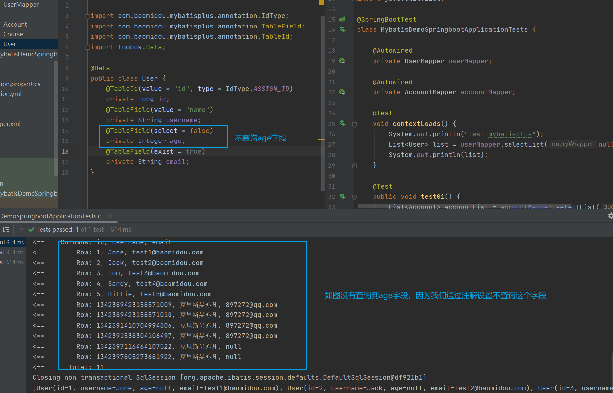
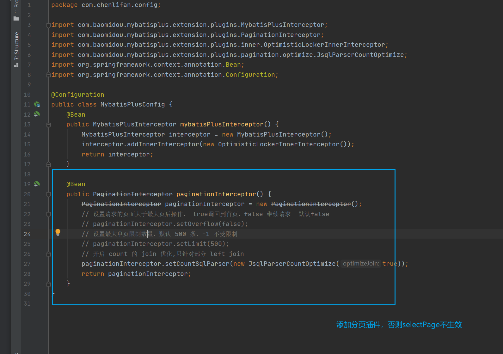
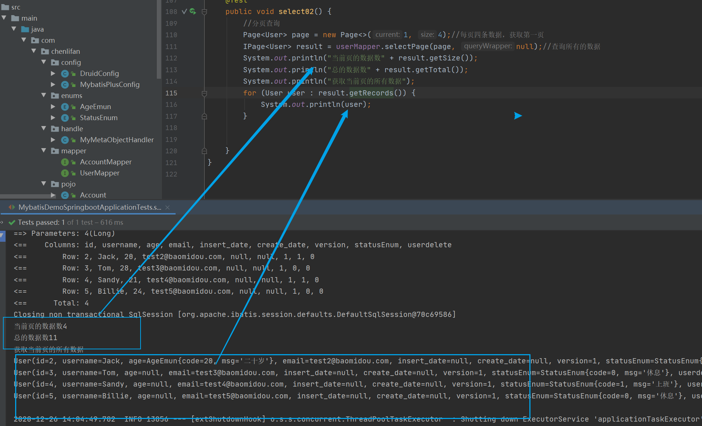
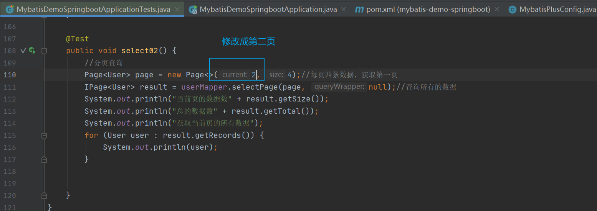
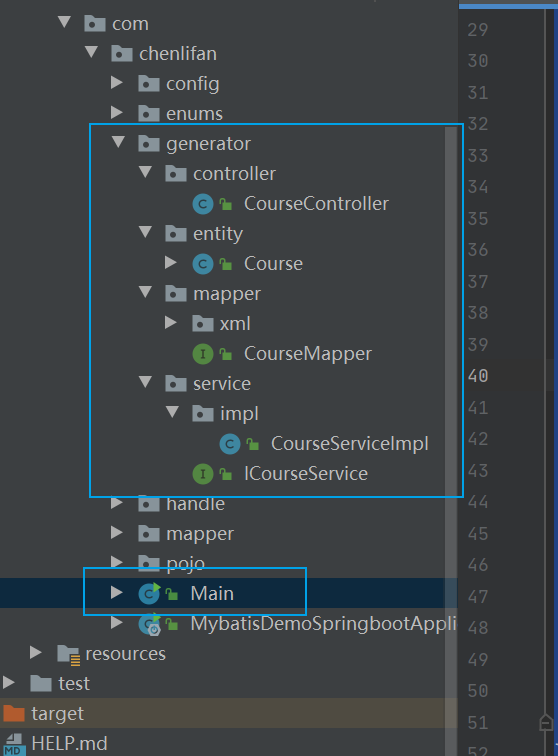
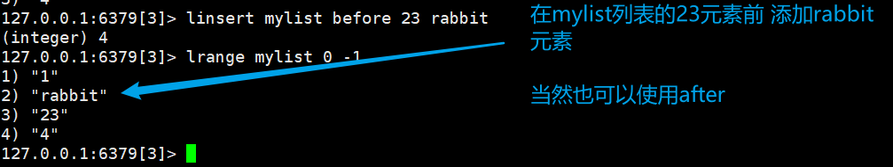
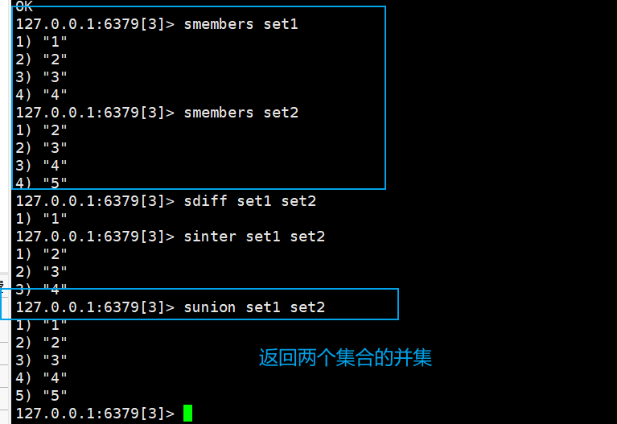

[TOC]

# Mybatis

## 入门

[官方文档](https://mybatis.org/mybatis-3/zh/index.html)

### 什么是mybatis


### 持久层


### 为什么需要mybatis


### 第一个mybatis程序

创建一个快速的spring boot环境


**然后导入依赖**

因为我是基于spring boot项目来开发的，所以需要 参考之前的spring boot笔记来整合mybatis

而数据源 使用的是阿里的druid数据源，所以在整合mybatis之前需要整合druid，在整合druid之前要整合jdbc


```yaml
#spring:
#  datasource:
#    driver-class-name: com.mysql.jdbc.Driver
#    username: root
#    password: root
#    url: jdbc:mysql://localhost:3306/stu?useUnicode=true&characterEncoding=utf-8&serverTimezone=Asia/Shanghai
#    type: com.alibaba.druid.pool.DruidDataSource
#    druid:
#      initial-size: 5
#      min-idle: 5
#      max-active: 20
#      test-while-idle: true
#      test-on-borrow: false
#      test-on-return: false
#      pool-prepared-statements: true
#      max-pool-prepared-statement-per-connection-size: 20
#      max-wait: 60000
#      time-between-eviction-runs-millis: 60000
#      min-evictable-idle-time-millis: 30000
#      filters: stat
#      async-init: true
#      filter: stat,wall,log4j
#      use-global-data-source-stat: true
#      connection-properties: druid.stat.mergeSql=true;druid.stat.slowSqlMillis=500


spring:
  datasource:
    driver-class-name: com.mysql.jdbc.Driver
    username: root
    password: root
    url: jdbc:mysql://localhost:3306/stu?useUnicode=true&characterEncoding=utf-8&serverTimezone=Asia/Shanghai
    type: com.alibaba.druid.pool.DruidDataSource
    druid:
      #Spring Boot 默认是不注入这些属性值的，需要自己绑定
      #druid 数据源专有配置
      initialSize: 5
      minIdle: 5
      maxActive: 20
      maxWait: 60000
      timeBetweenEvictionRunsMillis: 60000
      minEvictableIdleTimeMillis: 300000
      validationQuery: SELECT 1 FROM DUAL
      testWhileIdle: true
      testOnBorrow: false
      testOnReturn: false
      poolPreparedStatements: true
      #配置监控统计拦截的filters，stat:监控统计、log4j：日志记录、wall：防御sql注入
      #如果允许时报错  java.lang.ClassNotFoundException: org.apache.log4j.Priority
      #则导入 log4j 依赖即可，Maven 地址：https://mvnrepository.com/artifact/log4j/log4j
      filters: stat,wall,log4j
      maxPoolPreparedStatementPerConnectionSize: 20
      useGlobalDataSourceStat: true
      connectionProperties: druid.stat.mergeSql=true;druid.stat.slowSqlMillis=500
```

> 整合druid的配置参数

需要导入的依赖如下

```xml
  <dependencies>

        <!--整合jdbc-->
        <dependency>
            <groupId>org.springframework.boot</groupId>
            <artifactId>spring-boot-starter-jdbc</artifactId>
        </dependency>
        <!--log4j-->
        <dependency>
            <groupId>log4j</groupId>
            <artifactId>log4j</artifactId>
            <version>1.2.17</version>
        </dependency>
        <!-- https://mvnrepository.com/artifact/com.alibaba/druid-spring-boot-starter -->
        <dependency>
            <groupId>com.alibaba</groupId>
            <artifactId>druid-spring-boot-starter</artifactId>
            <version>1.2.3</version>
        </dependency>
        <dependency>
            <groupId>org.springframework.boot</groupId>
            <artifactId>spring-boot-starter-web</artifactId>
        </dependency>

        <dependency>
            <groupId>org.springframework.boot</groupId>
            <artifactId>spring-boot-devtools</artifactId>
            <scope>runtime</scope>
            <optional>true</optional>
        </dependency>
        <dependency>
            <groupId>mysql</groupId>
            <artifactId>mysql-connector-java</artifactId>
            <scope>runtime</scope>
        </dependency>
        <dependency>
            <groupId>org.projectlombok</groupId>
            <artifactId>lombok</artifactId>
            <optional>true</optional>
        </dependency>
        <dependency>
            <groupId>org.springframework.boot</groupId>
            <artifactId>spring-boot-starter-test</artifactId>
            <scope>test</scope>
        </dependency>
    </dependencies>
```


在完成jdbc、druid、mybatis与spring boot的整合之后，我们直接运行dao接口，就能输出数据库的数据了


## 增删改查实现

因为这里学习是基于springboot整合mybatis学习的，一些mybatis的配置已经由spring boot帮我们完成了，所以我们只需要集中精力学习mybatis的语法操作而不是配置，具体配置学习可以重新学习狂神的mybatis教程。


### namespace

namespace绑定一个对应的mapper/dao接口


### select


### selecet 元素属性


**更多的只是点建议之间看官方文档，官方文档已经是非常的详细了**


# Mybatis plus


[官方网站](https://baomidou.com/)


## 快速搭建一个mybatis plus项目


**快速开始的演示官方文档已经非常详细了**

[快速开始](https://baomidou.com/guide/quick-start.html#%E5%88%9D%E5%A7%8B%E5%8C%96%E5%B7%A5%E7%A8%8B)


## 输出sql语句

在配置文件中添加如下


然后我们重新运行


## 常用注解


### TableId


> auto：是使用是使用的数据库自增，需要在创建表的时候设置数据库自增（如果数据库没有设置自增长就会报错）
>
> none：使用的是雪花算法，MP会自动给我们的数据库主键插入雪花算法的值
>
> Input：这个需要我们在插入值的时候自定义手动编写值，如果不写，那么MP就会使用数据库自增的方法插入值
>
> ASSIASSIGN_ID：自动赋值，分配雪花算法
>
> ASSIGN_UUID：主键的数据类型必须是string，自动生成uuid（如果主键的类型不是string类型就会报错）

**演示**

然后我们尝试给user表插入数据而，只输入基本的信息，而不输入主键的值

然后tableid使用的type类型是NONE，然后NONE会使用雪花算法给我们的主键插入值


### TableField


|       属性       |             类型             | 必须指定 |          默认值          |                             描述                             |
| :--------------: | :--------------------------: | :------: | :----------------------: | :----------------------------------------------------------: |
|      value       |            String            |    否    |            ""            |                          指定字段名                          |
|        el        |            String            |    否    |            ""            | 映射为原生 `#{ ... }` 逻辑,相当于写在 xml 里的 `#{ ... }` 部分 |
|      exist       |           boolean            |    否    |           true           |           当设置为false，就算插入了数据，也会为空            |
|    condition     |            String            |    否    |            ""            | 字段 `where` 实体查询比较条件,有值设置则按设置的值为准,没有则为默认全局的 `%s=#{%s}`,[参考(opens new window)](https://github.com/baomidou/mybatis-plus/blob/3.0/mybatis-plus-annotation/src/main/java/com/baomidou/mybatisplus/annotation/SqlCondition.java) |
|      update      |            String            |    否    |            ""            | 字段 `update set` 部分注入, 例如：update="%s+1"：表示更新时会set version=version+1(该属性优先级高于 `el` 属性) |
|  insertStrategy  |             Enum             |    N     |         DEFAULT          | 举例：NOT_NULL: `insert into table_a(<if test="columnProperty != null">column</if>) values (<if test="columnProperty != null">#{columnProperty}</if>)` |
|  updateStrategy  |             Enum             |    N     |         DEFAULT          | 举例：IGNORED: `update table_a set column=#{columnProperty}` |
|  whereStrategy   |             Enum             |    N     |         DEFAULT          | 举例：NOT_EMPTY: `where <if test="columnProperty != null and columnProperty!=''">column=#{columnProperty}</if>` |
|       fill       |             Enum             |    否    |    FieldFill.DEFAULT     | 字段自动填充策略（表示是否自动填充、将对象存入数据库的时候，由MP自动给某些字段赋值，比如在insert的时候赋值，在update的时候赋值等等） |
|      select      |           boolean            |    否    |           true           |                     是否进行 select 查询                     |
| keepGlobalFormat |           boolean            |    否    |          false           |              是否保持使用全局的 format 进行处理              |
|     jdbcType     |           JdbcType           |    否    |    JdbcType.UNDEFINED    |           JDBC类型 (该默认值不代表会按照该值生效)            |
|   typeHandler    | Class<? extends TypeHandler> |    否    | UnknownTypeHandler.class |          类型处理器 (该默认值不代表会按照该值生效)           |
|   numericScale   |            String            |    否    |            ""            |                    指定小数点后保留的位数                    |

value


**exit**


**select**




**fill**

- 创建一个处理对象
- 给表添加一个时间字段
- 给实体类添加时间属性


**然后我们插入一条数据**


**更新数据自动插入时间**


### @Version

描述：乐观锁注解、标记 `@Verison` 在字段

> 通过version字段来保证数据的安全性，当修改数据的时候，会以version 作为条件，当条件成立的时候才会修改成功

比如

version= 1

update ....where set version = 2  where version =1; 


**演示**

在数据库的表中添加version字段，设置默认值为1

实体类添加version属性，并添加version注解

创建mybatis plus的配置类


**然后进行插入操作**


> 后台可以看到MP对version进行了+1的操作


**我们看一下，对同一条数据同时进行插入操作，看是什么效果**


> version 的初始值是2


> 同时进行插入操作


> user1修改成功，user2修改失败了


### @EnumValue

通过枚举类注解，将数据库字段映射成实体类的枚举类型成员变量

- 创建一个枚举类，映射一个表的status字段
- 在表中创建status字段
- 在user实体类创建StatusEnum枚举类的成员属性
- 在yml文件添加配置，扫描枚举类的包


**演示**


>
>
>记得重写tostring
>
>


**还有一种实现接口的方式**

我们继续创建一个枚举类


### @TableLogic


**逻辑删除处理的意思是，不是真的删除，只是加一个字段，0为没有删除，1为删除**


- 数据库表添加delete字段
- 实体类添加delete属性，并添加tablelogin的注解
- 然后在配置文件设置删除的就设置为1，未删除设置为0
- 然后执行删除操作


**然后我们进行查询**


> id 为1 的没有被查询出来


**注意 ：字段名不能用delete，不然会出现语法错误，冲突的字段名**


## CRUD

[官方文档](https://baomidou.com/guide/crud-interface.html#update-3)


### select


#### selectList


上面是查询的一个名字有两个用户，那么我如何在这两个用户中查找年龄为13的用户呢


**查找年龄小于13岁的用户**


**查找年龄大于13岁的用户**


**查找年龄不等于13岁大于用户**


**模糊查询**


insql


**insql也可以in两个**


**根据年龄升序排列**


**having**


#### selectByMap


#### selectCount


#### selectMap


#### selectPage

分页查询






如果我们想要查询出第二页，只需要修改为2就可以了’




**关于没有分页效果的问题**

这是因为我们没有在配置类中添加分页的插件

**使用selectpage之前要添加这个分页的插件**


#### selectMaoPage


#### selectObjs

```java
// 根据 Wrapper 条件，查询全部记录。注意： 只返回第一个字段的值
```


#### selectone

查询一条语句，如果查询到多条语句就会报错


### insert


### delete

**上面演示 的乐观锁我认为比直接删除的好**


### update


## 自定义sql（多表关联查询）


在mapper创建 一个方法


然后我们执行上面那个方法


然后就实现了多表关联查询


## mybatisplu代码生成器+部署上线

- 根据数据表自动生成实体类、mapper、service 、serviceimpl、controller


**步骤**

1. 在pom.xml导入依赖

```xml
  <!-- https://mvnrepository.com/artifact/com.baomidou/mybatis-plus-generator -->
        <dependency>
            <groupId>com.baomidou</groupId>
            <artifactId>mybatis-plus-generator</artifactId>
            <version>3.4.0</version>
        </dependency>

        <!--    mybati plus 根据这个模板生成上面generator的各种组件-->
        <!-- https://mvnrepository.com/artifact/org.apache.velocity/velocity -->
        <dependency>
            <groupId>org.apache.velocity</groupId>
            <artifactId>velocity</artifactId>
            <version>1.7</version>
        </dependency>

```

2.用navicat访问我们服务器上的数据库


> 访问宝塔面板的数据库需要很多操作

3.编写一个main方法，编写生成的策略

```java
package com.chenlifan;

import com.baomidou.mybatisplus.annotation.DbType;
import com.baomidou.mybatisplus.generator.AutoGenerator;
import com.baomidou.mybatisplus.generator.config.DataSourceConfig;
import com.baomidou.mybatisplus.generator.config.GlobalConfig;
import com.baomidou.mybatisplus.generator.config.PackageConfig;
import com.baomidou.mybatisplus.generator.config.StrategyConfig;
import com.baomidou.mybatisplus.generator.config.rules.NamingStrategy;

public class Main {
    public static void main(String[] args) {
        //创建generator对象
        AutoGenerator autoGenerator = new AutoGenerator();
        //数据源
        DataSourceConfig dataSourceConfig = new DataSourceConfig();
        dataSourceConfig.setDbType(DbType.MYSQL);
        //generator对象会这个连接的这个远程数据库生成各种组件模板
        dataSourceConfig.setUrl("jdbc:mysql://121.5.58.132:3306/stu?useUnicode=true&characterEncoding=utf-8&serverTimezone=Asia/Shanghai");
        dataSourceConfig.setUsername("root");
        dataSourceConfig.setPassword("root");
        dataSourceConfig.setDriverName("com.mysql.cj.jdbc.Driver");
        autoGenerator.setDataSource(dataSourceConfig);
        //全局配置
        GlobalConfig globalConfig = new GlobalConfig();
        globalConfig.setOutputDir(System.getProperty("user.dir") + "/src/main/java");//获取工程的绝对路径
        globalConfig.setOpen(false);
        globalConfig.setAuthor("chenlifan");
        globalConfig.setServiceName("%sService");//为了让生成的service接口名字没有i开头
        autoGenerator.setGlobalConfig(globalConfig);

        PackageConfig packageConfig = new PackageConfig();
        packageConfig.setParent("com.chenlifan");
        packageConfig.setModuleName("generator");//生成好的模板放在所在的包的微信
        packageConfig.setController("controller");
        packageConfig.setService("service");
        packageConfig.setServiceImpl("service.impl");
        packageConfig.setMapper("mapper");
        packageConfig.setEntity("entity");
        autoGenerator.setPackageInfo(packageConfig);
        //配置策略
        StrategyConfig strategyConfig = new StrategyConfig();
        strategyConfig.setEntityLombokModel(true);//自动添加lombok注解
        //将数据库表字段的下划线命名改为在项目中的驼峰命名法
        strategyConfig.setNaming(NamingStrategy.underline_to_camel);
        strategyConfig.setColumnNaming(NamingStrategy.underline_to_camel);//下划线转驼峰
        autoGenerator.setStrategy(strategyConfig);

        autoGenerator.execute();


    }
}

```

点击运行这个main方法

然后就自动生成了generator




**那么，我们就把generator所有的类串联起来，就可以直接通过浏览器访问**


我们只需要编写controller类就可以了


通过访问controller 方法的映射，就能直接在当前的页面打印出所有的course信息


**这样直接打印不太美观**

我们通过thymeleaf来输出这些信息

所以我们重写一下controller类


记得导入thymeleaf依赖


编写index页面


**然后我们的应用就完成了，**

现在我们可以先打包这个应用

注意，记得要先排除单元测试，否则会会报如下错误


```xml
//排除单元测试
<plugin>
    <groupId>org.apache.maven.plugins</groupId>
    <artifactId>maven-surefire-plugin</artifactId>
    <version>2.4.1</version>
    <configuration>
        <skipTests>true</skipTests>
    </configuration>
</plugin>
```

自行修改版本


这样就打包成功了


## mybatis plus可能出现的问题

### **关于没有分页效果的问题**

这是因为我们没有在配置类中添加分页的插件

**使用selectpage之前要添加这个分页的插件**


### 打包项目出现There are test failures


这是因为我们没有排除单元测试

```xml
//排除单元测试
<plugin>
    <groupId>org.apache.maven.plugins</groupId>
    <artifactId>maven-surefire-plugin</artifactId>
    <version>2.4.1</version>
    <configuration>
        <skipTests>true</skipTests>
    </configuration>
</plugin>
```

加上这个就打包成功了

我们先在本地运行一下这个jar包，看会不会出什么问题


运行正常，那么我们就可以把这个项目放到云服务器了


然后我们在xshell执行


然后通过浏览器访问


可以看到，一个spring boot和mybatis plus集合的项目就完成了


### 报错找不到mapper的方法


# Redis

## NoSql的概述

### 企业架构的演进


**单机MySQL年代**（时代）


> 数据库的读写都在单机

> 90年代，一个基本的网站访问量一般不会太大，单个数据库完全足够
>
> 那个时候更多的是使用静态网页 ——服务器没有压力
>
> - 缺点是数据量太大，一台机器放不下
> - 数据的索引(B+Tree)，一个机器内存放不下
> - 访问量（读写混合），一个服务器承受不了


**Memcached（缓存）+Mysql +垂直拆分**（时代）

网站80%的情况都是在读，每次都要去查询数据库的话就会很大的花销，所以通过缓存就能减轻数据库的压力，提高效率


> 通过缓存解决读的问题，先在缓存找数据，没有就到数据库找（解决了之前的读的问题）

**缓存的发展**

> 优化数据结构和索引
>
> 文件缓存（IO）
>
> Memcached


**分库分表+水平拆分+Mysql集群+**（时代）

数据库引擎

> - 最早MyISAM：表锁（100万  比如查询张三的密码，就会把整个表都锁起来，只有一个进程，其他进程这能等查询完毕才能查询）——高并发下就会出现严重问题
> - 后来Innodb：行锁（就是查询只会锁一行）
> - 后面就开始使用分库分表来解决表的压力  MySQL在那个年代推出了表分区（但是没什么人用）
> - Mysql的集群，很好满足了那个年代的所有需求


>   （解决了读写的问题）


**现在这个年代**


### 为什么要用nosql


**nosql**

> 方便扩展（数据之间没有关系，很好扩展）——比如之前的关系型数据库一个表有一亿条数据，那么当我们添加一个列就会很令人头大了，这会搞死人的，而nosql的横向扩展机制，Map<String,Objenct>就可以很好的很想扩展数据
>
> 大数据量高性能（redis一秒能写8万次，读取十一万次，nosql的缓存记录极，是一种细粒度的缓存，性能会比较高）
>
> 数据类型多样性（不需要事先设计数据库，随取随用，如果是数据量十分大的表，很多人是无法设计的）


传统的RDBMS（关系型数据库）和Nosql

- > 传统的RDBMS
  >
  > 1. 结构化组织
  > 2. sql
  > 3. 数和关系都存在单独的表中 
  > 4. 数据操作语言，数据定义语言
  > 5. 基础的十五

  

- >  nosql
  >
  > 1. 不仅仅是数据
  > 2. 没有固定的查询语言
  > 3. 键值对存储，列存储，文档存储，图形数据库（社交关系）
  > 4. 最终一致性
  > 5. cap定理和base（异地多活）初级架构师
  > 6. 高性能、高可用、高可扩展


了解大数据时代 的3V和3高


**3V**(主要是描述问题的)

> 海量volume（比如大量的用户在一秒内使用微信）
>
> 多样 variety（每种数据都是不一样）
>
> 实时velocity（要延迟低）


**3高**(主要是对程序的要求)

> 高并发
>
> 高可拓（随时水平拆分，机器不够，可以增加机器解决）
>
> 高性能（保证性能，用户体验）


**真正在公司中的实践：Nosql+RDBMS一起使用**


### 阿里巴巴的架构演进

 [阿里巴巴中文站架构设计实践(何崚).pdf](..\..\..\document\redis\阿里巴巴架构演进\阿里巴巴中文站架构设计实践(何崚).pdf) 


> 建议直接看上面连接的文档


**推荐文章**

[阿里云的这群疯子](https://www.huxiu.com/article/267100.html)


**如何解决**

> 没什么是加一层不能解决的，如果有，那就再加一层


### Nosql的四大分类


**图关系数据库**


> 这不是存放图片，存的是关系，比如：朋友圈社交网络，广告推荐
>
> neo4j  infogrid

   


## redis概念


### **redis是什么**

Redis（Remote Dictionary Server )，即远程字典服务，是一个开源的使用ANSI [C语言](https://baike.baidu.com/item/C语言)编写、支持网络、可基于内存亦可持久化的日志型、Key-Value[数据库](https://baike.baidu.com/item/数据库/103728)，并提供多种语言的API。从2010年3月15日起，Redis的开发工作由VMware主持。从2013年5月开始，Redis的开发由[Pivotal](https://baike.baidu.com/item/Pivotal)赞助。

> 免费和开源  是当下最热门的nosql技术之一，被人们称之为结构化数据库


### **redis能干什么**

- 内存存储、持久化，内存中是断电即失，所以说持久化很重要（rdb，aof）
- 效率高、可以用于高速缓存
- 发布订阅系统
- 地图信息分析
- 计时器、计数器（微信微博浏览量 ）

> 特性
>
> 1. 多样的数据烈性
> 2. 持久化
> 3. 集群
> 4. 事务


## window下安装redis

[安装教程](https://www.runoob.com/redis/redis-install.html)

> redis不推荐我们在window使用redis

## Linux下安装redis

我们先在官网下载linux版本的安装包


然后连接我们的远程服务器

然后把这个文件上传到我们远程服务器的home/redis文件夹下


解压这个安装包


进入解压好的redis文件


然后安装


然后输入make命令


> 到make这里因为redis版本太高，报错了，所以我还是先使用宝塔面板 安装好了


在宝塔面板安装好后，连接redis


> 注意是在www/server/redis/src下找到redis-cli
>
> 在此之前记得开启redis，我这里没开启，因为是宝塔面板帮我们开启了


**查看redis进程是否开启**


**如何关闭redis**


## redis-benchmark性能测试


然后 我们运行这个工具

> 测试
>
> 1. 100个并发 连接   100000个请求
>
> `redis-benchmark -h localhost -p 6379 -c 100 -n 100000`


**然后我们解析 一下刚刚测试的信息**


## redis基本知识

- redis默认有16个数据库（默认使用第0个数据库）
- 通过select 切换数据库
- dbsize查看当前数据库的大小
- keys \* 查看所有的key
- 通过get获取当前name
- flushall清空所有数据库的内容
- flushdb清空当前数据库的内容
- redis是单线程的

在配置文件redis.conf可以查看到redis默认设置了16个数据库


> 在配置文件可以看到


可以使用select进行切换数据库


查看数据库大小


清空当前数据库的内容


**redis的 端口号为什么是6379**


**redis是单线程的**

官方表示：redis是 基于内存操作的，cpu不是redis性能瓶颈，redis的瓶颈是根据机器的内存和网络带宽，既然可以使用单线程来实现，就使用单线程了。

redis为什么单线程还这么快

> redis是c语言写的，官方提供的数据为100000+的qps，这个不比同样使用的key-value的memecache差

> 核心：redis是将所有的数据全部放在内存中的，所以说使用单线程去操作效率是最高的   多线程（cpu上下文会切换，耗时的操作，对于内存系统来说，如果没有上下文切换效率就是最高的，多次读写都是在一个cpu上的，在内存情况下，这个就是最好的状态）


## redis的数据类型

> - string 
> - int 
> - set
> - list
> - hash
> - zset
>
> **三种特殊的数据类型**
>
> - geospatial
> - hyperloglog
> - bitmaps


## Rediskey的基本命令


**基本命令**

> exists 判断某一个健是否存在，存在就返回1，不存在就返回0
>
> move 移动这个键值对，`move age 1`  将age这个简直移动到数据库1
>
> expire 设置key过期时间
>
> ttl 查看还有多少时间过期
>
> type 查看当前key的类型
>
> (更多指令可以到官网上查看命令)[redis官方网站](https://redis.io/commands)


exists


move


expire


ttl


> 这个可以用作单点登录


type


## string 字符串类型的讲解


> append 往字符串追加东西  （如果append的key不存在，就相当于set key）
>
> strelen 获取字符串的长度
>
> incr 数值+1  相当于  i++
>
> decr 数值-1 相当于  i--
>
> incrby 一次加x  i =+
>
> decrby 一次减x  i =-
>
> getrange 获取一个字符串某个范围的值
>
> setrange 替换字符串的一部分
>
> setex 如果这个值存在就设置
>
> setnx Redis Setex 命令为指定的 key 设置值及其过期时间。如果 key 已经存在， SETEX 命令将会替换旧的值。
>
> setnx Redis Setnx（**SET** if **N**ot e**X**ists） 命令在指定的 key 不存在时，为 key 设置指定的值。
>
> mset 用于同时设置一个或多个 key-value 对。
>
> mget 令返回所有(一个或多个)给定 key 的值。 如果给定的 key 里面，有某个 key 不存在，那么这个 key 返回特殊值 nil 
>
> msetnx  所有给定 key 都不存在时，同时设置一个或多个 key-value 对。
>
> 当所有 key 都成功设置，返回 1 。 如果所有给定 key 都设置失败(至少有一个 key 已经存在)，那么返回 0 。
>
> getset 命令用于设置指定 key 的值，并返回 key 的旧值。（如果key不存在就返回nil）
>
> cas


append


strelen


incr


> 可应用于浏览量


decr


incrby


decrby


getrange


setrange


setex


setnx


mset


mget


> 一开始设置的json的k1 v1是键值对，但是没有值，如果我们直接user:1:k1是没有值的，只有通过mset设置值才能保存到值然后才能获取到


msetnx  


getset


**string类似的使用场景：value除了是我们的字符串还可以是我们的数字**

- 计数器
- 统计多单位的数量 

> 比如b站的关注数  我们用uid作为key
>
> ```json
> uid:862553706:follow:0
> ```


## List列表类型详解


> lpush  Redis Lpush 命令将一个或多个值插入到列表**头部**。 如果 key 不存在，一个空列表会被创建并执行 LPUSH 操作。 当 key 存在但不是列表类型时，返回一个错误。
>
> rpush Redis Rpush 命令用于将一个或多个值插入到列表的**尾部**(最右边)。
>
> lpop 命令用于移除并返回列表的第一个元素。
>
> rpop  命令用于移除列表的最后一个元素，返回值为移除的元素。
>
> lindex 命令用于通过索引获取列表中的元素。你也可以使用负数下标，以 -1 表示列表的最后一个元素， -2 表示列表的倒数第二个元素，以此类推。
>
> lrem 根据参数 COUNT 的值，移除列表中与参数 VALUE 相等的元素。
>
> ltrim 对一个列表进行修剪(trim)，就是说，让列表只保留指定区间内的元素，不在指定区间之内的元素都将被删除。下标 0 表示列表的第一个元素，以 1 表示列表的第二个元素，以此类推。 你也可以使用负数下标，以 -1 表示列表的最后一个元素， -2 表示列表的倒数第二个元素，以此类推。
>
> rpoplpush 命令用于移除列表的最后一个元素，并将该元素添加到另一个列表并返回。
>
> lset 过索引来设置元素的值。
>
> linsert 命令用于在列表的元素前或者后插入元素。当指定元素不存在于列表中时，不执行任何操作。当列表不存在时，被视为空列表，不执行任何操作。如果 key 不是列表类型，返回一个错误。


lpush


rpush


lpop


rpop


lindex


lrem


ltrim


rpoplpush 


lset


linsert




> list实际上是一个链表，before node after left right都可以插入
>
> 两边插入或者改动值，效率最高，中间元素，相对来说效率会低一点


## set集合类型详解

**Redis 的 Set 是 String 类型的无序集合。集合成员是唯一的，这就意味着集合中不能出现重复的数据。**

**Redis 中集合是通过哈希表实现的，所以添加，删除，查找的复杂度都是 O(1)。**

**集合中最大的成员数为 232 - 1 (4294967295, 每个集合可存储40多亿个成员)。**


> sadd 添加set集合元素
>
> smembers  命令返回集合中的所有的成员。 不存在的集合 key 被视为空集合。
>
> sismember 命令判断成员元素是否是集合的成员。
>
> scard  命令返回集合中元素的数量。
>
>  Srem 命令用于移除集合中的一个或多个成员元素，不存在的成员元素会被忽略。当 key 不是集合类型，返回一个错误。在 Redis 2.4 版本以前， SREM 只接受单个成员值。
>
> Srandmember 命令用于返回集合中的一个随机元素。
>
> > Redis Srandmember 命令用于返回集合中的一个随机元素。
> >
> > 从 Redis 2.6 版本开始， Srandmember 命令接受可选的 count 参数：
> >
> > - 如果 count 为正数，且小于集合基数，那么命令返回一个包含 count 个元素的数组，数组中的元素各不相同。如果 count 大于等于集合基数，那么返回整个集合。
> > - 如果 count 为负数，那么命令返回一个数组，数组中的元素可能会重复出现多次，而数组的长度为 count 的绝对值。
> >
> > 该操作和 SPOP 相似，但 SPOP 将随机元素从集合中移除并返回，而 Srandmember 则仅仅返回随机元素，而不对集合进行任何改动。
>
> Spop 命令用于移除集合中的指定 key 的一个或多个随机元素，移除后会返回移除的元素。
>
>  Smove 命令将指定成员 member 元素从 source 集合移动到 destination 集合。
>
> > SMOVE 是原子性操作。
> >
> > 如果 source 集合不存在或不包含指定的 member 元素，则 SMOVE 命令不执行任何操作，仅返回 0 。否则， member 元素从 source 集合中被移除，并添加到 destination 集合中去。
> >
> > 当 destination 集合已经包含 member 元素时， SMOVE 命令只是简单地将 source 集合中的 member 元素删除。
> >
> > 当 source 或 destination 不是集合类型时，返回一个错误。
>
>  Sdiff 命令返回第一个集合与其他集合之间的差异，也可以认为说第一个集合中独有的元素。不存在的集合 key 将视为空集。
>
> > 差集的结果来自前面的 FIRST_KEY ,而不是后面的 OTHER_KEY1，也不是整个 FIRST_KEY OTHER_KEY1..OTHER_KEYN 的差集。
>
> Sinter 命令返回给定所有给定集合的交集。 不存在的集合 key 被视为空集。 当给定集合当中有一个空集时，结果也为空集(根据集合运算定律)。
>
> Sunion 命令返回给定集合的并集。不存在的集合 key 被视为空集。

sadd


smembers


sismember 


Srandmember 


Spop 


smove


Sdiff 


Sinter 


Sunion




## hash类型详解


可以把hash想象成map集合

**Redis hash 是一个 string 类型的 field（字段） 和 value（值） 的映射表，hash 特别适合用于存储对象。**

**Redis 中每个 hash 可以存储 232 - 1 键值对（40多亿）。**


> hset 设置hash的值
>
> hget  获取hash的值
>
> hmset 一次性存入多个值
>
> Hdel 命令用于删除哈希表 key 中的一个或多个指定字段，不存在的字段将被忽略。
>
> hlen 获取hash的元素总数
>
> hexists 判断hash中的某个key是否存在
>
> hkeys 只获得所有的key
>
> hvals 只获得所有的value
>
>  Hincrby 命令用于为哈希表中的字段值加上指定增量值。
>
> > 增量也可以为负数，相当于对指定字段进行减法操作。
>
> Hsetnx 命令用于为哈希表中不存在的的字段赋值 。
>
> > 如果哈希表不存在，一个新的哈希表被创建并进行 HSET 操作。
> >
> > 如果字段已经存在于哈希表中，操作无效。
> >
> > 如果 key 不存在，一个新哈希表被创建并执行 HSETNX 命令。


hget  hset操作


hmset hmget


hdel


hlen


hexists 


hkeys 和hvals


hincrby


Hsetnx 


**创建一个hash为键值对**


> 可以 理解为这个hash的名字就是user:a


## Zset有序集合详解（有序集合）

set是  set k1 v1

zset k1 score1 v1

这个集合的最大的作用就是排序

> Zrangebyscore 返回有序集合中指定分数区间的成员列表。有序集成员按分数值递增(从小到大)次序排列。
>
>  Zrem 命令用于移除有序集中的一个或多个成员，不存在的成员将被忽略。
>
>  Zcard 命令用于计算集合中元素的数量。
>
>  Zrevrange 命令返回有序集中，指定区间内的成员。其中成员的位置按分数值递减(从大到小)来排列。
>
> zcount 判断区间中的值有多少


Zrangebyscore 


zcard


zrevrange


## 三种特殊的数据类型

### geospatial地理位置

朋友的定位、附近的人、打车距离的计算


- geoadd：添加地理位置的坐标。
- geopos：获取地理位置的坐标。
- geodist：计算两个位置之间的距离。
- georadius：根据用户给定的经纬度坐标来获取指定范围内的地理位置集合。
- georadiusbymember：根据储存在位置集合里面的某个地点获取指定范围内的地理位置集合。
- geohash：返回一个或多个位置对象的 geohash 值。


添加一个省中两个市的坐标


计算两地距离


根据用户给定的经纬度坐标来获取指定范围内的地理位置集合。


返回指定城市的坐标


根据储存在位置集合里面的某个地点获取指定范围内的地理位置集合


返回一个或多个位置对象的 geohash 值。


### Hypeloglog基数统计


**应用场景 ：网站的UV（一个人访问一个网站多次，但是还是算作一个人）**


**演示**


**合并两个元素**


### bitmap位图场景详解

**位存储**

> 

**演示**

> 使用bitmaps记录一个员工周一到周日的打卡情况
>
> 

查看某一天有没有打卡


> 

统计上班的天数

> 


## redis基本事务操作


**事务**


> redis的事务没有关系型数据库的原子性（要么同时成功，要么同时失败）
>
> 但是redis单条命令是保持原子性


**redis的事务**

- 开启事务
- 命令入队
- 执行事务


取消事务


## 乐观锁


比如两个线程同时修改一个变量


在没有开启watch的情况下


> 可以看到，rabbit就算在开启事务修改，但是当另一个线程修改这个rabbit的时候，依然能够修改到，这是不合理的


使用watch监听rabbit，当开启事务修改rabbit的时候，如果rabbit被修改，就会修改失败


> 所以，使用watch就能完成乐观锁的操作


## 用jedis操作redis

使用java操作redis

**什么是jedis 是redis官方推荐的Java连接开发工具！使用java操作redis中间件，如果你要使用java操作redis，那么一定要对jedis十分熟悉**


然后修改一下web.xml（从自己的tomcat的root文件夹下的web.xml文件复制 过来）


导入jedis依赖和ali的fastjson依赖

```xml
<!-- https://mvnrepository.com/artifact/redis.clients/jedis -->
<dependency>
  <groupId>redis.clients</groupId>
  <artifactId>jedis</artifactId>
  <version>3.2.0</version>
</dependency>
<!-- https://mvnrepository.com/artifact/com.alibaba/fastjson -->
<dependency>
    <groupId>com.alibaba</groupId>
    <artifactId>fastjson</artifactId>
    <version>1.2.62</version>
</dependency>

```


> 创建一个main方法，然后连接远程的redis，输出pong代表连接成功


如果连接失败，那么就说明远程服务器的6379端口没有打开


> 开启腾讯和宝塔面板的6379端口，重启redis可以在宝塔面板重启


> 如上，连接成功


jedis 的各种api

下面就不演示了，之后用到直接查就好了，因为jedis的api和在linux操作的命令是一样的


## 通过jedis再次理解事务

普通的事务


## spring boot集成jedis


首先要快速生成一个spring boot项目


导入jedis包

```xml
<!-- https://mvnrepository.com/artifact/org.springframework.boot/spring-boot-starter-data-redis -->
<dependency>
    <groupId>org.springframework.boot</groupId>
    <artifactId>spring-boot-starter-data-redis</artifactId>
</dependency>
```


连接配置


测试


创建redis配置类


导入lombok依赖

```xml
<!-- https://mvnrepository.com/artifact/org.projectlombok/lombok -->
<dependency>
    <groupId>org.projectlombok</groupId>
    <artifactId>lombok</artifactId>
</dependency>
```

创建一个user实体类


然后将这个实体类转变为json字符串，然后set进redis中


但是，如果我们不将user对象转变为json字符串，而是直接传入redis中，会发生什么


> 可以看到报错了  
>
> 告诉我们对象需要序列化


那么我们将User对象序列化


然后再次执行


> 可以看到，对象序列化之后，就传输成功了

我们不使用user的实现序列化的方式，而是通过redis配置类类实现key value的序列化

所以我们先把user的实现序列化删除掉，但是这样我们运行是会报错的，所以我们编写自己的配置类


编写自己的redis配置类，实现序列化

```java
package top.cabbit.config;

import com.fasterxml.jackson.annotation.JsonAutoDetect;
import com.fasterxml.jackson.annotation.PropertyAccessor;
import com.fasterxml.jackson.databind.ObjectMapper;
import com.fasterxml.jackson.databind.jsontype.impl.LaissezFaireSubTypeValidator;
import org.springframework.boot.autoconfigure.condition.ConditionalOnMissingBean;
import org.springframework.boot.autoconfigure.condition.ConditionalOnSingleCandidate;
import org.springframework.context.annotation.Bean;
import org.springframework.context.annotation.Configuration;
import org.springframework.data.redis.connection.RedisConnectionFactory;
import org.springframework.data.redis.core.RedisTemplate;
import org.springframework.data.redis.serializer.Jackson2JsonRedisSerializer;
import org.springframework.data.redis.serializer.StringRedisSerializer;

@Configuration
public class RedisConfig {
    //编写自己的redisatemplate
    @Bean
    public RedisTemplate<String, Object> redisTemplate(RedisConnectionFactory redisConnectionFactory) {
        //一般为了开发方便，直接使用<String，Object>
        RedisTemplate<String, Object> template = new RedisTemplate<>();
        template.setConnectionFactory(redisConnectionFactory);
        //json序列化配置
        Jackson2JsonRedisSerializer jackson2JsonRedisSerializer = new Jackson2JsonRedisSerializer(Object.class);
        ObjectMapper om = new ObjectMapper();
        om.setVisibility(PropertyAccessor.ALL, JsonAutoDetect.Visibility.ANY);
        om.activateDefaultTyping(LaissezFaireSubTypeValidator.instance, ObjectMapper.DefaultTyping.NON_FINAL);
        jackson2JsonRedisSerializer.setObjectMapper(om);
        //String的序列化
        StringRedisSerializer stringRedisSerializer = new StringRedisSerializer();

        //key采用string的序列化方式
        template.setKeySerializer(stringRedisSerializer);
        //hash的key采用string的序列化方式
        template.setHashKeySerializer(stringRedisSerializer);
        //value序列化方式采用jackson
        template.setValueSerializer(jackson2JsonRedisSerializer);
        //hash的value序列化方式采用jackson
        template.setHashValueSerializer(jackson2JsonRedisSerializer);
        template.afterPropertiesSet();

        return template;
    }

}

```


> 这个是固定的模板，企业中可以直接使用


然后运行


可以看到配置的配置类序列化生效了


user也没有乱码了


**redisUtils**

引入redisUtils，一般是公司 写好的

```java
package top.cabbit.utils;

import org.springframework.beans.factory.annotation.Autowired;
import org.springframework.data.redis.core.RedisTemplate;
import org.springframework.stereotype.Component;
import org.springframework.util.CollectionUtils;

import java.util.Collection;
import java.util.List;
import java.util.Map;
import java.util.Set;
import java.util.concurrent.TimeUnit;

@Component
public final class RedisUtil {

    @Autowired
    private RedisTemplate<String, Object> redisTemplate;

    // =============================common============================
    /**
     * 指定缓存失效时间
     * @param key  键
     * @param time 时间(秒)
     */
    public boolean expire(String key, long time) {
        try {
            if (time > 0) {
                redisTemplate.expire(key, time, TimeUnit.SECONDS);
            }
            return true;
        } catch (Exception e) {
            e.printStackTrace();
            return false;
        }
    }

    /**
     * 根据key 获取过期时间
     * @param key 键 不能为null
     * @return 时间(秒) 返回0代表为永久有效
     */
    public long getExpire(String key) {
        return redisTemplate.getExpire(key, TimeUnit.SECONDS);
    }


    /**
     * 判断key是否存在
     * @param key 键
     * @return true 存在 false不存在
     */
    public boolean hasKey(String key) {
        try {
            return redisTemplate.hasKey(key);
        } catch (Exception e) {
            e.printStackTrace();
            return false;
        }
    }


    /**
     * 删除缓存
     * @param key 可以传一个值 或多个
     */
    @SuppressWarnings("unchecked")
    public void del(String... key) {
        if (key != null && key.length > 0) {
            if (key.length == 1) {
                redisTemplate.delete(key[0]);
            } else {
                redisTemplate.delete((Collection<String>) CollectionUtils.arrayToList(key));
            }
        }
    }


    // ============================String=============================

    /**
     * 普通缓存获取
     * @param key 键
     * @return 值
     */
    public Object get(String key) {
        return key == null ? null : redisTemplate.opsForValue().get(key);
    }

    /**
     * 普通缓存放入
     * @param key   键
     * @param value 值
     * @return true成功 false失败
     */

    public boolean set(String key, Object value) {
        try {
            redisTemplate.opsForValue().set(key, value);
            return true;
        } catch (Exception e) {
            e.printStackTrace();
            return false;
        }
    }


    /**
     * 普通缓存放入并设置时间
     * @param key   键
     * @param value 值
     * @param time  时间(秒) time要大于0 如果time小于等于0 将设置无限期
     * @return true成功 false 失败
     */

    public boolean set(String key, Object value, long time) {
        try {
            if (time > 0) {
                redisTemplate.opsForValue().set(key, value, time, TimeUnit.SECONDS);
            } else {
                set(key, value);
            }
            return true;
        } catch (Exception e) {
            e.printStackTrace();
            return false;
        }
    }


    /**
     * 递增
     * @param key   键
     * @param delta 要增加几(大于0)
     */
    public long incr(String key, long delta) {
        if (delta < 0) {
            throw new RuntimeException("递增因子必须大于0");
        }
        return redisTemplate.opsForValue().increment(key, delta);
    }


    /**
     * 递减
     * @param key   键
     * @param delta 要减少几(小于0)
     */
    public long decr(String key, long delta) {
        if (delta < 0) {
            throw new RuntimeException("递减因子必须大于0");
        }
        return redisTemplate.opsForValue().increment(key, -delta);
    }


    // ================================Map=================================

    /**
     * HashGet
     * @param key  键 不能为null
     * @param item 项 不能为null
     */
    public Object hget(String key, String item) {
        return redisTemplate.opsForHash().get(key, item);
    }

    /**
     * 获取hashKey对应的所有键值
     * @param key 键
     * @return 对应的多个键值
     */
    public Map<Object, Object> hmget(String key) {
        return redisTemplate.opsForHash().entries(key);
    }

    /**
     * HashSet
     * @param key 键
     * @param map 对应多个键值
     */
    public boolean hmset(String key, Map<String, Object> map) {
        try {
            redisTemplate.opsForHash().putAll(key, map);
            return true;
        } catch (Exception e) {
            e.printStackTrace();
            return false;
        }
    }


    /**
     * HashSet 并设置时间
     * @param key  键
     * @param map  对应多个键值
     * @param time 时间(秒)
     * @return true成功 false失败
     */
    public boolean hmset(String key, Map<String, Object> map, long time) {
        try {
            redisTemplate.opsForHash().putAll(key, map);
            if (time > 0) {
                expire(key, time);
            }
            return true;
        } catch (Exception e) {
            e.printStackTrace();
            return false;
        }
    }


    /**
     * 向一张hash表中放入数据,如果不存在将创建
     *
     * @param key   键
     * @param item  项
     * @param value 值
     * @return true 成功 false失败
     */
    public boolean hset(String key, String item, Object value) {
        try {
            redisTemplate.opsForHash().put(key, item, value);
            return true;
        } catch (Exception e) {
            e.printStackTrace();
            return false;
        }
    }

    /**
     * 向一张hash表中放入数据,如果不存在将创建
     *
     * @param key   键
     * @param item  项
     * @param value 值
     * @param time  时间(秒) 注意:如果已存在的hash表有时间,这里将会替换原有的时间
     * @return true 成功 false失败
     */
    public boolean hset(String key, String item, Object value, long time) {
        try {
            redisTemplate.opsForHash().put(key, item, value);
            if (time > 0) {
                expire(key, time);
            }
            return true;
        } catch (Exception e) {
            e.printStackTrace();
            return false;
        }
    }


    /**
     * 删除hash表中的值
     *
     * @param key  键 不能为null
     * @param item 项 可以使多个 不能为null
     */
    public void hdel(String key, Object... item) {
        redisTemplate.opsForHash().delete(key, item);
    }


    /**
     * 判断hash表中是否有该项的值
     *
     * @param key  键 不能为null
     * @param item 项 不能为null
     * @return true 存在 false不存在
     */
    public boolean hHasKey(String key, String item) {
        return redisTemplate.opsForHash().hasKey(key, item);
    }


    /**
     * hash递增 如果不存在,就会创建一个 并把新增后的值返回
     *
     * @param key  键
     * @param item 项
     * @param by   要增加几(大于0)
     */
    public double hincr(String key, String item, double by) {
        return redisTemplate.opsForHash().increment(key, item, by);
    }


    /**
     * hash递减
     *
     * @param key  键
     * @param item 项
     * @param by   要减少记(小于0)
     */
    public double hdecr(String key, String item, double by) {
        return redisTemplate.opsForHash().increment(key, item, -by);
    }


    // ============================set=============================

    /**
     * 根据key获取Set中的所有值
     * @param key 键
     */
    public Set<Object> sGet(String key) {
        try {
            return redisTemplate.opsForSet().members(key);
        } catch (Exception e) {
            e.printStackTrace();
            return null;
        }
    }


    /**
     * 根据value从一个set中查询,是否存在
     *
     * @param key   键
     * @param value 值
     * @return true 存在 false不存在
     */
    public boolean sHasKey(String key, Object value) {
        try {
            return redisTemplate.opsForSet().isMember(key, value);
        } catch (Exception e) {
            e.printStackTrace();
            return false;
        }
    }


    /**
     * 将数据放入set缓存
     *
     * @param key    键
     * @param values 值 可以是多个
     * @return 成功个数
     */
    public long sSet(String key, Object... values) {
        try {
            return redisTemplate.opsForSet().add(key, values);
        } catch (Exception e) {
            e.printStackTrace();
            return 0;
        }
    }


    /**
     * 将set数据放入缓存
     *
     * @param key    键
     * @param time   时间(秒)
     * @param values 值 可以是多个
     * @return 成功个数
     */
    public long sSetAndTime(String key, long time, Object... values) {
        try {
            Long count = redisTemplate.opsForSet().add(key, values);
            if (time > 0)
                expire(key, time);
            return count;
        } catch (Exception e) {
            e.printStackTrace();
            return 0;
        }
    }


    /**
     * 获取set缓存的长度
     *
     * @param key 键
     */
    public long sGetSetSize(String key) {
        try {
            return redisTemplate.opsForSet().size(key);
        } catch (Exception e) {
            e.printStackTrace();
            return 0;
        }
    }


    /**
     * 移除值为value的
     *
     * @param key    键
     * @param values 值 可以是多个
     * @return 移除的个数
     */

    public long setRemove(String key, Object... values) {
        try {
            Long count = redisTemplate.opsForSet().remove(key, values);
            return count;
        } catch (Exception e) {
            e.printStackTrace();
            return 0;
        }
    }

    // ===============================list=================================

    /**
     * 获取list缓存的内容
     *
     * @param key   键
     * @param start 开始
     * @param end   结束 0 到 -1代表所有值
     */
    public List<Object> lGet(String key, long start, long end) {
        try {
            return redisTemplate.opsForList().range(key, start, end);
        } catch (Exception e) {
            e.printStackTrace();
            return null;
        }
    }


    /**
     * 获取list缓存的长度
     *
     * @param key 键
     */
    public long lGetListSize(String key) {
        try {
            return redisTemplate.opsForList().size(key);
        } catch (Exception e) {
            e.printStackTrace();
            return 0;
        }
    }


    /**
     * 通过索引 获取list中的值
     *
     * @param key   键
     * @param index 索引 index>=0时， 0 表头，1 第二个元素，依次类推；index<0时，-1，表尾，-2倒数第二个元素，依次类推
     */
    public Object lGetIndex(String key, long index) {
        try {
            return redisTemplate.opsForList().index(key, index);
        } catch (Exception e) {
            e.printStackTrace();
            return null;
        }
    }


    /**
     * 将list放入缓存
     *
     * @param key   键
     * @param value 值
     */
    public boolean lSet(String key, Object value) {
        try {
            redisTemplate.opsForList().rightPush(key, value);
            return true;
        } catch (Exception e) {
            e.printStackTrace();
            return false;
        }
    }


    /**
     * 将list放入缓存
     * @param key   键
     * @param value 值
     * @param time  时间(秒)
     */
    public boolean lSet(String key, Object value, long time) {
        try {
            redisTemplate.opsForList().rightPush(key, value);
            if (time > 0)
                expire(key, time);
            return true;
        } catch (Exception e) {
            e.printStackTrace();
            return false;
        }

    }


    /**
     * 将list放入缓存
     *
     * @param key   键
     * @param value 值
     * @return
     */
    public boolean lSet(String key, List<Object> value) {
        try {
            redisTemplate.opsForList().rightPushAll(key, value);
            return true;
        } catch (Exception e) {
            e.printStackTrace();
            return false;
        }

    }


    /**
     * 将list放入缓存
     *
     * @param key   键
     * @param value 值
     * @param time  时间(秒)
     * @return
     */
    public boolean lSet(String key, List<Object> value, long time) {
        try {
            redisTemplate.opsForList().rightPushAll(key, value);
            if (time > 0)
                expire(key, time);
            return true;
        } catch (Exception e) {
            e.printStackTrace();
            return false;
        }
    }


    /**
     * 根据索引修改list中的某条数据
     *
     * @param key   键
     * @param index 索引
     * @param value 值
     * @return
     */

    public boolean lUpdateIndex(String key, long index, Object value) {
        try {
            redisTemplate.opsForList().set(key, index, value);
            return true;
        } catch (Exception e) {
            e.printStackTrace();
            return false;
        }
    }


    /**
     * 移除N个值为value
     *
     * @param key   键
     * @param count 移除多少个
     * @param value 值
     * @return 移除的个数
     */

    public long lRemove(String key, long count, Object value) {
        try {
            Long remove = redisTemplate.opsForList().remove(key, count, value);
            return remove;
        } catch (Exception e) {
            e.printStackTrace();
            return 0;
        }

    }

}
```


直接使用工具类

就能完成


## redis配置文件详解


> unit对大小写不敏感


> 如果是后台运行的方式，需要pid文件


> redis是内存数据库，如果没有持久化，那么数据断电即失


> 


## 持久化rdb操作和aof操作

面试和工作，持久化都是重点

**redis是内存数据库，如果不将内存中的数据库状态保存到磁盘，那么一旦服务器进程退出，服务器中的数据库状态也会消失。所以redis提供了持久化功能**


> rdb保存的文件是dump.rdb


## redis发布订阅


## redis集群环境搭建


后期再学吧，感觉要很多设备


这些还没有学


## redis可能出现的问题

### 解决redis执行benckmark失败的问题


要加上./