[TOC]

# MySQL数据库

**约束**


**实体完整性和引用完整性**


**多表查询**


## 外键

**举例**

假如有一张部门表和一张员工表

在没有添加外键的情况下

如果我们只删除一个部门

那么员工表里面，删除的那个部门的人工依然会在员工表里面

显然这是不合理的

**这个时候，就需要多表连接添加外键约束了**


## 表与表之间的关系

## 多表连接查询

**交叉连接**


**内连接查询**


## 外连接

### 左外连接


### 右外连接


## 内连接和外连接的区别


## 多表查询之子查询


### 带in的举例


### 带 exists的举例


### 带any的举例

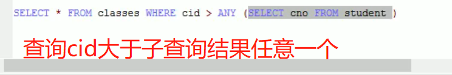

## 带all的举例


## 事务的概述

> 事务：指的是逻辑上的一组操作，组成这组操作的各个逻辑单元，要么全部成功，要么全部失败


**事务一旦commit和rollback，那么事务就会关闭**

**所以每次commit和rollback之后，下一次事务开始都需要start transaction**

**rollback可以回滚到事务开始之前**

**当提交事务commit之后，就不能进行回滚了**

**案例**（转账）


**当我我们进行了回滚然后查询表数据，发现数据已经回滚到事务开始之前**

## 事务的特性


## 事务的隔离级别

**如果不考虑隔离级别，就会引发一些安全问题**

> MySQL的默认隔离级别是repeatable read
>
> Oracle的默认隔离级别是read committed


**不可重复读**

> 第二次查询的数据和第一次不一样，这就是不可重复读的意思

**设置事务的隔离**

```mysql
SET SESSION TRANSACTION ISOLATION LEVEL 设置隔离级别
```

```mysql
SELECT @@tx_isolation;
```

### 脏读演示


### 脏读的避免以及不可重复读的演示

**接上案例，给窗口A设置的隔离级别如下**

```MySQL
SET SESSION TRANSACTION ISOLATION LEVEL READ COMMITTED;
```

然后在b窗口开启事务，然后进行转账操作，而不提交（commit）事务


**然后我们在b窗口提交事务，然后再a窗口的事务中再次查询**


**然后发现，因为b窗口已经提交了事务，改变了数据，所以a窗口事务再次查询的时候，查询到了两次不同的数据（第二次查询的数据和第一次不一样，这就是不可重复读的意思）**

> 所以我们就需要这个事务查询的数据不会因为另一个事务的提交而发生改变。

### 避免不可重复度

给窗口a的事务设置隔离级别

```mysql
SET SESSION TRANSACTION ISOLATION LEVEL REPEATABLE READ
```

**接上案例**


b窗口开启事务执行转账操作然后未提交

然后在a窗口事务进行第一次查询


第一次是窗口b事务没有提交的时候窗口a进行查询的

第二次是窗口b事务在提交了事务之后窗口a进行查询的

可以发现，两次查询到数据是一致的，说明可以进行**重复读**

### 避免虚读的操作（避免串行化）

a窗口设置隔离级别

```MySQL
SET SESSION TRANSACTION ISOLATION LEVEL SERIALIZABLE
```

>  什么是避免串行化呢
>
> **举例**
>
> 就是两个事务同时开启，b事务默认等级，a事务设置最高的隔离等级
>
> 当b事务进行插入操作后的时候
>
> a事务不能进行查询操作
>
> 只有b事务进行commit和rollback操作之后
>
> a事务才能进行查询操作


**发现a窗口一斤卡住了，说明事务不允许出现并发，a窗口需要等待 b窗口执行完成之后，才会执行a窗口的事务（当b窗口的事务提交或者回滚，那么a窗口马上就会出现结果）**


# JDBC

## jdbc的概述

> jdbc是用来执行sql语句的Java api，由Java语言编写的类和接口组成。

**什么是数据库驱动**

> 驱动：两个设备（应用）之间通信的桥梁

**为什么学习jdbc**

> 没有jdbc，当我们需要用Java连接MySQL或者Oracle数据库，我们就需要自己去了解MySQL和Oracle的驱动api
>
> 而sun公司提供一套统一的规范（接口），然后各个数据生产商只需要实现这个接口就可以实现了。

## jdbc环境准备


**实操演示**

```Java
package com.jdbcDemo;

import java.sql.*;

public class MySQLjdbc {
    public void show() throws SQLException {
        Connection connection = null;
        Statement statement = null;
        ResultSet resultSet = null;
        try {
            //加载驱动
            Class.forName("com.mysql.jdbc.Driver");
            //获取连接
            connection = DriverManager.getConnection("jdbc:mysql://localhost:3306/db_demo", "root", "root");
            //获取执行sql语句的对象
            statement = connection.createStatement();
            //sql语句
            String str_sql = "select * from account";
            //获取查询对象的结果集
            resultSet = statement.executeQuery(str_sql);
            //遍历数据集中的数据
            while (resultSet.next()) {
                System.out.print("ID\t\t" + resultSet.getInt("ac_id"));
                System.out.print("\tname\t\t" + resultSet.getString("name"));
                System.out.println("\tmoney\t\t" + resultSet.getFloat("money"));
            }

        } catch (ClassNotFoundException | SQLException e) {
            e.printStackTrace();
        } finally {
            connection.close();
            statement.close();
            resultSet.close();


        }
    }
}


package com.jdbcDemo;

import java.sql.SQLException;

public class Main {
    public static void main(String[] args) throws SQLException {
        new MySQLjdbc().show();
    }
}

```

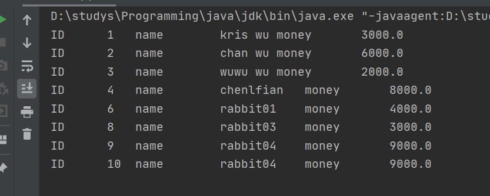


## jdbc的api之DriverManeager


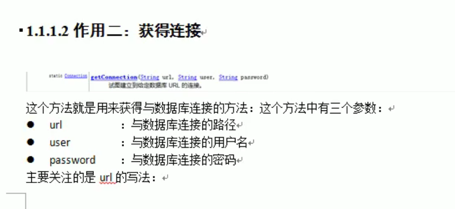


**url的写法**

```Java
jdbc:mysql://localhost:3306/数据库名称  标准写法
jdbc:mysql:///数据库名称  如果连接的是本机数据库的简化写法
```

## jdbc的api之Connection


## jdbc的api之Statement


## jdbc的api之ResultSet


将如上表的结果集封装成一个对象


## jdbc的资源释放


**标准的资源释放写法**

```java
//放在finally代码块中是为了让资源一定能得到释放
```

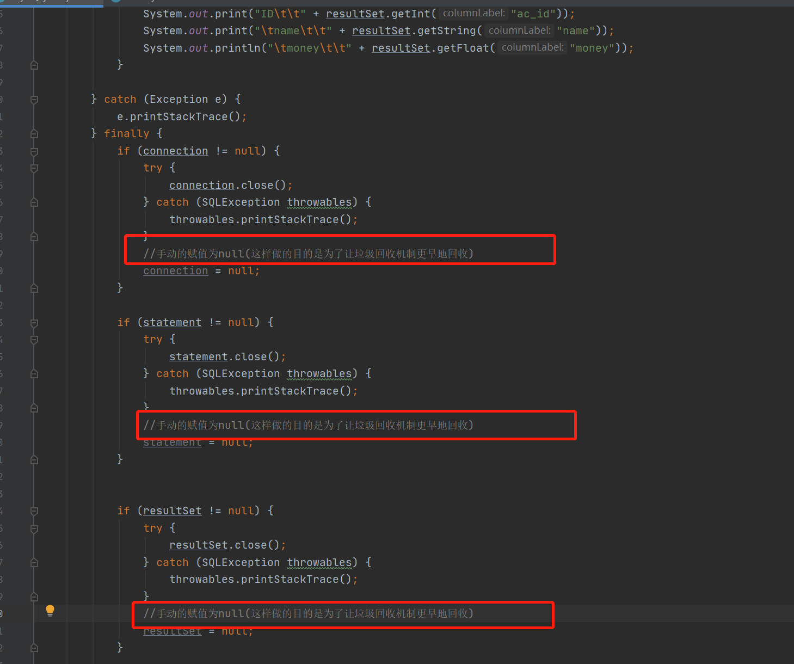


## jdbc的CRUD之保存操作

**代码实现**


## jdbc的CRUD的更新操作


## jdbc的CRUD的删除操作


## jdbc的CRUD的查询操作


## jdbc工具类的抽取

**在传统的jdbc开发中，注册驱动，获取连接和释放资源这些步骤都是重复的，那么我们可以把这些东西做成一个工具类，下次需要用到的时候，我们直接调用就能获取到**

**工具类代码实现**


> 工具类分成三个部分
>
> 1. 将注册jdbc驱动这个模块方法static代码块中，当实例这个工具类对象的时候加载这个模块
> 2. 获取连接的对象
> 3. 关闭资源模块

**通过调用工具类来实现查询的操作**


## jdbc的配置信息提取到配置文件

- 首先需要创建配置文件


将jdbc的配置信息都放在properties文件中

- 在工具类中创建配置文件，然后通过FileInputStream将配置信息加载到Properties对象中


## jdbc的SQL注入漏洞

**什么是注入漏洞**


**先编写一个简单的登录后台**


通过用户名密码进行登录，如果查询到有数据就返回true


1. 前台sql注入的两种方式

```java
boolean flag = new MySQLjdbc().login("dog' or '1=1", "1232313");
boolean flag = new MySQLjdbc().login("dog'-- ", "1232313");
```

**当以上面那样输入用户名，在sql中的查询语句就会变成如下**

```mysql
select * from account where name = 'dog' or '1=1'  and pwd = '123'
select * from account where name = 'dog'--  and pwd = '123'
```

这两种输入方式都是可以在只知道用户名的情况下，随便输入密码就能登入系统

- 第一个输入方式的意思如下


- 第二个输入方式就是就是把后面的语句都注释掉了

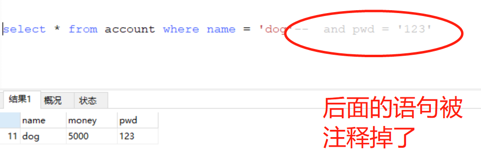

- 所以，在前台如上面两种输入方式输入，就会只要知道用户名就能登录到用户的系统

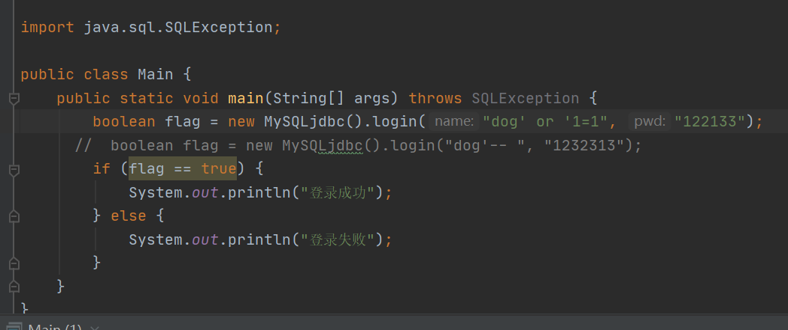

## jdbc解决注入漏洞


**上面演示中，我们只需要输入SQL的关键字如 or 和 --就可以在只知道用户名的情况下就能登录成功**

所以，我们如何去解决这个问题呢


我们对后台的代码进行如下修改


- 这样，当我们在前台输入or -- 等其他关键字的时候，系统就不会识别，而是判定这个sql语句是错误的


## jdbc的CRUD操作之PreparedStatement

创建工具类

```java
package com.jdbcDemo.jdbcPreparedStatement.jdbcUtil;

import java.io.FileInputStream;
import java.io.IOException;
import java.sql.*;
import java.util.Properties;

public class JdbcUtil {
    private static String Driver;
    private static String url;
    private static String username;
    private static String password;

    static {
        Properties properties = new Properties();
        try {
            properties.load(new FileInputStream("./src/com/jdbcDemo/properties/jdbc.properties"));
        } catch (IOException e) {
            e.printStackTrace();
        }
        Driver = properties.getProperty("Driver");
        url = properties.getProperty("url");
        username = properties.getProperty("username");
        password = properties.getProperty("password");
    }

    void setDriver() {
        try {
            Class.forName(Driver);
        } catch (ClassNotFoundException e) {
            e.printStackTrace();
        }
    }

    public Connection getConnection() {
        Connection connection = null;
        setDriver();
        try {
            connection = DriverManager.getConnection(url, username, password);
        } catch (SQLException throwables) {
            throwables.printStackTrace();
        }
        return connection;
    }

    public Connection close(Connection connection, Statement statement, ResultSet resultSet) {
        if (connection != null) {
            try {
                connection.close();
            } catch (SQLException throwables) {
                throwables.printStackTrace();
            }
            connection = null;
        }

        if (statement != null) {
            try {
                statement.close();
            } catch (SQLException throwables) {
                throwables.printStackTrace();
            }
            statement = null;
        }

        if (resultSet != null) {
            try {
                resultSet.close();
            } catch (SQLException throwables) {
                throwables.printStackTrace();
            }
            resultSet = null;
        }
        return connection;

    }

    public Connection close(Connection connection, Statement statement) {
        if (connection != null) {
            try {
                connection.close();
            } catch (SQLException throwables) {
                throwables.printStackTrace();
            }
            connection = null;
        }

        if (statement != null) {
            try {
                statement.close();
            } catch (SQLException throwables) {
                throwables.printStackTrace();
            }
            statement = null;
        }
        return connection;
    }
}

```

> 1. 每次调用这个工具类的对象都会获取配置文件的参数
> 2. 调用getConnection方法的同时调用setDriver方法 ，注册jdbc驱动
> 3. 当使用完这个工具类后，调用close方法关闭connection、statement或者Resultset，并将这三个对象设置为null，方便垃圾回收，并返回connection对象（用来判断connection是否被关闭，方便使用者重新开启）

CRUD的创建

```Java
//CRUD create增加 Retrieve检查 update更新 delete删除
public class JdbcPrepareStatementDemo {
    //获取工具类对象
    JdbcUtil jdbcUtil = new JdbcUtil();
    Connection connection = jdbcUtil.getConnection();
    PreparedStatement preparedStatement = null;
    ResultSet resultSet = null;


    //Retrieve
    public void retrieve() {
        openUp();
        String str = "select * from account where name = ?";
        try {
            preparedStatement = connection.prepareStatement(str);
            preparedStatement.setString(1, "dog");
            resultSet = preparedStatement.executeQuery();
            while (resultSet.next()) {
                System.out.print("id\t" + resultSet.getInt("ac_id"));
                System.out.println("\tname\t" + resultSet.getString("name"));
            }
        } catch (SQLException throwables) {
            throwables.printStackTrace();
        } finally {
            //执行完毕之后，返回一个空的connection，这样可以下一个需要调用可以重新开启connection
            connection = jdbcUtil.close(connection, preparedStatement, resultSet);


        }

    }

    //插入新数据
    public int create() {
        openUp();
        String str = "insert into account (name,money,pwd)values (?,?,?)";
        int num = 0;
        try {
            preparedStatement = connection.prepareStatement(str);
            preparedStatement.setString(1, "小白兔");
            preparedStatement.setFloat(2, 35500);
            preparedStatement.setString(3, "123");
            num = preparedStatement.executeUpdate();

        } catch (SQLException throwables) {
            throwables.printStackTrace();
        } finally {
            connection = jdbcUtil.close(connection, preparedStatement);
        }
        return num;
    }

    //update更新
    public int update() {
        //如果connection被关闭，那么重新打开connection
        openUp();
        int num = 0;
        String str = "update account set pwd = ? where ac_id = ?";
        try {
            preparedStatement = connection.prepareStatement(str);
            preparedStatement.setString(1, "clf1379");
            preparedStatement.setInt(2, 12);
            num = preparedStatement.executeUpdate();
        } catch (SQLException throwables) {
            throwables.printStackTrace();
        } finally {
            connection = jdbcUtil.close(connection, preparedStatement);

        }
        return num;
    }

    //delete删除
    public int delete() {
        openUp();
        int num = 0;
        String str = "delete from account where ac_id = ?";
        try {
            preparedStatement = connection.prepareStatement(str);
            preparedStatement.setInt(1, 12);
            num = preparedStatement.executeUpdate();
        } catch (SQLException throwables) {
            throwables.printStackTrace();
        } finally {
            connection = jdbcUtil.close(connection, preparedStatement);

        }
        return num;
    }

    //判断connection等对象是否关闭，如果关闭就开启
    public void openUp() {
        if (connection == null) {
            connection = jdbcUtil.getConnection();
        }
    }

}
```

> 1. 编写四个方法，分别为增删改查
> 2. 创建成员属性connection、preparedStatement、resultSet这三个属性
> 3. 获取工具类对象，调用getConnection方法将连接的对象赋值给connection
> 4. 创建一个用来判断connection是否被关闭的方法，当connection为null，重新注册驱动
> 5. 每一个CRUD方法开始都需要调用openUp方法来判断connection是否被关闭，执行完成任务后在finally通过工具类对象调用close方法关闭三个成员属性对象，并返回一个空的connection对象，方便下一个CRUD方法执行的时候开启connection对象。

Main方法

```Java
package com.jdbcDemo.jdbcPreparedStatement;
public class Main {
    public static void main(String[] args) {
        JdbcPrepareStatementDemo jsd = new JdbcPrepareStatementDemo();
        jsd.retrieve();
        int num = jsd.create();
        if (num > 0) {
            System.out.println("影响行数为：" + num + ",添加成功");
        }
        num = jsd.update();
        if (num > 0) {
            System.out.println("影响行数为：" + num + ",更改成功");
        }
        num = jsd.delete();
        if (num > 0) {
            System.out.println("影响行数为：" + num + ",删除成功");
        }

    }
}
```

## jdbc的批处理操作

**之前进行jdbc操作的时候，都是一条SQL语句执行，现在如果使用批处理，可以将一批SQL语句一起执行**

**注意批处理不能进行select操作**


> 因为使用Statement会有sql注入的风险，所以一般都不会使用上面的方法

- 使用PreparedStatement进行批处理


> 上面代码的关键是内存的释放，当批处理数量达到1000条，就执行，然后清空批处理

**注意，进行批处理前，需要在url中设置批处理开启的开关**


**不使用循环批处理的代码实现**


## jdbc事务事务管理

> 事务指的是逻辑上的一组操作，组成这个操作各个逻辑单元要么全部成功，要么全部失败

**普通的转账案例代码实现**


这样的转账方式是不安全的，因为不能保证吴亦凡扣了1000元之后，程序报错，然后狗就无法增加1000元，等程序错误问题，我们需要解决的是，当转账过程中一旦出现错误，就让整个转账过程都失败 ，不会出现一方扣钱一方收不到钱的情况。


**事务管理api**

- setAutoCommit()
- commit()
- rollback()


 

 

 


## 连接池的概述

> 连接池是装有连接的容器，使用连接的话，可以从连接池中进行获取，使用完成之后将连接归还给连接池

**为什么要学习连接池呢**

连接和销毁对象是需要时间的，在服务器初始化的时候就初始化一些连接。把这些连接放进内存中，使用的时候就从内存中获取，使用完后就将连接放入连接池中，从内存获取和归还的效率要远远高于创建和销毁的效率（提升性能）

就不需要我们每次执行一次方法就都初始化一次连接

**连接池的原理**


## 自定义连接池的实现

javax.sql.DataSource

编写一个类实现DataSource接口

重写getConnection方法

初始化多个连接在内存中

编写归还连接的方法

 

**自定义连接池的代码实现**

```java
//自定义连接池
public class CustomConnPool implements DataSource {
    //用来接收连接对象
    List<Connection> conn_list = new ArrayList<>();
    JdbcUtil jdbcUtil = new JdbcUtil();

    //初始化的时候创建一些连接对象到内存中
    public CustomConnPool() {
        //创建10个连接对象到内存中
        for (int i = 0; i < 10; i++) {
            //向集合中添加连接对象
            conn_list.add(jdbcUtil.getConnection());
        }
    }
    @Override
    public Connection getConnection() throws SQLException {
        //remove() --删除此列表中指定位置的元素。将所有后续元素向左移动（从其索引中减去一个）。返回被删除的元素
        return conn_list.remove(0);
    }
    //返还连接对象的方法
    public void addBack(Connection connection) {
        conn_list.add(connection);
    }
```

**测试自定义连接池代码**

```java
public class Main {
    public static void main(String[] args) {
        //创建自定义连接池对象
        CustomConnPool customConnPool = new CustomConnPool();
        Connection connection = null;
        PreparedStatement preparedStatement = null;
        ResultSet resultSet = null;
        try {
            //通过自定义连接池获取连接对象
            connection = customConnPool.getConnection();
            String str = "select * from account";
            preparedStatement = connection.prepareStatement(str);
            resultSet = preparedStatement.executeQuery();
            while (resultSet.next()) {
                System.out.println("name\t\t" + resultSet.getString("name"));
            }
        } catch (SQLException throwables) {
            throwables.printStackTrace();
        } finally {
            //销毁result对象
            if (resultSet != null) {
                try {
                    resultSet.close();
                } catch (SQLException throwables) {
                    throwables.printStackTrace();
                }
                resultSet = null;
            }
            //销毁preparedStatement对象
            if (preparedStatement != null) {
                try {
                    preparedStatement.close();
                } catch (SQLException throwables) {
                    throwables.printStackTrace();
                }
                preparedStatement = null;
            }
            //归还连接对象
            customConnPool.addBack(connection);
        }
    }
}
```


## 自定义连接池的问题及解决分析

**上面我是自定义了连接池，但是这种连接池是有一些缺陷的，如**

- 我们是通过接口的实现类来实例化或者连接池对象的

> 什么意思呢，就是一般来说，Java讲究的是面向接口变成的，而不是直接实例化对象的
>
> 面向接口举例如下 :arrow_down:
>
> ```java
> List<Connection> conn_list = new ArrayList<>();
> ```
>
> *通过接口来接收实列（向上转型——多态）*
>
> ****
>
> 直接实例化对象:arrow_down:
>
> ```java
>  CustomConnPool customConnPool = new CustomConnPool();
> ```
>
> 这种实例化方法是不可取的
>
> ****
>
> **所以面向接口编程是更加容易拓展的**


- 需要使用者自行调用addBack方法来归还连接对象

> 使用者需要额外记住addBack方法，这样就不太方便了，增加了连接池的使用难度

****

思考：既然我们的自定义连接池是实现了DataSource接口，那么我们实例化这个连接池的时候，用多态的方式向上转型来接收CustomConnPool这个对象不就行了吗？

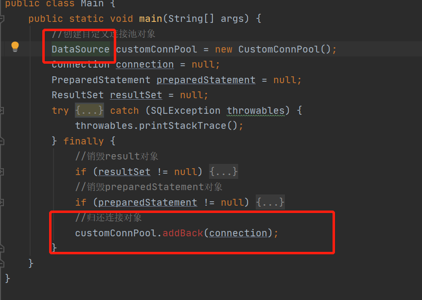

:arrow_up:如图所示，因为addBack方法是连接池实现类中自行定义的方法，而DataSource这个接口是没有这个addBack方法的，所以当我们对自定义连接池实例对象，并用DataSource来进行多态的向上转型的时候，是无法调用到addBack方法的，因为向上转型得到的对象只能调用接口定义的方法。

###  自定义连接池问题的解决（重点）

**不在自定义连接池中提供自定义的归还方法addBack就可以了**

> 那么在用DataSource接口接收了自定义连接池对象后，连接对象如何归还呢?

**解决思路**

- 在Connection接口中是有一个close方法中，这个方法完成了连接对象的销毁，那么我们可以将这个close方法的销毁操作改为**归还对象的操作**

- 现在要做的就是增强connection接口中的close方法（增强类中的方法） :arrow_down:

**增强类中方法的三种方式**

1. 采用继承的方式

```Java
public class Person {
    public void run(){
        System.out.println("跑");
    }
}
class Student extends  Person{
    @Override
    public void run() {
        System.out.println("飞");
    }
}
```

> 这是对类中方法增强最简单的一种方式，但是我们需要实现的是Connection接口
>
> 而Connection接口继承了其他的类
>
> 
>
> 如果我们通过继承的方式来增强close方法，这是不现实的，因为我们不知道Connection接口实际上继承具体的类是谁，所以我们就无法去继承这个类然后来增强这个close方法
>
> **所以通过继承的方式来增强方法不符合我们的要求**

****

2. 采用装饰者模式

**类似于BufferedInputStream对InputStream进行包装**

> 用通熟一点的说法就是：一个单眼皮的人去韩国整容就变成了双眼皮，但是实际上还是同一个人。
>
> 这样这个人就变得更加漂亮了，这就是装饰者模式

装饰者模式使用的条件

- 增强的类和被增强的类需要实现相同的接口
- 在增强的类中获得被增强的类的引用


> 装饰模式两个条件的图解模式
>
> **装饰者模式的缺点是，当我们只需要增强接口的一个方法，但是每次实现一个接口都需要重写这个接口的所有方法，并且需要我们自己手动一个一个地用接口的引用调用原来的方法，这样就会造成冗余（可以通过创建模板来解决）**
>
> 如图，connection.createStatement这样调用回原来的方法实现
>
> 

**代码演示**

```Java
//接口
interface Behavior {
    void show();
}

class Waiter implements Behavior {
    @Override
    public void show() {
        System.out.println("欢迎光临");
    }
}
//增强的服务员类
public class BuildUpWaiter implements Behavior {
    private Behavior behavior;

    public BuildUpWaiter(Waiter waiter) {
        this.behavior = waiter;
    }
    @Override
    public void show() {
        System.out.println("微笑");
        behavior.show();
    }
}
class Go{
    public static void main(String[] args) {
        Behavior behavior = new BuildUpWaiter(new Waiter());
        behavior.show();
    }
}
```


> 这样就实现了对Waiter类的show方法的增强，而且还体现了面向接口编程的方式

****

3. 动态代理的方式

[后期讲解动态代理，按住Ctrl跳转到动态代理的笔记](#动态代理)


### 自定义连接池代码实现

> 考虑到装饰者模式的缺点，我们给增强类提供一个模板类
>
> **模板类：原封不动的将接口中的所有方法都实现，但是都没有增强**

- 模板类部分代码实现


> 考虑到一会需要通过connection.preparedStatement来获取PreparedStatement对象，我们必须手动通过connection.preparedStatement来实现会原来的方法，其余的方法如果不用可以暂时不用手动重写

> 值得注意的是：这个模板类我并没有重写close方法，而是通过增强类继承这个模板类之后才会重写close方法来增强

****

- 增强类代码实现

```Java
public class BuildUpConnection extends BuildUpConnTemplate {
    Connection connection;
    List<Connection> connectionList;

    public BuildUpConnection(Connection connection, List<Connection> connectionList) {
        super(connection);
            //获取到被增强类的连接对象
        this.connection = connection;
        this.connectionList = connectionList;
    }

    //增强close方法
    @Override
    public void close() throws SQLException {
        connectionList.add(connection);
    }
}
```

> 得益于模板类实现了Connection接口，这样增强类就无需实现Connection的所有方法，只需要重写它想要继承的close方法，
>
> 由代码可以看到，增强类提供一个带参构造，它的父类模板类实现了Connection接口，这样，当我们的增强类获取到连接对象和集合对象的引用。

**可能你会对此感到疑惑，为什么我们只编写了增强类而没有编写被增强类的代码呢，和上面我们了解到的装饰者模型的概念有一点出入**

> 其实我们这个例子中已经提前提供了被增强类了，如下:arrow_double_down:,就是我们jdbc工具类中返回的Connection对象，这个对象实现了Connection接口，所以我们没有必要再编写一个被增强类，我们的目的就是为了增强下面被红框框住的对象。
>
> 
>
> :arrow_up:自定义连接池中的代码
>
> 
>
> :arrow_up:jdbc工具类中的代码

**如果你对此还是有疑惑，你可以这样理解**

> 我们编写的增强类BuildUpConnection是实现Connection接口，然后增强Connection的close方法的
>
> 而被增强类是可以调用connection.close方法的，而这个close是Connection接口的，所以被增强类是实现Connection接口的
>
> 所以我们编写的增强类可以对被增强类的close方法进行增强

****

- 增强类编写好好，我们对连接池的connection对象进行一个增强


> 如上:point_up:我们将获取到的连接对象（被增强对象）送入 增强对象中，返回增强的连接对象

- 测试

```java
public class Main {
    public static void main(String[] args) {
        //创建自定义连接池对象
        DataSource customCommPool = new CustomCommPool();
        Connection connection = null;
        PreparedStatement preparedStatement = null;
        ResultSet resultSet = null;
        try {
            //通过自定义连接池获取连接对象
            connection = customCommPool.getConnection();
            String str = "select * from account";
            preparedStatement = connection.prepareStatement(str);
            resultSet = preparedStatement.executeQuery();
            while (resultSet.next()) {
                System.out.println("name\t\t" + resultSet.getString("name"));
            }
        } catch (SQLException throwables) {
            throwables.printStackTrace();
        } finally {
         new JdbcUtil().close(connection,preparedStatement,resultSet);
        }
    }
}
```

> 1. 获取到被增强的连接对象
> 2. 通过被增强的连接对象获取preparedStatement对象
> 3. 进行sql语句的执行
> 4. 最后finally通过调用工具类对象调用**工具类**的close方法,对连接对象进行回收，对statement、resultset对象进行小虎
>
> > 
> >
> > 这个close是调用的增强类的close方法。

****

以上:arrow_heading_up:的内容装饰者模式的原理和第三方的连接池有关


# **Druid**

## Druid开源连接池的使用一（配置方式设置参数）

**阿里旗下开源连接池产品，使用非常简单，可以与spring框架进行整合**

1. 将Druid的驱动包加入到Java项目中

> 

2. 创建Druid类，将数据库参数传入到Druid中，Druid装饰连接对象


3. 复制之前项目用到的jdbc工具类，只用到这个工具类的close方法


> 红框标注的是关键，与我之前学习的自定义连接池的装饰者模式有关，这个connection.close不再是简单的销毁对象，而是归还连接对象到连接池中

4. 创建main方法进行简单的数据库操作，与之前jdbc操作有区别的主要是:arrow_down:以下红框圈到的区别


> Druid对Connection的方法进行了增强，所以，connection现在是归还连接对象而不是销毁连接对象

5. 项目目录


## Druid开源连接池的使用二（属性文件设置参数）

- 直接在main方法创建连接对象


> 如红框所示，这样就不需要一个一个参数输入了，简洁了工作

然后创建一个新的properties文件，就能实现对数据库的操作


 

如图所示，我们可以在properties文件中输入其他的参数，来对Druid数据库连接池进行操作


# C3P0

## C3P0连接池的使用一

C3P0是一个开源的[JDBC](https://baike.baidu.com/item/JDBC/485214)连接池，它实现了数据源和[JNDI](https://baike.baidu.com/item/JNDI/3792442)绑定，支持JDBC3规范和JDBC2的标准扩展。目前使用它的开源项目有Hibernate、Spring等。

- 首先导入C3P0需要的jar包到lib中


- 和Druid的用法差不多，手动插入参数


## C3P0连接池的使用二（通过c3p0-config.xml输入参数）

[c3p0官方使用文档（点击查看）](https://www.mchange.com/projects/c3p0/)

- 在文档中，要求在项目**类路径**创建一个c3p0-config.xml的配置文件，来对数据库连接池的参数进行配置


> 这个配置文件中提供了默认配置和自定义名字的配置
>
> 


- 然后在配置文件中设置连接池的默认参数


> 注意：参数名称一定要准确，并且配置文件一定要在根目录下，因为c3p0默认在项目根目录下查找配置文件
>
> 

- 编写数据库操作代码


**这样就能查询到数据了**


- 如果我们要使用自定义名称的参数


- 那么在创建数据库连接池的时候，只需要调用到c3p0的带参构造函数


> 这样就会调用到otherName这个配置的参数

- 如果我们写错了自定义参数的名称，那么c3p0就会调用我们默认设置的参数


## 改写工具类

**像上面我们演示的连接池，每次使用都创建一次连接池，这是不合理的，因为创建一个连接池比创建一次连接对象所要消耗的资源要大得多，所以我们就需要改写工具类来改变这个问题。**


- 创建c3p0的工具类，将这个类设置为饿汉式的单例模式


> 实例化这个c3p0工具类的所有实例对象都共享这个数据库连接池

- 创建测试类来测试这个工具类


> 直接调用getconnection方法来获取连接对象，对后调用close方法返回连接对象


# DBUtil

**什么是dbutils**

Commons DbUtils是[Apache](https://baike.baidu.com/item/Apache/8512995)组织提供的一个对[JDBC](https://baike.baidu.com/item/JDBC)进行简单封装的开源工具类库，使用它能够简化[JDBC](https://baike.baidu.com/item/JDBC)应用程序的开发，同时也不会影响程序的性能。

**为什么要学习dbutils**

因为JDBC手写比较麻烦,而且有非常多的代码是类似的。比如获得连接,预编译SQL释放资源等那么可以将这些代码抽取出来放到工具类中。将类似的代码进行抽取。大大简化JDBC的编程。


## DBtuils的api

- 构造方法

> QueryRunner()
>
> QueryRunner(DataSource ds)

- 成员方法

> update
>
> query

## DButils增删改查操作

- 添加DBUtils的jar包


- 获取c3p0连接池的DataSource


- 增删改操作


## DBUtils查询操作

1. 查询一条记录

- 创建一个account对象用来接收数据库数据


> 重写toString方法，方便输出结果，定义数据库account表各个字段的成员变量，并设置getset方法。


> 结果返回一个account对像

- 通过lambada改良结果集处理程序


- 查询多条数据


- 运行这个方法


> 获取到list对象，然后将这个对象的元素遍历出来


## DBtuils的使用之ResultSetHandler的实现类一

- **ArrayHandler **

> 将查询到的一条记录封装到数组中，这个数组是Object类型的（因为我们的数据是各种各样类型的），注意是一条记录

* **arraylisthandler**

> 将查询到的多条记录封装到装有Object[]的list集合中，意思是泛型为Object的集合

****

所以，我们可以对上面两个方法进行改造

**查询一条数据**


> 直接传入ArrayHandler对象，这个对象实现了ResultSetHandler接口，返回一个Object数组，然后通过foreach来遍历这个数组

**查询多条数据**


> 闯入ArrayListHandler对象，返回一个泛型为Object[]的List对象

**输出结果**


****


## DBtuils的使用之ResultSetHandler的实现类二

- BeanHandler

> 将查询到的一条记录封装到一个javabean中
>
> 自己创建的JavaBean的成员属性变量要和数据库表的字段一致

- BeanListHandler

> 将查询到的多条记录封装到泛型为某一个JavaBean的List中


**BeanHandler演示**

JavaBean


> 数据集处理程序BeanHandler，需要传入JavaBean的字节码文件对象，JavaBean的成员属性变量要和数据库表的字段一致


**BeanListHandler演示**


****

## DBtuils的使用之ResultSetHandler的实现类三

- MapHandler

> 将一条记录封装到map集合中
>
> map的key是列名
>
> map的value是表中记录

- MapListHandler

> 将查询到的多条记录封装到装有map的List集合中

**演示**


> Map的泛型String是列表名，Object是列表的值

****

## DBtuils的使用之ResultSetHandler的实现类四

- ColumnListHandler

> 将数据中的某列封装到list集合当中
>
> （就是现在我不select *了，要select name，然后将这些name封装到list当中）

- ScalarHandler

> 将单个值进行封装

- KeyedHandler（了解）

> MapHandler是将一条记录封装到map中 ，这个类是将多条记录封装到一个装有map集合的map集合中
>
> 而且外面的key是可以指定的
>
> 这个类保存的map的结构如下:arrow_down_small:
>
> 


**ColumListHandler演示**


> 传入列表字段名，输入泛型为String，返回一个泛型为String的List


**ScalarHandler**


**KeyedHandler**


> 这个数据集处理程序需要的泛型就好是输入object，因为不能确定key值是什么类型，但是输入String类型也可以，然后遍历这个map对象
>
> 先获取到这个map的所有key值，
>
> 然后通过这个key值获取value值
>
> 遍历结果如下:arrow_down:
>
> 
>
> 红框圈的就是KeyedHandler自定义的key值

# Web

**什么是web**

> 用户通过浏览器，访问到具体的网页，获取自己想要得到的信息

**javaweb**

> 使用Java语言开发web

**软件结构**

> - c/s架构的软件
>
> client客户端/server服务器，往往需要安装，如qq等
>
> > 优点：部分代码写在客户端中，减轻服务器端的压力，界面美观
> >
> > 缺点：一旦服务器更新，客户端也要更新，分布式开发比较弱
>
> - b/s架构的软件
>
> browser浏览器/server服务器，不需要安装，通过浏览器访问
>
> > 优点：服务器一旦更新，不需要更新客户端，因为客户端就是浏览器，分布式能力比较强
> >
> > 缺点：因为代码都放在服务器，所以服务器压力比较大，界面效果不如客户端


**服务器**

- 硬件：一台配置很高的电脑
- 软件：安装web服务器

**web服务器**

- tomcat：Apache组织提供的一个开源的免费的web服务器。满足EE的 Servlet和JSP规范
- webSphere：IBM公司开发的一个收费的大型web服务器。满足了EE开发的所有规范
- weblogic：BEA公司开发的一个收费的大型web服务器。满足了EE开发的所有规范
- iis：应用在.net平台上
- apache：应用在php平台上

**web开发中的资源**

- 静态的web资源

> - html
> - css
> - JavaScript

- 动态的web资源

> servlet，jsp
>
> php
>
> asp

## Tomcat的安装和概述

tomcat就是一个web服务器，用来发布web项目

**安装**

- [tomcat8下载地址](https://tomcat.apache.org/download-80.cgi)

- 点击下载


- 解压压缩包

- 打开apche-tomcat-8.5.58/bin/ 这个目录

> 编辑shutdown.bat和startup.bat文件
>
> 在第一行@echo off下面添加jdk的环境变量
>
> 
>
> 

- 双击startup.bat文件启动tomcat服务器
- 打开浏览器输入http://localhost:8080/
- 弹出这个页面证明安装成功

## Tomcat目录结构


- bin：二进制文件（命令文件：开启和关闭）

- conf：配置文件

- lib：tomcat所需要的jar包

- logs：tomcat服务器日志文件（tomcat运行当中的一些日志信息）

- temp：tomcat运行所产生的临时文件

- webapps：需要发布的项目需要放在webapps下

  > webapps/root：tomcat默认加载的项目

  

- work:jsp编译成servlet所产生的代码


## 动态web资源的目录结构

> website（根目录）
>
> ​	|——静态资源文件夹\HTML、css、js、图片
>
> ​	|——jsp页面
>
> ​	|——WEB-INF
>
> ​					|——webxml（必须的）
>
> ​					|——classes（可选的）
>
> ​					|——lib（开发中用到的jar包）

## Tomcat项目的发布


### **方式一**

1. 在webapps/ 目录下创建一个web项目，在这个项目中编写一个html文件


2.  编写html文件


3. 启动 bin/startup.bat
4. 在浏览器中输入地址，就能访问到发布在tomcat服务器中的web项目


### **方式二**

> 这种方式需要配置tomcat的虚拟路径
>
> **什么是虚拟路径呢**：配置一个名称与一个真实的路径进行绑定，然后访问这个名称而找到真正的路径
>
> **如何配置呢：**在tomcat/conf/server.xml中进行配置

1. 创建一个项目在桌面
2. 然后编辑tomcat/conf/server.xml文件
3. 在host便签中添加context标签

4. 打开服务器startup.bat
5. 在浏览器输入地址


### **方式3**

> 这种方式也是修改虚拟路径的，方式二是修改server.xml，而这个文件是tomcat的核心文件，如果修改错了，那么tomcat服务器就有可能崩溃，所以官方是不推荐这种方式的。

1. 在tomcat\conf\Catalina\localhost目录下创建一个xml文件

> xml的文件名就是虚拟目录

2. 编写xml文件的配置

3. 启动tomcat
4. 在浏览器输入虚拟目录地址

## idea创建web项目解析


**点击开启服务器，tomcat会默认加载index.jsp文件**


## tomcat虚拟主机的配置之网站访问的全过程


> 在dns服务器通过域名查找到ip地址，并且返回，然后通过默认端口号找到主机


## tomcat虚拟主机的配置

**什么是虚拟主机呢**

> 在电脑上设置一个真实的目录，使用一个名称与该目录进行绑定。这个路径称为虚 拟主机，主机是可以发布web项目的 

**配置虚拟主机的原理**

> 接上一小节网站访问的全过程
>
> 当我们在浏览器输入www.baidu.com的时候，会首先在我们本机的host文件下寻找有没有域名为baidu.com的ip地址，如果没有就去dns服务器进行匹对
>
> 而钓鱼网站的原理是修改我们电脑本地的host文件，当修改了我们的host文件之后，当我们在浏览器输入www.baidu.com的时候，就不会跳转到真正的百度官网，而是跳转到假的网站。

**隐藏站名称**

因为http默认的端口号的是80，所以当我们的钓鱼网站设置在其他服务器，要把这个服务器的端口号在server.xml中设置为80


然后要设置虚拟路径，将存放网站的这个项目名设置虚拟路径用 "/"代替


**设置默认跳转页面**

在/conf/web.xml文件下添加项目的首页面


> 如果前三项找不到，就会默认调用baidu.html


# idea和tomcat相关配置


idea配置其实是类似上面的部署项目的方式三  [点击查看](###方式3)

**idea会为每一个tomcat部署的项目单独建立一份配置文件**

> 这个配置文件在哪里呢

在我们启动tomcat之后，可以看到控制台输出的日志信息


BASE这个目录就是idea对我们部署在tomcat上项目的配置

打开这个路径的文件夹


打开conf/catalina/localhost里面有idea给我们配置的项目的虚拟路径

这种配置项目的方式和我们上面配置项目的方式3是差不多的，打开xml文件，可以看到


然后我们再看一下这个配置路径的其他文件夹


可以看到这里有和tomcat文件夹一样的server.xml文件，我们可以在这里修改项目的端口，但是我们没有必要这样做，因为我们可以在idea‘的图形化界面操作


**上面控制台输出的HOME路径是项目的部署路径，tomcat真正访问的项目的部署路径**

**而访问的是web目录下的所有资源，我们打开部署项目查看一下**


如图，可以看到部署项目的文件和idea上面的文件结构一样


工作目录src下的Java文件对应的是WEB-INF目录下的classes文件

也就是说，src下的java文件将来编译之后，会被放到WEB-INF目录下的classes目录下


**注意：WEB-INF目录不能直接被浏览器直接访问。**


**在tomcat中如何调试**

在之前简单的Java项目下，打断点只需要在代码前点出来一个红圈，如下:arrow_down_small:


而tomcat是在上面的基础上，打了断点之后，点击一只小蜘蛛启动tomcat 就可以了


> 总结：在idea部署tomcat项目，有三个路径
>
> 1. 配置文件路径
> 2. 部署路径
> 3. 工作路径


# 关于servlet的路径问题


## **获取项目真实路径的方式**（web目录下的资源访问）

getrealPath(String path)  返回一个真实的部署路径


**我们可以在项目结构中查看项目的输出路径**（工作路径）


这工作路径下，可以看到有target文件夹，这个文件夹就是Java项目编译之后，部署到tomcat部署路径下的


> **反正要知道的是，我们在tomcat中引用资源的路径，一定要是项目的部署路径，就是realpath。**


## src目录下的资源访问

上面是获取根目录下的文件的路径

那么我们如何获取src目录下文件的路径呢


**在maven项目中，要在pom文件下添加tomcat插件，否则resources文件不会更新文件在部署路径里里面**


**有时候静态资源文件被修改后，需要点击重启tomcat键**


# Http协议

**概念：规定了浏览器和服务器端的数据交互的格式**

**http的特征**

- 基于请求和响应模型

> 1. 必须要先有请求，后有相应 
>
> 2. 请求和相应必须成对出现

- 简单快捷

> 1. 因为发送请求的时候只需要发送请求方式和请求路径即可

- http的版本

> http1.0：请求一次，响应一次，然后连接断开
>
> http1.1：可以持续请求和响应，当很长时间没有响应，连接才会断开


## Http协议的抓包分析

**准备工作**


- 创建一个页面

> 编写一个form表单，点击submit跳转到同一目录下的另一个页面
>
> 


- 

- 然后查看这个页面的响应头和请求头

> 可以理解为在index.jsp页面中，我们点击提交按钮
>
> 然后就会向index.html发送请求，然后index.html就会响应回一个页面
>
> 
>
> 

## Http之请求部分


> - 请求行
>
> > 1. 请求方式：get（请求方式有很多种，常用的有get、psot）
> >
> > > get:请求的参数会显示到地址栏。通常是有大小限制的。没有请求体
> > >
> > > post：请求的参数不会显示到地址栏（请求体中）。post没有大小限制。有请求体（请求参数）
> >
> > 2. 请求路径：/MySecoundDemo/index.html?username=&password=
> >
> > 3. 协议版本：Http/1.1
>
> - 请求头（是浏览器告诉服务端请求的信息）
>
> > 请求头的格式一般是一个key对应一个value，也有一个key对应多个value的情况
> >
> > **常用的一些请求头**
> >
> > 1. Referer：代表网页的来源。（防盗链）
> > 2. User-Agent：获得客户端浏览器类型
>
> - 请求体：post的请求方式才有请求体，而且请求体是post方式请求参数

## Http之响应部分


- 响应行

> 1. 协议版本
>
> 2. 状态码
>
>    - 404：请求资源不存在
>    - 200：响应成功
>    - 302：需要进行重定向操作
>
>    - 500：服务器内部错误
>    - 304：需要查找本地缓存

- 响应头：通常一个key对应一个value，也有一个key对应多个value。

- 响应头是用来告诉浏览器这个网页的信息的

  > Location:重定向的路径
  >
  > Refresh：定时刷新
  >
  > Content-Disposition:文件 下载的时候使用

  

  - 响应体：显示在浏览器上面的代码。

  

  

   

  

  

# Servlet

**概念：Servlet其实就一个运行在web服务器上的Java程序,用于处理从web客户端发请求,并且对请求作出响。**

> 实现了Servlet接口的实现类就是一个可以发送请求和处理响应的Java程序

Servlet的jar包是在tomcat目录下的


**使用**

- 编写一个Java类实现Servlet的接口
- 配置`Servlet`


[Servlet官方开发文档](http://tomcat.apache.org/tomcat-5.5-doc/servletapi/)

**servlet中的方法**

| **Method Summary**  |                                                              |
| ------------------- | ------------------------------------------------------------ |
| `void`              | <u>destory()</u>  Called by the servlet container to indicate to a servlet that the servlet is being taken out of service. |
| ` ServletConfig`    | <u>getServletConfig()</u>   object, which contains initialization and startup parameters for this servlet. |
| ` java.lang.String` | <u>getServletInfo()</u>    Returns information about the servlet, such as author, version, and copyright. |
| ` void`             | <u>init(ServletConfig config)</u>    Called by the servlet container to indicate to a servlet that the servlet is being placed into service. |
| ` void`             | <u>service(ServletRequest req, ServletResponse res)</u> 用来处理客户的请求，并且对请求做出响应的方法 |


- **service演示**

**配置一个servlet程序**

向网页输出一个helloword字符串


> 但是现在这个类只是一个普通的Java的实现接口，如果想要处理请求和响应，还需要配置xml文件


配置Servlet程序


**运行tomcat，在浏览器访问我们配置好的Servlet程序 **


## Servlet的执行流程

1. 在浏览器输入地址，然后根据ip地址找到服务器

2. 进入到这个服务器，然后进入到配置文件xml，根据我们输入的路径root，进入到servet-mapping

3. 根据这个mapping映射的servlet名称进入到servlet的配置文件


4.根据 servlet的名称找到这个程序的全类名

5.然后根据这个全类名进入到这个类调用service方法，然后向浏览器响应输出hello world字符串


## Servlet的实现关系


servlet接口

​		|

​		|

GenericServlet类  ：通用的Servlet，是一个与协议无关的Servlet

​		|

​		|

HttpServlet类	：Http专用的Servlet


> Sun设计之初，是有野心的，以后的互联网不仅仅只是用http协议，可以通过GenericServlet是心啊。HttpServlet是一个与协议相关的Servlet，是专门用来http协议的请求。通常编写一个Servlet都会继承HttpServlet。


**创建一个类继承HttpServlet**

**然后重写service方法**

> 在service方法内部会根据请求方式不同，会调用不同doXXX方法 
>
> 但是我们的请求方式一般是GET或者是POST
>
> 所以，我们只需要重写GET和POST方法

**为什么我们编写的Servlet程序只重写了doGet和doPost方法，而不需要对传入的请求进行判断是get还是post就能自动调用doget和dopost呢**

> 因为我们定义的类继承了HttpServlet类，HttpServlet实现了Servlet接口，
>
> 当有一个服务请求的时候，Servlet就会被构造
>
> 然后调用init方法初始化
>
> 任何来浏览器客户端的请求都要在service中处理
>
> **因为我们的类继承了HttpServlet，但是我们没有重写service方法，而是重写doget和dopost方法**
>
> 所以客户端请求传进来，就会默认调用HttpServlet类中的service方法，然后 这个service就会获取传入请求的方式是get还是post，如果是get方式就调用doget，如果是post方式就调用dopost(多态的特性)（举例）
>
> Servlet从服务中移除，调用destroy方法销毁，然后垃圾收集和完成。

**简化servlet的编写，就是在doget方法中调用dopost方法，这样不管什么方式的请求，都会调用dopost方法**


## Servlet的生命周期

**什么是生命周期**

> 一个对象从创建到销毁的过程

**Servlet的生命周期**

> servlet 这个对象从创建到销毁的过程
>
> 1. The servlet is constructed, then initialized with the `init` method.
> 2. Any calls from clients to the `service` method are handled.
> 3. The servlet is taken out of service, then destroyed with the `destroy` method, then garbage collected and finalized.


**Servlet何时被创建**

> servlet是在第一次被访问的时候会被实例化 ，只要servlet被实例化，init方法就会执行（因为servlet是单例的，所以init只会执行一次），任何客户端发送来的请求，那么servlet中的service方法就会执行

**Servlet何时被销毁**

> 当servlet从服务器中移除或者服务器关闭的时候，Servlet对象就会被销毁，里面的destroy方法就会执行，然后垃圾回收就会将其回收掉。（destroy只会执行一次）

**代码演示**

- 创建一个servlet类，重写init、destroy、service方法


- 通过浏览器向这个servlet发出请求


> 第一次发出请求，init方法执行，service处理请求

- 第二次发出请求


> init方法不再执行，因为servlet是单例的，同一个对象不会再初始化一次，而service方法会继续处理客户端发进来的请求

- 点击停止按钮，destroy就会销毁servlet对象


## servlet启动服务器时加载

> servlet对象是第一次被访问的时候被创建的，init方法就会执行。假设在init方法中做了一些比较耗时的操作，比如加载配置文件需要消耗3秒，那么第一个访问我们servlet的用户就需要等待3秒，其余的用户就不需要，这是不合理的，**所以我们需要在启动服务器的时候就创建servlet**

**启动服务器时创建servlet对象演示**

> 需要在xml文件中配置服务器启动时创建servlet
>
>   
>
> 初始化的顺序按照数字由小到大，数字越小，优先级越高
>
> 为什么是从2开始呢，因为在tomcat/conf/web.xml这个文件下提供了默认的servlet已经占用了第一个顺位
>
> 然后启动服务器
>
> 
>
> 如图:arrow_double_up:我的两个servlet在服务器启动的时候就被创建了。

## Servlet访问路径的配置

web.xml配置文件中<url-pattern>的配置

- 完全路径匹配

> 以/开始 比如/ServletDemo1/aaa/Servletsdf

- 目录匹配

> 以/开始 ，以/* 结束  /aaaa*  /aaa/bbb/*    (这里的*代表任意字符)

- 扩展名匹配

> 不能以/开始，以* 开始   *.action  *.do  *.jsp

**完全路径匹配**


**目录匹配**


**扩展名匹配**


- **访问优先级**

> 完全路径皮皮额> 目录匹配> 扩展名匹配


## Servlet的ServletConfig对象

- ServletConfig获得Servlet相关的配置的对象

> 通过servlet接口下面的getServletConfig()方法获取ServletConfig对象

 

-  ServletConfig对象的api

| ` java.lang.String`      | getInitParameter(String name)    根据初始化参数的名称获取参数的值 |
| ------------------------ | ------------------------------------------------------------ |
| ` java.util.Enumeration` | getInitParameterNames()    返回一个枚举类，类中包含该servlet中所有的初始化参数名称 |
| ` ServletContext`        | getServletContext ()     Returns a reference to the ServletContext in which the caller is executing. |
| ` java.lang.String`      | getServletName()      返回servlet的名称                      |


- 配置 servlet的初始化参数

**注意：初始化参数配置不能在标签`<load-start-up>`标签前面，否则会报错**


- 在创建的servlet程序中通过调用接口的getServletConfig()方法获取ServletConfig对象

- 通过参数名称获取参数的值getInitParameter（String name）

- 获取所有的初始化参数名称（getInitParameterNames()）

- 获取servlet程序的名称


## ServletContext获取web项目的信息

- **什么是servletcontext**

  ServletContext：servlet的上下文对象。这个对象一个项目只有一个。在服务器启动的时候为每一个web项目创建一个单独的servletContext对象

- **用来获取web项目的信息**

  因为一个web项目只有一个servletContext对象，所以这个对象拥有整个项目的相关信息

- 获取文件的MIME类型（getMineType(String file)）

- 获取web项目请求的工程名(getContextPath())


- 获取web项目的所有的全局初始化参数名称(getInitParmeterName()) 
- getInitParmeter(String name)


## ServletContext对象之读取web项目下的文件

**之前使用IO流就可以读取文件（Java项目）**

**但是web项目是要发布到tomcat下才能访问的，获取web项目下的文件如果使用传统的IO就会出现问题（路径问题 ）**


- 使用传统的方法来获取db.properties文件的配置参数


这样是访问不到的，服务器报500错误


- 因为项目代码在经过war包装后，src是不存在的


- 所以需要使用servletcontext的getResourceAsStream方法

这个方法的用法如上:arrow_double_up:


- getResourceAsSteam()方法举例（绝对路径）


> "/"代表当前项目的根路径，编译后的路径没有src，而是classes
>
> 上面的路径是绝对路径
>
> 而这个方法的相对路径是在tomcat目录下的bin目录作为相对路径的
>
> 所以如果我们想要使用相对路径，就需要在bin目录下创建这个程序的编译程序

- getRealPath的使用


****


## idea项目部署到webapps目录下


## ServletContext对象作为域对象存取数据

- 域对象

  > 指的是将我们的数据存入到域对象中，这个数据就有一定的作用范围。域：指的是一定的作用范围

  

- ServletContext作为域对象的api

> - setAttu\ribute(String name,Object obj)
>
> 存入数据到域对象
>
> - getAtturibute（String name）
>
> 获取域对象的数据
>
> - removeAttribute（String name）
>
> 移除域对象的数据

- Servlet Context作为域对象的作用范围

ServletContext是在服务器启动的时候为每个web项目单独创建的一个域对象。当web项目从服务器移除，或者关闭服务器的时候，ServetContext对象就会被销毁。**向ServletContext存储的数据会一只存在**（知道web项目从服务器移除，或者关闭服务器的时候，ServetContext对象就会被销毁，数据就会消失）。

范围是整个wen项目


- **代码演示**

创建两个servlet，然后在servlet程序初始化的时候将数据存入域对象，然后两个servlet分别获取


## Response对象

> 开发的软件是B/S架构的软件，可以通过浏览器访问的软件。从浏览器输出地址访问服务器（请求），服务器接收到请求，进行处理后，将处理的结果返回到浏览器端（这个过程称之为响应）


## Response对象的api

> http的响应可以分为响应行、响应头、响应体

- 响应行的方法

setStatus（int sc） 设置状态码


- 响应头的方法

setHeader(String name,String value)

setDateHeader(String name,long date) 

setKeyHeader(String name, int value)

> set开头的方法，针对的是一个key对应一个value的情况
>
> - 比如一个头content-Type:text/html 	
> - 修改这个头setHeader("content-Type","text/plain")
> - 就变成 content-Type:text/plain

addDateHeader(String name,long date)

addHeader(String name,String value)

addIntHeader(String name,int value)

> add开头的方法，针对一个key对用多个value的情况
>
> 比如conten-Type:text/html     
>
> 设置这个content-Type   addHeader("content-Type","text/plain")
>
> 得到的结果是 content-Type:text/html,text/plain

- 响应体的方法

  响应体的方法是调用与http无关的ServletResponse的方法


 

- 其他的一些response的api

sendRedirect(String location) 重定向的方法

setContentType(String type)

setCharacterEncoding（String charset）			设置响应缓冲区的字符集


****

**代码演示**

- 设置页面404

访问这个servlet

- 设置页面状态码为302，已经设置响应头状态码为302


- 重定向 

302状态码和Location响应头结合使用


**注意**

设置响应头的status是不能改变状态码的


- **定时刷新**

3秒钟之后跳转到另一个servlet

```Java 
resp.setHeader("Refresh","3;url=/servletDemo03/myservlet02");
```

- 开发中最常使用的重定向方法

```Java
resp.sendRedirect("/servletDemo03/myservlet02");
```

## 使用js的方式设置页面5秒后重定向到另一个页面


## Response对象处理页面中文乱码问题

- 使用字节流响应中文


> - 字节流响应出现乱码问题的主要原因是，getBytes将我们输入的字符串转化为字节数组的编码格式和浏览器打开我们字节流采用的编码格式不一致就会产生乱码问题
>
> - getBytes采用的是我们操作系统默认的编码格式，如果与浏览器的编码格式不一致就会产生乱码问题
> - 所以，我们设置getByte打包我们的字节数组为utf-8，然后设置响应头的编码格式也是utf-8。这样浏览器打开我们的输出流对象就会以utf-8的格式打开


- 使用字符流响应中文

```Java
resp.getWriter().println("陈立繁");
```

 使用字符流来向浏览器打印中文是一定会产生乱码问题的，因为字符流是有缓冲区的，而response对象设置默认的缓冲区编码是ISO-8859-1.这个字符集是不支持中文的，所以一定会产生乱码问题。

**解决：**

首先设置浏览器默认打开的时候采用的编码格式为utf-8

设置response的获取字符的缓冲区的编码格式为utf-8


## request对象

**开发的软件都是B/S架构的软件，从浏览器向服务器提交一些数据，将这些内容进行封装，就封装成一个request对象（请求对象）**

- 获取请求方式

getmethod()

- 获取请求路径后的提交参数的字符串

getQueryString(只能获取get请求的参数，获取请求路径后的参数，post请求封装的请求体的参数是不能获取到的)

- 获取请求路径的url和rui

getRequestUrl

getRequestUri

- 获取客户机的ip地址

getRemoteAdddr

- 获取请求头


getHeader

- 获取一个key对应一个value的请求头

getHeaders


- 获取提交的参数（一个名称对应一个value我）


getParmeter

- 获取提交参数（一个name对应多个值）

gettParmeterValues

- 获得提交的参数，将提交的参数的名称和对应的值存入到一个map集合中

getParmeterMap

- request作为域对象存取方法

serAttribute  getAttribute  removeAttribute


**代码演示**

**获取客户机的信息 **

- 获取请求方式

- 获取客户机的ip地址（当客户机和服务器是同一台电脑的时候，返回0:0:0:0:0:0:0:1ipv6地址，只有是外网客户机访问就会返回ipv4地址）

- 获取请求参数的字符串

- 获取请求路径的url和uri（url是带有客户端ip地址的，uri之带有项目名及之后的路径）

 **获取请求头信息**

- 获取user-agent请求头信息（告诉 服务器是使用什么浏览器访的）


## request转发

**转发后，转发之后的同一页面的request和response对象将不起作用**，如下:arrow_down_small:


## request接收表单的请求参数


## request请求参数解决中文乱码问题

- post方式产生乱码的原因

> post方式提交的数据是在请求体中的
>
> request对象接收到数据后，就会放在request的缓冲区中，缓冲区的默认编码是ISO-8858-1，这编码的不支持中文的
>
> **post方式解决**
>
> 修改request缓冲区的编码
>
> ```Java
> req.setCharacterEncoding("utf-8");
> ```

- **get方式解决乱码问题**

> get方式提交的数据是在请求url后面，地址栏上其实就已经对url进行一次编码了
>
> 在ie浏览器上可以看到地址栏已经对url进行一次编码了
>
> 
>
>  
>
> ```Java
> String name = req.getParameter("username");
> //将获取的值以ISO-8859-1编码取出
> String encode = URLEncoder.encode(name, "ISO-8859-1");
> //然后以utf-8解码
> String username = URLDecoder.decode(encode, "utf-8");
> ```
>
> **tomcat8.0之后get请求不需要url拿数据再解码，直接取消这两部，直接输出的是utf-8的数据**
>
> 所以之后我们可以直接获取数据就行，不需要取数据然后解码。

# tomcat8.0之后get请求不需要url拿数据再解码，直接取消这两部，直接输出的是utf-8的数据(如果继续这样解码会报错)

## 会话技术

**什么是会话：用户打开一次浏览器，点击多个超链接访问服务器的web资源，然后关闭浏览器，整个过程成为一次会话**


**为什么学习会话：每个用户与服务器进行交互过程中，产生一些各自的数据，程序想要把这些数据进行保存，就需要使用会话技术。**

> 例如：用户点击超链接购买一个商品，程序应该保存用户所购买的商品，以便用户点击结账可以得到用户所购买商品信息。
>
> 那么用户购买商品的信息能否保存到request或者context中呢
>
> 


## 会话技术的实现原理

**会话技术的分类**

- cookie

cookie是客户端的技术，程序把每个用户的数据以cookie的形式保存到各自的浏览器中。当用户使用浏览器再次访问呢服务器中的web资源的时候，就会带着各自的数据过去。这样，web处理的资源就是用户各自的数据了


- session

session是服务器端的技术，服务器在运行时为每一个用户的浏览器创建一个独享的session对象。这个对象是每个浏览器特有的。所以用户在访问服务器的时候，就可以把各自的数据放在各自的session当中。 

## Cookie

- **cookie对象的构造方法**

**[Cookie](http://tomcat.apache.org/tomcat-5.5-doc/servletapi/javax/servlet/http/Cookie.html#Cookie(java.lang.String, java.lang.String))**(java.lang.String name, java.lang.String value)

- **设置cookie**

void setPath(java.lang.String uri)  ：设置cookie的有效访问路径

void setMaxAge(int expiry) ： 设置cookie的有效时间

> 传入的0代表删除cookie，传入负数代表将cookie保存在浏览器内存中（关闭浏览器cookie就被销毁），传入整数60*60代表传入1个小时

void setValue(java.lang.String newValue) ：设置cookie的值

- **发送cookie到浏览器中保存**

void response.addCookie(Cookie cookie)  : 发送cookie（重复添加相同名称的cookie，新的cookie就会覆盖旧的cookie）

> **注意**
>
> 当传入cookie的value的字符串是存在空格的时候，会报错误的
>
> 
>
> 只要将value中的空格全部替换掉，才不会报错，因为cookie的值是不支持空格的

- **接收cookie**

Cookie[] request.getCookies()  : 接收cookie


## Cookie记录用户上次访问时间


- 创建一个寻找cookie的工具类

```Java
public Cookie getfindCookie(Cookie[] cookies, String cookieName) {
    //如果cookie为空，证明使用的浏览器是第一次访问我们的服务器
    if (cookies == null) {
        return null;
    } else {
        //如果cookie不为空，就通过cookie名称查找到对应的cookie
        for (Cookie cookie : cookies) {//String类型equal比较的是值，==比较的是地址
            if (cookie.getName().equals(cookieName)) {
                return cookie;
            }
        }
        return null;
    }

}
```

- 判断返回的cookie，进行选择判断

```Java
resp.setHeader("content-Type", "text/html;charset=utf-8");
resp.setCharacterEncoding("utf-8");
//获取本服务器保存在发出请求浏览器上的所有cookie,返回cookie数组
Cookie[] cookies = req.getCookies();
//调用工具类，根据cookie名来寻找cookie
Cookie cookie = new CookieUtil().getfindCookie(cookies, "firstTime");
//如果返回的cookie为null，就在页面输出欢迎，并在浏览器中添加一个cookie
if (cookie == null) {
    resp.getWriter().println("<h1>你第一次登录，欢迎</h1>");
    //调用replace方法的原因是cookie的值是不支持空格的，所有需要帮字符串中的空格替换掉
    resp.addCookie(new Cookie("firstTime", new Date().toString().replace(" ", "")));
} else {
    //如果获取到的cookie名称为firstName，就输入上一次登录的时间
    //并添加一个cookie设置当前时间
    resp.getWriter().println("<h1>你上一次的登录时间为\t" + cookie.getValue() + "</h1>");
    resp.addCookie(new Cookie("firstTime", new Date().toString().replace(" ", "")));
}
```


## Cookie的分类

上一个代码的示例，有一个缺陷，就是当我们关闭浏览器的时候，保存在浏览器中的cookie就被销毁了。再次打开浏览器，服务器就会当作是第一次访问

这是因为我们没有对cookie进行分级

- 默认级cookie

指的是没有设置有效时间，默认情况下只要关闭浏览器就，cookie就会被销毁（cookie保存在浏览器的内存中，关闭浏览器cookie就被销毁了）

- 持久级的cookie

指的是设置了有效时间的cookie，这种cookie的内容不是保存在浏览器的内存中的，将cookie的内容保存在硬盘中。这个时候，就算关闭浏览器，然后再次打开浏览器，浏览器就会打开保存在硬盘中的cookie，所有cookie就不会被销毁。

```Java
//设置cookie的有效期,设置有效期为60秒
c.setMaxAge(60);
```


## Cookie的个别api的使用

| ` void` | `setDomain(String pattern)`  Specifies the domain within which this cookie should be presented. |
| ------- | ------------------------------------------------------------ |
| ` void` | `setMaxAge(int expiry)`      Sets the maximum age of the cookie in seconds. |
| ` void` | `setPath(String uri)`      Specifies a path for the cookie to which the client should return the cookie. |

- 设置cookie有效域名	setDomain  因为一些网站 比较大，是有二级域名的，比如百度有百度地图，有百度贴吧，可以通过配置这个有效域名来使这两个网站共享cookie


- 设置cookie有效路径	setPath   表示cookie在可以被访问的路径

如我们设置一个cookie的有效路径:arrow_down:

那么，当我们访问如下路径的程序，可以取得:arrow_double_up:上面有效路径的cookie


访问myservlet03/demo或者demo一下一级目录的路径都是可以访问到这个cookie的比如/servletDemo03/myservlet03/demo/chenlifan


- 设置cookie有效市场	setMaxAge    （会话级别：默认关闭浏览器就销毁）


**一般来说，设置cookie的有效市场的同时也需要设置cookie的路径** 

如上图，设置了不同有效路径的cookie会生成两个同名，路径不同的cookie，这就是要为什么，当我们删除cookie的时候，要设置对应的路径，不然可能只删除其他同名不同有效路径的cookie


```Java
//设置cookie的有效路径，如下设置为/servletDemo03,这样当我们访问servletDemo03下的路径，就能得到对应的cookie
c.setPath("/servletDemo03");
//设置cookie的有效期,设置有效期为60秒
c.setMaxAge(60);
```


## Cookie的使用细节

- cookie是键值对的形式的，所以，至少含有一个cookie会有一个名称和它的值（cookie的值是不能识别空格的，所以传入字符串到cookie的值之前要去掉空格）
- 一个web站点可以给一个浏览器发送多个cookie，一个浏览器可以存储多个web站点的cookie
- 老版的浏览器只能存放300个cookie，一个web站点对多存放20个cookie，每个cookie的大小限制为4k
- 如果创建了一个cookie，并发送到浏览器中，默认情况下它是一个会话级别的cookie（浏览器关闭，cookie就消失了），如果想要cookie持久化，可以通过setMaxAge方法
- 如果需要删除cookie，需要setMaxAge的参数为0，并设置setPath有效路径指定cookie，否者无法删除cookie


# Session

**什么是session：session称为是一次会话，cookie将用户产生的私有的数据保存到浏览器中，session将用户产生的私有的数据保存到服务器端。注意：一个浏览器独占一个session对象，因此，在需要保存用户数据时候，服务器程序可以将用户数据写到session对象中，当用户使用浏览器访问其他程序时，其他程序可以从用户的session中取出该用户的数据，为用户服务  **

**有了cookie为什么还要有session呢**

- cookie局限性

> 1. cookie保存的数据是有个数和大小的限制的
> 2. 数据是保存在客户端的（不安全）

- session

> session没有个数和大小限制
>
> 数据是保存在服务器上（相对安全）

**session如何保存用户数据**

 Session对象由服务器创建，开发人员可以调用request对象的getsession方法得到session对象


## Session的原理


> 浏览器a访问服务器，创建session对象，开辟浏览器a的session内存空间，并表示一个sessionID，通过set-cookie返回浏览器，下次改浏览器访问，通过sessionid获取原先的session对象。

## Session作为域对象存储数据

- **session作为域对象的api**

setAttribute（String name，Object value）向session中存数据

getAttribute（String name）通过名称获取值

removeAttribute（String name）	从session域中移除数据

- **session域对象的作用范围**

session作为域对象的作用范围是一次会话的范围。指的是用户打开浏览器，点击多个超链接，访问服务器的资源，到最后关闭浏览器的过程。（一次会话：打开浏览器，访问服务器，关闭服务器）


## Servlet域对象的总结


- 默认设置session的过期时间为30分钟


- session的应用范围


- context的应用范围


#  案例需求


## 一次性验证码的流程


##  验证码代码实现

```Java
package com.chenlifan.servletCase.utils;

import javax.imageio.ImageIO;
import java.awt.*;
import java.awt.image.BufferedImage;
import java.io.FileOutputStream;
import java.io.IOException;
import java.io.OutputStream;
import java.util.Date;
import java.util.Random;

public class ValidateCode {
    // 图片的宽度。
    private int width = 160;
    // 图片的高度。
    private int height = 40;
    // 验证码字符个数
    private int codeCount = 5;
    // 验证码干扰线数
    private int lineCount = 150;
    // 验证码
    private String code = null;
    // 验证码图片Buffer
    private BufferedImage buffImg = null;

    // 验证码范围,去掉0(数字)和O(拼音)容易混淆的(小写的1和L也可以去掉,大写不用了)
    private char[] codeSequence = {'A', 'B', 'C', 'D', 'E', 'F', 'G', 'H', 'I', 'J',
            'K', 'L', 'M', 'N', 'P', 'Q', 'R', 'S', 'T', 'U', 'V', 'W',
            'X', 'Y', 'Z', '1', '2', '3', '4', '5', '6', '7', '8', '9'};

    /**
     * 默认构造函数,设置默认参数
     */
    public ValidateCode() {
        this.createCode();
    }

    /**
     * @param width  图片宽
     * @param height 图片高
     */
    public ValidateCode(int width, int height) {
        this.width = width;
        this.height = height;
        this.createCode();
    }

    /**
     * @param width     图片宽
     * @param height    图片高
     * @param codeCount 字符个数
     * @param lineCount 干扰线条数
     */
    public ValidateCode(int width, int height, int codeCount, int lineCount) {
        this.width = width;
        this.height = height;
        this.codeCount = codeCount;
        this.lineCount = lineCount;
        this.createCode();
    }

    public void createCode() {
        int x = 0, fontHeight = 0, codeY = 0;
        int red = 0, green = 0, blue = 0;

        x = width / (codeCount + 2);//每个字符的宽度(左右各空出一个字符)
        fontHeight = height - 2;//字体的高度
        codeY = height - 4;

        // 图像buffer
        buffImg = new BufferedImage(width, height, BufferedImage.TYPE_INT_RGB);
        Graphics2D g = buffImg.createGraphics();

        /*// 将图像背景填充为白色
        g.setColor(Color.WHITE);
        g.fillRect(0, 0, width, height);*/
        // 增加下面代码使得背景透明
        buffImg = g.getDeviceConfiguration().createCompatibleImage(width, height, Transparency.TRANSLUCENT);
        g.dispose();
        g = buffImg.createGraphics();
        // 背景透明代码结束

        // 画图BasicStroke是JDK中提供的一个基本的画笔类,我们对他设置画笔的粗细，就可以在drawPanel上任意画出自己想要的图形了。
        g.setColor(new Color(255, 0, 0));
        g.setStroke(new BasicStroke(1f));
        g.fillRect(128, 128, width, height);

        // 生成随机数
        Random random = new Random();
        //设置字体类型、字体大小、字体样式　
        Font font = new Font("微软雅黑",Font.PLAIN, fontHeight);

        g.setFont(font);

        for (int i = 0; i < lineCount; i++) {
            // 设置随机开始和结束坐标
            int xs = random.nextInt(width);//x坐标开始
            int ys = random.nextInt(height);//y坐标开始
            int xe = xs + random.nextInt(width / 8);//x坐标结束
            int ye = ys + random.nextInt(height / 8);//y坐标结束

            // 产生随机的颜色值，让输出的每个干扰线的颜色值都将不同。
            red = random.nextInt(255);
            green = random.nextInt(255);
            blue = random.nextInt(255);
            g.setColor(new Color(red, green, blue));
            g.drawLine(xs, ys, xe, ye);
        }

        // randomCode记录随机产生的验证码
        StringBuffer randomCode = new StringBuffer();
        // 随机产生codeCount个字符的验证码。
        for (int i = 0; i < codeCount; i++) {
            String strRand = String.valueOf(codeSequence[random.nextInt(codeSequence.length)]);
            // 产生随机的颜色值，让输出的每个字符的颜色值都将不同。
            red = random.nextInt(255);
            green = random.nextInt(255);
            blue = random.nextInt(255);
            //指定某种颜色
            //g.setColor(new Color(252, 145, 83));
            g.setColor(new Color(red, green, blue));
            g.drawString(strRand, (i + 1) * x, codeY);
            // 将产生的四个随机数组合在一起。
            randomCode.append(strRand);
        }
        // 将四位数字的验证码保存到Session中。
        code = randomCode.toString();
    }

    public void write(String path) throws IOException {
        OutputStream sos = new FileOutputStream(path);
        this.write(sos);
    }

    public void write(OutputStream sos) throws IOException {
        ImageIO.write(buffImg, "png", sos);
        sos.close();
    }

    public BufferedImage getBuffImg() {
        return buffImg;
    }

    public String getCode() {
        return code;
    }

    /**
     * 测试函数,默认生成到d盘
     *
     * @param args
     */
    public static void main(String[] args) {
        ValidateCode vCode = new ValidateCode(160,40,5,150);
        try {
            String path="D:/"+new Date().getTime()+".png";
            System.out.println(vCode.getCode()+" >"+path);
            vCode.write(path);
        } catch (IOException e) {
            e.printStackTrace();
        }
    }
}
```


## 案例代码实现

**该项目结构**

index.jsp是登录页面

代码如下

```jsp
<%@ page contentType="text/html;charset=UTF-8" language="java" %>
<html>

<head>
    <title>登录页面</title>
</head>
<script type="text/javascript">
    function changeImage() {
        //我们不能重设图片的src为一样的路径，因为浏览器有缓冲，如果第二次访问的src和第一次一样，
        //那么就直接缓冲第二次的，所以我们在这个路径添加一个参数，这个参数是不断变化的时间毫秒值
        document.getElementById("img01").src = "/servletDemo03/loginServlet/getCheckImage?time=" + new Date().getTime();
    }
</script>
<%!String username="";%>
<%
    Cookie[] cookies = request.getCookies();
    CookieUtil cookieUtil = new CookieUtil();
    Cookie cookie = cookieUtil.getfindCookie(cookies, "rememberUser");
    if (cookie!= null){
        username = cookie.getValue();
    }
%>

<body>

<h1>登录页面</h1>
<form action="loginServlet" method="POST">
    用户名：<input type="text" name="username" value=<%=username%>><br/>
    密码：<input type="password" name="password"><br/>
    验证码：<input type="text" name="Codevalidation">
    <button type="button" onclick="changeImage()">看不清楚，换一张</button>
    <br/>
    <input type="checkbox" name="rememberUser">记住用户<br/>
    <button type="submit">登录</button>
</form>

</body>

</html>
```


cookie工具类，通过cookie获取cookie对象

```Java
public class CookieUtil {


    public Cookie getfindCookie(Cookie[] cookies, String cookieName) {
        //如果cookie为空，证明使用的浏览器是第一次访问我们的服务器
        if (cookies == null) {
            return null;
        } else {
            //如果cookie不为空，就通过cookie名称查找到对应的cookie
            for (Cookie cookie : cookies) {//String类型equal比较的是值，==比较的是地址
                if (cookie.getName().equals(cookieName)) {
                    return cookie;
                }
            }
            return null;
        }

    }
}
```

getCheckiamge这是一个servlet

```Java
public class GetCheckImage extends HttpServlet {
    @Override
    protected void doGet(HttpServletRequest req, HttpServletResponse resp) throws ServletException, IOException {
        String path = "D:\\studys\\Programming\\ide\\intellij_idea\\java_code\\javaee_web\\servletDemo03\\src\\com\\chenlifan\\servletCase\\image\\validateCode.png";
        //创建验证码对象，设置验证码的参数
        ValidateCode validateCode = new ValidateCode(160, 40, 5, 150);
        //将验证码图片保存在images目录下
        validateCode.write(path);
        /*
         * 获取验证码值
         * 将这个值保存在session中
         * */
        String code = validateCode.getCode();
        HttpSession session = req.getSession();
        //设置session有效期为1小时
        session.setMaxInactiveInterval(60 * 60);
        session.setAttribute("validateCode", code);
        //将生成的验证码图片响应回去
        resp.setContentType("image/png");
        //获取图片到内存中
        byte[] imageByte = new byte[1024];
        InputStream is = new FileInputStream(path);
        ServletOutputStream sop = resp.getOutputStream();
        while (is.read(imageByte) != -1) {
            sop.write(imageByte);
        }
        is.close();
        sop.close();
    }
}
```

> 调用验证码类生成验证码

用户点击登录按钮后跳转到的servlet

```Java
public class LoginServlet extends HttpServlet {
    @Override
    protected void doGet(HttpServletRequest req, HttpServletResponse resp) throws ServletException, IOException {


    }

    @Override
    protected void doPost(HttpServletRequest req, HttpServletResponse resp) throws ServletException, IOException {
        //设置request缓冲区的编码为utf-8
        req.setCharacterEncoding("utf-8");
        //使用字符流输出字符串到浏览器
        //因为respond默认的字符流缓冲区编码是iso-8859-1.所以需要手动设置缓冲区编码为utf-8
        resp.setCharacterEncoding("utf-8");
        //设置浏览器浏览器以utf-8打开我们的网页
        resp.setHeader("content-Type", "text/html;charset=utf-8");

        //用户点击提交 ，然后请求的参数就发送到loginservlet中
   /*     Map<String, String[]> map = req.getParameterMap();
        for (String key : map.keySet()) {
            System.out.println(Arrays.toString(map.get(key)));
        }*/

        String username = req.getParameter("username");
        String password = req.getParameter("password");
        String rememberUser = req.getParameter("rememberUser");
        String UserInputValidateCode = req.getParameter("Codevalidation");
        HttpSession session = req.getSession();
        String sessionCode = (String) session.getAttribute("validateCode");
        session.removeAttribute("validateCode");

        //登录成功
        if (username.equals("root") & password.equals("123") & UserInputValidateCode.equals(sessionCode)) {
            resp.getWriter().println("用户：" + username + "\t恭喜你登录成功");

            session.setAttribute("username", username);
            session.setAttribute("passworod", password);
            //如果用户点击了记住我
            if (rememberUser.equals("on")) {
                Cookie cookie = new Cookie("rememberUser", username);
                //设置cookie的有效路径
                cookie.setPath("/servletDemo03");
                //设置cookie的有效时间
                cookie.setMaxAge(60 * 60);
                //添加cookie到浏览器中
                resp.addCookie(cookie);
            }

        } else {//登录失败
            resp.getWriter().println("登陆失败");
            resp.getWriter().println("<br/>");
            resp.getWriter().println("<a href=\"index.html\">点击返回登录页面</a>");
        }


    }
}
```


# JSP

JSP：JavaServer Pages  （Java服务端页面）

jsp就是HTML+Java代码+JSP自身的东西

## JSP的由来 

servlet技术生成动态网页的时候是很麻烦的，需要通过response获得输出流，调用print 方法进行打印。这种变成是很麻烦的，而且美工也不容易处理。SUN公司为了简化动态网页开发。推出了jsp。


**jsp的运行原理**

[jsp官方文档](http://tomcat.apache.org/tomcat-5.5-doc/jspapi/)

jsp在执行时，会被服务器翻译为servlet编译执行，jsp就是一个servlet。

```jsp
<%! %>//jsp声明，翻译成servlet而成员部分的内容。声明变量、方法、内部类
<%= %>//翻译out.prinit（），在servlet方法内部。用于生成HTML页面源码
<% %>//嵌入就Java代码，翻译成servlet方法内部的代码块。声明变量，内部类
```


## JSP指令元素

```java
<%@ page contentType="text/html;charset=UTF-8" language="java" pageEncoding="utf-8" %>
```

content-type 指服务器返回给客户端文件的类型，已经客户端以什么编码格式打开这个文件

pageEncoding 指当前文件的编码格式 

##

- page指令


```jsp
<%@ page contentType="text/html;charset=UTF-8" language="java" pageEncoding="utf-8" session="true" buffer="8kb"
         autoFlush="true" %>
```

```java
<%@ page import="com.chenlifan.cookie.CookieUtil" %>
<%@ page import="java.util.List" %>
<%@ page import="java.util.ArrayList" %><%--
```


- 静态包含的原理


- 静态包含的注意事项

> 被包含的页面的结构需要删除掉
>
> 在被包含的页面中定义变量，在包含的页面中还可以使用
>
> 


## JSP的内置对象


> **jsp的application相当于Java的servletContext**

## PageContext对象的概述

pageContext对象  这个对象代表页面上下文，该对象主要用于访问JSP之间的共享数据（servletContext是一个项目只有一个，pageContext是作用一个项目的所有jsp）

- PageContext对象作用

> 提供了page范围的数据存取的方法
>
> - 向page范围存入数据 setAttribute
> - 向page方位取出数据 getAttribute
> - 移除数据 removeAttribute
> - 查找属性的方法 findAttribute
>
> 通过这个对象获得其他的8个内置对象的方法
>
> - 
> - 


## JSP的四个作用范围


- 在同一个页面用四个域对象存入数据，然后在同一个页面取出数据的结果


- 在上一个页面的基础上，进行转发，然后在新的页面继续获取四个域对象的值


如图，已经获取不到pageContext对象的数据

- 继续在第一个页面的基础上，将原先转发的代码注释掉，添加转发的代码


可以看到，request的值已经取不出来了

- 接上代码，关闭浏览器后跳转页面


session的数据也取不到了，因为关闭浏览器后，一次会话已经结束了


- 对pageContext对象进行改造，使其可以变成其他域对象


- findAttribute方法


由作用域范围的从小到大进行查找 ，显示查到pageContext，如果没有就取request查找，如此类推

## JSP的动作标签

 JSP的动作标签用于在jsp页面中提供业务逻辑功能，避免在jsp页面中直接编写Java 代码，造成jsp页面难以维护


- 动态包含和静态包含的区别 


- 静态包含原理


# EL（Expression Language表达式语言）

为了使jsp写起来更加简单，表达式语言灵感来自于ECMAScript和XPath表达式语言，使jsp代码更加简介

- 为什么学习el和jstl

> 取代jsp页面中嵌入Java代码

- el的功能

> - EL 获取数据
> - EL 执行运算
> - EL 获取web开发常用的对象
> - EL 调用Java方法

- EL基本语法

> ${ EL表达式 }

- 如何获取数据

> EL 表达式在执行的时候，会调用``pageContext.getAttribute`方法，分别从page、request、session、application范围查找对象（所以el表达式只能在域对象中获取数据），找到就返回对象，找不到就返回null。

```jsp
<body>
<% pageContext.setAttribute("name","wuyifan");%>
<% request.setAttribute("name","克里斯无");%>
<% session.setAttribute("name","赛车手吴亦凡");%>
<% application.setAttribute("name","youngOG kris");%>

<%= pageContext.getAttribute("name")%> ---> ${pageScope.name}<br>
<%= request.getAttribute("name")%> ---> ${requestScope.name}<br>
<%= session.getAttribute("name")%> ---> ${sessionScope.name}<br>
<%= application.getAttribute("name")%> ---> ${applicationScope.name}<br>
${name}//EL 的简写，获取域对象的顺序如上笔记
</body>
```


- EL获取数组的数据

```jsp
<h1>获取数组元素</h1>
<%
    String[] strings = new String[]{"小猪", "小鸡", "小狗"};
    pageContext.setAttribute("arr", strings);
%>
${arr[0]}
${arr[1]}
${arr[2]}

<h1>获取lsit元素</h1>
<%
    List<String> list = new ArrayList<>();
    list.add("书包");
    list.add("枕头");
    list.add("面包");
    pageContext.setAttribute("list",list);
%>
${list[0]};
${list[1]};
${list[2]};


<h1>获取map元素</h1>
<%
    Map<String,Integer> map = new HashMap<>();
    map.put("吴亦凡",1);
    map.put("鹿晗",2);
    map.put("蔡徐坤",3);
    pageContext.setAttribute("map",map);
%>
${map.吴亦凡}
${map.鹿晗}
${map.蔡徐坤}
```

- 结果


- map集合的注意事项

当我们将map对象的key设置为

这种key的命名格式，我们在使用el表达式的时候，不能如红框那样获取value值的，需要这样更改


才能获取到这个值，[] 是用来获取下标的


- EL执行运算

> 1. 算术运算
> 2. 关系运算
> 3. 逻辑运算
> 4. 三元运算
> 5. 判断对象是否为空

```jsp
<%
    pageContext.setAttribute("a", 1);
    pageContext.setAttribute("b", 2);
%>
${a+b} <br> //算术运算
${a>b} <br> //关系运算
${a>b&& b>a} <br> //逻辑运算
${a>b?"a大于b":"b大于a"} <br> //三元表达是
${empty studabadsent} <br> //判断是对象是否为空
${!empty user} <br> //判断对象是否为空
```


- EL获取web开发常用对象


# JSTL

jsp标准标签库

**和EL一起来取代传统页面上直接嵌入Java代码写法，提升程序可读性、维护性、方便性**


## JSTL入门

- 需要导入两个jar包 


- 引入标签库

```jsp 
<%@taglib uri="http://java.sun.com/jsp/jstl/core" prefix="c" %>
```

- 演示

```jsp
<%
    pageContext.setAttribute("aa", "吴亦凡");
%>
<c:set value="蔡徐坤" var="aa" scope="page"></c:set>//value 值的是域对象数据的值 var 域对象数据的变量名  scope  作用范围
${aa}
```


> 如图:arrow_double_up:，将域对象数据的值吴亦凡改为了蔡徐坤


## JSTL的if标签


```jsp
<%
    pageContext.setAttribute("x", 1);
%>
<c:if test="true">陈立繁</c:if><br>//test为true，才能输出标签内的html内容
<c:if test="false">吴亦凡</c:if><br>
<c:if test="${x<2}">
    <span style="color: aquamarine">x小于2</span>
</c:if><br>
<c:if test="${x>1}" var="newNum" scope="page">//test属性得到的结果会赋值到var的变量中，将变量newNum存放到page作用域中
</c:if><br>
${newNum}//输出newNum
```


## JSTL的foreach标签

```jsp
<h1>遍历数组</h1>
<%
    String[] strings = new String[]{"吴亦凡", "鹿晗", "蔡徐坤"};
    pageContext.setAttribute("someString", strings);
%>
<%--var代表items遍历取出来的值 ，items是遍历的内容,需要通过EL表达式获取到Java代码里面的数组对象--%>
<c:forEach var="strs" items="${someString}">
    ${ strs }
</c:forEach>

<h1>遍历集合</h1>
<%
    List<String> list = new ArrayList<>();
    list.add("书包");
    list.add("枕头");
    list.add("面包");
    pageContext.setAttribute("list", list);
%>
<c:forEach var="list_var" items="${list}">
    ${list_var}
</c:forEach>

<h1>获取map元素</h1>
<%
    Map<String, Integer> map = new HashMap<>();
    map.put("吴亦凡", 1);
    map.put("鹿晗", 2);
    map.put("aaa.bbb", 3);
    pageContext.setAttribute("map", map);
%>
<c:forEach var="map_var" items="${map}">
    ${map_var.value} ---${map_var.key}
</c:forEach>

<h1>从1遍历到10</h1>

<c:forEach var="num" begin="1" end="10" step="1">
    ${num}
</c:forEach>
```


```jsp
<c:forEach var="num" begin="1" end="100" step="2" varStatus="status"><%--varStatus代表这个foreach的状态对象，包含foreach的状态信息--%>

    ${status.step}
    <h2>end</h2>
    ${status.end}
    <h2>begin</h2>
    ${status.begin}
    <h2>count</h2>
    ${status.count}<%--代表foreach迭代了多少次，比如这个foreach从1开始，100结束，一步为2，所以count会迭代50次--%>
    <h2>current</h2>
    ${status.current}<%--代表当前迭代集合的项，这个项就是num--%>
    <h2>first</h2>
    ${status.first}
    <h2>index</h2>
    ${status.index}
    <h2>last</h2>
    ${status.last}
</c:forEach>
```

> varStatus代表这个foreach的状态对象，包含foreach的状态信息
>
> **c:forEach varStatus 属性**
>
> - **current**: 当前这次迭代的（集合中的）项（集合的值）
> - **index**: 当前这次迭代从 0 开始的迭代索引(集合的下标)
> - **count**: 当前这次迭代从 1 开始的迭代计数
> - **first**: 用来表明当前这轮迭代是否为第一次迭代的标志
> - **last**: 用来表明当前这轮迭代是否为最后一次迭代的标志
> - **begin**: 属性值
> - **end**: 属性值
> - **step**: 属性值

## 案例

> 用户在登录页面登录
>
> 登录成功跳转到成功页面输出用户信息，用户可以点击查询所有人信息显示
>
> 登录失败显示登录失败

使用mvc架构进行开发


- 项目名称为servletDemo04,自行查阅


# 监听器 

> 监听器就是一个实现特定接口的Java类，这个Java类用于监听另一个Java类的方法调用或者属性的改变。当被监听对象发生上述事件后，监听器某个方法将会立即被执行

- 监听器的用途

> 用来监听其他对象的变化。主要应用再图形化界面开发上
>
> - Java中的GUI，Android

- 监听器的术语

> 1. 事件源（汽车）
> 2. 监听器（报警器）
> 3. 事件源和监听器绑定（报警器安装在汽车上）
> 4. 事件 （踹了汽车一脚）

## 监听器入门

设置一个Java窗口，当关闭这个窗口，控制台输出窗口关闭字符串，并关闭虚拟机


## 监听器的执行过程


## Servlet中的监听器

Servlet中定义了多种类行的监听器，他们用于监听的事件源是ServletContext、HttpSession、ServletRequest这三个域对象


- 监听器的分类（一共提供了8个接口）

> 1. 监听三个域对象的创建和销毁的监听器（三个）
> 2. 监听三个域对象的属性变更（属性添加、移除、替换 ）的监听器（三个）
> 3. 监听HttpSession中JavaBean的状态改变（钝化、活化、绑定、解除绑定）的监听（两个）

## ServletContextListener的使用

> 用来监听ServletContext域对象的创建和销毁的监听器

- ServletContext

> 创建：在服务器启动的时候，为每个web应用创建单独的ServletContext对象
>
> 销毁：在服务器关闭的时候，或者项目从wen服务器中移除的时候


**事件源：ServletContext**

**监听器：ServletContextListener**

**事件源绑定监听器：通过配置方式（web.xml）**

**事件：开启服务器，关闭服务器、移除项目**


- 演示

创建 ServletContextListener实现类

```Java
public class MyServletContextListener implements ServletContextListener {
    @Override
    public void contextInitialized(ServletContextEvent servletContextEvent) {
        System.out.println("服务器开启");
    }

    @Override
    public void contextDestroyed(ServletContextEvent servletContextEvent) {
        System.out.println("服务器关闭或项目被移除");
    }
}
```

- 在配置文件中绑定事件源ServletContext和监听器


- 开启服务器


- 关闭服务器


**ServletContextListener还可以用作定时任务调度**

> 比如服务器启动，监听器就进行一个计时，当事件到就触发一个事件

## HttpSessionListener的使用

**用来监听HttpSession对象的创建和销毁**


- 创建：服务器端第一次调用getSession()方法的时候

- 销毁

> 1. 非正常关闭服务器（正常关闭服务器session会被序列化）
> 2. session过期（默认过期事件为30秒）
> 3. 手动调用session.invalidate()方法


**HttpServletListener监听器的方法**

- 监听HttpSession对象创建
- 监听HttpSession对象销毁 


**问题**（访问这三种页面是否会默认创建session对象）

- 访问html  不会
- 访问jsp（jsp这个servlet默认是创建好session对象） 会
- 访问servlet  不会


## ServletRequestListener的使用

- 用来监听ServletRequest对象的创建和销毁

**ServletRequest**

- 创建：客户端向服务器发送一次请求，服务器就会创建request对象
- 销毁：服务器对这次请求做出了响应，request对象就会被销毁


**问题（访问一下页面是否会默认创建request对象）**

- 访问html页面 会
- 访问jsp 会
- 访问request  会

## 案例：统计当前在线人数

- 创建ServletContext对象，将统计在线人数的值保存在这个域对象中
- 使用ServletContextListener监听这个域对象
- 通过访问jsp对象（jsp默认创建session对象）
- 使用HttpSessionListener监听session对象
- 通过不同的浏览器访问jsp文件

**创建context监听器**


**创建session监听器**


- 在事件源上绑定监听器


- 创建jsp页面，获取count人数


- 然后分别使用chrome浏览器和edge浏览器访问jsp页面


## 监听三个域对象属性变更的监听器

- ServletContextAttributeListener

- HttpSessionAttributeListener
- ServletRequestAttributeListener

> 监听3个域对象中的属性变更（属性添加、移除、替换）的监听器

这三个域对象的方法都是一样的，如ServletContextAttributeListener


-  **演示HttpSessionAttributeListener**

创建监听器

```java
public class MySessionAttributeListener implements HttpSessionAttributeListener {
    @Override
    public void attributeAdded(HttpSessionBindingEvent httpSessionBindingEvent) {
        System.out.println("添加属性");
    }

    @Override
    public void attributeRemoved(HttpSessionBindingEvent httpSessionBindingEvent) {
        System.out.println("移除属性");
    }

    @Override
    public void attributeReplaced(HttpSessionBindingEvent httpSessionBindingEvent) {
        System.out.println("替换属性");
    }
}
```

绑定监听器

```Java
<listener>
    <listener-class>com.chenlifan.listener.contextListener.attributeListener.MySessionAttributeListener</listener-class>
</listener>
```

事件

```jsp
<%
    session.setAttribute("name", "陈立繁");
    session.setAttribute("name", "wuyifan");
    System.out.println(session.getAttribute("name"));
    session.removeAttribute("name");
%>
```

事件源是session对象


## HttpSession中Java类状态改变的监听器


 保存在session域中的Java类可以有多种状态

> 绑定到session中
>
> 从session中解除绑定
>
> 随session对象持久化到一个存储设备中（dun'hua ）
>
> 随session对象从一个存储设备中恢复（活化）

Sevlect对象中定义了两个特殊的监听的接口来帮助Java了解自己在session域中的状态

> - HttpSessionBindingListener接口
> - HttpSessionActivationListener接口

**实现这两个接口的类不需要在web.xml中进行配置**


**演示HttpSessionBindingListener**

- 创建一个JavaBean
- 使用这个Javabean实现HttpSessionBindingListener接口
- 在jsp中将这个JavaBean存入到session中
- 移除session中的这个JavaBean

```java
public class Bean01 implements HttpSessionBindingListener {
    private String name;

    public String getName() {
        return name;
    }

    public void setName(String name) {
        this.name = name;
    }

    @Override
    public void valueBound(HttpSessionBindingEvent httpSessionBindingEvent) {
        System.out.println("bean存储进session中了");
    }

    @Override
    public void valueUnbound(HttpSessionBindingEvent httpSessionBindingEvent) {
        System.out.println("bean被移除出session");
    }
}
```

```jsp
<%
    Bean01 bean01 = new Bean01();
    session.setAttribute("bean", bean01);
    session.removeAttribute("bean");
%>
```


**HttpSessionActivationListener使用**

> 监听HttpSession中Java类的钝化和活化监听器
>
> > 钝化：将这个bean对象持久化到硬盘上（序列化）
> >
> > 活化：从硬盘上把这个数据恢复回来（反序列化）

**钝化和活化的好处**

比如一个人登录我们的网站，就需要为他创建一块属于他的session内存空间，如果有30w个人，就需要三十w个空间，如果这些人30分钟不操作，就浪费了这30个空间。那么，如果两分钟内不操作，就将用户的信息序列化到硬盘上，内存的空间就释放掉了，当用户操作的时候，就反序列化。


**bean的代码**

```java
public class Bean02 implements HttpSessionActivationListener, Serializable {
    private String name;

    public String getName() {
        return name;
    }

    public void setName(String name) {
        this.name = name;
    }

    @Override
    public void sessionWillPassivate(HttpSessionEvent httpSessionEvent) {
        System.out.println("bean被钝化");
    }

    @Override
    public void sessionDidActivate(HttpSessionEvent httpSessionEvent) {
        System.out.println("bean被活化");
    }
}
```

> 注意要实现序列化

**index.jsp的代码**

```jsp
<%
    Bean02 bean02 = new Bean02();
    bean02.setName("吴亦凡");
    session.setAttribute("bean",bean02);
%>
```

**demo01.jsp的代码**

```jsp
${bean.name}
```

> 重启服务器，然后显示访问index.jsp，让bean存储进session中
>
> 然后关闭服务器，就显示数据被钝化
>
> 
>
> 然后重启服务器，访问demo01.jsp，数据就被活化，但是控制台不输出被活化的信息，不知道为什么

数据被序列化在这列:arrow_down:


**上面我们钝化数据是通过关闭服务器来实现钝化的，显然这是不现实的，所以我们通过配置，当这个session1分钟不操作，就序列化到磁盘中**

- 在context.xml中配置

> context标签可以配置在
>
> - tomcat/conf/context.xml    所有tomcat下的虚拟主机和虚拟目录下的工程都会序列化sessoin
> - tomcat/conf/Catalina/localhost/context.xml   只有localhost这个虚拟主机下的所有项目会序列化session
> - 项目工程/META-INF/context.xml     只有当前工程才会序列化session

**演示**

在上面代码的基础上，创建context.xml文件


配置这样的代码

```xml
<?xml version="1.0" encoding="UTF-8"?>
<Context>
    <Manager className="org.apache.catalina.session.PersistentManager" maxIdleSwap="1">
        <Store className="org.apache.catalina.session.FileStore" directory="chenlifan12138"/>
    </Manager>
</Context>
```


- 重启项目 ，然后访问index.xml


控制台输出被钝化

然后访问demo01.jsp


控制台输出被活化

保存在这个路径下


# Filter的概述


> Fileter称为过滤器，它是Servlet技术中最实用的技术，web开发人员通过Filter技术对web服务器所管理的资源（JSP，Servlet，静态图片或静态html文件）进行拦截，从而实现一些特殊的功能
>
> 总结:**Filter就是过滤从客户端向服务器发送的请求**

- 过滤器的原理


## Filter入门

-  创建一个类实现filter接口

```java
public class MyFilter implements Filter {
    @Override
    public void init(FilterConfig filterConfig) throws ServletException {
        
    }

    @Override
    public void doFilter(ServletRequest servletRequest, ServletResponse servletResponse, FilterChain filterChain) throws IOException, ServletException {
        System.out.println("进入到filter");
    }

    @Override
    public void destroy() {

    }
}
```

- 在web.xml配置filter

```xml
<!--    filter配置  /*拦截所有的请求-->
<filter>
    <filter-name>MyFilter</filter-name>
    <filter-class>com.chenlifan.filter.MyFilter</filter-class>
</filter>
<filter-mapping>
    <filter-name>MyFilter</filter-name>
    <url-pattern>/*</url-pattern>
</filter-mapping>
```

- 然后在浏览器访问index.xml


如上图:arrow_heading_up:，因为我们项目的所有的请求都被myfilter过滤器拦截了，所以，当我们访问index.jsp的时候，并不能显示index,jsp页面，因为请求被拦截了，停留在myfilter类的doFilter方法中，**那么，怎么才能让我们的请求到达index.jsp呢，我们需要在doFilter方法里面设置放行**


## FilterChain的使用

FilterChain过滤器链；在一个web应用中，可以开发编写多个Filter，这些Filter组合起来称为一个过滤器链

web服务器根据Filter在web.xml文件中的注册顺序（mapping的配置顺序）决定先调用哪个Filter，一次调用后面的过滤器。如果没有下一个过滤器，调用目标资源


**演示**

创建三个filter

代码一样的三个filter


配置这三个filter


输出结果如图，显示请求输出filter，然后响应后输出响应后的filter


## Filter的生命周期

创建：filter的创建和销毁是由web服务器负责，web应用程序启动的时候，web服务器从创建filter实例对象 （服务器启动，filter的实例对象就被创建），并调用init方法进行初始化（filter对象只会创建一次，init方法也只会执行一次）

初始化：每次filter进行拦截的时候，都会执行dofilter方法

销毁：当服务器关闭的时候，应用从服务器中移除的时候，服务器就会销毁filter对象


**演示**

继续上面的代码，我们在filter的init方法和destroy方法添加输出语句


##  FilterConfig对象


- 获取过滤器的名称
- 配置初始化参数

```xml
<filter>
    <filter-name>MyFilter04</filter-name>
    <filter-class>com.chenlifan.filter.MyFilter04</filter-class>
    <init-param>
        <param-name>username</param-name>
        <param-value>吴亦凡</param-value>
    </init-param>
    <init-param>
        <param-name>password</param-name>
        <param-value>root</param-value>
    </init-param>
</filter>
<filter-mapping>
    <filter-name>MyFilter04</filter-name>
    <url-pattern>/*</url-pattern>
</filter-mapping>
```

- 获取所有初始化参数的名称


## 过滤器的相关配置

- `<url-pattern>`

> **完全路径匹配**：以/开始  比如/aaa  /bb/aa
>
> **目录匹配** :以/开始  以*结束  ，比如  /aaa/* *     (代表aaa目录下的所有路径都匹配)    /aaa/bbb/*    /*  （代表所有请求）
>
>   **扩展名匹配**:不能以/开始   以*开始，比如  *.jsp   *.do    *.action

- `<servlet-name>` 专门以servlet的配置的名称拦截servlet（不重要，因为url-pattern可以取代掉）


- `<dispatcher>`

> 默认情况下过滤器会拦截请求。如果进行转发（需要拦截这次转发）
>
> - dispatcher的取值
>
> > 1. request:默认值，默认过滤器拦截的就是请求
> > 2. forward：转发
> > 3. include：页面包含的时候进行拦截
> > 4. error：页面出现全局错误页面跳转的时候进行拦截

**演示forward属性**

- 创建两个jsp页面，demo01.jsp和demo02.jsp页面
- 创建一个过滤器
- 在配置文件配置过滤器，添加 `<dispatcher>FORWARD</dispatcher>` 属性
- 访问demo01，转发到demo02.jsp页面


```xml
<filter>
    <filter-name>MyFilter05</filter-name>
    <filter-class>com.chenlifan.filter.MyFilter05</filter-class>
</filter>
<filter-mapping>
    <filter-name>MyFilter05</filter-name>
    <url-pattern>/*</url-pattern>
    <dispatcher>FORWARD</dispatcher>
</filter-mapping>
```


访问demo01之后进行转发，filter起作用，对转发进行了拦截，执行dofilter方法，然后才进入到demo02.jsp中


## 案例：权限验证过滤器

**案例需求**

一般的登录程序是先在登录页面输入账号信息，登录成功后跳转到登录成功的页面

现在我们要求，用户不能直接通过在地址栏输入我们登录成功的页面的地址来访问登录成功页面


**案例实现**

- 在过滤器中的dofilter方法中编写判断用户是否登录的代码，如果登录了就跳转到成功页面，如果没有登录，就返回登录页面

> 所以，这个登录权限的过滤去需要拦截所有的请求，当用户向我们项目发出请求的时候，先进入我们的过滤器doFilter


在login这个servlet判断用户名密码，正确就保存一个cookie


创建过滤器，当用户在地址栏直接输入susses.jsp的地址，就会被拦截，通过判断是否存在cookie来判断用户是否已经登录过，登录过直接转发到成功页面，没有登录跳转到登录页面（注意：重定向后，不需要调用filterChain.dofilter来放行）


## 通用的字符集编码的过滤器

**案例需求**

当我们在一个网站向后台提交中文数据（不论是get还post）

因为请求的方式不同，所以我们要分开处理，而且这两种方式都会产生中文乱码（tomcat8  get方式地址栏支持中文编码）

**我们的目的是解决数据的乱码问题 ，在过滤器中解决乱码问题**

所以，我们通过过滤器，对request对象的getParameter方法进行增强，增强的过程写在过滤器中

- 增强一个方法的三种方式

> 1. 继承：必须要能够控制这个类的构造（可以实例化）
>
> 2. 装饰者模式：
>
>    > - 被增强的类和增强的类需要实现相同的接口（通过模板类解决）
>    > - 在增强的类中获得被增强类的引用
>
> 3. 动态代理：类需要实现接口

因为我们要增强HttpServletRequest类中的getParameter方法，如果使用装饰者模式就会有一个缺点要把接口的所有方法都实现，

所以tomcat给我们提供了HttpServletRequest类的模板了，HttpServletRequestWrapper，我们只需要继承这个类，重写需要增强的方法就可以了。


**演示**

- 增强类继承模板类


- 过滤器


- Servlet


- 前台


# 文件上传

文件上传：将本地的温江通过流写入到服务器的过程

实例

- qq空间上传图片
- 招聘网站上传简历


**文件上传的技术**

- JSPSmartUpload:应用在jsp上的文件上传和下载的组件（现在一般不用这个）
- **FileUpload：apache下应用Java环境上的文件上传的功能的组件**（重点）
- Servlet3.0：文件上传功能
- Struts2：文件上传功能


**文件上传的3个要素**(FileUpload)

- 表单提交的方式是post（get方式有大小限制，所以不能使用）
- 表单中需要有`<input type="file">`元素，需要有name属性和name属性要有值
- 表单属性enctype="multupart/form-data"

## 文件上传的原理分析

1.普通表单提交默认enctype="application/x-www-form-urlencoded"；但是当表单中存在文件类型时，需要设置enctype="multipart/form-data"，它不对字符进行编码，用于发送二进制的文件（即所有文件类型，如视频、图片、音乐、文档都可以用此类型entype）；还有一种enctype="text/plain"用于发送纯文本内容。

2.表单请求方式必须为post。

3.接收时不能再用request.getParameter()，而是request.getInputStream()解析二进制流，得到ServletInputStream对象。

>  ------WebKitFormBoundaryzRSPAU9UKnMzdAUZ--是分隔符，用于分隔表单的每一个字段。


- 手动实现文件上传的步骤

> 1. 获得分割线
> 2. 获得请求体的所有内容requenst.getInputStream()
> 3. 利用分割线将获得内容进行分割
> 4. 判断是普通项还是文件上传项
>
> > - 普通项：获得普通项名称和值
> > - 文件上传项：获得文件名称和文件内容，通过流写在服务器上


**文件上传代码实现**

- 引入文件上传相关jar包（commons-fileupload-1.2.1    commons-io-1.4）

- 编写文件上传的页面

- 编写servlet

  ​	|

  ​	|

  ​	|

  1. 创建磁盘文件项工厂
  2. 创建核心的解析类对象
  3. 利用核心解析类对象解析request对象，分析后会得到多个部分，使用list集合封装
  4. 遍历list集合，判断每个元素是普通项(hasFormField还是上传项)

```java
protected void doPost(HttpServletRequest req, HttpServletResponse resp) throws ServletException, IOException {
    try {
        DiskFileItemFactory diskFileItemFactory = new DiskFileItemFactory();
        ServletFileUpload servletFileUpload = new ServletFileUpload(diskFileItemFactory);
        List<FileItem> fileItems = servletFileUpload.parseRequest(req);
        for (FileItem fileItem : fileItems) {
            if (fileItem.isFormField()) {//如果是普通项
                //因为form表单enctype="multipart/form-data",所以不能通过getParameter来获取，如果属性enctype是默认项才可以
                System.out.println(fileItem.getFieldName());//获取普通项的名称
                System.out.println(fileItem.getString("utf-8"));//获取普通项的值，使用utf-8编码来读取
            } else {//如果是上传项
                //因为form表单上传是通过字节流上传   所以将获取到的上传的文件通过字节流解析
                InputStream inputStream = fileItem.getInputStream();
                OutputStream outputStream = new FileOutputStream("D:\\studys\\Programming\\ide\\intellij_idea\\java_code\\javaee_web\\servletDemo05\\web\\images\\" + fileItem.getName());
                byte[] bytes = new byte[1024];
                while (inputStream.read(bytes) != -1) {
                    outputStream.write(bytes);
                }
                inputStream.close();
                outputStream.close();
            }
        }
    } catch (FileUploadException e) {
        e.printStackTrace();
    } finally {

    }
}
```

jsp代码

```jsp
<form action="upload" method="post" enctype="multipart/form-data">
    文件描述：<input type="text" name="info" value=""/><br>
    文件上传：<input type="file" name="upload"/><br>
    <input type="submit" value="上传">
</form>
```

## 文件上传DiskFileItemFactory

**有两个构造方法**


> sizeThreshold :设置 文件上传缓冲区的大小，默认值为10kb
>
> repository：设置文件上传中产生临时文件存放的路径（如果文件的大小超过了缓冲区的大小，就会产生临时文件）


> setSizeThreshold :设置缓冲区大小
>
> setRepository:设置临时文件存放路径

 

## 文件上传ServletFileUpload（核心解析类）

**构造方法**


-  成员方法


> 判断表单enctype属性中的值是不是为multipart/form-data


> 解析request对象，返回一个list集合（每个部分的FileItem对象）

 

> 设置上传单个文件大小

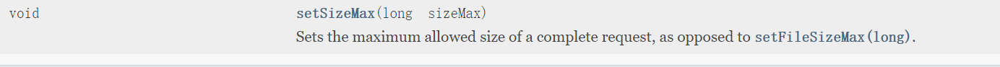

> 设置上传所有文件的总大小


> 设置上传中文文件名乱码的问题


> 监听文件上传的进度

## 文件上传之FileItem（文件项）


> 判断表单项是普通项还是文件上传项


> 获得普通项的名称


> 获取普通项的值，另一个重载方法可以设置接收值的编码类型


> 获得文件上传的文件名的方法


> 获得文件内容的方法


> 获得文件上传的文件的大小


> 获得文件上传的mine类型


> 删除文件上传产生的临时文件


## JS控制多文件上传


**代码实现**

```html
<html>
<head>
    <title>Title</title>
</head>
<script type="text/javascript">
    function add() {
        var divElement = document.getElementById("uploadList")
        divElement.innerHTML += '<div><input type="file" name="upload"><button type="button" onclick="del(this)">移除</button></div>'
    }

    function del(who) {
        who.parentNode.parentNode.removeChild(who.parentNode);
    }
</script>
<body>
<form action="upload" method="post" enctype="multipart/form-data">
    <button type="button" onclick="add()">添加</button>
    <button type="submit">提交</button>
    <div id="uploadList">

    </div>
</form>
</body>
</html>
```

> 文件上传的后台代码使用之前的就行了


## 文件上传中兼容浏览器的问题及解决

如果使用IE老版本的浏览器出现一个文件名称获取错误的问题，IE老版本获取文件名称的时候，会带有路径


## 文件上传同一个目录下文件同名的问题及解决

张三向服务器上传了一个文件aa.txt内容是hello world。李四向服务器上传了一个文件也叫aa.txt，但是内容为hello trump。因为文件名相同，后上传的文件就会将先上传的文件覆盖掉。

**解决问题**

使用唯一文件名

Java的api中有一个类叫UUID，可以产生随机的字符串

```java
UUID.randomUUID().toString().replace("-", "");
```


## 文件上传同一个目录下存放文件过多的问题

现在所有的用户都上传文件，如果网站访问量比较大，如果都上传到同一个目录下，在同一个目录下存放的文件太多，也会对程序有影响（文件多，打开这个目录的时候都会很卡，更别说读写操作）


**解决**

- 目录分离

> 按时间分离      月、周、天、小时
>
> 按用户分离     按张三、李四
>
> 按个数分离    一个目录下存放3000个文件
>
> 按目录分离算法     按照某种特定算法进行分离
>
> > 1. 上传一个文件，得到一个唯一的文件名
> > 2. 唯一文件名获取其hashCode值。  ---int类型的值（32）
> > 3. 让hashcode的值 & 0xf（十六进制）其实就是二进制的（1111）  得出这个值作为一级目录
> > 4. 让hashcode右移4位  & 0xf   得出这个值作为二级目录
> > 5. 如此类推


# 文件下载

**文件下载：将服务器上的一个文件，通过流写入到客户端上**


文件下载的方式

- 使用超链接的方式实现文件的下载

> 1. 在 `<a href="文件的路径">超链接</a>`
> 2. 注意：超链接的方式，如果浏览器不能识别这种格式的文件，提示下载，如果支持该格式的文件，直接打开。

- 通过手动编写代码的方式实现文件的下载

> 设置两个头和一个流
>
> - content-type  :文件的mime的类型
> - content-Disposition :浏览器支持该格式的文件，提示下载
> - 设置该文件的输入流（输出流是固定的response.getOutpitStream）

## 文件下载的超链接方式

> 直接在浏览器的超链接访问资源路径，如果浏览器支持的资源就直接打开，不支持的资源的需要下载

- 创建download.jsp文件

```jsp
<h1>文件下载</h1>
${pageContext.request.contextPath}
<h3><a href="${pageContext.request.contextPath}/data/1.jpg">图片</a></h3>
<h3><a href="${pageContext.request.contextPath}/data/org.wso2.maven.registry-5.2.30.jar">zip文件</a></h3>
```


- 将资源文件放在web目录下


点击图片，浏览器支持直接打开图片，可以直接在浏览器查看


点击 jar包，浏览器不支持直接打开jar包，需要下载


## 文件下载之手动编码的方式

什么是mine类型

在tomcat/conf/web.xml文件中可以查看

html的mine类型

jpg的mine类型


**代码实现**

jsp代码

```jsp
<h1>手动编码下载，可以下载jpg图片</h1>
<%--通过超链接访问我们的servlet,然后传送一个参数,这个参数是文件名,servlet通过这个参数找到我们需要下载的文件--%>
<h3><a href="${pageContext.request.contextPath}/download?filename=1.jpg">图片</a></h3>
<h3><a href="${pageContext.request.contextPath}/download?filename=org.wso2.maven.registry-5.2.30.jar">zip文件</a></h3>
```

servlet代码

```java
protected void doGet(HttpServletRequest req, HttpServletResponse resp) throws ServletException, IOException {
    //获取要下载的文件名文件名
    String filename = req.getParameter("filename");
    //动态获取要下载文件的mine类型
    String mine = getServletContext().getMimeType(filename);
    //设置content-Type servlet响应回浏览器,告诉浏览器响应回去的mine类型
    resp.setContentType(mine);
    //设置浏览器可以下载的类型,而浏览器不是直接打开
    resp.setHeader("Content-Disposition", "attachment;filename=" + filename);
    //获取要下载文件的输入流
    String path = getServletContext().getRealPath("/data");
    System.out.println(path);
    InputStream inputStream = new FileInputStream(path + "/" + filename);
    OutputStream outputStream = resp.getOutputStream();
    byte[] bytes = new byte[1024];
    while (inputStream.read(bytes) != -1) {
        outputStream.write(bytes);
    }
    inputStream.close();
    outputStream.close();

}
```


## 中文名文件的下载

**不同的浏览器对中文的下载的编码不一样的**

- IE浏览器采用的是url编码
- firefox浏览器采用的是Base64编码

> 通过判断客户端使用的浏览器类型
>
> - User-agent请求头可以获得客户端浏览器信息

> ```java
> //为什么要对文件名进行编码，因为浏览器不认识中文，而下面我们需要把文件名作为参数输入浏览器，而文件名包含中文，浏览器不认识中文
> // 所以需要把中文转化为url编码或者base64编码，这样浏览器才能识别
> ```

**tomcat8.0之后get请求不需要url拿数据再解码，直接取消这两步，直接输出的是utf-8的数据(如果继续这样解码会报错)**


> tomcat8之后获取get请求的数据不需要encode和decode了，继续这样做中文会乱码


## 给定目录下的文件下载

任意获取一条路径，然后将这条路径的文件显示在页面上，在页面上给每个目录或文件响应下载连接，当点击这个连接的时候，对该文件 进行下载

**树形结构的遍历**


- 二叉树的遍历


**什么是队列**

“队列是一种特殊的线性表，特殊之处在于它只允许在表的前端（front）进行删除操作，而在表的后端（rear）进行插入操作，和栈一样，队列是一种操作受限制的线性表。进行插入操作的端称为队尾，进行删除操作的端称为队头。” 

**代码实现**

```jsp
<%
    //创建一个队列（队列是前端进行删除操作，后端进行添加操作 ）
    Queue<File> queue = new LinkedList<>();
    //将resource根节点入队
    File root = new File("C:\\Users\\生吞二次元\\Desktop\\resource");
    //传入resource目录，队列获取resource
    queue.offer(root);
    //如果队列不为空
    while (!queue.isEmpty()) {
        //根节点出队
        File file = queue.poll();
        //获取根节点下所有的子节点
        File[] files = file.listFiles();
        //判断子节点是文件还是目录，如果是文件就输出，如果是目录，就将这个目录传入队列
        for (File f : files) {
            if (f.isFile()) {
%>
<h4><a href="#"><%=f.getName()%>
</a></h4>
<%
            } else {
                queue.offer(f);
            }
        }
    }
%>
```


**和上面一样，只对a标签进行修改，因为浏览器不能识别特殊符号\，所以需要替换成十六进制**


**servlet代码和上面大同小异**

```java
String filename = req.getParameter("filename");
String path = filename;
System.out.println(filename);
//判断浏览器的类型
//为什么要对文件名进行编码，因为浏览器不认识中文，而下面我们需要把文件名作为参数参入浏览器，而文件名包含中文，
// 所以需要把中文转化为url编码或者base64编码，这样浏览器才能识别
String agent = req.getHeader("User-Agent");
if (agent.contains("Firefox")) {//如果这个agent包含"Firefox"
    //将文件名转化为base64编码
    filename = "?UTF-8?B?" + new String(Base64.getEncoder().encode(filename.getBytes("utf-8"))) + "?=";
} else {
    //将文件名转化为url编码
    filename = URLEncoder.encode(filename, "UTF-8");
}
//动态获取要下载文件的mine类型
String mine = getServletContext().getMimeType(filename);
//设置content-Type servlet响应回浏览器,告诉浏览器响应回去的mine类型
resp.setContentType(mine);
//设置浏览器可以下载的类型,而浏览器不是直接打开
resp.setHeader("Content-Disposition", "attachment;filename=" + filename);
InputStream inputStream = new FileInputStream(path);
OutputStream outputStream = resp.getOutputStream();
byte[] bytes = new byte[1024];
while (inputStream.read(bytes) != -1) {
    outputStream.write(bytes);
}
inputStream.close();
outputStream.close();
```


# 三层架构


# 代理

1. 静态代理
2. 动态代理


## **静态代理代码演示**

**步骤**

- 创建一个抽象角色
- 真实角色（目标角色）和代理角色都需要实现抽象角色
- 抽象角色获得真实角色的引用
- 在抽象角色调用真实角色目标


传统访问目标角色

- 创建抽象接收（抽象类、接口）

```java
public interface IPerson {
    void play();
}
```

- 创建真实角色

```java
public class TargetPerson implements IPerson {
    @Override
    public void play() {
        System.out.println("我会唱跳rap");
    }
}
```

- 直接创建目标

```java
public static void main(String[] args) {
    //传统直接访问目标对象
    IPerson person = new TargetPerson();
    person.play();
}
```


**现在我们不再通过真实对象来执行方法，而是通过代理对象来实现，目标对象只需完成实现方法的内容，代理对象可以实现其他辅助方法**

- 创建代理对象

```java
public class PersonProxy implements IPerson {
    private IPerson person;

    public PersonProxy(IPerson person) {
        this.person = person;

    }

    @Override
    public void play() {
        person.play();
    }
}
```

- 通过代理调用目标

```java
//通过代理来访问
//创建目标
IPerson person1 = new TargetPerson();
//创建代理
IPerson personProxy = new PersonProxy(person1);
//通过代理来调用目标
personProxy.play();
```

**传统调用和代理调用的结果**

**代理模式的好处**

> 真实的目标可以专注于他实现接口的方法，不用关心非真实对象其他功能
>
> 而其他辅助功能可以在代理对象完成，比如日志操作，性能监控等，可以在代理类中完成，提高真实对象的间接性

## 

**静态代理的概述**

> 是由程序员创建或工具生成代理类的源码，再编译代理类。所谓静态也就是在程序运行前就已经存在代理类的字节码文件（代理类提前通过代码写好），代理类和委托类的关系在运行前就确定了

**静态代理的缺点**

> 使用静态代理很容易就完成了对一个类的代理操作。但是静态代理的缺点也暴露了出来：由于代理只能为一个类服务，如果需要代理的类很多，那么就需要编写大量的代理类，比较繁琐


## 动态代理

> 是在实现阶段不用关心代理类，而在运行阶段才指定哪一个对象
>
> 利用反射机制在运行时创建代理类。


**代码演示**

```java
//创建目标
IPerson person2 = new TargetPerson();
IPerson proxyInstance = (IPerson) Proxy.newProxyInstance(person2.getClass().getClassLoader(), person2.getClass().getInterfaces(), new InvocationHandler() {
    @Override
    public Object invoke(Object proxy, Method method, Object[] args) throws Throwable {
         //method是通过字节码文件对象获得的method对象,返回一个invoke对象
                //invoke是在指定对象上调用方法
                //args是方法上的参数
                //proxy是代理对象
                //  method.invoke(object, args);
        return method.invoke(person2, args);
    }
});
proxyInstance.play();
```

> newProxyInstance方法的三个参数
>
> - 目标对象的类加载器
> - 目标对象实现所有接口的数组
> - 因为动态代理没有实际意义上的代理对象，所以需要通过invocationHandler来监听目标对象，帮助我们调用目标对象的行为
>
> > invoke方法的三个参数
> >
> > 1. proxy：是我们的代理对象
> >
> > 2. method：是在指定对象上调用方法
> >
> > 3. args：是目标行为方法的参数


**创建一个代理工具类**

创建这个代理工具类对象，存入目标类对象，返回一个代理对象

**代理工具类**

```java
public class ProxyUtil {
    //因为这是工具类，定义一个用来接收所有目标对象的成员属性
    private Object object;

    public ProxyUtil(Object obj) {
        this.object = obj;
    }

    public Object getProxy() {
        //返回一个代理类对象
        return Proxy.newProxyInstance(object.getClass().getClassLoader(), object.getClass().getInterfaces(), new InvocationHandler() {
            @Override
            public Object invoke(Object proxy, Method method, Object[] args) throws Throwable {
                //method是通过字节码文件对象获得的method对象,返回一个invoke对象
                //invoke是在指定对象上调用方法
                //args是方法上的参数
                //proxy是代理对象
                //  method.invoke(object, args);
                method.invoke(object, args);
                return proxy;
            }
        });
    }
}
```

**抽象对象和上面一样**


**方法调用**

```java
//创建目标类对象
LoginService loginService = new LoginImpl();
ProxyUtil proxyUtil = new ProxyUtil(loginService);
LoginService proxy = (LoginService) proxyUtil.getProxy();
proxy.login("吴亦凡", "蔡徐坤");
proxy.play();
```


# Maven环境搭建

****

### **为什么要学习maven**

> 在Javaweb开发种，需要大量jar包，这些jar包需要手动导入，这是非常繁琐的
>
> 如何让一个东西自动帮我们导入和配置jar包

### **Maven是项目架构工具**

> 就是用来方便我们导入jar包的
>
> 核心思想是：约定大于配置
>
> Maven会规定好你该如何去编写我们的Java代码，必须要按照这歌规范来

### **下载安装maven**


- 下载完成后解压


- 配置环境变量


> M2_HOME：maven目录下的bin目录 （这个配置是为了学习之后的mvc和spring boot）
>
> MAVEN_HOME：maven的目录

- 配置path


- 配置完成后，打开cmd


### **配置ali云镜像**

打开conf/setting.xml这个文件

在mirrors标签中，需要设置国内镜像，如果使用默认的国外镜像，下载就会非常慢

```xml
  <mirror>
        <id>alimaven</id>
        <name>aliyun maven</name>
        <url>
            http://maven.aliyun.com/nexus/content/groups/public/
        </url>
        <mirrorOf>central</mirrorOf>
    </mirror>
```


### **建立仓库**

- 本地仓库

> 自己重新配置maven本地仓库路径，防止仓库生成在c盘

1. 在maven安装目录下创建一个新的文件夹maven-repo
2. 在conf\setting.xml配置文件配置本地仓库路径


## idea中maven的操作

### **通过模板创建一个maven项目**


**题外话**


**然后就疯狂下载东西 **


**观察maven仓库多了什么东西**


**idea的maven设置**

创建完项目后需要注意


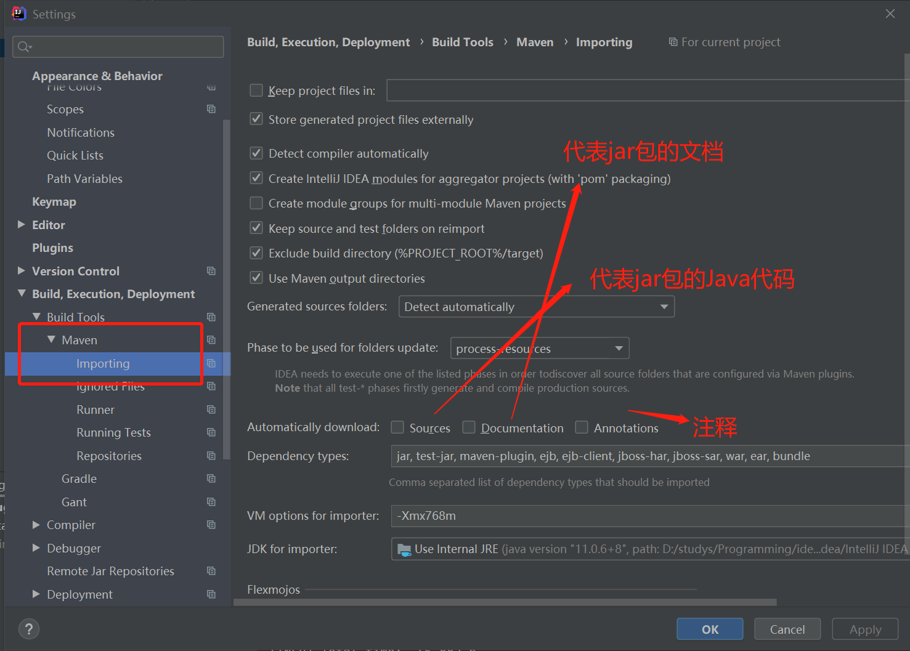

> 一般不会选择导入jar包的Java文件和文档，会影响上传速度

**忽视配置文件  （这个需要在配置文件出现问题才会配置）**


**使用项目的jdk**


配置本地仓库


因为这个项目是基于web模板创建的，所有会有web的资源文件夹


**到这里，maven在idea中的配置就完成了**


### 创建一个普通的maven项目


**这样一个干净的maven项目就做出来了**


### 在web模板项目的基础上，添加java文件目录


然后通过右键点击这些文件夹，点击make Directory as选项，将这些文件架定义为不同类型的目录


**项目结构配置**

**第二种定义文件类型的方法**

点击file ——> 点击project structrue打开界面


**在idea中配置tomcat**


> 如何解决这个warning，为什么会有这个问题
>
> 我们访问一个网站，需要指定一个文件夹名字

所以继续配置


**配置完上面之后，就可以开启服务器启动了**


**查看maven project**


### pom文件

pom文件是maven的核心配置文件


> 所以我们可以在maven project这个选项卡查看我们pom.xml文件的状态，比如当我们在pom.xml添加dependencies这个标签，maven project就会新增Dependencies这个选项。
>
> 
>
> **演示**
>
> 在depenencies中添加新的依赖
>
> 

### **maven可能出现的问题**

因为maven是约定大于配置，所以后期可能会出现资源导出失败的问题，会在mybaties中遇到

比如maven规定在Java文件中只能写Java代码，如果在Java文件中写了xml或者properties文件（数据库文件），maven就会导不出来这些文件，就会卡很久

**解决**

所以可以在pom.xml文件中的`<build>`标签中进行如下配置

```xml
  <!--防止我们项目中配置文件导出失败的问题-->
        <resources>
            <resource>
                <directory>src/main/resources</directory>
                <excludes>
                    <exclude>**/*.properties</exclude>
                    <exclude>**/*.xml</exclude>
                </excludes>
                <filtering>false</filtering>
            </resource>
            <resource>
                <directory>src/main/java</directory>
                <includes>
                    <include>**/*.properties</include>
                    <include>**/*.xml</include>
                </includes>
                <filtering>false</filtering>
            </resource>
        </resources>
```


### 目录树


## 解决遇到的问题

- 在maven3.6.2中  会出现 

解决方法是maven降级别3.6.1

- idea中每次都要重复配置maven


红框部分没有配置好（在file ---->  setting ---> mavne）


- maven默认web项目中的web.xml版本问题

想要最兼容的版本，应该去D:\studys\Programming\tomcat\apache-tomcat-8.5.59\webapps\ROOT\WEB-INF路径下的web.xml文件直接复制粘贴到项目上，如下


- 创建maven项目无法找到有关servlet的jar包，如下:arrow_down:


这时候，我们可以去tomcat的lib目录下查看，有关servlet的jar包是什么


有可能叫servlet-api，那么我们可以去maven官方查找这个jar包


这样就能查到有关servlet的jar包了


### maven plugins出现红线的问题


不断重复上面的3个步骤，

install一次，刷新一次，如果还有红线，重复就行2  和3 就行

原文解决方案地址

[解决plugins报红问题](https://blog.csdn.net/kealina/article/details/79040168)


## 解决maven突然出错，找不到某个jar包的问题


用最笨的方法，重新创建一个新的本地仓库，然后更改项目关联的本地仓库，然后重新下载maven依赖（一个一个依赖的导入进去）

记得修改settings.xml文件


## 解决maven文件夹删除没有权限或者还有程序使用这个maven文件的问题

只要将这个与maven 的本地仓库的项目取消掉就行了


## 关于之前看视频在maven的pom文件配置的resource标签的问题

```xml
 <resources>
            <resource>
                <directory>src/main/resources</directory>
                <excludes>
                    <exclude>**/*.properties</exclude>
                    <exclude>**/*.xml</exclude>
                </excludes>
                <filtering>false</filtering>
            </resource>
            <resource>
                <directory>src/main/java</directory>
                <includes>
                    <include>**/*.properties</include>
                    <include>**/*.xml</include>
                </includes>
                <filtering>false</filtering>
            </resource>
        </resources>
```

这个最好暂时先不要使用，因为理解不深，很容易造成路径混乱


## 使用maven打包项目出现无效的目标的发行版的错误

这是因为我们在maven中配置的jdk和当前所用的jdk不一致


去maven文件夹的

把jdk15修改成1.8就行了


# tomcat遇到的问题

## 解决welcome-file-list设置默认欢迎页无法加载js、css等文件的问题

因为设置我们的login.html为默认页，结果tomcat不能加载css、js文件

不管我们怎么配置css和js文件路径，依然加载不了


所以我们换一种思路

- 用index.jsp文件作为默认欢迎页


- 然后在jsp文件中编写js代码默认跳转到我们的login.html页面


## 解决在resources文件创建文件但是部署路径不更新，不显示文件的问题

这是因为我们的是maven项目

需要在pom.xml文件里面添加tomcat插件


## 解决静态资源被修改后重启服务器资源没有被加载到部署路径的问题


## 关于idea中tomcat项目两种打包方式的区别

.png)


打包成war_exploded的方式和打包成war方式的区别是，当我们打包成war方式的时候，项目的部署路径是在tomcat的webapps目录下的如下:arrow_double_down:


> 当我们把项目打包成war目录，部署路径是在webapps下


而当我们打包成war_exploded的时候


webapps下是没有这个项目的，那么这个项目部署在哪里呢


> 项目是被部署在了工作目录下的target下的maven-stuManager-1.0SNAPSHOT下，而maven-stuManager-1.0SNAPSHOT也是我们项目的realpath的根目录

其实上面被打包成war项目，在他的工作路径中也是有和war_exploded一样的target目录的，但是war是比war_exploded更进一步的直接把项目部署在tomcat的webapps目录下了（个人理解）


**当我们的项目被打包成war，**

**当我们通过getrealpath()方法在部署路径下创建文件夹，我们在idea的target目录是查看不到新建的文件夹的，只能通过tomcat目录下的webapps下才能查看到项目的更新，如**


我们将项目打包成war


我们打开控制台输出的路径查看是否存在这个验证码图片


可以看到，确实是生成在了webapps下的，所以当我们把项目打包成war包之后，idea上的target目录是查看不到生成新的文件，只能去tomcat目录下的webapps目录下去查看


**然后我们把项目打包成war_exploded文件，看我们新建的验证码图片，在idea的target下能不能查看到**


## 关于getrealPath方法的理解

```java
ServletContext servletContext = req.getServletContext();
String path = servletContext.getRealPath("/");
```

getrealpath("/")获取的是我们项目的根路径

比如当项目为war_exploded打包的时候，根路径为:arrow_double_down:

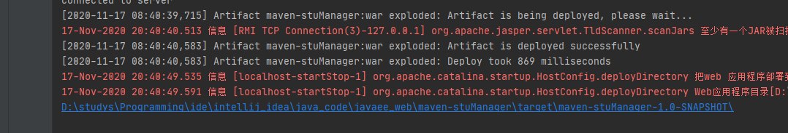

> 就是工作路径下target目录下的maven-stuManaager-1.0-SNAPSHOT
>
> 打开这个文件
>
> 可以看到这个就是我们项目的根目录

我们在根目录下创建一个文件夹

```java
ServletContext servletContext = req.getServletContext();
String path = servletContext.getRealPath("/");
System.out.println(path);
File file = new File(path+"images");
while (!file.exists()){
    file.mkdir();
}
```


如图，可以看到，我们通过getrealpath创建一个文件夹，这个文件夹在部署路径中已经创建了，但是在工作路径下是查看不到这个image文件被创建的

然后我们在这个images文件创建一个html，然后通过浏览器看看能不能访问到


可以看到，这是可以访问到的


**注意：如果文件是在WEB-INF文件夹下，那么是无法通过浏览器访问到的**

> 就是说，如果我们上面的a.html文件时生成在WEB-INF文件夹下，那么通过浏览器是访问不到的


**我们通过在webapp下创建一个c.txt**

**在resources文件下创建一个b.txt**

**在java.com文件夹下创建一个a.txt**

看看经过tomcat打包后，部署在tomcat的位置是在哪里


- 显示查看c.txt


> 如图可以看到，当我们在webapp创建c.txt文件，

然后我们查看resources文件下的b.txt文件


> 如图可以看到，资源文件下的b.txt经过tomcat编译后就会才WEB-INF/classes/ 下生成
>
> **注意：因为是生成在WEB-INF目录下的，所以这些文件是无法通过浏览器来访问到的**
>
> 所以我们可以通过getrealpath（"\\WEB-INF\\classes\"）来获取到我们的资源文件


然后我们查看在java/com 下创建 的a.txt文件是生成在哪里


> 如图，可以看到，在java文件夹下创建文件，经过tomcat打包后是不存在的，因为java文件夹是用来编写java代码的，如果用来存放一些资源文件是不合理的，所以我们应该将资源文件放在resources目录下
>
> **所以我们可以理解为，在部署路径下，WEB-INF/classes是用来存放我们的资源文件的**
>
> 当我们进行上传下载等操作的时候，就需要在WEB-INF/classes目录下创建一个文件，然后用来存放文件，注意，这个文件夹是不可访问的，就是浏览器不能访问到WEB-INF下的文件的


**如果我们通过getrealpath来创建一个文件夹来存放文件，那么我们通过File类来判断这个文件夹在项目的真实路径下是否存在，否则就会报路径不存在的异常**

操作如下:arrow_down:


**注意：我们直接在工作路径下创建文件时可以在部署路径下查看到的**

**但是我们在部署路径下创建文件，在工作路径下是不能查看到的，但是部署在项目根目录下的文件是可以被浏览器访问到的（因为只有是WEB-INF目录下的文件，浏览器是不能访问到的）**


> 我认为，在javaweb项目中，一些提前配置好的资源文件或者静态资源文件，是创建在在工作路径，然后部署路径也会存在的
>
> 而通过tomcat生成的文件文件是生成在部署路径上的，在工作路径上是不显示的。


## /和/*的区别


# ajax

## 概念


## 原生js的实现方式


**get请求**

```JavaScript
    <!--    创建ajax对象-->
    var xmlhttp;
    if (window.XMLHttpRequest) {// code for IE7+, Firefox, Chrome, Opera, Safari
        xmlhttp = new XMLHttpRequest();
    } else {// code for IE6, IE5
        xmlhttp = new ActiveXObject("Microsoft.XMLHTTP");
    }

    function btnFun() {
        xmlhttp.open("GET", "/MyJavaWeb_StuManagenr/ajax01?username=wuyifan", true);
        xmlhttp.send();
    }
```

**同步演示**


> 可以看到，在普通的同步请求的时候
>
> 点击发出请求，页面是需要等服务器返回响应，客户端浏览器才能操作，就是需要等服务器5秒执行完之后才能操作页面


**异步演示**


> 可以看到，设置成异步请求之后，当我们向服务器发出请求等待服务器响应回来的时间段，我们是可以继续操作页面的


## 接收并处理来自服务器的结果

```JavaScript
<!--    创建ajax对象-->
var xmlhttp;
if (window.XMLHttpRequest) {// code for IE7+, Firefox, Chrome, Opera, Safari
    xmlhttp = new XMLHttpRequest();
} else {// code for IE6, IE5
    xmlhttp = new ActiveXObject("Microsoft.XMLHTTP");
}

function btnFun() {
    xmlhttp.open("GET", "/MyJavaWeb_StuManagenr/ajax01?username=wuyifan", true);
    xmlhttp.send();
    //在 onreadystatechange 事件中，我们规定当服务器响应已做好被处理的准备时所执行的任务
    xmlhttp.onreadystatechange=function()
    {
        //当 readyState 等于 4 且状态为 200 时，表示响应已就绪：
        if (xmlhttp.readyState==4 && xmlhttp.status==200)
        {
            //responseText 属性返回字符串形式的响应
            alert(xmlhttp.responseText);
        }
    }
}
```

**服务器**

```java
try {
    Thread.sleep(5000);
} catch (InterruptedException e) {
    e.printStackTrace();
}
String username = req.getParameter("username");
System.out.println(username);
resp.getWriter().print(username);
doPost(req, resp);
```


## jQuery的实现方式


### $.ajax();

```JavaScript
$.ajax(
    {
        url: "/MyJavaWeb_StuManagenr/ajax01",
        data: {
            username: 'wuyifan',

            password: "root"
        },
        success(data) {
            alert(data)
        }
    }
)
```

### $.get();

```JavaScript
$.get(
    "/MyJavaWeb_StuManagenr/ajax01",
    {
        pwd: "root",
        username: "wuyifan"
    },
    function (data) {
        alert(data)
    }
)
```


### $.post();

```JavaScript
$.post(
    "/MyJavaWeb_StuManagenr/ajax01",
    {
        pwd: "root",
        username: "wuyifan"
    },
    function (data) {
        alert(data)
    }
)
```


## ajax实现form表单的提交


# JSON

## json的定义

```json
var data =  {
    "sites": [
        { "name":"菜鸟教程" , "url":"www.runoob.com" }, 
        { "name":"google" , "url":"www.google.com" }, 
        { "name":"微博" , "url":"www.weibo.com" }
    ]
}
```


## json值的获取


```json
//变量名.键值对
//变量名[键值对]
```


## json解析器——Jackson

- 常见的json解析器

> 1. jsonlib
> 2. gson
> 3. fastjson
> 4. jackson


**jackson的使用步骤**

- 导入相关Java包
- 创建Jackson核心对象ObjectMapper
- 调用objectMapper的相关方法


**JSON数据和Java对象的相互转换**


### json转为Java对象

使用readValue方法


### Java对象转换json

```Java
Rabbit rabbit = new Rabbit();
rabbit.setAddress("广东江门");
rabbit.setAge("121");
rabbit.setName("吴亦凡");
//创建jackson核心类
ObjectMapper objectMapper = new ObjectMapper();
/*
 * writeValue(参数1，obj);
 * 参数1
 *   File:将obj对象转换为json字符串，并保存到指定的文件中
 *    Writer:将obj对象转换为json字符串，并将json数据填充到字符串输出流中
 *    OutPutStream：将obj对象转换为json字符串，并将json数据填充到字节输出流中
 *
 * writerValueAsString（obj）将对象转换为json字符串
 * */
String jsonRabbit = objectMapper.writeValueAsString(rabbit);
System.out.println(jsonRabbit);
```


## json注解

- @JsonIgnore：排除属性
- @JsonFormat：属性值的格式化

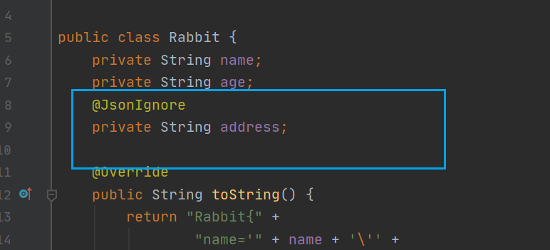


## 复杂的对象转换（List 、map）


List：会转变为数组

Map：转变为json格式


## JS遍历json对象

```JavaScript
//[{"tid":"013","tname":"小兔","tsex":"男","tpwd":null},{"tid":"001","tname":"小红","tsex":"男","tpwd":null},{"tid":"003","tname":"小辉","tsex":"男","tpwd":null},{"tid":"002","tname":"小绿","tsex":"女","tpwd":null}] ———— data
//data为后台传过来的json字符串
//JSON.parse 将json字符转转换为json对象
var teacherInfo = JSON.parse(data);
//遍历json对象  teachetInfoKey为json对象的key
for (const teachetInfoKey in teacherInfo) {
    // console.log(teacherInfo[teachetInfoKey])
    console.log(teacherInfo[teachetInfoKey]["tid"])
    console.log(teacherInfo[teachetInfoKey]["tname"])
    console.log(teacherInfo[teachetInfoKey]["tsex"])


}
```


# LocalDateTime


