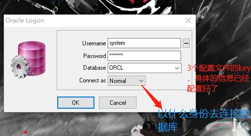
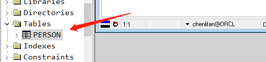
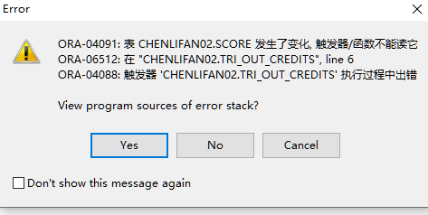

[TOC]

### Oracle的体系

- **数据库**

> Oracle数据库屎数据的物理存储。这就包括（数据文件ORA或者DBF、控制文件、联机日志、参数文件）。其实Oracle数据库的概念喝其他数据库不一样，这里的数据库是一个操作系统，只有一个库。可以看作屎Oracle就只有一个大数据库。

- **实例**

> 一个Oracle实例有一系列的后台进程和内存结构组成。一个数据库可以有n个实例

- **用户**

> 用户是在实例下建立的，不同实例可以建相同名字的用户
>
> > 1. Oracle的用户是管理表的基本单位（某某用户下有多少张表）
> >
> > 
> >
> > 1. Mysql管理表的基本单位是数据库（比如当前数据库下有多少张表）
> >
> > > 所以我们用oracle数据库作为一个项目的数据库，我们会新创建一个用户，而如果是mysql来管理一个项目的话，我们就会创建一个新的数据库

- **表空间**

> Oracle数据库是通过表空间来存储物理表的，一个数据库实例可以有N个表空间，一个表空间下可以有N张表。
>
> 有了数据库，就可以创建表空间。

- **用户、表空间、表的关系**

> Oracle数据库建立好后，想要在数据库里建表，必须先为数据库建立用户，并为用户指定表空间
>
> > 如果说用户是商家的话，那么表就是商品，而表空间就是仓库。

- **数据文件**

> 数据文件是数据库的物理存储单位。数据库的数据是存储在表空间中的，真正是在某一个或者多个数据文件中。而一个表空间可以由一个或多个数据文件组成，一个数据文件只能属于一个表空间。一旦数据文件被加入到某个表空间后，就不能删除这个文件，如果要删除某个数据文件，只能删除其所属于的表空间才行

**注意：**表的数据，是有用户放入某一个表空间的，而这个表空间会随机把这些数据放到一个或者多个数据文件中。

> 由于Oracle的数据库不是普通的概念，Oracle是由用户和表空间对数据进行管理和存放的。但是表不是由表空间去查询的，而是由用户去查的。因为不同用户可以在同一个表空间建立同一个名字的表！！这里的区别就是用户了。

**拓展（表空间和临时表空间的区别）**

> **表空间**：此空间是用来进行数据存储的（表、function、存储过程等），所以是实际物理存储区域。
> **临时表空间**：主要用途是在数据库进行排序运算[如创建索引、order by及group by、distinct、union/intersect/minus/、sort-merge及join、analyze命令]、管理索引[如创建索 引、IMP进行数据导入]、访问视图等操作时提供临时的运算空间，当运算完成之后系统会自动清理。
> 备注：因为用途不同所以才有了区分，实际上数据库都是有默认临时空间的，但实际应用中很难满足需求，所以才需要自己创建临时空间。


### 创建表空间、创建用户以及用户授权

- 超级管理员的用户只有一个，**username：system **

**password：manager**




Connect as这个选项一般选择normal，常规的，正常的

> SYSDBA和SYSOPER这两个选项是给数据库管理员用的

###### 创建表空间

```sql
--创建表空间
create tablespace demoTableSpace01 --表空间只是一个逻辑单位，真正存放数据的地方应该叫做数据文件，所以我们创建完一个表空间之后，应该指定一个数据文件的位置，如下
datafile 'D:\oracle01\datafile\chenlifan.dbf' --'c:\chenlifan.dbf'
size 100m --创建这个表空间的初始大小为100m
autoextend on --将来存放的数据越来越多，所以我们让这个大小自动增长
next 10m --每次自动增长10m大小
```

- 删除表空间

```sql
--删除表空间
drop tablespace tablespacename;
```

- 创建用户

```sql
create user chenlifan--用户名
identified by clf13795--密码
default tablespace demoTableSpace01 --指定表空间
```

- 到这一步的时候，这个账户的用户名和密码还暂时不能用来登陆
  所以我们就需要给用户授权，
- Oracle数据库中常用角色

> **connect-**- 连接角色，基本 角色，如果Oracle中没有这个角色就无法使用
> **resource**--开发者角色（一般公司会给程序员分配的角色）
> **dba**--超级管理员角色（学习中用的角色）

- **授权**

```sql
grant dba to chenlifan
```

- **表的创建**

`基本数据类型`

|              |                                |                                                 |                                       |
| ------------ | ------------------------------ | ----------------------------------------------- | ------------------------------------- |
| 类型         | 含义                           | 存储描述                                        | 备注                                  |
| CHAR         | 固定长度字符串                 | 最大长度2000bytes                               |                                       |
| VARCHAR2     | 可变长度的字符串,              | 最大长度4000bytes                               | 可做索引的最大长度749                 |
| NCHAR        | 根据字符集而定的固定长度字符串 | 最大长度2000bytes                               |                                       |
| NVARCHAR2    | 根据字符集而定的可变长度字符串 | 最大长度4000bytes                               |                                       |
| DATE         | 日期（日-月-年）               | DD-MM-YY(HH-MI-SS),经过严格测试，无千虫问题     |                                       |
| TIMESTAMP    | 日期（日-月-年）               | DD-MM-YY(HH-MI-SS:FF3),经过严格测试，无千虫问题 | 与DATE相比较，TIMESTAMP有小数位秒信息 |
| LONG         | 超长字符串                     | 最大长度2G,足够存储大部头著作                   |                                       |
| RAW          | 固定长度的二进制数据           | 最大长度2000bytes                               | 可存放多媒体图象声音等                |
| LONG RAW     | 可变长度的二进制数据           | 最大长度2G                                      | 可存放多媒体图象声音等                |
| BLOB         | 二进制数据                     | 最大长度4G                                      |                                       |
| CLOB         | 字符数据                       | 最大长度4G                                      |                                       |
| NCLOB        | 根据字符集而定的字符数据       | 最大长度4G                                      |                                       |
| BFILE        | 存放在数据库外的二进制数据     | 最大长度4G                                      |                                       |
| ROWID        | 数据表中记录的唯一行号         | 10bytes                                         | ***\***.***.\***格式，*为0或1         |
| NROWID       | 二进制数据表中记录的唯一行号   | 最大长度4000bytes                               |                                       |
| NUMBER(P,S)  | 数字类型                       | P为整数位，S为小数位                            |                                       |
| DECIMAL(P,S) | 数字类型                       | P为整数位，S为小数位                            |                                       |
| INTEGER      | 整数类型                       | 小的整数                                        |                                       |
| FLOAT        | 浮点数类型                     | NUMBER(38)，双精度                              |                                       |
| REAL         | 实数类型                       | NUMBER(63)，精度更高                            |                                       |

- 在chenlifan用户下创建一个person表

```sql
--创建一个person表
create table person(
       pid number(20),
       pname varchar2(10)   
);
```

`执行之后，可以在tables查看到创建了一个person表`



------

**关于sql查询语句很重要的知识点关于max()**

在[SQL](http://database.51cto.com/art/201009/225139.htm)数据库中，最大/最小值函数—MAX()/MIN()是经常要用到的，下面就将为您分别介绍MAX()函数和MIN()函数的使用，供您参考，希望对您学习SQL数据库能有些帮助。

当需要了解一列中的最大值时，可以使用MAX()函数；同样，当需要了解一列中的最小值时，可以使用MIN()函数。语法如下。

SELECT          MAX (column_name) / MIN (column_name)

FROM            table_name

说明：列column_name中的数据可以是数值、字符串或是日期时间数据类型。MAX()/MIN()函数将返回与被传递的列同一数据类型的单一值。

实例7 MAX()函数的使用

查询TEACHER表中教师的最大年龄。实例代码：

SELECT MAX (AGE) AS MAXAGE

FROM     TEACHER

运行结果如图1示。

[](http://images.51cto.com/files/uploadimg/20100910/1403460.jpg)

图1TEACHER表中教师的最大年龄

然而，在实际应用中得到这个结果并不是特别有用，因为经常想要获得的信息是具有最大年龄的教师的教工号、姓名、性别等信息。

然而SQL不支持如下的SELECT语句。

SELECT TNAME, DNAME, TSEX, MAX (AGE)

FROM     TEACHER

因为聚合函数处理的是数据组，在本例中，MAX函数将整个TEACHER表看成一组，而TNAME、DNAME和TSEX的数据都没有进行任何分组，因此SELECT语句没有逻辑意义。同样的道理，下面的代码也是无效的。

SELECT TNAME, DNAME, TSEX,SAL ,AGE

FROM     TEACHER

WHERE   AGE＝MAX (AGE)

解决这个问题的方法，就是在WHERE子句中使用子查询来返回最大值，然后再基于这个返回的最大值，查询相关信息。

实例8 在WHERE子句中使用子查询返回最大值

查询TEACHER表中年纪最大的教师的教工号、姓名、性别等信息。

实例代码：

SELECT TNAME, DNAME, TSEX, SAL, AGE

FROM     TEACHER

WHERE   AGE＝(SELECT MAX (AGE) FROM    TEACHER)

运行结果如图2示。

[](http://images.51cto.com/files/uploadimg/20100910/1403461.jpg)

图2在WHERE子句中使用子查询返回最大值

MAX()和MIN()函数不仅可以作用于数值型数据，也可以作用于字符串或是日期时间数据类型的数据。

实例MAX()函数用于字符型数据

如下面代码：

SELECT MAX (TNAME) AS MAXNAME

FROM     TEACHER

运行结果如图3示。

[](http://images.51cto.com/files/uploadimg/20100910/1403462.jpg)

图3在字符串数据类型中使用MAX的结果

可见，对于字符串也可以求其最大值。

说明
 对字符型数据的最大值，是按照首字母由A～Z的顺序排列，越往后，其值越大。当然，对于汉字则是按照其全拼拼音排列的，若首字符相同，则比较下一个字符，以此类推。

当然，对与日期时间类型的数据也可以求其最大/最小值，其大小排列就是日期时间的早晚，越早认为其值越小，如下面的实例。

实例 MAX()、MIN()函数用于时间型数据

从COURSE表中查询最早和最晚考试课程的考试时间。其中COURSE表的结构和数据可参见本书6.1节的表6-1。实例代码：

SELECT MIN (CTEST) AS EARLY_DATE,

MAX (CTEST) AS LATE_DATE

FROM     COURSE

运行结果如图4示。

[](http://images.51cto.com/files/uploadimg/20100910/1403463.jpg)

图4COURSE表中最早和最晚考试课程的考试时间

可见，返回结果的数据类型与该列定义的数据类型相同。

注意
 确定列中的最大值（最小值）时，MAX( )（MIN( )）函数忽略NULL值。但是，如果在该列中，所有行的值都是NULL，则MAX( )/MIN( )函数将返回NULL值。


------

   

### 游标

> 游标是用来操作查询结果集，相当于jdbc的resultset

语法 cursor 游标名 is 查询结果集(select。。。。。)


开发步骤

1. 声明游标
2. 打开游标    open 游标名
3. 从游标中取数据    fetch游标名 into 变量(相当于resultset中的next)
4. 什么时候取完数据呢   游标名%found :找到数据  	游标名%found：没有找到数据
5. 关闭游标    close 游标名


## 触发器

增删改的时候触发触发器

分类

> 语句级触发器
>
> 行级触发器  for each row
>
> > 使用了行级触发器，就能使用:old 和 :new 对象

- 创建触发器的过程中出现的问题



先看看我创建的触发器

```sql
create or replace trigger tri_out_credits
  after insert
  on score
  for each row
    declare 
    var_sid studentinfo.sid%type;
    var_avg_credits courseinfo.course_credits%type;
    begin
      if :new.s_score > 60 then
      select sid,avg(course_credits) into var_sid,var_avg_credits from studentinfo 
      natural join score 
      natural join courseinfo group by sid having sid =  :new.sid;

      dbms_output.put_line('你的学分为:'||var_avg_credits);
      else
        dbms_output.put_line('继续努力');
        end if;    
      end;
```

```sql
 insert into Score values(score_sequence01.nextval,20190119,'C0005','第一学年',70,'我觉得可以');
```

- 这个报错的意思是我insert这个数据到score这个表，但是这个score表的数据已经改变了，这个触发器就失效了，所以我们要把这个before该为after
- 代码如下

```sql
create or replace trigger tri_out_credits
  before insert
  on score
  for each row
    declare 
    var_sid studentinfo.sid%type;
    var_avg_credits courseinfo.course_credits%type;
    begin
      if :new.s_score > 60 then
      select sid,avg(course_credits) into var_sid,var_avg_credits from studentinfo 
      natural join score 
      natural join courseinfo group by sid having sid =  :new.sid;

      dbms_output.put_line('你的学分为:'||var_avg_credits);
      else
        dbms_output.put_line('继续努力');
        end if;    
      end;
```


- 这个是对于我出现上面的问题的分析

> 创建触发器时，触发器类型为after insert ，
>
> 在begin中
>
> Select fieldA into v_a from tableA;
>
> 执行到此句时，会出错：
>
> --弹出错误信息提示 
>
>    --ORA-04091：表tr_table发生了变化触发器/函数不能读它 
>
>    --ORA-06512: 在iu_table line 2 
>
> --ORA-04088: 触发器iu_table 执行过程中出错 
>
>  
>
> 问题分析：
>
> 在Oracle中执行DML语句的时候是需要显示进行提交操作的。当我们进行插入的时候，会触发触发器执行对触发器作用表和扩展表的种种操作，但是这个时候触发器和插入语句是在同一个事务管理中的，因此在插入语句没有被提交的情况下，我们无法对触发器作用表进行其他额外的操作。如果执行其他额外的操作则会抛出如上异常信息。
>
>  
>
> 解决方案：
>
> 出错的原因是因为触发器和DML语句在同一事务管理中，所以方案一便是将触发器和DML语句分成两个单独的事务处理。这里可以使用Pragma autonomous_transaction; 告诉Oracle触发器是自定义事务处理。
>
> Declare
>
> pragma autonomous_transaction;  
>
> begin
>
> \-------
>
> --这里需要显示提交事务
>
> Commit;
>
> End;
>
>  
>
> 同时，触发器不能更新触发条件所在的行。
>
> 例如：
>
> Create or replace trigger tri_A
>
> After  insert on tableA
>
> For each row
>
> Declare
>
> pragma autonomous_transaction;  
>
> begin
>
> update tableA set fieldA=1 where id=:new.id;
>
> end;
>
> 当你插入数据时，会发现，这个update语句有执行，却不生效。
>
> 然后想改为:new.fieldA= 1,执行后，报错：
>
> ORA-04084：无法更改此触发器类型的new值
>
> 这时候，要更换策略了，不过，也得根据个人需求了，