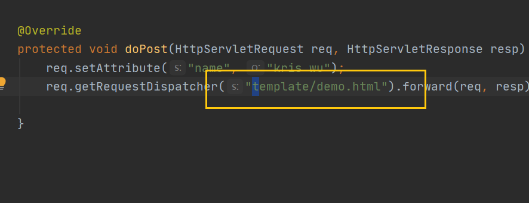

[TOC]

# 概述


# 入门

[freemarker官方手册](https://freemarker.apache.org/docs/index.html)

## freemarker环境搭建

创建一个简单的Java web项目


**输入maven依赖**

```xml
       <!-- https://mvnrepository.com/artifact/org.freemarker/freemarker -->
        <dependency>
            <groupId>org.freemarker</groupId>
            <artifactId>freemarker</artifactId>
            <version>2.3.23</version>
        </dependency>
        <!-- https://mvnrepository.com/artifact/javax.servlet/javax.servlet-api -->
        <dependency>
            <groupId>javax.servlet</groupId>
            <artifactId>javax.servlet-api</artifactId>
            <version>3.1.0</version>
            <scope>provided</scope>
        </dependency>
```

**配置maven插件和maven正常读取resource配置文件**


```xml
 <build>
        <plugins>
            <!--            配置tomcat插件-->
            <plugin>
                <groupId>org.apache.tomcat.maven</groupId>
                <artifactId>tomcat6-maven-plugin</artifactId>
                <version>2.2</version>
            </plugin>
        </plugins>
        <!--防止我们项目中配置文件导出失败的问题-->
        <resources>
            <resource>
                <directory>src/main/resources</directory>
                <excludes>
                    <exclude>**/*.properties</exclude>
                    <exclude>**/*.xml</exclude>
                </excludes>
                <filtering>false</filtering>
            </resource>
            <resource>
                <directory>src/main/java</directory>
                <includes>
                    <include>**/*.properties</include>
                    <include>**/*.xml</include>
                </includes>
                <filtering>false</filtering>
            </resource>
        </resources>
    </build>
```

**因为我们导入了freemarker依赖，所以我们可以直接在xml中配置别人的已经创建好的freemarkerservlet**

**freemarker的servlet的xml配置**

在我们webapp/web-inf下面的web.xml文件添加freemarker相关 servlet配置

**在配置之前，我们先把这个web.xml文件改为我们tomcat下 标准的格式**

:arrow_down_small:下面的是配置模板引擎的标准写法，这个servlet是在大三方别人提前写好的jar包里面

```xml
     <!--  freemarker配置的servlet的配置-->
    <servlet>
        <servlet-name>freemarker</servlet-name>
        <servlet-class>freemarker.ext.servlet.FreemarkerServlet</servlet-class>
        <init-param>
            <param-name>TemplatePath</param-name>
            <!--      默认在webapp目录下查找对应的模板文件-->
            <param-value>/</param-value>
        </init-param>
        <init-param>
            <param-name>default_encoding</param-name>
            <!--            模板默认编码为utf-8-->
            <param-value>UTF-8</param-value>
        </init-param>
    </servlet>
    <!--    处理所有以.ftl结尾的文件;ftl是freemarker默认的文件后缀-->
    <servlet-mapping>
        <servlet-name>freemarker</servlet-name>
        <url-pattern>*.ftl</url-pattern>
    </servlet-mapping>
```

**配置tomcat**


## 编写servlet类

- 将数据保存在域对象中
- 请求跳转到ftl文件中（因为我们上面配置了一个Freemarkerservlet（别人写好的第三方servlet）是访问路径是*.ftl，所以当我们跳转到ftl文件的时候，就会跳转到我们上面创建的freemarkerServlet）


1. 创建一个servlet


2. 创建模板引擎


3. 启动tomcat访问我们创建的servlet


## 如果想在html通过模板引擎获取数据

1. 创建一个html文件，然后编写el表达式


2. 访问的servlet跳转到html文件上



3. 修改模板引擎拦截的路径为所有html(*.html)


# freemarker的数据类型（注意：不同的内置函数对freemarker版本有要求，一般版本越高越好）


## 布尔数据类型的使用

将布尔类型的值传入域对象中，然后在html获取这个值


然后通过浏览器向servlet发出请求


> 不能自动将布尔值转换为字符串，因为"boolean_format"设置为"true,false"，这是传统的计算机语言默认格式，因此不被接受。


试试通过这三种方式输出Boolean值


**then的演示**

> then类型Java中的三元运算符


## 日期类型的使用

- date: 年月日      ?date
- time：时分秒    ?time
- datetime：年月日时分秒   ?datetime
- 自定义格式   ?stirng("YYYY:MM:dd:HH:mm:ss​")


**和布尔类型一样，直接输出是不被允许的**


**freemarker还提供了其他关于时间类型的内置函数，这些后期去学习**


## 数值类型数据的使用

**数值类型的数据是可以直接被输出的**


- abs   给出数字的绝对值。例如 `x?abs`，如果`x`为-5，则求值为5

- c（与数值一起使用）  将数字转换为字符串

- is_infinite   

  > 判断数字是否为浮点无穷大（根据IEEE 754）。例如，`someNumber?is_infinite` 计算`true`或`false` 取决于的值是否`someNumber`为无限。当然，如果基础数字不是浮点类型，则将始终返回 `false`。

- is_nan

  >  判断数字是否为浮点NaN（根据IEEE 754）。例如，`someNumber?is_nan`计算等于 `true`或`false`取决于`someNumber`NaN的值。当然，如果基础数字不是浮点类型，则将始终返回`false`


- lower_abc

> **将数组转化为字符串**
>
> `1`，`2`， `3`，等字符串`"a"`， `"b"`，`"c"`，等到达时 `"z"`，再这样下去`"aa"`， `"ab"`等，这是同样的逻辑，你可以在电子表格应用程序（如Excel或计算器）列标签看到。**允许的最低数字是`1`**。没有上限。如果数字`0`等于或小于或不是整数，则模板处理将中止并出错。


- round、floor、ceiling

> 使用指定的舍入规则将数字转换为整数：
>
> - `round`：四舍五入到最接近的整数。如果数字以.5结尾，则向上舍入（0.5结尾即朝正无穷大）小数大于0.5进1 小于0.5归零
> - `floor`：将数字向下舍入（即，向负无穷大）只要有小数，则一定归零
> - `ceiling`：向上舍入数字（即朝正无穷大） 只要有小数，则一定进1


- string（与数字值一起使用）

```html
$ {x} 
$ {x？string} <＃-与$ {x}相同-> 
$ {x？string.number} 
$ {x？string.currency} 
$ {x ？string.percent} 
$ {x？string.computer}
```


```html
<#setting number_format = "currency">
```

可以让输出的数字都成

**还有很多内置函数，可以查看官方文档**


- **upper_case**   转换为大写
- **lower_case** 转换为小写


## 字符串类型的使用


方法太多了，自行去官方查看


## 空值的处理

**当我们输出一个不存在的对象**


如图就会报错


当我们输出一个null的对象


还是一样会报错


当我们输出一个空的字符产


可以看到空的字符串是不会报错的


**那么我们应该如何避免上面两种报错的呢（不存在的对象和空的对象）**


1. 在对象后面加！


如上，在空的对象后面加感叹号就不会报错了

> !的意思是，如果对象的值为空，则默认值是空字符串


2. 在对象后面加??


为什么还会报错呢，因为

> ​	?? 返回的是一个布尔类型，如果对象存在就为true，如果对象不存在就为false
>
> 但是如果直接输入布尔值是会报错的
>
> 所以就需要用到布尔类型的内置函数


这样就能判断对象是否存在了


## sequence数据类型

**输出一组数组**


**输出list集合**


这样就不用在数据库中排序了


## hash类型的使用（就是map）


# freemarker的常用指令

## assign自定义变量指令

> 使用assign指令你可以创建一个新的变量，或者替换一个已经存在的变量


## if指令和list指令

因为尖括号会和html元素标签产生冲突，所以一般不建议使用，而是替换为如下:arrow_down:

lt  lte gt（小于 等于 大于）


**判断当数组不为空的时候才做遍历**


当把数组设置为空，并没有报错


## 自定义指令

**自定义普通指令**


**自定义带参指令**


**nested占位符的使用**


# freemarker页面静态化

> 通过上述介绍可知 Freemarker是一种基于模板的、用来生成输出文本的通用工具所以
> 我们必须要定制符合自己业务的模板，然后生成自己的html页面。 Freemarker是通过
> freemarker. template. Configuration这个对象对模板进行加载的（它也处理创建和缓存预
> 解析模板的工作），然后我们通过 gettemplate方法获得你想要的模板，有一点要记住
> freemarker. template. Configuration在你整个应用必须保证唯一实例

**静态化的效果是可以把我们数据库的数据写入到html文件中**

**写入到HTML文件中之后，这种不变的内容，就可以直接通过访问HTML的形式显示，就不需要再访问我们的数据库，这样就可以减少了对服务器与服务器的交互**

**也就是说，对那种内容不怎么变的数据，没有必要访问一次就访问一次数据库，这样给服务器的负担是非常大的，通过静态化可以降低我们数据库的压力**


**比如**

> 我们进入到淘宝商城，进入到手机界面，在手机的介绍页面种，这些手机宣传信息是非常少变化的，所以我们就可以对手机参数介绍的信息进行静态化


> 如上，就是信息非常少变化的页面，我们可以对其进行静态化处理

**静态化的意思就是将我们的数据库数据写入到HTML文件中。**


## 页面静态化的实现


**定义模板**

创建一个new.ftl文本


**加载模板**

创建一个servlet加载模板

- 实例化一个模板对象
- 获取模板的存放路径
- 设置模板的编码格式
- 加载模板文件，获取模板对象
- 准备数据模型
- 获取项目的根目录
- 设置html的存放路径
- 判断文件目录是否存在
- 生成随机文件名
- 创建html文件
- 获取文件输出流(设置编码格式)
- 生成html

```Java
 protected void doPost(HttpServletRequest req, HttpServletResponse resp) throws ServletException, IOException {
//                 - 实例化一个模板对象
        Configuration configuration = new Configuration();

//                - 获取模板的存放路径
        configuration.setServletContextForTemplateLoading((getServletContext()), "/template");
        //                - 设置模板的编码格式
        configuration.setDefaultEncoding("UTF-8");
//                - 加载模板文件，获取模板对象
        Template template = configuration.getTemplate("news.ftl");
        template.setEncoding("utf-8");
//                - 准备数据模型
        Map<String, Object> map = new HashMap<>();
        map.put("title", "Bernie Sanders claims 'far-left agenda' supported<br>\n" +
                "    by 'the majority of American people'");
        map.put("reporter", "蔡徐坤");
        map.put("reportTime", new Date());
        map.put("content", "Dedication of doctor undeterred by outbreak US surgeon returned to treat Chinese children with cerebral palsy On Feb 20, as the country faced an uphill battle to control the COVID-19 pandemic, prominent United States surgeon David Price Roye Jr. realized the need to keep treating Chinese children with cerebral palsy. An emeritus pediatric orthopedic surgeon at Columbia University Medical Center in New York, Roye flew to Beijing via Tokyo as direct flights between China and the US were being suspended.  Roye said when he arrived in China two decades ago there was no specialist area of pediatric orthopedics Now there is a field and there are meetings,  he said.  I just attended the 2020 pediatric orthopaedic annual meeting of the orthopedic branch of the Guangdong Medical Doctor Association in Dongguan. It was a very academic, very solid meeting. However, there are not nearly enough people (in this field) in China, not even close");
//                - 获取项目的根目录
        String rootPath = req.getServletContext().getRealPath("/");
        System.out.println(rootPath);
//                - 设置html的存放目录
        File directory = new File(rootPath + "/html");

//                - 判断文件目录是否存在
        if (!directory.exists()) {
            directory.mkdir();
        }
//                - 生成随机文件名
        String fileName = System.currentTimeMillis() + ".html";
//                - 创建html文件
//        File file = new File(directory, fileName);
////                - 获取文件输出流
//        FileWriter fileWriter = new FileWriter(file);
        OutputStreamWriter outputStreamWriter = new OutputStreamWriter(new FileOutputStream(directory +"/"+ fileName), "utf-8");

//                - 生成html
        try {
            template.process(map, outputStreamWriter);
        } catch (TemplateException e) {
            e.printStackTrace();
        } finally {
            outputStreamWriter.close();
        }

    }
```

然后静态文件就会生成在我们项目部署的目录下


## 遇到问题

Java FileWriter 默认是用（ISO-8859-1 or US-ASCII）西方编码的，总之不是UTF-8的，而FileWriter类有getEncoding方法，却没有setEncoding的方法，如下的写法可以使正确输出UTF-8的文件：

OutputStreamWriter out = new OutputStreamWriter(new FileOutputStream(path),"UTF-8");

或者

Writer out = new BufferedWriter( new OutputStreamWriter(new FileOutputStream(this.outputFilename),”UTF-8″));

使用装饰者模式转到Writer类上。

**就是说使用filewriter是会产生中文乱码问题的，而且filewriter是没有提供任何setencoding方法给我们来设置编码的，如下:arrow_down:**


**只有换一个输出流，然后设置中文编码，就嫩解决乱码问题**


# freemarker运算符


# freemarker可能出现的问题

**在模板引擎中，这种注释会导致报错出现的，虽然在编译器并不会报错**


