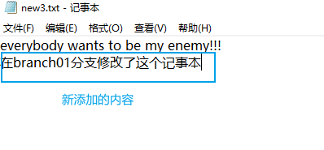
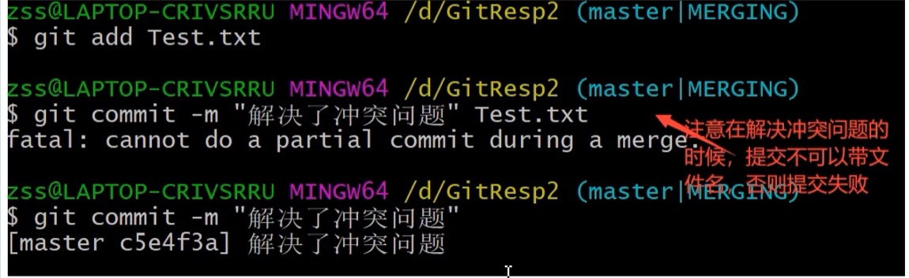

[TOC]

# 常用的git命令

# git知识点汇总

git学习网站 https://learngitbranching.js.org/?locale=zh_CN

## git的一些常规命令

- git --version 查看git安装版本

- clear 清屏

- 设置签名（设置用户名和邮箱）

  > 1. git config --global user.name "chenlifan" 
  >
  > 2. git config --global user.email "862553706@qq.com"

- git init 初始化本地库

## git的结构

## 代码托管中心，远程库和本地库的交互方式

1. 团队内部协作

2. 跨团队协作

3. 托管中心种类

## 初始化本地库

>  git init 初始化本地库
>
> 
>
> 

## 添加和提交

**演示**

基于上面初始化好为**本地库**的**工作区**，我们在这个工作区中添加一个文件

> **这个时候的newTxt文件还没有添加和提交到本地库，所以这个文件是不受git管理和控制的**

将文件提交到暂存区

然后将暂存区的文件提交到本地库中

> -m的意思是message的意思

## status命令

> git status 命令可以查看暂存区和工作区的状态
>
> （在工作新创建一个文件，然后看看这个指令返回的信息）
>
> 
>
> 通过git add将这个新文件添加到暂存区
>
> 
>
> 所以我们要用commit提交到本地库
>
> 
>
> 然后修改new2.txt文件的内容，然后查看本地库的状态
>
> 添加一段文字
>
> git就检测到这个文件的内容发生的更改，建议我们添加和提交
>
> 所以我们添加提交新的改动
>
> 

## git log查看记录 

> git log
>
> 
>
> 当我们多次提交后，就会无法显示所有的提交记录，在左下角会有个冒号
>
> 
>
> 我们可以通过点击键盘空格下一页，或者点击键盘B上一页，点击Q退出

## 日志展示方式

方式一：git log  （有分页的效果）

方式二：git log --pretty=oneline

> 
>
> 

方式三：git log --oneline

方式四：git relog

## reset命令（前进或者后退版本）

在演示这个命令之前，我们先对一个文件中的内容进行多次点修改，并提交到本地库

先通过 git reflog查看提交的记录，比如要恢复到aaa的版本

查看这个文件

可以看到已经返回成功了

查看日志

如果后悔了，像回到ddd 的内容，一样的操作

## reset命令 hard、mixed、soft参数

- hard    

> 

- mixed (git reset --mixed [索引])

- soft(git reset --soft[索引])

  

**总结*：以后用的多的就是第一种hard参数，其他两个使用的场景不多，了解即可*

## 删除文件，找回本地库删除文件

**演示**

- 新建一个文件
- 然后add到暂存区
- 然后commit到本地库

- 删除工作区新建的文件

> **注意，这个命令删除的是 工作区 中的文件**

- 将删除操作同步到暂存区

- 将删除操作同步到本地库

- 查看日志  查看是否删除成功

- 恢复这个文件，使用reset指令

## 找回暂存区删除的文件

**演示**

- 删除工作区new3.txt文件
- 提交这个记录到暂存区

- 然后我们就开始后悔了，想恢复这个文件，直接和上面一样reset

**上面是第一种输入方式**

**我们可以把索引换成head**

## diff命令 （比对工作区和暂存区的文件）（比对暂存区和本地库的文件差异）

- new3.txt文件是已经提交到本地库中的文件
- 现在我们在工作区中修改这个文件中的内容

> 导致：工作区 和 暂存区 中 new3.txt的内容不一致，所以我们需要进行比对

- diff命令比对内容

> 注意，git是以 行 为单位来管理数据的，所以表示的是增加一行 或者  删除一行的数据
>
> git diff 命令是比对 工作区 和 暂存区 所有有差异文件

**那么，如何比对暂存区和本地库的文件差异呢**

先修改一个文件，然后提交到暂存区中，然后执行一下命令

> **当然，我们也可以把HEAD换成其他提交记录的索引号**
>
> 

**从工作区提交到暂存区，暂存区提交到本地库，要理解为是提交工作区编写代码过程中的记录，而不是物理上的操作，比如是记录对工作区文件内容的修改，文件的删除这个过程**

## 分支

- 什么是分支

> 版本控制过程中，使用多线程同时推进多个任务。这里的多线程那就是多个分支

- 一张图表示分支

- 分支的好处

> 同事多个分支可以并行开发，互相不耽误，互相不影响，提高开发效率
>
> 如果有一个分支功能开发失败，直接删除这个分支就可以，对其他分支不会产生任何的影响

## 查看分支，创建分支，切换分支

- 查看分支

> git branch -v

- 创建分支

> git branch 分支名

- 切换分支

> git checkout 分支名

## 分支冲突问题，解决冲突问题（分支合并产生的冲突）

- 首先，在branch01分支中对new3.txt添加内容

- 然后把这个修改branch01分支点记录提交到本地库

- 然后我们切换到主干分支

- 打开new3.txt文件

> 可以看到，因为现在都索引是在主干分支master上的，所以我们打开new3.txt文件中是没有在branch01分支上修改的内容的
>
> 只要切换回branch01分支才能看到修改的内容
>
> 
>
> **所以每个分支之间是互不影响的**

- 将branch01分支合并到主分支中

1. 进入主分支
2. 在branch01分支增加内容的同一行也添加内容

> 注意，两个分支修改的是同一个文件，同一行的内容

3. 然后把在master分支修改的内容提交到本地库中

- 然后把branch01分支合并到master中（注意，现在位置是在master分支中）

- 然后打开文件查看合并的内容、

  

> 所以在同一个文件同一个位置修改内容会产生冲突

- 解决：互相商量到底保留谁的代码，git是不会帮你解决这个问题的

- 所以在商量后保留master分支中的内容

- 提交内容到本地库

## 操作远程库

- 在github创建一个远程库

> 有https和ssh两个远程库地址
>
> 

### git remote

因为远程库地址比较长，每次复制都比较麻烦

**所以我们可以在本地将远程库的地址保存**

### 推送push操作

因为上面已经添加了远程库地址，别名为origin，所以现在进行推送操作

> 查看到当前我是在master主干上的

> 一般来说，第一次使用https和ssh进行push操作是需要验证github账号密码的
>
> 
>
> 通过https协议的，会在windows中保存一个凭证

刷新一下github

### 克隆操作

**基于上面创建的远程库，我们进行克隆操作，因为远程库有main和master两个分支，我们克隆main分支**

创建newgitclone文件夹，然后打开git bash，进行克隆操作

克隆完成后

**克隆操作可以帮我们完成**

1. 初始化本地库
2. 将远程库内容完整克隆到本地
3. 替我们创建远程库的别名

### 邀请加入团队

一般来说，团队合作都是有不同的电脑去进行的，但是在学习阶段，我们一般只有一台电脑，所以我们如果想在一台电脑中两个用户对远程库进行操作，需要清除缓存，下面的演示是基于https协议来进行clone和提交的

修改工作区内容，然后再push

这个时候就需要录入账号密码了

因为该账号没有加入团队，所以push失败

所以在远程库中，点击setting，

这就可以邀请成员加入项目了

点击这个按钮，是邀请成员加入项目的链接

成员接受邀请，就可以了

### 远程库的拉取

pull操作其实是fetch操作+merge

> 在抓取操作执行后，只是将远程库的内容下载到本地，但是工作区的文件并没有更新，工作区还是原先的内容

**因为一下下载下来了**，**所以我们可以切换到远程库下载下来的分支**

> 如上那就是抓取下来的内容，然后通过cat查看文件的内容

发现内容正确，就可以进行合并操作 

- 先切换到本地库master的主干（分支）
- 然后合并远程库下载下来的分支

**上面的拉取操作是分别通过fetch和merge来完成的，下面直接通过pull来完成拉取操作**

> git pull origin master
>
> 

### 协同开发合作时冲突的解决方法

被操作同一个文件的同一个位置的时候，就会引起冲突

- 产品经理用他的账号，创建一个库推送到远程库

- 程序员用他的账号，抓取了产品经理上传的远程库的项目到本地

> 程序员修改了产品经理这个项目的文件内容，然后上传到远程库

- 产品经理**没有抓取**程序员修改的远程库的分支情况下，修改了他工作区的文件（与程序员一样，操作了同一个文件的同一个位置），并上传到了远程库

> 如上所示，产品经理没有抓取程序员修改的分支，操作了同一个文件同一个文职，出现如上提示

> 
>
> 然后产品经理抓取远程库
>
> 
>
> 如上冲突，然后就需要人为解决上面的冲突，然后再推送到远程库
>
> 
>
> 
>
> 

### 跨团队合作

两个公司合作

A公司推送项目到远程库后

B公司fork这个项目

那么这个项目就会复制到B公司github账号的仓库

然后B公司就可以克隆这个项目到本地

然后B公司修改这个项目，推送到这个B公司github账号的远程库

修改项目后B公司向A公司创建请求

然后A公司进行审核操作

> 查看文件改变的内容

查看审核问文件没问题后，进行合并操作

然后就合并成功了

## SSH免密登陆

在实际的开发中，都是使用ssh协议来连接github的，比如Linux系统，就无法像windows那样生成凭证，

所以需要在电脑中生成一个.ssh的目录

然后就生成如下文件

打开id_rsa.pub，复制里面的内容到github

## idea集成git

随便在idea创建一个java项目

把git继承到idea

### 初始化、暂存、提交

在idea中进行本地库的初始化操作

初始化完成，TestGit被git控制了

创建一个java文件

然后就会弹出询问是否添加到git中（add操作）

右键文件，点击commit，就会出现这个界面，填写提交的描述，就可以提交到本地库中了（commit）

这个地方可以查看日志

然后我们给Student类添加内容

然后add commit

可以查看两个版本

### 拉取、推送

推送

> 先拉取人家都项目下来的基础上改，然后再push

### 克隆远程仓库到本地

### 解决冲突，如何避免冲突

> 同时操作 同一个文件同一个位置，产生冲突

点击合并出现的界面

**如何避免冲突**

> 先拉取人家都项目下来的基础上改，然后再push

## 两个不同的项目进行合并

# git网上教程

https://www.kancloud.cn/boxsky/git_base/1715675 git详细教程，与下图无关

# 解决git base下载失败的问题

# 解决markdown图片上传github图片裂开的问题

进去这个网站https://www.ipaddress.com/，搜索raw.githubusercontent.com 例如如下

保存后再重新上传项目到github，就解决图片裂开的问题了

hosts文件的路径  C:\Windows\System32\drivers\etc\hosts

具体参考的解决网址

https://blog.csdn.net/weixin_28907839/article/details/112100647

