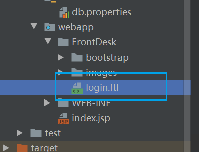
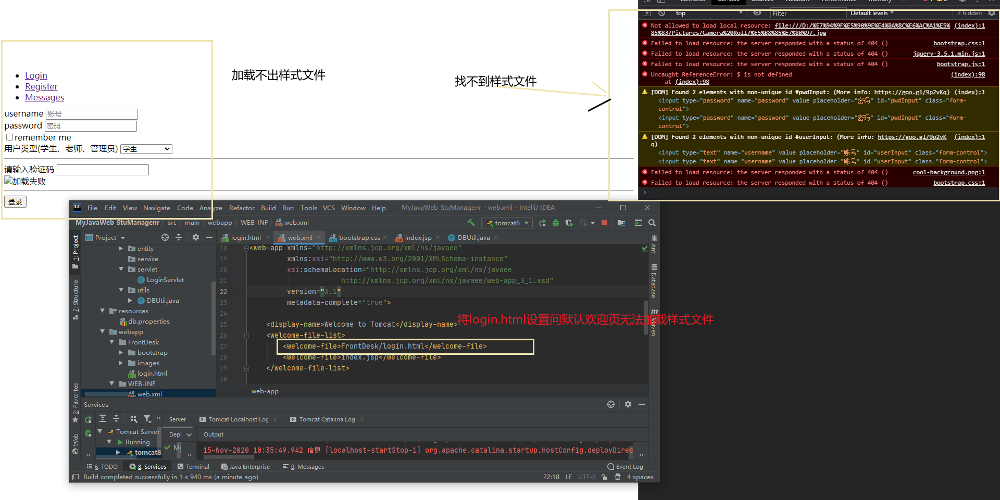

[TOC]

# 技术选型

**该项目需要用到的技术**

- 编程语言：Java
- jdbc、Druid连接池
- jar包管理：maven
- 容器：tomcat
- 网页设计servlet、jsp
- 前端：html  css jQuery bootstrap
- 数据库：MySQL
- 数据库操作 ：DBUtils
- 架构：MVC架构
- 模板引擎：freemarker

# 需求描述

**角色**

- 学生
- 老师
- 系统管理员


1. 学生操作系统流程

> - 登录系统
>
> - 选择课程并确认
>
> - 各种查询
>
> - 接收老师发送的信息
>
> - 接收学习的信息
>
>   > 通过科目名称查成绩，查总成绩，查排名等等


2. 老师操作系统流程

> - 登录系统
> - 课程管理（实现对课程的CURD）
> - 各种查询
> - 成绩录入
> - 给学生发送信息


3.管理员系统

> - 登录系统
> - 对老师的CURD
> - 对学生的CRUD
> - 查询数据

**角色操作流程图**

  


# 数据库设计


学生表

| 字段名      | 字段类型 | 字段约束 | 备注     | 是否主键、外键 |
| ----------- | -------- | -------- | -------- | -------------- |
| stuId       | varchar  | 唯一     | 学号     | 主键           |
| stuName     | varchar  |          | 学生姓名 |                |
| stuAge      | int      |          | 学生年龄 |                |
| stuSex      | varchar  |          | 学生性别 |                |
| stuBirthday | date     |          | 生日     |                |
| stuAddress  | varchar  |          | 地址     |                |
| password    | varchar  | notnull  | 密码     |                |


教师表

| 字段名 | 字段类型 | 字段约束 | 备注     | 是否主键、外键 |
| ------ | -------- | -------- | -------- | -------------- |
| t_Id   | varchar  | 唯一     | 教师号   | 主键           |
| t_name | varchar  |          | 教师姓名 |                |
| t_sex  | varchar  |          | 教师性别 |                |
| t_Job  | varchar  |          | 教师职务 |                |
| t_pwd  | varchar  |          | 教师密码 |                |


课程表

| 字段名      | 字段类型 | 字段约束 | 备注     | 是否主键、外键 |
| ----------- | -------- | -------- | -------- | -------------- |
| course_id   | int      | 唯一     | 课程id   | 主键           |
| course_name | varchar  |          | 课程名称 |                |
| t_id        | varchar  |          | 任课教师 | 外键           |


> 数据库中有学生表、教师表、管理员表
>
> 课程表（外键是学生id）——一个课程对应多个老师
>
> 班级表 ——一个学生对应一个班级  一个班级对应多个课程
>
> 一个学生对应一个班级  一个班级对应多个课程  一个课程对应多个老师

```mysql
CREATE TABLE stu (
	s_id VARCHAR(50) NOT NULL,
	stuName VARCHAR(50),
	stuAge INT,
	stuSex VARCHAR(50),
	stuBirthday datetime,
	stuAddress VARCHAR (255),
	PASSWORD VARCHAR(50) NOT NULL,
	major VARCHAR (50),
	PRIMARY KEY (`s_id`)
);
-- 一个学生对应一个系


CREATE TABLE major_course (
	major VARCHAR (50),
	c_id VARCHAR (50)
);
-- 一个系绑定不同的课程

CREATE TABLE course (
	cid VARCHAR (50) NOT NULL,
	cname VARCHAR (50) NULL,
	tid VARCHAR (50) NULL,
	PRIMARY KEY (cid)
);

-- 一个课程对应一个老师

	CREATE TABLE teacher (
		tid VARCHAR(50) NOT NULL,
		tname VARCHAR(50) ,
		tsex VARCHAR(50) ,
		tpwd VARCHAR(50) ,
		PRIMARY KEY (tid)
	);


CREATE TABLE score (
	sid VARCHAR (50),
	cid VARCHAR (50),
	grade FLOAT
);
-- 一个学生对应多个课程


CREATE TABLE admini (
  account varchar(50) DEFAULT NULL,
  password varchar(50) DEFAULT NULL
) ENGINE=InnoDB DEFAULT CHARSET=utf8;

-- 添加外键(外键必须关联主键)
alter table major_course add foreign key cid_key(c_id) references course(cid);
alter table course add foreign key tid_key(tid) references teacher(tid);
alter table score add foreign key sid_key(sid) references stu(s_id);
ALTER TABLE score ADD FOREIGN KEY cid_key (cid) REFERENCES course (cid);


insert into stu VALUES('417240257','吴亦凡',23,'男','2020-10-11','广州增城','123','计算机科学与技术');
insert into stu VALUES('417240258','蔡徐坤',12,'男','2020-10-11','广州增城','123','计算机科学与技术');
insert into stu VALUES('417240259','吴磊',45,'男','2020-10-11','广州增城','123','计算机科学与技术');
insert into stu VALUES('417240260','马玉',25,'男','2020-10-11','广州增城','123','计算机科学与技术');
insert into stu VALUES('417240261','马云',56,'男','2020-10-11','广州增城','123','会计');
insert into stu VALUES('417240262','马化腾',14,'男','2020-10-11','广州增城','123','经济学');
insert into stu VALUES('417240263','乔布斯',16,'男','2020-10-11','广州增城','123','计算机科学与技术');
insert into stu VALUES('417240264','二次元',18,'男','2020-10-11','广州增城','123','经济学');
insert into stu VALUES('417240265','小明',18,'男','2020-10-11','广州增城','123','经济学');
insert into stu VALUES('417240266','东哥',24,'男','2020-10-11','广州增城','123','经济学');
insert into stu VALUES('417240267', '强哥',15,'男','2020-10-11','广州增城','123','经济学');
insert into stu VALUES('417240268','龙哥',56,'男','2020-10-11','广州增城','123','会计');
insert into stu VALUES('417240269','李华',18,'男','2020-10-11','广州增城','123','经济学');
insert into stu VALUES('417240270','特朗普',45,'男','2020-10-11','广州增城','123','会计');
insert into stu VALUES('417240271','拜登',75,'男','2020-10-11','广州增城','123','会计');
insert into stu VALUES('417240272','奥巴马',34,'男','2020-10-11','广州增城','123','会计');
insert into stu VALUES('417240273','简自豪',15,'男','2020-10-11','广州增城','123','会计');


insert into teacher  values ('001','小红','男','123');
insert into teacher  values ('002','小绿','女','123');
insert into teacher  values ('003','小辉','男','123');
insert into teacher  values ('004','小白','男','123');
insert into teacher  values ('005','小陈','女','123');
insert into teacher  values ('006','小张','男','123');
insert into teacher  values ('007','小飞','女','123');
insert into teacher  values ('008','小贤','男','123');
insert into teacher  values ('009','小树','男','123');
insert into teacher  values ('010','小鸟','女','123');
insert into teacher  values ('011','小猫','女','123');
insert into teacher  values ('012','小狗','女','123');
insert into teacher  values ('013','小兔','男','123');


insert into course values ('01','数学','001');
insert into course values ('02','语文','002');
insert into course values ('03','概率论','003');

insert into course values ('04','马克思','004');
insert into course values ('05','毛泽东理论','005');
insert into course values ('06','数据可视化','006');
insert into course values ('07','前端','007');

insert into course values ('08','Java后端','008');
insert into course values ('09','数据结构','009');
insert into course values ('10','python','010');
insert into course values ('11','计算机网络','011');
insert into course values ('12','数据挖掘','012');

insert into course values ('13','大学生创业','013');


insert into major_course values  ('计算机科学与技术','08');
insert into major_course values  ('计算机科学与技术','09');
insert into major_course values  ('计算机科学与技术','10');
insert into major_course values  ('计算机科学与技术','11');
insert into major_course values  ('计算机科学与技术','12');
insert into major_course values  ('会计','13');
insert into major_course values  ('会计','01');
insert into major_course values  ('会计','02');
insert into major_course values  ('会计','03');
insert into major_course values  ('经济学','04');
insert into major_course values  ('经济学','05');
insert into major_course values  ('经济学','06');
insert into major_course values  ('经济学','07');


-- 计算机
insert into score values  ('417240257','08',60);
insert into score values  ('417240257','09',10);
insert into score values  ('417240257','10',30);
insert into score values  ('417240257','11',90);
insert into score values  ('417240257','12',88);

insert into score values  ('417240258','08',50);
insert into score values  ('417240258','09',89);
insert into score values  ('417240258','10',69);
insert into score values  ('417240258','11',17);
insert into score values  ('417240258','12',80);

insert into score values  ('417240259','08',99);
insert into score values  ('417240259','09',98);
insert into score values  ('417240259','10',67);
insert into score values  ('417240259','11',78);
insert into score values  ('417240259','12',59);

insert into score values  ('417240260','08',48);
insert into score values  ('417240260','09',87);
insert into score values  ('417240260','10',58);
insert into score values  ('417240260','11',97);
insert into score values  ('417240260','12',89);

insert into score values  ('417240263','08',46);
insert into score values  ('417240263','09',78);
insert into score values  ('417240263','10',98);
insert into score values  ('417240263','11',98);
insert into score values  ('417240263','12',68);


-- 会计

insert into score values  ('417240261','13',46);
insert into score values  ('417240261','01',18);
insert into score values  ('417240261','02',88);
insert into score values  ('417240261','03',48);

insert into score values  ('417240268','13',26);
insert into score values  ('417240268','01',48);
insert into score values  ('417240268','02',68);
insert into score values  ('417240268','03',78);

insert into score values  ('417240270','13',46);
insert into score values  ('417240270','01',78);
insert into score values  ('417240270','02',38);
insert into score values  ('417240270','03',98);

insert into score values  ('417240271','13',46);
insert into score values  ('417240271','01',58);
insert into score values  ('417240271','02',78);
insert into score values  ('417240271','03',98);

insert into score values  ('417240272','13',46);
insert into score values  ('417240272','01',38);
insert into score values  ('417240272','02',78);
insert into score values  ('417240272','03',98);

insert into score values  ('417240273','13',46);
insert into score values  ('417240273','01',88);
insert into score values  ('417240273','02',99);
insert into score values  ('417240273','03',98);

-- 经济学

insert into score values  ('417240262','04',44);
insert into score values  ('417240262','05',81);
insert into score values  ('417240262','06',96);
insert into score values  ('417240262','07',93);

insert into score values  ('417240264','04',56);
insert into score values  ('417240264','05',38);
insert into score values  ('417240264','06',99);
insert into score values  ('417240264','07',38);

insert into score values  ('417240265','04',46);
insert into score values  ('417240265','05',88);
insert into score values  ('417240265','06',69);
insert into score values  ('417240265','07',78);

insert into score values  ('417240266','04',46);
insert into score values  ('417240266','05',38);
insert into score values  ('417240266','06',99);
insert into score values  ('417240266','07',88);

insert into score values  ('417240267','04',46);
insert into score values  ('417240267','05',58);
insert into score values  ('417240267','06',39);
insert into score values  ('417240267','07',68);

insert into score values  ('417240269','04',96);
insert into score values  ('417240269','05',38);
insert into score values  ('417240269','06',69);
insert into score values  ('417240269','07',98);

```


# 框架搭建

创建一个简单的Javaweb  maven项目


更换web.xml为D:\studys\Programming\tomcat\apache-tomcat-8.5.59\webapps\ROOT\WEB-INF目录下的web.xml代码


在pom文件下的`build`标签下添加这一段代码，防止无法读取Java目录下的配置文件

```xml
  <!--防止我们项目中配置文件导出失败的问题-->
        <resources>
            <resource>
                <directory>src/main/resources</directory>
                <excludes>
                    <exclude>**/*.properties</exclude>
                    <exclude>**/*.xml</exclude>
                </excludes>
                <filtering>false</filtering>
            </resource>
            <resource>
                <directory>src/main/java</directory>
                <includes>
                    <include>**/*.properties</include>
                    <include>**/*.xml</include>
                </includes>
                <filtering>false</filtering>
            </resource>
        </resources>
```

添加tomcat


创建各种文件夹


**创建各种包**

1. entity：实体类  （model、vo）
2. dao ：操作数据库 （data 、access 、object）
3. utils：工具包
4. servlet：存放servlet项目的文件 （web、action、controller）
5. service：存放业务逻辑 （biz）


- 创建entity的实体类

一个表对应一个实体类


# 数据库工具类的实现


输入连接MySQL的驱动的依赖

```xml
<!-- https://mvnrepository.com/artifact/mysql/mysql-connector-java -->
<dependency>
  <groupId>mysql</groupId>
  <artifactId>mysql-connector-java</artifactId>
  <version>5.1.36</version>
</dependency>
```

编写注册数据库的配置文件


## 创建Druid数据库连接池和DBUtil

输入druid连接池依赖和dbUtils的jar包

```xml
<!-- https://mvnrepository.com/artifact/com.alibaba/druid -->
<dependency>
    <groupId>com.alibaba</groupId>
    <artifactId>druid</artifactId>
    <version>1.2.1</version>
</dependency>
<!-- https://mvnrepository.com/artifact/commons-dbutils/commons-dbutils -->
<dependency>
    <groupId>commons-dbutils</groupId>
    <artifactId>commons-dbutils</artifactId>
    <version>1.6</version>				
</dependency>
```

创建工具类，这个工具类可以获取到druid的connection对象、atasource对象和dbUtils对象

```java
public class DBUtil {
    private static Properties properties = new Properties();
    private static DataSource dataSource = null;
    private static QueryRunner queryRunner = null;

    static {
        try {
            properties.load(new FileInputStream("src\\main\\resources\\db.properties"));
            dataSource = DruidDataSourceFactory.createDataSource(properties);
            queryRunner = new QueryRunner(dataSource);
        } catch (Exception e) {
            e.printStackTrace();
        }
    }

    private DBUtil() {

    }

    public static Connection getConnection() throws SQLException {
        return dataSource.getConnection();
    }

    public static DataSource getDataSource() {
        return dataSource;
    }

    public static QueryRunner getQueryRunner() {
        return queryRunner;
    }
}
```


# 验证码工具类的实现

```java
package com.chenlifan.servletCase.utils;

import javax.imageio.ImageIO;
import java.awt.*;
import java.awt.image.BufferedImage;
import java.io.FileOutputStream;
import java.io.IOException;
import java.io.OutputStream;
import java.util.Date;
import java.util.Random;

public class ValidateCode {
    // 图片的宽度。
    private int width = 160;
    // 图片的高度。
    private int height = 40;
    // 验证码字符个数
    private int codeCount = 5;
    // 验证码干扰线数
    private int lineCount = 150;
    // 验证码
    private String code = null;
    // 验证码图片Buffer
    private BufferedImage buffImg = null;

    // 验证码范围,去掉0(数字)和O(拼音)容易混淆的(小写的1和L也可以去掉,大写不用了)
    private char[] codeSequence = {'A', 'B', 'C', 'D', 'E', 'F', 'G', 'H', 'I', 'J',
            'K', 'L', 'M', 'N', 'P', 'Q', 'R', 'S', 'T', 'U', 'V', 'W',
            'X', 'Y', 'Z', '1', '2', '3', '4', '5', '6', '7', '8', '9'};

    /**
     * 默认构造函数,设置默认参数
     */
    public ValidateCode() {
        this.createCode();
    }

    /**
     * @param width  图片宽
     * @param height 图片高
     */
    public ValidateCode(int width, int height) {
        this.width = width;
        this.height = height;
        this.createCode();
    }

    /**
     * @param width     图片宽
     * @param height    图片高
     * @param codeCount 字符个数
     * @param lineCount 干扰线条数
     */
    public ValidateCode(int width, int height, int codeCount, int lineCount) {
        this.width = width;
        this.height = height;
        this.codeCount = codeCount;
        this.lineCount = lineCount;
        this.createCode();
    }

    public void createCode() {
        int x = 0, fontHeight = 0, codeY = 0;
        int red = 0, green = 0, blue = 0;

        x = width / (codeCount + 2);//每个字符的宽度(左右各空出一个字符)
        fontHeight = height - 2;//字体的高度
        codeY = height - 4;

        // 图像buffer
        buffImg = new BufferedImage(width, height, BufferedImage.TYPE_INT_RGB);
        Graphics2D g = buffImg.createGraphics();

        /*// 将图像背景填充为白色
        g.setColor(Color.WHITE);
        g.fillRect(0, 0, width, height);*/
        // 增加下面代码使得背景透明
        buffImg = g.getDeviceConfiguration().createCompatibleImage(width, height, Transparency.TRANSLUCENT);
        g.dispose();
        g = buffImg.createGraphics();
        // 背景透明代码结束

        // 画图BasicStroke是JDK中提供的一个基本的画笔类,我们对他设置画笔的粗细，就可以在drawPanel上任意画出自己想要的图形了。
        g.setColor(new Color(255, 0, 0));
        g.setStroke(new BasicStroke(1f));
        g.fillRect(128, 128, width, height);

        // 生成随机数
        Random random = new Random();
        //设置字体类型、字体大小、字体样式　
        Font font = new Font("微软雅黑",Font.PLAIN, fontHeight);

        g.setFont(font);

        for (int i = 0; i < lineCount; i++) {
            // 设置随机开始和结束坐标
            int xs = random.nextInt(width);//x坐标开始
            int ys = random.nextInt(height);//y坐标开始
            int xe = xs + random.nextInt(width / 8);//x坐标结束
            int ye = ys + random.nextInt(height / 8);//y坐标结束

            // 产生随机的颜色值，让输出的每个干扰线的颜色值都将不同。
            red = random.nextInt(255);
            green = random.nextInt(255);
            blue = random.nextInt(255);
            g.setColor(new Color(red, green, blue));
            g.drawLine(xs, ys, xe, ye);
        }

        // randomCode记录随机产生的验证码
        StringBuffer randomCode = new StringBuffer();
        // 随机产生codeCount个字符的验证码。
        for (int i = 0; i < codeCount; i++) {
            String strRand = String.valueOf(codeSequence[random.nextInt(codeSequence.length)]);
            // 产生随机的颜色值，让输出的每个字符的颜色值都将不同。
            red = random.nextInt(255);
            green = random.nextInt(255);
            blue = random.nextInt(255);
            //指定某种颜色
            //g.setColor(new Color(252, 145, 83));
            g.setColor(new Color(red, green, blue));
            g.drawString(strRand, (i + 1) * x, codeY);
            // 将产生的四个随机数组合在一起。
            randomCode.append(strRand);
        }
        // 将四位数字的验证码保存到Session中。
        code = randomCode.toString();
    }

    public void write(String path) throws IOException {
        OutputStream sos = new FileOutputStream(path);
        this.write(sos);
    }

    public void write(OutputStream sos) throws IOException {
        ImageIO.write(buffImg, "png", sos);
        sos.close();
    }

    public BufferedImage getBuffImg() {
        return buffImg;
    }

    public String getCode() {
        return code;
    }

    /**
     * 测试函数,默认生成到d盘
     *
     * @param args
     */
    public static void main(String[] args) {
        ValidateCode vCode = new ValidateCode(160,40,5,150);
        try {
            String path="D:/"+new Date().getTime()+".png";
            System.out.println(vCode.getCode()+" >"+path);
            vCode.write(path);
        } catch (IOException e) {
            e.printStackTrace();
        }
    }
}
```


# 获取cookie工具类的实现

```java
public class CookieUtil {
    public Cookie getCookieByNane(Cookie[] cookies, String cookieName) {
        //如果cookie为空，证明使用的浏览器是第一次访问我们的服务器
        if (cookies == null) {
            return null;
        } else {
            //如果cookie不为空，就通过cookie名称查找到对应的cookie
            for (Cookie cookie : cookies) {//String类型equal比较的是值，==比较的是地址
                if (cookie.getName().equals(cookieName)) {
                    return cookie;
                }
            }
            return null;
        }
    }
}
```


# Dao层代码的实现

[需求描述](#需求描述)

**学生需求**

> 学生通过学号和密码登录系统 （数据库层验证学生学号和密码是否存在）
>
> 学生通过学号查询个人信息
>
> 学生查询个人总分
>
> 学生查询个人成绩排名
>
> 学生查询课程老师信息
>
> 学生修改个人地址
>
> 学生请假

老师需求

> 老师登录验证
>
> 老师查询他交教的课的全部学生的成绩
>
> 老师查询他教的学生的信息
>
> 老师给学生插入分数

管理员需求

> 登录验证
>
> 增加学生
>
> 删除学生
>
> 查询所有学生信息
>
> 修改学生信息
>
> 给学生批准假条
>
> 查询老师排名

# 前台代码实现

**view层代码**

前台使用了bootStrap框架

## login页面代码实现

```html
<!DOCTYPE html>
<html lang="en">

<head>
    <meta charset="UTF-8">
    <title>登录注册</title>
<#--    <link href="bootstrap/css/bootstrap.css" rel="stylesheet">-->
    <link href="/MyJavaWeb_StuManagenr/FrontDesk/bootstrap/css/bootstrap.css" rel="stylesheet">
</head>

<!-- 编写一个登录组件和一个组成组件
通过jQuery控制这两个组件的显示和隐藏
-->

<body style="background-image: url(http://localhost:8080/MyJavaWeb_StuManagenr/FrontDesk/images/cool-background.png); background-repeat: no-repeat; background-size: 2200px 1500px">
<div class="container">
    <div class="row">
        <div class="col-md-4"></div>


        <div class="col-md-4">

            <ul class="nav nav-tabs" style="margin-top:150px; margin-bottom: 10px;">
                <li role="presentation" class="active" id="li01"><a href="#">Login</a></li>
                <li role="presentation" id="li02"><a href="#">Register</a></li>
                <li role="presentation" id="li03"><a href="#">Messages</a></li>
            </ul>
            <form id="formLogin" action="login" method="POST">
                <div class="form-group" style="width: 300px;">
                    <label for="login_userInput">username</label>
                    <input type="text" name="username" value="" placeholder="账号" id="login_userInput" class="form-control">
                </div>
                <div class="from-group" style="width: 300px;">
                    <label for="login_pwdInput">password</label>
                    <input type="password" name="password" value="" placeholder="密码" id="login_pwdInput" class="form-control">
                </div>
                <div class="checkbox">
                    <label>
                        <input type="checkbox" name="rememberMe" value="on">remember me
                    </label>
                </div>
                <div class="form-group">
                    <label for="selectUser">用户类型(学生、老师、管理员)</label>
                    <select class="form-control" id="selectUser" name="userType" style="width: 100px;">
                        <option value="学生">学生</option>
                        <option value="老师">老师</option>
                        <option value="管理员">管理员</option>
                    </select>
                </div>
                <hr>
                <div class="row form-group">
                    <div class="col-md-4">
                        <label for="valiCode">请输入验证码</label>
                        <input type="texxt" name="validateCode" value="" id="valiCode" class="form-control">
                    </div>
                    <div class="col-md-4">
                        
                    </div>
                </div>
                <hr>
                <button type="submit" class="btn btn-success">登录</button>

            </form>
            <!-- 注册页面，默认隐藏 -->
            <form id="formRegister" action="" method="POST" hidden>
                <div class="form-group" style="width: 300px;">
                    <label for="userInput">username</label>
                    <input type="text" name="username" value="" placeholder="账号" id="userInput" class="form-control">
                </div>
                <div class="from-group" style="width: 300px;">
                    <label for="pwdInput">password</label>
                    <input type="password" name="password" value="" placeholder="密码" id="pwdInput" class="form-control">
                </div>
                <hr/>
                <button type="submit" class="btn btn-success">注册</button>


            </form>


        </div>
        <div class="col-md-4"></div>
    </div>
</div>


</body>


<script src="/MyJavaWeb_StuManagenr/FrontDesk/bootstrap/js/jquery-3.5.1.min.js"></script>
<script src="/MyJavaWeb_StuManagenr/FrontDesk/bootstrap/js/bootstrap.min.js"></script>
<script>


    $(document).ready(
        $("#li01").click(function () {
            $("#li02").removeClass("active")
            $("#li01").addClass("active")
            $("#formRegister").hide(1);
            $("#formLogin").toggle();

        })
    );

    $(document).ready(
        $("#li02").click(function () {
            $("#li01").removeClass("active")
            $("#li02").addClass("active")
            $("#formLogin").hide(1);
            $("#formRegister").toggle();


        })
    );

</script>

</html>
```

**因为需要用到模板引擎，所以把html改成ftl页面**



**然后导入freemarker的依赖**

```xml
<!-- https://mvnrepository.com/artifact/org.freemarker/freemarker -->
<dependency>
  <groupId>org.freemarker</groupId>
  <artifactId>freemarker</artifactId>
  <version>2.3.23</version>
</dependency>
```


**创建一个跳转到login.ftl的servlet**

```java
@Override
protected void doGet(HttpServletRequest req, HttpServletResponse resp) throws ServletException, IOException {
    //当用户进入到我们的进入到login的时候，就给用户分配一个uuid
    UUID uuid = UUID.randomUUID();
    String uuidUser = uuid.toString().replace("-", "");
    System.out.println(uuidUser);
    //然后将这个uuid保存在用户的浏览器的cookie中
    Cookie uudiCookie = new Cookie("userUUID", uuidUser);
    uudiCookie.setPath("/");
    resp.addCookie(uudiCookie);
    
    req.getRequestDispatcher("/FrontDesk/login.ftl").forward(req, resp);

}
```


> 当我们访问这个servlet就会跳转到login.ftl页面

**创建模板引擎用来拦截所有访问ftl页面的请求**

```xml
<!--    创建模板引擎-->
<servlet>
    <servlet-name>freemarker</servlet-name>
    <servlet-class>freemarker.ext.servlet.FreemarkerServlet</servlet-class>
    <init-param>
        <!--            默认在webapp目录下查找对应的模板文件-->
        <param-name>TemplatePath</param-name>
        <param-value>/</param-value>
    </init-param>
    <init-param>
        <param-name>default_encoding</param-name>
        <param-value>UTF-8</param-value>
    </init-param>
</servlet>
<!--    拦截所有访问ftl文件的请求-->
<servlet-mapping>
    <servlet-name>freemarker</servlet-name>
    <url-pattern>*.ftl</url-pattern>
</servlet-mapping>
```

> 当有请求访问ftl文件，就会对ftl文件进行渲染


**配置转发login.ftl页面的servlet**

```xml
<!--    配置login页面的模板引擎-->
<servlet>
    <servlet-name>loginTemplate</servlet-name>
    <servlet-class>com.chenlifan.servlet.template.LoginTeplate</servlet-class>
</servlet>
<servlet-mapping>
    <servlet-name>loginTemplate</servlet-name>
    <url-pattern>/login</url-pattern>
</servlet-mapping>
```


响应的，我们的index.jsp就要修改成默认跳转到login的servlet


## 解决welcome-file-list设置默认欢迎页无法加载js、css等文件的问题

因为设置我们的login.html为默认页，结果tomcat不能加载css、js文件

不管我们怎么配置css和js文件路径，依然加载不了



所以我们换一种思路

- 用index.jsp文件作为默认欢迎页


- 然后在jsp文件中编写js代码默认跳转到我们的login.html页面


## 	解决配置成ftl文件后，无法加载js、css、png等静态 文件的问题

一开始使用的是相对路径来加载，但是加载是404    `<link href="bootstrap/css/bootstrap.css" rel="stylesheet">`

使用上面的写法报404错误


然后我就改成加载下面的方式


就能成功加载出来了


# controller层代码实现


## 用户唯一值页面

```java
public class OnlyUserServlet extends HttpServlet {
    @Override
    protected void doGet(HttpServletRequest req, HttpServletResponse resp) throws ServletException, IOException {
        //当用户进入到我们的项目的时候，就给用户分配一个uuid
        UUID uuid = UUID.randomUUID();
        String uuidUser = uuid.toString().replace("-", "");
        System.out.println(uuidUser);
        //然后将这个uuid保存在用户的浏览器的cookie中
        Cookie uudiCookie = new Cookie("userUUID", uuidUser);
        uudiCookie.setPath("/");
        resp.addCookie(uudiCookie);

    }
}
```

```xml
<!--    onlyUserServlet-->
<servlet>
    <servlet-name>onlyUserServlet</servlet-name>
    <servlet-class>com.chenlifan.servlet.OnlyUserServlet</servlet-class>
</servlet>
<servlet-mapping>
    <servlet-name>onlyUserServlet</servlet-name>
    <url-pattern>/</url-pattern>
</servlet-mapping>
```

> 当用户进入到我们的项目，就会自动给用户分配一个uuid。并且把这个uuid保存在cookie中。供之后的验证码图片使用


## login页面的登录功能

创建接收login表单请求的servlet


## 获取验证码的servlet


```java
package com.chenlifan.servlet;


import com.chenlifan.utils.CookieUtil;
import com.chenlifan.utils.ValidateCode;

import javax.servlet.ServletContext;
import javax.servlet.ServletException;
import javax.servlet.ServletOutputStream;
import javax.servlet.http.*;
import java.io.File;
import java.io.FileInputStream;
import java.io.IOException;
import java.io.InputStream;

public class ValidateServlet extends HttpServlet {
    @Override
    protected void doGet(HttpServletRequest req, HttpServletResponse resp) throws IOException {
        //获取用户uuid的cookie，用来给验证码图片命名，以及用来保存验证码到session中
        CookieUtil cookieUtil = new CookieUtil();
        Cookie[] cookies = req.getCookies();
        Cookie cookie = cookieUtil.getCookieByNane(cookies, "userUUID");
        String imageName = cookie.getValue();

        //获取项目对象
        ServletContext servletContext = req.getServletContext();
        //设置图片名称,将图片保存在部署路径的\WEB-INF\classes\validateCodeImages
        String imagePath = servletContext.getRealPath("\\WEB-INF\\classes\\validateCodeImages\\" + imageName + ".png");
        System.out.println(imagePath);

        InputStream inputStream = null;
        ServletOutputStream servletOutputStream = null;
        try {
            //创建验证码实例对象
            ValidateCode validateCode = new ValidateCode(160, 40, 5, 150);
            //输入图片存放路径，生成验证码图片
            validateCode.write(imagePath);

            //获取session对象
            HttpSession session = req.getSession();
            //将验证码保存在session中，命名为图片名称
            session.setAttribute(imageName, validateCode.getCode());
            session.setMaxInactiveInterval(60 * 60);

            //获取生成的图片，并响应回浏览器
            inputStream = new FileInputStream(imagePath);
            servletOutputStream = resp.getOutputStream();
            byte[] bytes = new byte[1024];
            while (inputStream.read(bytes) != -1) {
                servletOutputStream.write(bytes);
            }


        } catch (IOException e) {
            e.printStackTrace();
        } finally {

            //关闭流
            inputStream.close();
            servletOutputStream.close();

        }
    }


}

```


# Service层的实现


创建Loginservice的实现类


# 项目可能遇到的问题

## 解决queryrunner对象为null的问题


造成这个问题的主要原因是无法加载db.properties文件，加载不到这个文件的原因是路径错误了


> 因为我们这个是javaweb项目，已经不是以前那些简单的java路径了，程序经过tomcat包装之后，类似db.properties文件等resources文件都会放在项目的根目录下的WEB-INF/classes/目录下，而且经过tomcat编译的src\main这个路径是不存在的，自然也就找不到这个文件下的路径了

**所以需要这样修改这个文件路径**


## 解决使用beanHandleer方法在给实体类命名错误时的解决方法

需要将错误的变量已经成员方法和重写方法都要重写写一次

比如s_id写错了写成sid，就需要删除掉sid，已经getset方法，toString方法，重新定义成s_id之后再定义getset方法和tostring方法


# 存余问题

## 通过ajax请求，无法获取freemarker 的数据


