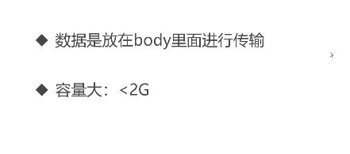

[TOC]

# 什么是node

以前我们运行js都是通过引入到html，然后浏览器来解析的

现在我们就通过单纯些js项目，来单独运行js，就通过node

**构建在Chrome V8引擎之上**

- Node.js不是一门语言
- Node.js不是库、不是框架
- Node.js是一个JavaScript运行时环境
- 简单点来讲就是Node.js可以解析和执行JavaScript代码
- 以前只有浏览器可以可以解析执行JavaScript 代码
- 也就是说现在的JavaScript可以完全脱离浏览器来运行，一切都归功于: Node.js

> 总结：就是一个解析执行js代码的环境

## 浏览器中的js

有什么

> Ecmascript
>
> - 基本语法
> - if
> - var
> - function
> - object
> - array
>
> Dom
>
> Bom

## node中的js

没有dom bom

没有ecmascript

在node这个JavaScript执行环境中为js提供了一些服务器级别的操作api

- 文件读写
- 网络服务的构建
- 网络通信

- http服务器
- 。。。

说白了就是在学web服务器开发

但是这里的js不是浏览器中的js

## 什么是npm

基于node.js开发的管理工具

- npm是世界上最大的开源库生态系统
- 绝大多数JavaScript相关的包都存放在npm上，这样做的目的是为了让开发人员更方便的去下载使用

- `npm install jquery`这条命令用来搞定npm的安装

# node安装配置


# node能做什么

- web服务器后台

- 命令行工具

  -  npm
  - git
  - hexo

  

  # 这门课程你能学到什么

  - B/S编程模型

    - browser-server
    - back-end
    - 任何服务端技术这种BS编程模型都是一样的，和语言无关
    - node只是作为我们学习BS编程模型的一个工具

  - 模块化编程

    - RequireJS

    - SeaJS

    - 以前认知的JavaScript只能通过script标签来加载

    - 在node中可以像@import()一样来引用加载JavaScript脚本文件

      

  - node常用API

  - 异步编程

    - 回调函数
    - promise
    - async
    - generator

  - Express开发框架

  - Ecmascript6（新语法）

  

# 在cmd运行通过node运行js文件


- 在cmd中进入到创建js的文件夹，然后通过node+空格+文件名，来运行js文件
- 注意记得保存文件


**我们也可以通过按住shift+右键**


通过powershell来运行


# file-system（读写文件）

- 在node中如果想要进行文件操作，就必须引入fs这个核心模块
- 在fs这个核心模块中，就提供了所有的文件操作相关的api
- `var fs = require('fs')`
- 使用require方法加载fs核心模块

- 读取文件
- `fs.readfile('文件路径 ')`

读取成功
data 数据
error nu1l

读取失败
data  null
error 错误对象


例子

```js
var fs = require('fs');
fs.writeFile('./test1/..txt', '带咋好,我是陈立繁,你太臭了,比考级', function(error, data) {
	console.log('插入文本成功');
	console.log(error)
	if (error) {
		console.log('读取文件错误')

	} else {
		console.log(data);
	}

});

```


- 上述代码是读取一个错误的路径，然后通过error来判断输出错误信息，当读取成功error为null，当读取失败，error输出一个对象，对象在if中判断为true。

# http(构建一个web服务器)

- 在node 中专门提供了一个核心模块：http
- 这个模块的职责就是帮你创建编写服务器

**怎么使用呢**

1. 首先要加载http核心模块
2. 使用创建的对象调用出createServer()方法创建一个web服务器
3. 这个方法返回一个server实例 

**服务器用来干什么的**

- 提供服务：对数据的服务
- 发请求
- 接受请求
- 处理请求
- 反馈请求（发送相应）

例子

```js
var http = require('http');
var server = http.createServer();


server.listen(3000,function(){
	console.log('启动web服务器成功')
});
/* 注册request 请求事件
当客户端请求过来，就会自动触发服务器的request 请求事件，然后执行第二个参数:回调处理 */
server.on('request',function(){
	console.log('接受到客户端的请求了')
});
```


这个时候就启动服务器成功了，什么cd指令也不管用了

- 这个时候，我们打开浏览器，访问这个服务器
- 

- 可以看到，这个web服务器接收到request请求，然后输入信息

为什么这个这个浏览器会转着不动呢，因为服务器没有响应回去，得不到响应，就一直在等待

- ctrl+c就能关闭服务器


- request请求事件处理函数，需要接收两个参数:
  - Request请求对象
    - 请求对象可以用来获取客户端的一些请求信息， 例如请求路径
  - Response响应对象
    - 响应对象可以用来给客户端发送响应消息

例子

```js
/* 1. 首先要加载http核心模块
2. 使用创建的对象调用出createServer()方法创建一个web服务器
3. 这个方法返回一个server实例
 4. 绑定端口号,启动服务器
 */
var http = require('http');
var server = http.createServer();

//启动服务器
server.listen(3000,function(){
	console.log('启动web服务器成功')
});
/* 注册request 请求事件
当客户端请求过来，就会自动触发服务器的request 请求事件，然后执行第二个参数:回调处理 */

/* request请求事件处理函数，需要接收两个参数:
	Request请求对象
		请求对象可以用来获取客户端的一些请求信息， 例如请求路径
	Response响应对象
		响应对象可以用来给客户端发送响应消息

response对象有一个方法: write 可以用来给客户端发送响应数据
	write可以使用多次，但是最后一定要使用end来结束响应，否则客户端会一直等待 */
server.on('request',function(request,response){
	console.log('接受到客户端的请求了')
	console.log('请求的路径为:'+request.url)
	response.write('chenlifan');
	//end结束响应
	response.end();
});


```


**可以看到请求的路径有这个 :favicon.ico**

这是因为浏览器有一个默认行为，会请求收藏夹图标


- 但是，我们这个服务器如何处理不同路径响应不同结果呢，如

> / index
> /1ogin登陆
> /register注册
> /haha哈哈哈


使用end()来结束访问和响应数据

**注意：**响应的内容只能是字符串和二进制数据

```js
//也可以直接通过end来响应数据,并结束访问
	response.end('wo yong end jie shu fangwen ');
```


- 处理不同路径

```js
var http = require('http');
var server = http.createServer();


server.listen(3000, function() {
	console.log('启动web服务器成功')
});

server.on('request', function(request, response) {
	console.log('接受到客户端的请求了')
	console.log('请求的路径为:' + request.url)

	var url = request.url;
	if (url == '/') {
		response.end('index.html');
	} else if (url == '/login') {
		response.end('/login.html');
	} else {
		response.end('404 not found');
	}
});

```


- 因为end()只能响应字符串和二进制格式，所以我们尝试将数组转化为字符串输出

- ```js
  var vararray = [{
  			name: '华为',
  			num: 123
  		},
  		{
  			name: '阿里巴巴',
  			num: 123
  		},
  		{
  			name: '腾讯',
  			num: 123
  		}
  	];
  	response.end(JSON.stringify(vararray));
  ```

  

# 核心模块

- fs文件系统模块
- http服务架构模块
- path路径操作模块
- os操作系统信息模块

例子

通过os核心模块查询cpu信息

```js
var os = require('os');
console.log(os.cpus());
```


- require是一个方法

  > 它的作用就是用来加载模块的
  >
  > 在Node中，模块有三种:
  >
  > 具名的核心模块， 例如fs、 http 
  >
  > 用户自己编写的文件模块

所以我们如何通过执行一个js文件的同时执行另一个js文件


**模块作用域**

> 外部访问不到内部
>
> 内部也访问不到外部

那么如何让模块与模块之间进行通信呢

- 在每个文件模块中都提供了一个对象exports
- exports默认是一个对象

实例


如果在demo01中调用到demo02中的方法


可以看到输出3


# ip地址和端口号的概念

- 所有联网的程序都需要进行网络通信
- 计算机中只有一个物理网卡，而且同一个局域网中，网卡的地址必须是唯一的
- 网卡是通过唯一的ip地址来进行定位的


通过所谓的网址如www.baidu.com

就是方便我们记忆的，一般来说，通过DNS将这个网址转化为ip地址如213.23.1.123这样的地址，然后定位到服务器中


而我们的电脑也可以作为一个服务器

我们通过各种终端访问服务器，先通过ip地址定位到服务器，然后在通过端口号定位到服务器中的软件


**端口号的补充**

- ip地址用来定位计算机

- 端口号用来定位具体的应用程序

- 一切需 要联网通信的软件都会占用一个端口号

- 端口号的范围从0- 65536之间

- 在计算机中有一些默认端口号，最好不要去使用

- 例如http服务的80

- 我们在开发过程中使用-些简单好记的就可以了，例如3000、5000 等没什么含义


remoteaddress是获取访问我这个服务器的用户的ip地址

remoteport是获取访问我这个服务器的用户的浏览器端口


# 解决服务器响应到浏览器中文乱码的问题

`	response.setHeader('Content-Type','text/plain;charset=utf-8');`

这一段代码可以解决将中文数据相应到浏览器乱码的问题

例子

```js

var http = require('http');
var  server = http.createServer()
server.listen(3000, function() {
	console.log('服务器已经启动')
});

server.on('request',function(request, response){
	console.log(request.url);
	//设置响应头,告诉浏览器应该用什么格式接收相应的消息
	response.setHeader('Content-Type','text/plain;charset=utf-8');
	response.end('你看到中文了吗');
});
```


第二个案例

```js

var http = require('http');
var  server = http.createServer()
server.listen(3000, function() {
	console.log('服务器已经启动')
});

server.on('request',function(request, response){
var  url = request.url;
if(url == '/plain'){
	response.setHeader('Content-Type','text/plain;charset=utf-8');
	response.end('你看到中文了吗');
}else if(url == '/html'){
	response.setHeader('Content-Type','text/html;charset=utf-8');
	response.end('<h1>你看到中文了吗</h1>');
}else{
	response.end('index.html');
}

	
	
});
```


第三个案例

```js
//获取web服务器核心模块
var http = require('http');
//创建 服务器
var server = http.Server();
//获取文件系统核心模块
var fs = require('fs')
server.listen(3000, function() {
	console.log('你已经启动服务器')
});

server.on('request', function(request, response) {
	var url = request.url;
	if (url == '/') {
		fs.readFile('./index.html', function(error, data) {
			if (error) {
				response.setHeader('Content-Type', 'text/plain;charset=utf-8');
				response.end('读取文件失败');
			} else {
				response.setHeader('Content-Type', 'text/html;charset=utf-8');
				response.end(data);
			}
		});
	} else if (url == '/zhanshuang') {
		fs.readFile('./image/1.jpg', function(error, data) {
			if (error) {
				response.setHeader('Content-Type', 'text/plain;charset=utf-8');
				response.end('读取文件失败');
			} else {
				response.setHeader('Content-Type','image/jpeg');
				response.end(data);
			}
		});
	} else {
		response.end("404 not fouund")
	}

});

```

创建服务器核心模块和文件系统核心模块，通过用户访问路径名不同，跳转到不同的页面，页面通过文件系统模块读取页面的内容或者图片


# Content-Type查询网址

https://tool.oschina.net/commons


# 代码风格

https://standardjs.com/rules-zhcn.html


# NPM包管理（https://www.imooc.com/video/20562）

我们可以通过package.json来查看我们用来什么插件，什么依赖

如何生成这个package.json呢

1. 在我们要生成这个package.json的目录下打开命令行窗口，然后输入命令 `npm init`
2. 出现下面这个界面，一直enter就好了
3. 
4. 然后目录就会生成package.json
5. 

## 如何安装第三方的包

比如安装npm install jquery


下载成功，然后在当前文件夹就会有node_modules这个包


里面有一个jQuery这个包

打开package.json，就会看到增加了jQuery


## 如何删除第三方的包

`npm uninstall jquery`


就能成功删除

## cnpm的安装

百度输入cnpm，进入网站


这段代码的-g是整台电脑都能用cnpm的意思，如果没有-g，就只限当前文件夹可以使用cnpm


然后我们安装第三方的包的时候，只需要把npm改成cnpm就行

## 如何更新第三方的包

`npm update xxx`

## 如何将package.json中的依赖都安装一次

`npm install`

# 全局模块

- process.env 环境变量

# 系统模块


## node三大模块：自定义模块

require  自己封装的模块

exports 这个上面演示过了

module


# get和post请求

## 什么是get请求


案例

index.js

```js
let http = require('http');
let url = require('url')
http.createServer((request, response) => {
	let {
		pathname,
		query
	} = url.parse(request.url, true)
	console.log(pathname, query);
	response.end();
}).listen(3000)

```

index.html

```js
<!DOCTYPE html>
<html>
	<head>
		<meta charset="utf-8">
		<title></title>
	</head>
	<body>
		<form action="http://localhost:3000/" method="get">
			username:<input type="text" name="username"  />
			password:<input type="text" name="password"  />
			<input type="submit" value="提交"/>
		</form>
	</body>
</html>

```

启动服务器，然后在表单输入信息


## 什么是post请求




案例

```js
let http = require('http');
let url = require('url')
http.createServer((request, response) => {
	let result = []
	request.on('data', buffer => {
		result.push(buffer)
	})
	request.on('end', () => {
		let data = Buffer.concat(result)
		console.log(data.toString())
	})
}).listen(3000)

```

```js
<!DOCTYPE html>
<html>
	<head>
		<meta charset="utf-8">
		<title></title>
	</head>
	<body>
		<form action="http://localhost:3000/" method="post">
			username:<input type="text" name="username"  />
			password:<input type="text" name="password"  />
			<input type="submit" value="提交"/>
		</form>
	</body>
</html>

```

然后我们在表单输入数据


# 案例

## 接口设计


## js的小知识（箭头函数和结构赋值）

箭头函数

https://www.jianshu.com/p/188bafb77263

结构赋值


**案例**

文件目录


```js
/* 
创建服务器核心模块
 创建url核心模块
 创建服务器 端口
 
 判断是get 还是post
 */
var http = require('http')
var url = require('url')
var fs = require('fs')
var querystring = require('querystring')
var user = {
	admin: 123456
}
http.createServer((request, response) => {
	var path, get, post;

	//get
	if (request.method == 'GET') {
		var {
			pathname,
			query
		} = url.parse(request.url, true)
		path = pathname
		get = query
		complete()
	} else if (request.method == 'POST') {
		var arr = []
		path = request.url
		request.on('data', buffer => {
			arr.push(buffer)
		})
		request.on('end', () => {
			post = querystring.parse(Buffer.concat(arr).toString())
			complete()
		})

	}

	function complete() {
		if (path == '/login') {
			response.setHeader('Content-Type', 'text/plain;charset=utf-8');
			var {
				username,
				password
			} = get
			if(!user[username]) {
				console.log('我在这里吗')
				response.end(JSON.stringify({
					err: 1,
					msg: '用户不存在'
				}))
			} else if (user[username] != password) {
				response.end(JSON.stringify({
					err: 1,
					msg: '密码错误'
				}))
			} else {
				response.end(JSON.stringify({
					err: 0,
					msg: '登录成功'
				}))
			}
		} else if (path == '/regist') {
console.log(post)
			response.setHeader('Content-Type', 'text/plain;charset=utf-8');
			var {
				username,
				password
			} = post
			if (user[username]) {
				response.end(JSON.stringify({
					err: 1,
					msg: '账号已经存在'
				}));
			} else {
				user[username] = password
				response.end(JSON.stringify({
					err: 0,
					msg: '注册成功'
				}))

			}

		} else {

			fs.readFile(`./${path}`, (err, data) => {
				
				if (err) {
					console.log(`./${path}`)
					response.setHeader('Content-Type', 'text/plain;charset=utf-8');
					response.end('404 not found')
				} else {
					response.setHeader('Content-Type', 'text/html;charset=utf-8');
					response.end(data)
				}
			});
		}
	}

}).listen(3000);

```

```html
<!DOCTYPE html>
<html>
	<head>
		<meta charset="utf-8">
		<title></title>
		<script type="text/javascript" src="./node_modules/jquery/dist/jquery.min.js"></script>
	</head>
	<body>
		<form>
			<input type="text" id="username" />
			<input type="password" id="password" />
			<input type="submit" value="登录" id="login" />
			<input type="submit" value="注册" id="regist" />
		</form>
	</body>
	<script type="text/javascript">
		$('#login').click(function() {

			$.ajax({
				url: '/login',
				data: {
					username: $('#username').val(),
					password: $('#password').val()
				},
				dataType: "json",
				success(request) {
					if (request.err) {

						alert(request.msg)
					} else {
						alert('登录成功')
						location.href='./admin.html'
					}
				}
			})
		})
		
		$('#regist').click(function() {
		
			$.ajax({
				url: '/regist',
				method:'post',
				data: {
					username: $('#username').val(),
					password: $('#password').val()
				},
				dataType: "json",
				success(request) {
					if (request.err) {
		
						alert(request.msg)
					} else {
						alert('注册成功')
					}
				}
			})
		})
	</script>
</html>

```

```html
<!DOCTYPE html>
<html>
	<head>
		<meta charset="utf-8">
		<title></title>
	</head>
	<body>
		<h1>你进入了后台</h1>
	</body>
</html>

```

# 如果使用多个node版本，并进行切换（NVM）


# 实现自己的技术博客

## 技术方案

- 数据如何存储

  - 博客

    - | id   | title | content | createtime   | autor |
      | ---- | ----- | ------- | ------------ | ----- |
      | 1    | 标题1 | 内容1   | 141645656156 | 张三  |
      | 2    | 标题2 | 内容    | 16165156     | lisi  |

      

  - 用户

    - | id   | username | password | realname |
      | ---- | -------- | -------- | -------- |
      | 1    | zhangsan | 123      | 张三     |
      | 2    | lisi     | 123      | 李四     |

      

- 如何与前端对接，即接口设计

  

# 开发接口（不使用框架）

## http请求概述

- 当我们输入一个ip地址，浏览器进行DNS解析，客户端和服务器建立TCP连接（三次握手），发送http请求
- server接受到http请求，处理，并返回
- 客户端接受到返回数据，处理数据（渲染页面，执行js）


## 处理http请求

- get请求和querystring

> 什么是querystring 就是 ?a=100&b=123

- post请求和postdata
- 路由


## 搭建开发环境

第一步是初始化开发环境（注意：目录名不能是中文）


然后就会生成package.json文件


新建目录bin，然后新建一个www.js文件

并且修改package中的mian为


## 创建web服务器


www.js

```js
var http = require('http')
var serverHandle = require('../app.js')
http.createServer(serverHandle).listen(3000);

```

app.js

```js
const serverHandle = (request, response) => {
	response.setHeader('Content-type', 'application/json')
	const resData = {
		name: '陈立繁',
		site: 'guangdongdagas'
	}
	response.end(JSON.stringify(resData));
}
module.exports = serverHandle;

```

## 安装cross-env 和 nodemon

cross-env用来解决跨平台设置问题

nodemon解决热启动问题，不需要每次修改js都要启动

`cnpm install nodemon cross-env --save-dev`

这段代码是在意思是在开发环境下安装这两个插件

然后我们修改package.json 文件添加这么一段代码，用来监听www.js文件，这样就不用重启服务器了


然后我们运行的时候，输入 `npm run env`


## 开发接口

创建一个src文件夹


blog实现5个接口

user实现1个接口


1. 获取请求的方法
2. 获取url
3. 将url分成两段，前面是path，后面是data


blog.js

```js
const blogHandleRouter = (request, response) => {
	const method = request.method;
	const url = request.url;
	const path = url.split('?')[0];
	//获取博客列表
	if (method == 'GET' && path == '/api/blog/list') {
		return {
			msg: '这是博客列表'
		}
	}
	//获取博客详情
	if (method == 'GET' && path == '/api/blog/detail') {
		return {
			msg: '这是博客详情'
		}
	}
	//更新博客
	if (method == 'POST' && path == '/api/blog/update') {
		return {
			msg: '更新博客'
		}
	}
	//新建博客
	if (method == 'POST' && path == '/api/blog/new') {
		return {
			msg: '新建博客'
		}

	}
	//删除博客
	if (method == 'POST' && path == '/api/blog/del') {
		return {
			msg: '删除博客'
		}
	}
}
module.exports = blogHandleRouter;

```

user.js

```js
const userHandleRouter = (request, response) => {
	const method = request.method;
	const url = request.url;
	const path = url.split('?')[0];
	//登录
	if (method == 'POST' && path == '/api/user/login') {
		return {
			msg: '登录接口'
		}
	}

}
module.exports = userHandleRouter;

```

app.js

```js
const blogHandleRouter = require('./src/router/blog.js');
const userHandleRouter = require('./src/router/user.js');
const serverHandle = (request, response) => {
	response.setHeader('Content-type', 'application/json')
	
	//处理blog路由，返回一个对象
	const blogRouter = blogHandleRouter(request,response);
	if(blogRouter){
		response.end(JSON.stringify(blogRouter));
		return;
	}
	
	
	//处理user路由，返回一个对象
	const userRouter = userHandleRouter(request,response);
	if(userRouter){
		response.end(JSON.stringify(userRouter));
		return;
	}
	
	//没有命中路由，返回404
	response.setHeader('Content-Type','text/plain;charset=utf-8');
	response.end('404 not found');
}
module.exports = serverHandle;

```

然后我们可以通过谷歌浏览器插件进行测试


## 建立数据模型


```js
class BaseModel {
	constructor(data, message) {
		if (typeof data == 'String') {
			this.message = data;
			data = null;
			message = null;
		}
		if (data) {
			this.data = data;
		}
		if (message) {
			this.message = message;
		}

	}
}

class SuccessModel extends BaseModel{
	constructor(data, message) {
		super(data,message)
		this.errno = 0
	
	}
}

class ErrorModel extends BaseModel{
	constructor(data, message) {
		super(data,message)
		this.errno = -1
	
	}
}
```


创建controller文件夹


新建一个blog.js

```js
const getList = (anthor, keyword) => {
	return [{
		id: 1,
		title: '标题A',
		content: '内容A',
		createTime: '321312312',
		anthor: '陈立繁',
	}, {
		id: 2,
		title: '标题B',
		content: '内容B',
		createTime: '23132131241',
		anthor: '狗仔',
	}]
}

const getDetail = (id) =>{
	return {
		id: 1,
		title: '标题A',
		content: '内容A',
		createTime: '321312312',
		anthor: '陈立繁',
	}
}

module.exports = {
	getList,
	getDetail
}

```


## （番外promise）如何根据a的文件内容读取b，然后读取c，如此类推


```js
//根据a的文件内容读取b，然后根据b的文件内容读取c，如此类推

const fs = require('fs')
const path = require('path')

function getFileContent(fileName) {
	/* 
	promise这个对象中传入一个函数，
	 然后获取文件的全名
	 然后通过这个文件名来读取文件，
	 如果读取失败，就调用reject这个函数，并传入错误对象error
	 如果读取成功，就调用resolve这个函数，然后传入数据对象，转化为String并通过JSON的格式输出出来
	 */
	const promise = new Promise((resolve, reject) => {
		//获取完成的文件路径名
		/* 
		__dirname这是一个全局属性，是当前文件的目录 ,
		比如:D:\vue的学习\blogdemo01\nodeTest01
		
		files 是文件的目录名
		a.js是文件名
		 */
		const fullFileName = path.resolve(__dirname, 'files', fileName)
		fs.readFile(fullFileName, (error, data) => {
			if (error) {
				reject(error)
				return
			}
			resolve(JSON.parse(data.toString()))
		})
	})
	return promise
}

/* 
调用getfilecontent 函数，传入第一个文件的文件名，
当读取这个文件成功，getfilecontent调用resolve函数，并传入文件数据
最后getfilecontent函数返回promise对象
然后调用then方法，这个方法传入一个函数，先叫这个函数为函数1
而getfilecontent函数中的resolve就是相当于then方法中的函数1，
aData就相当于JSON.parse(data.toString())

 */

getFileContent('a.json')
	.then(aData => {
		console.log('a file', aData)
		return getFileContent(aData.next)
	})
	.then(bData => {
		console.log('b file', bData)
		return getFileContent(bData.next)
	})
	.then(cData => {
		console.log('c file', cData)

	})

```

## 路由和api

- api：前端和后端、不同端（子系统）之间对接的一个术语

- url（路由）、输入、输出  '/api/blog/list'(这个就是api)


- 路由：

- > api的一部分
  >
  > 后端系统内部的一个模块

## node操作数据库（因为我的电脑的mysql是5,540版本的，而连接node需要5.7版本以上的，所以会连接失败）

- 新建一个文件夹，
- 初始化node
- 然后安装


