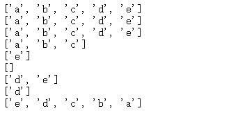
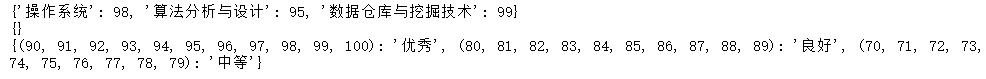
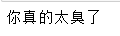
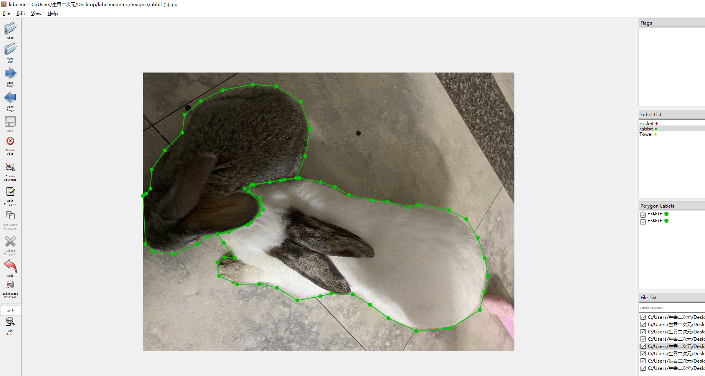
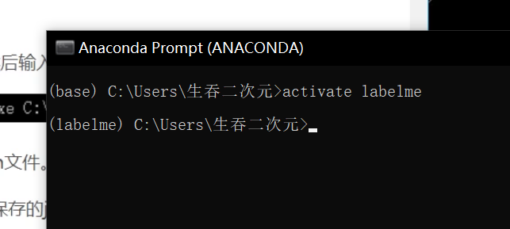
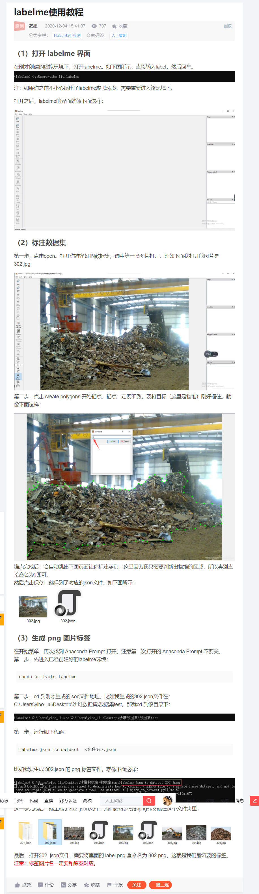

[TOC]

#### 变量赋值 、基本数据类型

```python
var01 = 123123
print(type(var01))
var01 = 'chenlifan'
print(type(var01))
var01 = -1
print(type(var01))
```

- 结果
- 

#### 注释

> 单行注解
>
> 多行注解

```python
#这个是单行注解
'''
用六个单引号可以多行注释
'''
```

#### 字符串

- 字符串是以两个单引号或者两个双引号包裹起来的文本

- ```python
  print('chelifan')
  print("chenlifan01")
  ```

  - 结果
  - 

- 字符串可以看作是字符的序列
- 字符串内的字符不可以改变

```python
str01 = 'kong'
str01[0] = 'C'
print(str01)
```


可以看到不可以改变字符串内的字符的


- 但是可以通过索引来获取字符串内的字符

```python
str01 = 'kong'
print(str01[0])
```


#### 转义字符

- \n表示换行，\t表示制表符
- r"" 表示原议字符创，内部的字符串默认不转义

```python
print("chen li fan")
print("chen \tli fan")
print("chen \nli fan")
print(r"chen\n li fan")
```

- 结果
- 


- 上面的例子可以看到，i‘m在单字符串的包裹下执行是会报错的，所以正确的打法应该是


#### 布尔类型

```python
print(bool('d'))
print(bool(1))
print(bool(0))
print(1>2)
print(1>2 or 3>2)
```


#### 逻辑运算符

- 布尔值可以进行and、or和not 运算
- and、or运算分别用 & 和 | 表示
- not为非运算，即把False变成True，True变成False

**注意False和True一定是开头字母大写的，不然没有分**


#### 二元数学运算符

| 运算 | 说明                           | 示例              |
| ---- | ------------------------------ | ----------------- |
| a+b  | a加b                           |                   |
| a-b  | a减b                           |                   |
| a*b  | a乘以b                         |                   |
| a/b  | a除以b                         | 3/2=1.5           |
| a%b  | a除以b，取余数                 | 3%2=1             |
| a//b | a除以b后向下取证，丢弃小数部分 | 16//6=2   16//5=3 |
| a**b | a的b次方                       | 3**               |

#### 类型转换(bool)

- 当变量值为0,0.0，'',None时，bool转换的结果才为False

```python
print(bool(0))
print(bool(0.0))
print(bool(None))
print(bool(''))
```

- 结果
- 

#### 列表创建

- 创建方式一

```python
a = [1,23,4,5,45]
print(a)
```

- 结果


- 创建方式二，**用list()将其他序列转换为list**

```python
a = list('chenlifan')
print(a)
a = range(5)
print(a)
```

- 结果
- range函数可以创建一个整数列表


#### 列表索引

- **索引都是从0开始计数的，如果列表中有n个元素，那么最后一个元素的索引是n-1**

- **也可以从列表里最后一个元素对应的索引开始，最后一个位置的索引为-1**

- ```python
  a = list('chenlifan')
  print(a[-1])
  print(a[-2])
  print(a[-3])
  ```

- 结果

- 

#### 列表切片（重点）

- **==切片操作得到原列表的一个列表，仍然是list类型==**

- 列表名称[起始索引位置:最后索引位置:步长]
- 如果未输入步长，则默认步长为1
- 注意：切片返回的元素为 **起始步长** 到 **最后索引-1** 的元素

```python
a=['a','b','c','d','e']
print(a[:])#两个索引位置都省略，表示原样复制- - 个列表
print (a[0:]) #从最开始进行切片，最后索引位置省略，表示原样复制- - 个列表
print (a[:100])#省略起始索引位置，表示从最开始进行切片，
#当最后索引位置大于或等于元素个数时，表示原样复制- - 个列表
print (a[0:3]) #起始索引位置为0,最后索引位置为3，表示切片结果为前3个元素
print(a[-1:])#从最后一个元素开始切片，最后索引位置省略，表示切片结果为最后1个元素
print(a[-1:-1])#从最后一个元素开始切片， 最后索引位置为-1，表示切片结果为空
print(a[-2:])#从倒数第二个元素开始切片，最后索引位置省略，表示切片结果为最后2个元素
print(a[-2:-1])#并起始索引位置为-2,最后索引位置为-1，表示切片结果为倒数第二个元素
print(a[::-1])#::-1表示将列表的顺序颠倒过来
```

- 结果



- **主要：切片结果包含起始索引位置的元素，但不包含最后索引位置的元素**


|  0   |  1   |  2   |  3   |  4   |  5   |  6   |
| :--: | :--: | :--: | :--: | :--: | :--: | :--: |
|  a   |  b   |  c   |  d   |  e   |  f   |  g   |
|  -7  |  -6  |  -5  |  -4  |  -3  |  -2  |  -1  |

1. > 当步长为==正整数==的时候，相当于站在==左==侧看

   ```python
   a=['a','b','c','d','e']
   print(a[0:3:1])
   print(a[0:4:2])
   ```

   - 结果

   

2. > 当步长为==负整数==的时候，相当于站在==右==侧看

```PYTHON
a=['a','b','c','d','e']
print(a[4:0:-1])
print(a[4:0:-2])
print(a[0:4:-2])
print(a[::-1])
print(a[::-2])
print(a[::])
```

- 结果


#### 列表的加乘

```python
a=[1,2,3,4]
b=[5,6,7,8,9]
c = a+b
c = c+[4,3,2,1]
print(c)
c = a*3
print(c)
```

- 结果
- 

#### 列表对象的增加

- **通过insert()方法在指定的索引位置添加数据元素**

```python
a = [1,2,3]
a.insert(1,4)
print(a)
```

- 结果


#### 列表对象的删除

- **使用remove()方法删除元素**

> remove()方法适用于知道要删除的值的情况

```python
a = [1,2,3]
#删除元素2
a.remove(2)
print(a)
```

- 结果


#### 使用del()函数和pop()方法对列表对象进行删减

- **通过引用列表的索引来删除列表的对象**

```python
a = [1,2,3]
del a[-2]
print(a)
a = [1,2,3,4,5]
a.pop(-2)
print(a)
```


#### 列表的其他方法

- 列表求和
- 列表长度
- 列表排序

```python
a = [1,2,3,4,5]
print(sum(a))
print(len(a))
print(sorted(a))
print(2 in a)
b = ['2','1','3','4']
print(sorted(b))
```


#### 元组操作

- **元组是不可变的**
- 所以没有append(),insert(),del这样的方法，
- 元组因此也可以使代码更安全
- 注意：**如果元组的元素是列表list，虽然这个元素不可变，但是list中的值是可以改变的**

```python
t1 = (1,'a',[1,2])
print(t1)
t1[2][1] = 'b'#获取元组中的列表的下标为1
print(t1)
```


- 元组不可变

```python
t2 = (1,2,3,4,5,6)
t2[2] = (2,)
print(t2)

```


```python
t2 = (1,2,3,4,5,6)
t2 + (7,)
print(t2)
```


可以看到并没有将元素7添加到元组中，虽然没有报错


#### 字典

- **==字典的值==可以使标准对象，也可以使用户自定义的**
- **==字典的键的两个特性==**

> ==不允许同一个键出现两次==，创建的时候如果同一个键被赋值两次，则后一个值会被记住
>
> ==键必须不可变==，所以可以用数字，字符串，元组充当，但用元组做有效的键，必须要加限制：元组中只包括像数字和字符串这样不可变的参数

- 字典是python语言中唯一-的映射类型。

- 字典是一-些列键(key) 值(value) 对组成的，形式如下:

  > {键1:值1,键2:值2....键n:值n}

  - 每个键值对用冒号隔开
  - 每对之间用逗号隔开
  - 键必须是唯一的，必须是不可变的，如字符串，数字， 元组
  - 值可以是任何数据类型

  **字典的创建**

  ```python
  scores ={'操作系统': 98,'算法分析与设计': 95,'数据仓库与挖掘技术':99}
  print (scores)
  empty_dict = {}#空的花括号代表空的字典
  print (empty_dict)
  #使用元组作为字典的键
  t1=(90, 91, 92, 93, 94, 95, 96, 97, 98, 99, 100)
  t2= (80, 81, 82, 83, 84, 85, 86, 87, 88, 89) 
  t3=(70, 71, 72, 73, 74, 75, 76, 77, 78, 79)
  dict1 = {t1:'优秀',t2:'良好',t3:'中等'}
  print (dict1)
  ```

  

- 上面展示了创建字典的方式，以及使用元组作为字典的键
- 使用zip()函数创建字典

```python
Cities=['北京','上海','广州']
AreaCode=['010','021','020']
z=zip(Cities, AreaCode)
for i in z:
    print(i)
```


```python
Cities=['北京','上海','广州']
AreaCode=['010','021','020']
z=zip(Cities, AreaCode)
list01 = list(z)
print(list01)
print(dict(list01))
```


上面是通过zip()函数创建字典后，将其转化为列表

而dict()函数是将z这个字典对象转化为字典，如果直接输出z这个对象，那么就会输出z这个对象的内存值

如下


- 创建字典的其他方式

```python
d = dict(x1=1,x2=2,x3=3)
print(d)
```


```python
d = dict(zip(list('chenlifan'),range(1,10)))
print(d)
```


- 通过键值获取值

```python
Cities=['北京','上海','广州']
AreaCode=['010','021','020']
z=zip(Cities, AreaCode)
dict01 = dict(z);
print(dict01['北京'])
```


- 通过键值修改值

- ```python
  Cities=['北京','上海','广州']
  AreaCode=['010','021','020']
  z=zip(Cities, AreaCode)
  dict01 = dict(z);
  dict01['北京'] = '111'
  print(dict01['北京'])
  ```


- 通过in操作判断是否存在某个键

```python
Cities=['北京','上海','广州']
AreaCode=['010','021','020']
z=zip(Cities, AreaCode)
dict01 = dict(z);
print('北京' in dict01)
```


- 使用keys()和values()方法获取字典的键和字典的值

```python
Cities=['北京','上海','广州']
AreaCode=['010','021','020']
z=zip(Cities, AreaCode)
dict01 = dict(z);
print(dict01.keys())
print(dict01.values())
```


- 字典添加键值对的方法（通过添加不存在的键进行添加）

```python
Cities=['北京','上海','广州']
AreaCode=['010','021','020']
z=zip(Cities, AreaCode)
dict01 = dict(z);
dict01['江门'] = '112'
print(dict01['江门'])
```


- 通过使用setdefalut()方法来天剑键值对

```python
Cities=['北京','上海','广州']
AreaCode=['010','021','020']
z=zip(Cities, AreaCode)
dict01 = dict(z);
key = '深圳'
value = '003'
dict01.setdefault(key,value)
print(dict01)
```


#### 字符串操作

使用dir方法可以查看字符串可以使用的方法

```python
str = '1321321'
print(dir(str))
```


- **关于字符串的一些操作**

```python
str = 'dadad'
print(str.upper())
print(str.find('a'))
print(str.count('a'))
list01 = list(str)
print(list01)
str01 = '-'.join(str)
print(str01)
str02 = str01.split('-')
print(str02)
```


- 字符串的加法和乘法

```python
str01 = 'kong'
str02 = 'long'
print(str01+str02)
print(str01*3)
```


#### 集合的创建

- 集合可以嵌套tuple和string，不可变的结构，但是不能嵌套list，set和dict

```python
s1  = {1,2,3,4,'chenlifan',1,(1,2)}
print(s1)
```


- 使用set创建集合

```python
s1 = set([1,2,3,4])
print(s1)
s2 = set()
print(type(s2))
```


- **==注意：创建空集合，必须使用set()，而不是{}，因为使用{}表示创建的是一个字典==**

```python
s1 = set()
print(type(s1))
s2 = {}
print(type(s2))
```


嵌套list，set，dict都是报错的

```python
s1 = {1,2,[1,2]}
print(s1)
```


```python
s1 = {1,2,{1,2}}
print(s1)
```


```python
s1 = {1,2,23,{'x1':1,'x2':2}}
print(s1)
```


#### 数据的读取

- 对文件操作之前需要用open()函数来打开文件
- 打开之后将返回一个文件对象(file object)，后续对文件内数据的操作都是基于这个文件对象的方法来实现的
- 对文件数据的读取是用的read()方法，read()方法将返回文件中的所有内容
- 用print打印所有内容会显示文件夹的内容，每次open完文件后记得一定要close文件，否则文件就会一直被python占用，不能被其他进程使用

一个简单的案例

```python
#encodig : <utf-8>
f =open(r'C:\Users\86255\Desktop\hello.txt','r',encoding = 'utf-8')
print(f.read())
f.close()
```



读取的是桌面的文件，注意文件的前面一定要加r，否则就会报语法错误，因为\是python的转义字符，用r可以忽略这些\


- 使用with open() as  f : 在操作后自动关闭文件


```python
with open (r'C:\Users\86255\Desktop\hello.txt','r',encoding = 'utf-8') as f:
    print(f.read())
```


使用这种方法可以自动关闭文件，不需要自己close


- 在read()中加入数字，可以指定读取的字符数

```python
with open (r'C:\Users\86255\Desktop\hello.txt','r',encoding = 'utf-8') as f:
    print(f.read(3))
```


可以看到只读取了3个字符


- 读取Excel文件的数据

```python
import pandas as pd
df = pd.read_csv(r'F:\大三\数据挖掘\第六周\数据集\iris.csv',encoding='utf-8')
df.head()#默认显示前五行
```


#### 数据的写入


- 写入操作和读取操作雷士，用的是wirte()函数，同时需要将打开的文件的mode参数设置为w
- **注意：**读取的时候read() 要使用r，写入的时候write() w，否则就会报错

```python
with open (r'C:\Users\86255\Desktop\hello.txt','w',encoding = 'utf-8') as f:
    f.write('唔该麻烦你们')
with open (r'C:\Users\86255\Desktop\hello.txt','r',encoding = 'utf-8') as f:
    print(f.read())
```


#### 列表推导式

- 将列表中的每个元素都乘以2

  ```python
  list01 = [1,2,3,4,5,6,7]
  print([i*2 for i in list01])
  
  print([i*2 for i in range(1,10)])
  ```

  

  

- **注意，列表推导式要有[]这个括号**

#### 集合推导式

- 集合推导式和列表推导式很类似，唯一的区别是前者使用大括号{}

```python
s1 = {1,2,3,4,5,6}
print({i*2 for i in s1})
```


- 集合推到式自带去重的功能

```python
print({i**2 for i in {1,-1,2}})
```


#### 字典推导式

- 字典推导式通过{key:value+for循环句子}的方式生成新的字典

```python
d1 = {key:value for key,value in zip('abcde',range(1,6))}
d1
```


> 上面是通过字典推导式生成新的字典

```python
t1=(1,2,3,4,5)
t2=(6,7,8,9,10)
t3=(11,12,13,14,15)
d1={t1:'优秀',t2:'合格',t3:'中等'}
d2={v:k for k,v in d1.items()}
d2
```


#### 函数的语法规则

```python
def fuc_name(x):
    '''
    注解
    '''
    print('被偷得内裤都不剩了')
    return x
print(fuc_name('真的臭'))
```


#### lambda函数，是一个只用一行就能解决问题的函数

- lambda函数又称为==匿名函数==

- 求两数之和

```python
lam = lambda x,y:x+y
lam(2,6)
```


- reduce函数

- 求1~100之和

```python
from functools import reduce
reduce(lambda x,y:x+y,range(1,101))
```


- 其他操作

```python
from functools import reduce

def add(x,y):
    return x+y
reduce(add,[1,2,3,4,5])
```


- 上面的操作也可以用lambda函数来替代


#### 第一章小结

- **==数据挖掘==**是从海量数据中心发现的有趣模式的过程。作为==知识发现过程==，它通常包括数据清理、数据集成、数据选择、数据变换、模式发现、模式评估和知识表现。

- 一个模式如果是有趣的，则它在某种确信程度上对于检验数据是==有效的，新颖的，潜在有用的==（例如，可以据之行动，或者验证了用户关注的某种预感），==并且容易被人理解。有趣的模式代表知识==。模式兴趣度度量，无论是客观的还是主观的，都可以用来指导发现过程。


#### 盒图


#### 距离


#### 求出均值、中位数、众数、上四分位数、四分位数极差、最大值、最小值、极差、方差、标准差、并绘制盒图


#### 第二章小结

- 数据集由数据对象构成，一个数据对象表示一个实体，数据对线用属性描述，属性可分为标称属性、二元属性、序数属性、数值属性。
- **==标称属性==**：的值可以是符号或事物的名字，其中每个值代表某种类别、编码或状态。
- **==二元属性==**：是仅有两种可能状态（如0和1，或真与假）的标称属性。
- **==序数属性==**：是其可能的值之间具有有意义的序或排位，但相继值之间的差位置的属性。
- **==数值属性==**：是定量的，即它是可度量的量，用整数或实数值来表示。数值属性可以是区间标度的或比率标度的。
- 基本统计描述为数据预处理提供了分析基础。主要内容包括度量数据的中心趋势：算术==均值（Mean）、中位数（Median）、众数（Mode），以及度量数据的离散程度：极差、四分位数、方差、标准差和四分位数极差。==


# labelme学习


安装labelme之前查看anaconda的内置python版本   python版本要看自己而定


> 上面的conda create --name=labelme python3.8相当于在anaconda中安装了一个labelme的小房子
>
> 
>
> 
>
> 这是小房子的路径

然后我们进入这个小房子


然后我们开始给这个房子开始装修


**下面的一些软件如果下载不下来，可以使用清华同源**


安装完上面步骤之后


打开labelme



然后把labelme中的图像都标注好点之后。查看下面这个blog

https://blog.csdn.net/yql_617540298/article/details/81110685


这个主要是解决一次执行一个json这样的麻烦，而是可以直接执行一个文件夹


> 首先是寻找json_to_dataset.py
>
> 因为安装labelme的一个环境，和上面blog有区别
>
> 所以json_to_dataset.py是在如下路径的
>
> 先打开我们安装anaconda安装的文件夹
>
> 

然后我们把blog的代码替换掉json_to_dataset.py的代码

**这是博客的代码**

```python
import argparse
import json
import os
import os.path as osp
import warnings
 
import PIL.Image
import yaml
 
from labelme import utils
import base64
 
def main():
    warnings.warn("This script is aimed to demonstrate how to convert the\n"
                  "JSON file to a single image dataset, and not to handle\n"
                  "multiple JSON files to generate a real-use dataset.")
    parser = argparse.ArgumentParser()
    parser.add_argument('json_file')
    parser.add_argument('-o', '--out', default=None)
    args = parser.parse_args()
 
    json_file = args.json_file
    if args.out is None:
        out_dir = osp.basename(json_file).replace('.', '_')
        out_dir = osp.join(osp.dirname(json_file), out_dir)
    else:
        out_dir = args.out
    if not osp.exists(out_dir):
        os.mkdir(out_dir)
 
    count = os.listdir(json_file) 
    for i in range(0, len(count)):
        path = os.path.join(json_file, count[i])
        if os.path.isfile(path):
            data = json.load(open(path))
            
            if data['imageData']:
                imageData = data['imageData']
            else:
                imagePath = os.path.join(os.path.dirname(path), data['imagePath'])
                with open(imagePath, 'rb') as f:
                    imageData = f.read()
                    imageData = base64.b64encode(imageData).decode('utf-8')
            img = utils.img_b64_to_arr(imageData)
            label_name_to_value = {'_background_': 0}
            for shape in data['shapes']:
                label_name = shape['label']
                if label_name in label_name_to_value:
                    label_value = label_name_to_value[label_name]
                else:
                    label_value = len(label_name_to_value)
                    label_name_to_value[label_name] = label_value
            
            # label_values must be dense
            label_values, label_names = [], []
            for ln, lv in sorted(label_name_to_value.items(), key=lambda x: x[1]):
                label_values.append(lv)
                label_names.append(ln)
            assert label_values == list(range(len(label_values)))
            
            lbl = utils.shapes_to_label(img.shape, data['shapes'], label_name_to_value)
            
            captions = ['{}: {}'.format(lv, ln)
                for ln, lv in label_name_to_value.items()]
            lbl_viz = utils.draw_label(lbl, img, captions)
            
            out_dir = osp.basename(count[i]).replace('.', '_')
            out_dir = osp.join(osp.dirname(count[i]), out_dir)
            if not osp.exists(out_dir):
                os.mkdir(out_dir)
 
            PIL.Image.fromarray(img).save(osp.join(out_dir, 'img.png'))
            #PIL.Image.fromarray(lbl).save(osp.join(out_dir, 'label.png'))
            utils.lblsave(osp.join(out_dir, 'label.png'), lbl)
            PIL.Image.fromarray(lbl_viz).save(osp.join(out_dir, 'label_viz.png'))
 
            with open(osp.join(out_dir, 'label_names.txt'), 'w') as f:
                for lbl_name in label_names:
                    f.write(lbl_name + '\n')
 
            warnings.warn('info.yaml is being replaced by label_names.txt')
            info = dict(label_names=label_names)
            with open(osp.join(out_dir, 'info.yaml'), 'w') as f:
                yaml.safe_dump(info, f, default_flow_style=False)
 
            print('Saved to: %s' % out_dir)
if __name__ == '__main__':
    main()
```


这是原版的代码

```python
import argparse
import base64
import json
import os
import os.path as osp

import imgviz
import PIL.Image

from labelme.logger import logger
from labelme import utils


def main():
    logger.warning(
        "This script is aimed to demonstrate how to convert the "
        "JSON file to a single image dataset."
    )
    logger.warning(
        "It won't handle multiple JSON files to generate a "
        "real-use dataset."
    )

    parser = argparse.ArgumentParser()
    parser.add_argument("json_file")
    parser.add_argument("-o", "--out", default=None)
    args = parser.parse_args()

    json_file = args.json_file

    if args.out is None:
        out_dir = osp.basename(json_file).replace(".", "_")
        out_dir = osp.join(osp.dirname(json_file), out_dir)
    else:
        out_dir = args.out
    if not osp.exists(out_dir):
        os.mkdir(out_dir)

    data = json.load(open(json_file))
    imageData = data.get("imageData")

    if not imageData:
        imagePath = os.path.join(os.path.dirname(json_file), data["imagePath"])
        with open(imagePath, "rb") as f:
            imageData = f.read()
            imageData = base64.b64encode(imageData).decode("utf-8")
    img = utils.img_b64_to_arr(imageData)

    label_name_to_value = {"_background_": 0}
    for shape in sorted(data["shapes"], key=lambda x: x["label"]):
        label_name = shape["label"]
        if label_name in label_name_to_value:
            label_value = label_name_to_value[label_name]
        else:
            label_value = len(label_name_to_value)
            label_name_to_value[label_name] = label_value
    lbl, _ = utils.shapes_to_label(
        img.shape, data["shapes"], label_name_to_value
    )

    label_names = [None] * (max(label_name_to_value.values()) + 1)
    for name, value in label_name_to_value.items():
        label_names[value] = name

    lbl_viz = imgviz.label2rgb(
        label=lbl, img=imgviz.asgray(img), label_names=label_names, loc="rb"
    )

    PIL.Image.fromarray(img).save(osp.join(out_dir, "img.png"))
    utils.lblsave(osp.join(out_dir, "label.png"), lbl)
    PIL.Image.fromarray(lbl_viz).save(osp.join(out_dir, "label_viz.png"))

    with open(osp.join(out_dir, "label_names.txt"), "w") as f:
        for lbl_name in label_names:
            f.write(lbl_name + "\n")

    logger.info("Saved to: {}".format(out_dir))


if __name__ == "__main__":
    main()

```

然后我们把imgas中的json图片提取出来


到json文件夹中


**上面用来打开labelme的anaconda prompt控制台不要关闭，我们新打开另一个anaconda prompt控制台，相当于两个控制台（如果把第一个打开labelme的控制台关闭，下面就会出现没有权限的错误）**，

打开新的anaconda prompt控制台，然后进入到labelme环境中，

找到下面这个程序


找到上面的exe文件


然后运行


出现这样的错误

这个错误需要我们如下解决


然后我们再次尝试

如果进不去文件夹可以用下面方法


## 如果上面的方法出现了问题，在上面方法的基础上，重新布置labelme




# labelimg

安装labelimg

和labelme一样，在anaconda中创建一个labelimg的房子


然后我们进入labelimg这个房子安装labelimg


然后打开labelimg


