[TOC]

## 代码结构介绍


- security：主模块 
- security-core：核心业务逻辑
- security-browser：浏览器安全特定代码
- security-app：app相关特定代码
- security-demo：样例程序 


- P4有说如何把工程打包成jar包，并运行


## 使用springmvc开发RestFul API

1. 使用springmvc编写Restful API
2. 使用springmvc处理其他web应用常见的需求喝场景
3. RestFul api开发常用辅助框架

 

|      | 传统风格的url                |      | RestFul风格的api |        |
| ---- | ---------------------------- | ---- | ---------------- | ------ |
| 查询 | /user/query?name=tom         | GET  | /user/?name=tom  | GET    |
| 详情 | /user/getInfo?id=1           | GET  | /user/1          | GET    |
| 创建 | /user/create?name=tom        | POST | /user            | POST   |
| 修改 | /user/update?id=1&name=jerry | POST | /user/1          | PUT    |
| 删除 | /user/delete?id=1            | GET  | /user/1          | DELETE |

- 传统风格
  - 用url描述资源
  - 使用http方法描述行为。使用http状态吗来表示不同的结果
  - 使用键值对传输数据
- Restful风格
  - 使用json交换数据
  - restful只是一种风格，并不是一种强制的标准

### 用户查询请求

**编写第一个Restful API**

1. 编写针对restfulapi的**测试**用例
2. 使用注解声明restfulapi
3. 在restfulapi中传递参数


1. 编写针对restfulapi的**测试**用例

- 

新建一个测试用例

<u>因为我们是要测试web的环境，所以我们要伪造一个mvc的环境</u>

<u>这个伪造的环境不会启动我们的tomcat，所以这个测试用例就会很快</u>


**用户查询的测试用例流程**

- 代码演示

```java
package com.chenlifan.controller;

import com.chenlifan.DemeApplication;

import org.junit.Before;
import org.junit.Test;
import org.junit.runner.RunWith;

import org.springframework.beans.factory.annotation.Autowired;
import org.springframework.boot.test.context.SpringBootTest;

import org.springframework.http.MediaType;
import org.springframework.test.context.junit4.SpringRunner;
import org.springframework.test.web.servlet.MockMvc;
import org.springframework.test.web.servlet.request.MockMvcRequestBuilders;
import org.springframework.test.web.servlet.result.MockMvcResultMatchers;
import org.springframework.test.web.servlet.setup.MockMvcBuilders;
import org.springframework.web.context.WebApplicationContext;


/*告诉如何执行这个测试用例*/
@RunWith(SpringRunner.class)
@SpringBootTest(classes = DemeApplication.class)
public class UserController {

    @Autowired
    private WebApplicationContext webApplicationContext;

    /*伪造mvc的环境*/
    private MockMvc mockMvc;

    /*会在每一个测试用例执行前去执行*/
    @Before
    public void setUp() {
        /*构建一个伪造的mvc环境*/
        mockMvc = MockMvcBuilders.webAppContextSetup(webApplicationContext).build();
    }

    /*构建一个用户查询的测试用例*/
    @Test
    public void whenQuerySuccess() throws Exception {
        /*用mockMvc去发一个请求路径为user的get请求，编码格式为json_utf-8的请求，发出这个请求之后，我们去判断这个请求返回的内容是否符合我们的期望*/
        mockMvc.perform(MockMvcRequestBuilders.get("/user").contentType(MediaType.APPLICATION_JSON_UTF8))
                /*执行完上面的请求之后，（andExpect）我们对期望服务器端返回的数据是什么样子的
                 * 1.期望这个结果的状态码是200——MockMvcResultMatchers.status().isOk()
                 * 2.判断返回json的内容，期望返回的是一个集合，而且集合的长度是3个元素——MockMvcResultMatchers.jsonPath("$.length()").value(3)
                 * */
                .andExpect(MockMvcResultMatchers.status().isOk())
                .andExpect(MockMvcResultMatchers.jsonPath("$.length()").value(3));


    }

}
```

- 得到的结果是
- 

- 因为期望的状态码是200，但是得到的是404，这是因为我们没有写user的这个api


2. 使用注解声明restfulapi

- 常用注解
  - @RestController表明此Controller提供RestfulApi
  - RequestMapping及其变体。映射http请求url到java方法上面
  - RequsetParam映射请求参数到java方法的参数


3. 在restful api中传递参数

- 在User Controller编写好查询用户的api
- 

- 再次运行用户查询的测试用例
- 

- 报错，告诉我们json不能为null或者为空的字符串


- 所以我们在UserController上添加3个用户

- ```java
  public List<User> query() {
          List<User> users = new ArrayList<>();
          /*因为期望返回集合的长度是3个——MockMvcResultMatchers.jsonPath("$.length()").value(3，所以添加三个用户*/
          users.add(new User());
          users.add(new User());
          users.add(new User());
  
  
          return users;
      }
  ```

  

- 再次运行测试用例
- 

- 代表符合期望，运行成功

- ```java
  @RequestParam String username——要求请求必须要携带username这样的一个参数
  ```

- 如果请求没有这个参数就会报400

- 

- 后台要求传username这样的参数，但是没有传

- 所以我们在测试用例中传递参数

- ```java
   mockMvc.perform(MockMvcRequestBuilders.get("/user")
           /*请求过程中传递的参数*/
                  .param("username","chenlifan")
                  .contentType(MediaType.APPLICATION_JSON_UTF8))
  ```

- 在UserController中获取请求传递的参数

- ```java
   /*获取请求传递的参数username*/
          System.out.println(username);
  ```

- 在控制台获取到username

- 

| @RequestParam的属性   |                                                              |
| --------------------- | ------------------------------------------------------------ |
| value                 | 即请求参数的名字，比如value ="username"则，请求的参数的名字必须为username，而获取的api可以为别的名字 |
| required：true，false | true代表请求必须传递参数，否则报错，反之为false              |
| defaultValue          | 代表没有同名的请求参数的时候的默认值                         |

- 将参数传到实体类中，api获取类中的参数
- 创建实体类UserQueryCondition

```java
package com.chenlifan.pojo;

public class UserQueryCondition {
    private String username;
    private int age;
    private String sex;

    public String getUsername() {
        return username;
    }

    public void setUsername(String username) {
        this.username = username;
    }

    public int getAge() {
        return age;
    }

    public void setAge(int age) {
        this.age = age;
    }

    public String getSex() {
        return sex;
    }

    public void setSex(String sex) {
        this.sex = sex;
    }
}

```

- 在测试用例中传递参数

- ```java
   mockMvc.perform(MockMvcRequestBuilders.get("/user")
                  /*请求过程中传递的参数*/
                  .param("username","chenlifan")
                  .param("age","18")
                  .param("sex","恐龙仔")
                  .contentType(MediaType.APPLICATION_JSON_UTF8))
  ```

  

- api获取类并输出


- 得到的结果


- 传递分页的信息

- 在测试用例传入参数

- ```java
   /*这个三个参数的意思
                  * page——查询第三页的数据
                  * size——每页返回15行
                  * 查询的结果按照年龄的降序排列
                  * */
                  .param("size","15")
                  .param("page","3")
                .param("sort","age,desc")
  ```

  - 在api中获取Pageable对象，并输出传送的参数

  

- 得到结果

- 

- 常用注解

  - **@PageableDefault指定分页参数默认值**

```java
@PageableDefault(page = 2, size = 17, sort = "username,asc")
```

- 再次访问user这个api

- 得到结果

- 

###### jsonpath的语法(详情：GitHub搜索jsonpath)

| Operator                  | Description                                                  |                                                      |
| ------------------------- | ------------------------------------------------------------ | ---------------------------------------------------- |
| `$`                       | The root element to query. This starts all path expressions. | 代表整个传回来的json的文档，整个json的根就是一个集合 |
| `@`                       | The current node being processed by a filter predicate.      |                                                      |
| `*`                       | Wildcard. Available anywhere a name or numeric are required. |                                                      |
| `..`                      | Deep scan. Available anywhere a name is required.            |                                                      |
| `.<name>`                 | Dot-notated child                                            |                                                      |
| `['<name>' (, '<name>')]` | Bracket-notated child or children                            |                                                      |
| `[<number> (, <number>)]` | Array index or indexes                                       |                                                      |
| `[start:end]`             | Array slice operator                                         |                                                      |
| `[?(<expression>)]`       | Filter expression. Expression must evaluate to a boolean value. |                                                      |

**FUNCTION**

| Function | Description                                                  | Output  |
| -------- | ------------------------------------------------------------ | ------- |
| min()    | Provides the min value of an array of numbers                | Double  |
| max()    | Provides the max value of an array of numbers                | Double  |
| avg()    | Provides the average value of an array of numbers            | Double  |
| stddev() | Provides the standard deviation value of an array of numbers | Double  |
| length() | Provides the length of an array                              | Integer |

### 用户详情请求

###### @PathVariable：映射url片段到java方法的参数

**流程**

- 先写一个测试用例

```java
  /*创建一个当获取用户信息成功的时候的测试用例*/
    @Test
    public void whenGetInfoSuccess() throws Exception {
        /*用MockMVc去伪造一个restFul的url请求*/
        mockMvc.perform(MockMvcRequestBuilders.get("/user/1")
                .contentType(MediaType.APPLICATION_JSON_UTF8))
                /*期望返回的结果是状态吗为200*/
                .andExpect(MockMvcResultMatchers.status().isOk())
                /*期望返回的json的内容是一个username，值为chenlifan*/
                .andExpect(MockMvcResultMatchers.jsonPath("$.username").value("chenlifan"));


    }
```

- 先执行看看结果
- 

- 因为没有写实际的api
- 编写具体的api

```java
/*编写这样的一个通过id来获取用户信息的api
     *假设我们通过id为1去查询用户信息
     *传统的前端请求api的方式为——/user/getInfo?id=1
     *而restFul的请求的api的方式为——/user/1
     * 而我们可以通过@PathVariable注解来实现将请求的url上的参数1传递到api的String id上
     * 而@PathVariable则将@RequeatMapping的path上面的{id}映射到api的id上
     * */
    /*method = RequestMethod.GET代表处理get请求
    * */
    @RequestMapping(path = "/user/{id}", method = RequestMethod.GET)
    public User getInfo(@PathVariable String id) {
        User user = new User();
        user.setUsername("chenlifan");
        return user;
    }
```

- 运行测试用例
- 结果api的返回值与预期的相符合
- 

- 也可以通过指定映射的属性名

- ```java
  @RequestMapping(path = "/user/{id}", method = RequestMethod.GET)
      public User getInfo(@PathVariable(value = "id") String xsid) {
          
      }
  ```


###### 在url声明中使用正则表达式

- **如何对请求的参数进行限制**
- 先编写一个访问 restful api返回结果为400的测试用例

```java
  /*编写一个访问api返回结果为400的测试用例*/
    @Test
    public void whenGetInfoFail() throws Exception {
        mockMvc.perform(MockMvcRequestBuilders.get("/user/a")
                .contentType(MediaType.APPLICATION_JSON_UTF8))
                .andExpect(MockMvcResultMatchers.status().is4xxClientError());
    }
```

- 
- 意思是期望是访问失败的，而结果是成功的，这是因为没有对访问的请求进行限制
- 对api的拦截请求进行限制只能接收数字
- 修改api拦截的请求
- 

- 再次执行测试用例
- 返回结果运行成功
- 

- 代表api只能拦截数字的请求


###### @JsonView控制json输出的内容

**前言**

> 什么样的场景下才会使用jsonView的注解
>
> >
> >
> >假设在查询的时候我们不希望把用户的密码等重要信息返回到前台，或者说只在某种权限下才把密码这种字段展现出来

**@JsonView使用步骤**

1. 在实体类上使用接口来声明多个视图

> 查询的场景是不带有password
>
> 查询详情的场景是带有password

2. 使用jsonView注解在值对象的get方法上指定视图

> 比如指定User这种实体类的每一个字段是在哪一个视图上显示

3. 在Controller方法上去指定视图

> 指定每一个方法指定哪个视图，这个方法被调用的时候，就会相应的对应在实体类中指定视图的每一个字段

**实现流程**

- 在User实体类中声明多个视图


- 用jsonView注解在User对象的get方法上指定视图


- 这个是完整的User实体类配置代码

```java
public class User {
    /*声明多个视图，一个展示简单的信息，一个展示详细信息*/
    public interface UserSimpleView {
    }

    /*用户详细视图继承用户简单视图*/
    public interface UserDetailView extends UserSimpleView {
    }


    private String id;
    private String username;
    private Date birthday;
    private String password;

    @JsonView(UserSimpleView.class)
    public String getId() {
        return id;
    }

    public void setId(String id) {
        this.id = id;
    }

    @JsonView(UserSimpleView.class)
    public String getUsername() {
        return username;
    }

    public void setUsername(String username) {
        this.username = username;
    }

    @JsonView(UserSimpleView.class)
    public Date getBirthday() {
        return birthday;
    }

    public void setBirthday(Date birthday) {
        this.birthday = birthday;
    }

    @JsonView(UserDetailView.class)
    public String getPassword() {
        return password;
    }

    public void setPassword(String password) {
        this.password = password;
    }
}
```

- 在Controller方法上去指定视图
- 在查询用户简单的信息的api上声明接口
- 

- 在查询用户详细信息的api上声明接口
- 

- 然后使用之前编写的测试用例来获取api返回到值并打印在控制台上

- 先执行访问获取简单的用户信息api的测试用例
- 通过简单的配置
- 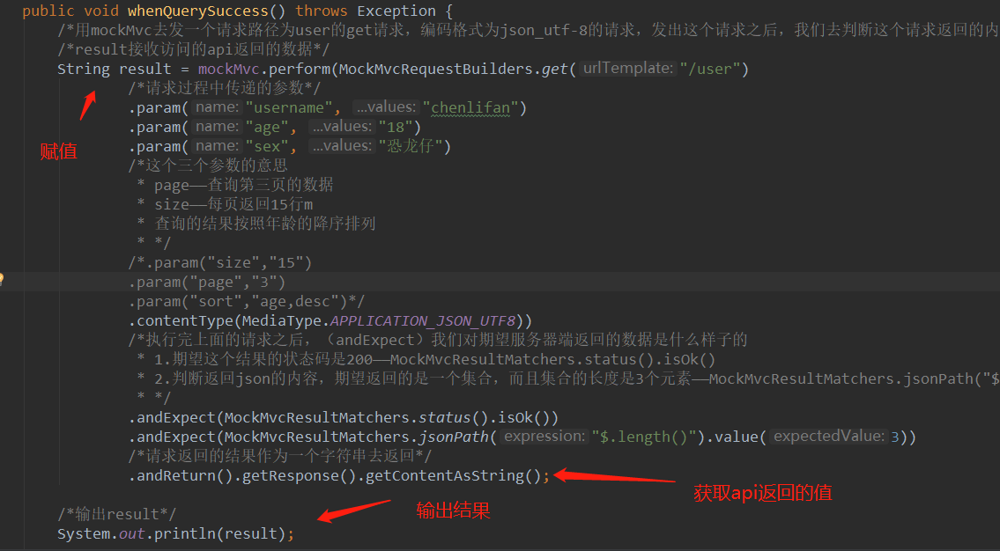

- 运行后的结果
- 

- 可以看出没有获取password
- 然后我们执行获取相详细信息的api的结果
- 

- 得到结果
- 

- 控制台输出的结果包含了password

## 代码重构

****

**小步快跑，不要一次写一大段代码**

原先代码

```java
 /*因为是用户的增删改查操作，所以请求的方法为get请求*/
    @RequestMapping(path = "/user", method = RequestMethod.GET)
    /*因为是用户的查询，所以返回的是用户的集合*/
    /*@RequestParam String username——要求请求必须要携带username这样的一个参数*/
    /*声明对应的视图
    * 因为是返回简单的信息，所以用注解@JsonView声明UserSimpleView
    * */
    @JsonView(User.UserSimpleView.class)
    public List<User> query(UserQueryCondition userQueryCondition, @PageableDefault(page = 2, size = 17, sort = "username,asc") Pageable pageable) {
        List<User> users = new ArrayList<>();
        /*因为期望返回集合的长度是3个——MockMvcResultMatchers.jsonPath("$.length()").value(3，所以添加三个用户*/
        users.add(new User());
        users.add(new User());
        users.add(new User());
        /*获取请求传递的参数username*/
        System.out.println(ReflectionToStringBuilder.toString(userQueryCondition, ToStringStyle.MULTI_LINE_STYLE));

        /*获取pageable的属性的参数*/
        System.out.println(pageable.getPageNumber());
        System.out.println(pageable.getPageSize());
        System.out.println(pageable.getSort());

        return users;
    }
```

- 比如

```java
@RequestMapping(path = "/user", method = RequestMethod.GET)
```

- 这种写法又长，也不好看，

- 经过代码重构

- ```java
  @GetMapping(path = "/user")
  ```

- 还有其他的注解

- @PostMapping

- @DeleteMapping

- @PutMapping

****

- 每一个api捕获url地址都有一个user的前缀
- 这个也是可以重构的
- 我们可以在Controller这个类上面声明一个@RequestMapping这个注解
- @RequestMapping(path="/user")
- Controller方法下的api只需要根据请求方式声明@GetMapping()或者@GetMapping(path = "/{id:\\d+}")等等

## 用户创建请求

1. @RequestBody映射请求体到java方法的参数
2. 日期类型参数的处理
3. Valid注解和BindingResult验证请求参数的合法性并处理校验结果

###### @RequestBody注解的这个用法流程

- 编写测试用例

```java
/*编写一个创建用户请求成功的测试用例*/
    @Test
    public void whenCreateSuccess() throws Exception {
        /*传送的数据*/
        String content = "{\"username\":\"tom\",\"password\":null}";
        /*与上面不同的是，这次是post请求*/
        mockMvc.perform(MockMvcRequestBuilders.post("/user").contentType(MediaType.APPLICATION_JSON_UTF8)
                /*content是伴随post请求发送出去的参数*/
                .content(content))
                /*期望返回结果为200*/
                .andExpect(MockMvcResultMatchers.status().isOk())
                /*期望返回的json有一个id字段，这个id的值为1*/
                .andExpect(MockMvcResultMatchers.jsonPath("$.id").value("1"));
    }
```

- 因为测试用例是发送post请求的，所以编写一个接收post请求的api

```java
 /*编写一个接收post请求的api*/
     @PostMapping
    public User createUser(User user) {
         System.out.println(user.getUsername());
         System.out.println(user.getBirthday());
         System.out.println(user.getId());
         System.out.println(user.getPassword());
         user.setId("1");
         return user;
    }
```


- 运行测试用例得到结果
- 

- 因为在api中通过user.setId("1")并返回user
- 所有测试用例得到的结果和预期相同
- 

- 但是api在控制台上输出了4个null

- 说明我们在测试用例中给api传递的值
- 

- 并没有被映射到User实体类中
- 这是因为我们没有在api中的方法的传参中添加@**RequestBody这个注解**
- 我们添加这个注解并再次运行测试用例
- 

- 

- 可以看到控制台输出了chenlifan这个字符串

###### 日期类型参数的处理流程

- 一般来说，日期格式有

> "yyyy-MM-dd"
>
> "yyyy-MM-dd HH:mm:ss"
>
> 但是这种对于前后端架构分离是有问题的
>
> <u>比如手机调用的日期格式只显示时分</u>
>
> <u>网页端调用显示的格式就调用详细的时间信息</u>
>
> >
> >
> >所以我们在后台向前台只需要传递一个时间戳（data）
> >
> ><u>前台获取到时间戳后再负责决定时间的显示格式</u>

- 继续用上面的方法
- 在测试用例中获取系统的时间戳，并作为json格式传输到api中


```java
/*编写一个接收post请求的api*/
    @PostMapping
    public User createUser(@RequestBody User user) {
        System.out.println(user.getUsername());
        System.out.println(user.getBirthday());
        System.out.println(user.getId());
        System.out.println(user.getPassword());
        user.setId("1");
        return user;
    }
```

- 运行测试得到结果
- 


###### Valid注解和BindingResult验证请求参数的合法性并处理校验结果

- @NotBlank注解

- 这个注解用在User实体类中，可以判断某个字段是否为空；如：

- ```java
  /*判断该字段的值是否为空*/
      @NotBlank
      private String password;
  ```

- 然后在api方法参数的传递上添加@Valid注解用来扫描@NotBlank注解，判断请求传递到该api的User对象的password属性是否为空

- 

- 再次运行测试用例
- 符合预期得报错了（400：请求格式错误）

- 

- 当我们传一个空的password的时候，后台直接就返回了这个错误，我们的请求根本没有进入到api中
- **在实际开发中，就是无法获得这个空的password，也要记录这个错误的信息，进入到这个api中，这时候就需要BindingResult这个类**
- <u>BindingResult需要和@Valid这个注解一起配合使用</u>

> 当我们传递一个空的password的时候，而User这个实体类的password这个属性被@NotBlank标记住，那么当我们请求的时候，不会直接被弹回错误，而是将错误信息注入到BindingResult这个类的对象中

- 现在演示BindingResult这个对象的使用方法
- 在请求的api中
- 

- 运行测试用例
- 测试用例是绿的，说明我们进入了api中
- 

- 


- **与@Valid这个注解配合使用的**
<table border="1" cellpadding="1" cellspacing="1"><tbody><tr><td><strong>限制</strong></td>
			<td><strong>说明</strong></td>
		</tr><tr><td>@Null</td>
			<td>限制只能为null</td>
		</tr><tr><td>@NotNull</td>
			<td>限制必须不为null</td>
		</tr><tr><td>@AssertFalse</td>
			<td>限制必须为false</td>
		</tr><tr><td>@AssertTrue</td>
			<td>限制必须为true</td>
		</tr><tr><td>@DecimalMax(value)</td>
			<td>限制必须为一个不大于指定值的数字</td>
		</tr><tr><td>@DecimalMin(value)</td>
			<td>限制必须为一个不小于指定值的数字</td>
		</tr><tr><td>@Digits(integer,fraction)</td>
			<td>限制必须为一个小数，且整数部分的位数不能超过integer，小数部分的位数不能超过fraction</td>
		</tr><tr><td>@Future</td>
			<td>限制必须是一个将来的日期</td>
		</tr><tr><td>@Max(value)</td>
			<td>限制必须为一个不大于指定值的数字</td>
		</tr><tr><td>@Min(value)</td>
			<td>限制必须为一个不小于指定值的数字</td>
		</tr><tr><td>@Past</td>
			<td>限制必须是一个过去的日期</td>
		</tr><tr><td>@Pattern(value)</td>
			<td>限制必须符合指定的正则表达式</td>
		</tr><tr><td>@Size(max,min)</td>
			<td>限制字符长度必须在min到max之间</td>
		</tr><tr><td>@Past</td>
			<td>验证注解的元素值（日期类型）比当前时间早</td>
		</tr><tr><td>@NotEmpty</td>
			<td>验证注解的元素值不为null且不为空（字符串长度不为0、集合大小不为0）</td>
		</tr><tr><td>@NotBlank</td>
			<td>验证注解的元素值不为空（不为null、去除首位空格后长度为0），不同于@NotEmpty，@NotBlank只应用于字符串且在比较时会去除字符串的空格</td>
		</tr><tr><td>@Email</td>
			<td>验证注解的元素值是Email，也可以通过正则表达式和flag指定自定义的email格式</td>
		</tr></tbody></table>


## 修改和删除请求

1. 常用的验证注解
2. 自定义消息
3. 自定义校验注解

###### 常用验证注解演示

- **演示@Past注解**

- 先编写测试用例

```java
 /*创建一个用户更新信息成功的测试用例*/
    @Test
    public void whenUpdateSuccess() throws Exception {
        /*获取系统的时间戳，传递给后端*/
        Date date = new Date();
        System.out.println(date.getTime());
        /*传送的数据*/
        String content = "{\"id\":\"1\",\"username\":\"chenlifan\",\"birthday\":" + date.getTime() + "}";

        /*这个测试用例的请求的put请求,而且是针对id是1的用户进行修改*/
        String result = mockMvc.perform(MockMvcRequestBuilders.put("/user/1").contentType(MediaType.APPLICATION_JSON_UTF8)
                /*伴随请求传输的数据*/
                .content(content))
                /*期望返回结果为200*/
                .andExpect(MockMvcResultMatchers.status().isOk())
                /*期望返回的json有一个id字段，这个id的值为1*/
                .andExpect(MockMvcResultMatchers.jsonPath("$.id").value("1"))
                /*获取api返回的json数据*/
                .andReturn().getResponse().getContentAsString();
        System.out.println(result);

    }
```

- 运行一次测试用例
  
  - 每一次创建完测试用例都要运行一次的原因的是看测试用例能否正常运行，并且符合预期
- 因为没有编写好api，所以很正常的报错了
- 

- 新建一个新的api

- ```java
  /*编写一个put请求，这个api只能接收后缀为数字的请求*/
      @PutMapping(path = "/{id:\\d+}")
      public User UpdateUser(@Valid @RequestBody User user, BindingResult errors) {
          /*不符合@Valid这个注解规定的约束，那么错误信息就会传递到error中*/
          /*通过hasErrors这个方法判断这个error中是否有错误*/
          if (errors.hasErrors()) {
              /*如果有错误，就把错误通过foreach循环把所有错误都打印出来*/
              errors.getAllErrors().stream().forEach(error -> System.out.println(error.getDefaultMessage()));
          }
          System.out.println(user.getUsername());
          System.out.println(user.getBirthday());
          System.out.println(user.getId());
          System.out.println(user.getPassword());
          user.setId("1");
          return user;
      }
  ```

- 在User实体类中的birthday属性的上方标注@Past注解，这个注解的意识是这个Birthday获取的生日时间必须是已经是过去的时间

- User的代码

- ```java
    /*限制必须是一个过去的时间*/
      @Past
      private Date birthday;
  ```

- 修改一开始编写的测试用例，主要是获取过去一年的系统的时间

- 

- 运行测试用例
- 

- 因为我们的测试用例没有传递password而且传递的时间为未来一年的时间，errors的信息符合我们的预期

###### 自定义错误消息

- 上面的自定义错误消息代码有点繁杂
- 

- 我们可以通过在User实体类中自定义错误消息

- ```java
  /*限制必须是一个过去的时间*/
      @Past(message = "生日必须是一个过去的时间")
      private Date birthday;
      /*判断该字段的值是否为空*/
      @NotBlank(message = "密码不能为空")
      private String password;
  ```

- 再次运行测试用例得到结果

- 

- 获取错误消息的代码也可以简化

- ```java
   /*编写一个put请求，这个api只能接收后缀为数字的请求*/
      @PutMapping(path = "/{id:\\d+}")
      public User UpdateUser(@Valid @RequestBody User user, BindingResult errors) {
          /*不符合@Valid这个注解规定的约束，那么错误信息就会传递到error中*/
          /*通过hasErrors这个方法判断这个error中是否有错误*/
          if (errors.hasErrors()) {
              /*如果有错误，就把错误通过foreach循环把所有错误都打印出来*/
              errors.getAllErrors().stream().forEach(error -> System.out.println(error.getDefaultMessage()));
          }
          System.out.println(user.getUsername());
          System.out.println(user.getBirthday());
          System.out.println(user.getId());
          System.out.println(user.getPassword());
          user.setId("1");
          return user;
      }
  ```

  

###### 自定义校验注解

**<u>有时候hibernate提供的注解的功能太简单了，我们需要自己去提供一些注解来增强我们代码的功能</u>**

- 首先我们创建一个包
- 

- 这个是创建的注解的代码

- ```java
  package com.chenlifan.validator;
  
  import javax.validation.Constraint;
  import javax.validation.Payload;
  import java.lang.annotation.ElementType;
  import java.lang.annotation.Retention;
  import java.lang.annotation.RetentionPolicy;
  import java.lang.annotation.Target;
  
  /*@Target标签代表床架的注解标签可以标注在什么元素上面
   * ElementType.METHOD ———— 代表可以标注在方法上
   * ElementType.FIELD ———— 代表剋标注在字段上面
   * */
  @Target({ElementType.METHOD, ElementType.FIELD})
  /*运行时的注解*/
  @Retention(RetentionPolicy.RUNTIME)
  /*代表我们写的注解是用于校验的注解
   * validatedBy——指我们的这个注解是依靠哪一个类的逻辑的
   * */
  @Constraint(validatedBy = MyConstraintValidator.class)
  public @interface MyConstraint {
      /*这个注解不能为空
       * 有三个属性是我们必须要写的
       * 我们可以从@Post这种注解中的源代码中直接拷贝过来
       * */
      String message() ;
  
      Class<?>[] groups() default {};
  
      Class<? extends Payload>[] payload() default {};
  
  }
  
  ```

- 这个是注解对应的逻辑

- ```java
  package com.chenlifan.validator;
  
  import com.chenlifan.service.HelloService;
  import org.springframework.beans.factory.annotation.Autowired;
  import org.springframework.stereotype.Component;
  
  import javax.validation.ConstraintValidator;
  import javax.validation.ConstraintValidatorContext;
  
  /*这个类是实现我们创建的注解的逻辑的
   *实现ConstraintValidator这个接口有两个泛型，第一个是代表我们写的这个注解，第二个是我们要验证的东西的类型是什么
   * 比如，创建的注解是要用来放在String这种字段的类型上面的，第二个泛型就要写String，但我们写Object就可以放在任何类型的参数
   * */
  @Component
  public class MyConstraintValidator implements ConstraintValidator<MyConstraint, Object> {
  
      @Autowired
      private HelloService helloService;
  
      /*
       * 顾名思义这个方法是我们创建的注解初始化的时候需要执行的逻辑
       * */
      @Override
      public void initialize(MyConstraint myConstraint) {
          System.out.println("my first validator!!!!");
  
      }
  
      /*
       * 这个方法就是真正的校验逻辑
       * 这个方法分成两部分
       * 第一个是我们校验的值
       * 第二个是我们校验的上下文
       * */
      @Override
      public boolean isValid(Object value, ConstraintValidatorContext constraintValidatorContext) {
          helloService.greeting("恐龙仔");
          /*因为我们的注解标注的是username字段，而我们的请求传递的username是"chenlifan"字符串，所以object输出的是"chenlifan"*/
          System.out.println(value);
          /*返回true代表校验成功，false代表校验失败*/
          return false;
      }
  }
  
  ```

- 这个serviceImpl是被注解的逻辑类调用的api

- ```java
  package com.chenlifan.service.impl;
  
  import com.chenlifan.service.HelloService;
  import org.springframework.stereotype.Service;
  
  @Service
  public class HelloServiceImpl implements HelloService {
  
      @Override
      public String greeting(String name) {
          System.out.println("hello greeting");
          return "hello" + name;
      }
  }
  
  ```

- 创建的注解的逻辑中，先设定逻辑方法返回false

- 

- 然后将注解标注的User实体类的username字段上面

- ```java
   /*声明自己写的注解*/
      @MyConstraint(message = "这是我自己写的注解————报错的时候输出的信息")
      private String username;
  ```

- 运行测试用例获得结果

- 

- 如果设置为true，就不会输出错误信息

- **顺便编写删除的服务**

- ```java
  /*编写一个用户删除的测试用例*/
  
      @Test
      public void userDelete() throws Exception {
          /*代表删除id为1的这样的一个用户*/
          mockMvc.perform(MockMvcRequestBuilders.delete("/user/1").contentType(MediaType.APPLICATION_JSON_UTF8))
                  /*restful这种请求一般是用状态码来判断用户请求成功还是失败的，而不是根据返回的json返回的是什么样的数据，除非有明确是要求*/
                  .andExpect(MockMvcResultMatchers.status().isOk());
      }
  ```

- 国际惯例是先运行一下测试用例是否符合预期

- 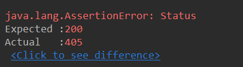

- 显然：405代表请求的方式不一致，符合我们的预期

- 写一个删除的api

- ```java
   /*创建用户删除的api*/
      @DeleteMapping(path = "/{id:\\d+}")
      public void DeleteUser(@PathVariable String id,) {
          
          System.out.println(id);
      }
  ```

  - 测试用例的结果返回200，并且输出id1
  - 


## Restful API错误处理

1. Spring boot中默认的错误处理机制
2. 自定义异常处理

###### Spring boot中默认的错误处理机制

**例子**

- 先启动tomcat服务器

- 然后在浏览器访问一个不存在的页面，得到结果

- 

- spring boot的相应信息

- 

- 错误请求中的请求头

- 

- 为了方便模拟restful请求，可以在浏览器端使用rested插件

- 尝试使用rested插件，向spring boot发送请求

- 

- 当用rested访问一个不存在的页面的时候

- 

- 可以看到，spring boot会根据请求发送的主体不同，来相应返回不同的消息**

- > 如果是浏览器向服务器发送一个不存在的请求，spring boot就会返回一个html页面
  >
  > 而用app或者rested向服务器发送一个不存在请求，spring boot就会返回json数据
  >
  > > **那么spring boot是如何做到这一点的**

- spring boot默认错误处理原理

- 在package这个包下

- ```java
  package org.springframework.boot.autoconfigure.web;
  ```

- 

- 我们往下可以看到

- 

- 通过restlet插件访问spring boot
- 
  - request header的accept是一个*/*可以看到并没有明确的说明text/html
  - 所以用restlet这个插件访问springboot就会进入到BasicErrorController这个类的没有指明html的方法那里去,并且返回一个json的对象


- 先创建一个接收post请求的Controller类

- ```java
   @PostMapping
      public User createResult(@Valid @RequestBody User user) {
          System.out.println(user.getId());
          System.out.println(user.getPassword());
          System.out.println(user.getBirthday());
          System.out.println(user.getUsername());
          return user;
      }
  ```

- 然后我们利用插件对这个api放松post请求

- 并且发送一个对于api本身的约束来说不正确的json格式,因为我们使用Post注解和自己创建的注解,对User实体类注入的值进行了约束

- 

- 发送后接收到的返回结果


- 这是spring boot默认对400异常情况的处理


- 在Controller编写一个接收get请求的方法,当访问这个api的时候抛出异常信息

- ```java
   @GetMapping(path = "/{id:\\d+}")
      public User getInfo(@PathVariable(value = "id") String xsid) {
          throw new RuntimeException("user not exit");
      }
  ```

- 然后通过浏览器对这个api进行防访问

- 

- 用restlet插件访问这个api
- 


###### 自定义异常处理

**基于状态码来处理**

比如当访问我们的服务器的页面不存在的时候,我们就让用户跳转到我们的404页面

- 流程
- 先resources资源目录下再创建一个resources目录,里边创建一个error文件夹,设置一个404的html页面,具体目录分支
- 


- 

- 然后我们重启服务器,通过浏览器访问一个不存在的页面,浏览器机会自动跳转到404.html页面

- 

- 通过插件访问就会返回404状态吗

- 

- 新建一个500的html页面,当服务器内部错误的时候跳转到该页面

- 

    

- 用浏览器访问上面的api,这个api当被请求的时候会自动抛出服务器异常

- 

- 浏览器返回错误500的页面

- 

- 使用restlet插件访问会抛出自定义的错误信息

- **使用restlet这个插件给api发送请求相当于app给api发送请求**

- 但是返回的异常信息都是相对简单的,我们怎么让可以自定义一些有意义的信息呢

- 我们先编写一个异常类

- 

- 编写代码

- ```java
  package com.chenlifan.exception;
  
  
  /*这个是自己定义的一个异常
   * */
  public class UserNotExistException extends RuntimeException {
  
  
      private static final long serialVersionUID = -6462529876957425911L;
      /*
      * 这个的作用是，当用户不存在的时候，返回信息告诉我们是哪个用户不存在
      * 将这个id存在这个异常里面然后抛出去
      * */
      private String id;
  
      /*给这个类编写一个构造函数*/
      public UserNotExistException(String id) {
          super("user not exist");
          this.id = id;
  
      }
  
      public String getId() {
          return id;
      }
  
      public void setId(String id) {
          this.id = id;
      }
  }
  
  ```

- 稍微修改一下接收get请求的api

- ```java
  @JsonView(User.UserDetailView.class)
      /*@RequestMapping(path = "/user/{id:\\d+}", method = RequestMethod.GET)*/
      @GetMapping(path = "/{id:\\d+}")
      public User getInfo(@PathVariable(value = "id") String xsid) {
          throw new UserNotExistException(xsid);
      }
  ```

- 然后通过插件restlet去访问这个api

- 

- 依然返回这样的一个结果,和上面的差别不大

- **没有获取到id的信息**

- 我们新创建一个类用来处理其他Controller抛出的异常信息

- ```java
  package com.chenlifan.controller;
  
  import com.chenlifan.exception.UserNotExistException;
  import org.springframework.http.HttpStatus;
  import org.springframework.web.bind.annotation.ControllerAdvice;
  import org.springframework.web.bind.annotation.ExceptionHandler;
  import org.springframework.web.bind.annotation.ResponseBody;
  import org.springframework.web.bind.annotation.ResponseStatus;
  
  import java.util.HashMap;
  import java.util.Map;
  
  @ControllerAdvice
  /*这个类使用来处理其他的控制器跑出来的异常的，本身并不负责处理http请求*/
  public class ControllerExceptionHandler {
      /*
       * 任何控制器的api抛出  throw new UserNotExistException(xsid);的时候，都会转到这个方法下面去
       * */
      @ExceptionHandler(UserNotExistException.class)
      /*
       * 然后这个方法可以拿到抛出来的异常信息
       * */
      @ResponseBody
      /*返回http状态吗
      * */
      @ResponseStatus(HttpStatus.INTERNAL_SERVER_ERROR)
      public Map<String, Object> handleUserNotExistException(UserNotExistException e) {
          Map<String, Object> result = new HashMap<>();
          result.put("id", e.getId());
          result.put("message", e.getMessage());
          return result;
      }
  }
  
  ```

- 然后我们重启服务器 ,然后通过restlet访问Controller的api

- 这个是被访问的api

- ```java
    @JsonView(User.UserDetailView.class)
      /*@RequestMapping(path = "/user/{id:\\d+}", method = RequestMethod.GET)*/
      @GetMapping(path = "/{id:\\d+}")
      public User getInfo(@PathVariable(value = "id") String xsid) {
          throw new UserNotExistException(xsid);       
      }
  ```

- 可以看到输出的结果

- 

- 输入了我们自定义的异常的信息,获取了我们注入的id

  


## 用切片拦截rest服务

- Restful api拦截

> - 过滤器(Filter)
> - 拦截器(Interceptor)
> - 切片(Aspect)

**用来处理所有服务的处理时间**

######  过滤器（filter）

- 我们先创建一个过滤器，和改写一下接收get请求的api

- Controller的api

- ```java
  @JsonView(User.UserDetailView.class)
      /*@RequestMapping(path = "/user/{id:\\d+}", method = RequestMethod.GET)*/
      @GetMapping(path = "/{id:\\d+}")
      public User getInfo(@PathVariable(value = "id") String xsid) {
         /* throw new UserNotExistException(xsid);*/
          System.out.println("进入getInfo服务");
          User user = new User();
          user.setUsername("chenlifan");
          return user;
      }
  
  ```

- ```java
  package com.chenlifan.web.filter;
  
  import org.springframework.stereotype.Component;
  
  import javax.servlet.*;
  import java.io.IOException;
  import java.util.Date;
  
  /**
   * @ Author     ：konglongzai
   * @ Date       ：Created in 17:22 2019/8/14
   * @ Description：konglongzai
   */
  
  @Component
  public class TimeFilter implements Filter {
  
      @Override
      public void init(FilterConfig filterConfig) throws ServletException {
          System.out.println("time filter init");
      }
  
      @Override
      public void doFilter(ServletRequest servletRequest, ServletResponse servletResponse, FilterChain filterChain) throws IOException, ServletException {
          System.out.println("time filter start");
          /*获取开始的时间*/
          long start = new Date().getTime();
          filterChain.doFilter(servletRequest, servletResponse);
          /*输出filter结束的时间*/
          System.out.println("time filter 耗时:"+ (new Date().getTime()-start));
          System.out.println("time filter finish");
  
      }
  
      @Override
      public void destroy() {
          System.out.println("time filter destory");
      }
  }
  
  ```

- 

- 


- 


- **上边是我们自己写的过滤器**
- 但是当我们使用第三方的过滤器框架的时候，它没有在过滤器这个类上边声明@Component这个注解，这时候我们怎样把过滤器加载紧spring boot里边来呢

- 演示不用Component注解，将过滤器添加到项目中

- 说白了就是不通过配置文件和注释，通过类的方式创建一个对象

- ```java
  package com.chenlifan.web.config;
  
  import com.chenlifan.web.filter.TimeFilter;
  import org.springframework.boot.web.servlet.FilterRegistrationBean;
  import org.springframework.context.annotation.Bean;
  import org.springframework.context.annotation.Configuration;
  
  import java.util.ArrayList;
  import java.util.List;
  
  @Configuration
  public class WebConfig {
  
      /*将过滤器配置到spring boot中
       * */
      @Bean
      public FilterRegistrationBean timeFilter() {
          /*创建一个filter的容器*/
          FilterRegistrationBean filterRegistrationBean = new FilterRegistrationBean();
          /*创建自己编写的过滤器对象*/
          TimeFilter timeFilter = new TimeFilter();
          /*将filter添加到这个配置容器中*/
          filterRegistrationBean.setFilter(timeFilter);
          List<String> urls = new ArrayList<>();
          /*将过滤器扫描的路径添加到list中*/
          urls.add("/*");
          /*将路径的集合添加到过滤器中*/
          filterRegistrationBean.setUrlPatterns(urls);
  
          return filterRegistrationBean;
      }
  }
  
  ```

- 再次访问和上面的结果一模一样

- 


###### 拦截器(Interceptor)

- 但是我们并不知道我们的请求是被哪个api处理的，如果我们需要知道这些信息的话，我们需要设置连接器
- 这个拦截器是spring框架本身提供的

**流程**

- 先	创建一个interceptor的包和类
- 

- ```java
  package com.chenlifan.web.Interceptor;
  
  import org.springframework.stereotype.Component;
  import org.springframework.web.method.HandlerMethod;
  import org.springframework.web.servlet.HandlerInterceptor;
  import org.springframework.web.servlet.ModelAndView;
  
  import javax.servlet.http.HttpServletRequest;
  import javax.servlet.http.HttpServletResponse;
  import java.util.Date;
  /*声明为spring组件*/
  @Component
  public class TimeInterceptor implements HandlerInterceptor {
      /*
       * 这个方法是在每一个Controller的api被调用前被调用
       * */
      /*Object o这个是用来处理当前请求的那个控制器的那个方法的声明*/
      @Override
      public boolean preHandle(HttpServletRequest httpServletRequest, HttpServletResponse httpServletResponse, Object o) throws Exception {
          System.out.println("preHandle");
          /*查看当前被请求访问的方法的bean和类的名字*/
          System.out.println(((HandlerMethod) o).getBean().getClass().getName());
          /*输出被请求调用的方法的名字*/
          System.out.println(((HandlerMethod) o).getMethod().getName());
          httpServletRequest.setAttribute("startTime", new Date().getTime());
          /*这个返回值代表请求能否调用要请求的api
          * true可以调用，false不能调用
          * */
          return false;
      }
  
      /*
       * 这个方法是在每一个Controller的api被调用后被调用
       * 如果控制器的api抛出了异常，那么这个方法就不会被调用
       * */
      @Override
      public void postHandle(HttpServletRequest httpServletRequest, HttpServletResponse httpServletResponse, Object o, ModelAndView modelAndView) throws Exception {
          System.out.println("postHandle");
          /*获取preHandle创建的时间*/
          Long start = (Long) httpServletRequest.getAttribute("starTime");
          System.out.println("time interceptor 耗时：" + (new Date().getTime() - start));
      }
  
      /*
       * 不管被访问的controller的方法被正常调用还是异常，这个方法都会被调用
       * Exception e当被调用的方法是成功的没有异常的，这个Exception对象是null的
       * */
      @Override
      public void afterCompletion(HttpServletRequest httpServletRequest, HttpServletResponse httpServletResponse, Object o, Exception e) throws Exception {
          System.out.println("afterCompletion");
          Long start = (Long) httpServletRequest.getAttribute("starTime");
          System.out.println("time interceptor 耗时：" + (new Date().getTime() - start));
          /*输出被调用方法的异常，没有异常时为空*/
          System.out.println("Exception：" + e);
      }
  }
  
  ```

- 然后，我们要把interceptor注册进我们的容器中

- 在config类下进行注册，

- 这个config需要继承WebMvcConfigurerAdapter这样的父类和重写这个父类的注册器的方法来将我们编写的Interceptor注册进我们的容器中

- ```java
   /*将我们自己创建的Interceptor注入进来*/
      @Autowired
      private TimeInterceptor timeInterceptor;
    
      /*
       * 重写父类的方法
       * 这个方法是拦截器的注册器
       * */
      @Override
      public void addInterceptors(InterceptorRegistry registry) {
          /*
           * 将我们的Interceptor注册进我们的spring容器中
           * */
          registry.addInterceptor(timeInterceptor);
      }
  ```

- 好了，我们重启spring boot，然后随访问一个api

- 注意，第一次访问我们先把我们的Interceptor的preHandle这个方法的返回值设置为false

- 

- 因为preHandle方法的返回值设置为false，所以请求在访问controller的api之前调用了preHandle，并且拒绝了请求调用controller中的api
- **这次我们设置preHandle的返回值为true**
- 然后再次访问

- 

- 如果请求出现异常怎么样

- 将我们访问的api抛出一个异常
- 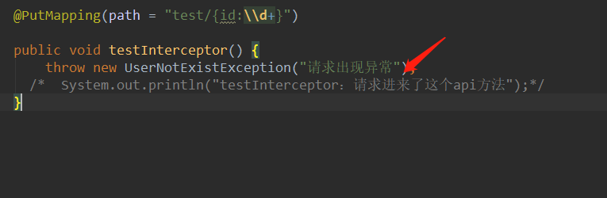

- 访问一下看看

- 

- 抛出了500
- 

- 但是我们的拦截器并没有获取到异常
- 这是因为这个异常被我之前编写的控制器错误管理器提前捕获到了
- 

- 所以拦截器获的afterCompletion获取不到
- 所以我们修改一下控制器的异常处理，这个RunTimeException没有被我写的异常预处理声明

- 

- 再重新请求一次
- 

- 可以看到没有访问到postHandle然后afterCompletion方法获取到了异常


###### 切片（Aspect）

- 通过上面的演示，其实实际上拦截器的preHandle方法的Object o是无法获取请求访问api中请求的id 或者user对象中属性的值的，为什么会这样呢
- 因为我们参数封装到Controller的api是靠handle方法来调用的
- 
- 而这个是在调用preHandle方法之后的
- 这个时候就需要用到Aspect切片，aop面向切片编程
- 在使用切片的时候我们需要了解一下知识点
- 
- 现在开始写一个切片
- 详细的关于切片的配置可以去spring的官方文档查看
- 
- 先创建一个aspect的包和类
- 

- 编写aspect

- ```java
  package com.chenlifan.web.aspect;
  
  import org.aspectj.lang.ProceedingJoinPoint;
  import org.aspectj.lang.annotation.Around;
  import org.aspectj.lang.annotation.Aspect;
  import org.aspectj.lang.annotation.Before;
  import org.springframework.stereotype.Component;
  
  import java.util.Date;
  
  /*声明为切片*/
  @Aspect
  /*使切片成为我容器的一部分*/
  @Component
  public class TimeAspect {
  
      /*
       * 定义切入点要定义两个东西
       * 1.在哪些方法上起作用
       * 2.在什么时候起作用——这个是使用的注解来决定的
       * */
      /*@Before()——这个注解相当于我们之前写的拦截器的preHandle
       *是在增强的方法执行之前执行的
       * @After——是增强的方法执行之后执行
       * @AfterThrow——增强的方法抛出某个异常之后被调用
       * @Around——相当于上面3个注解的集大成者，一般直接用这个注解
       */
  
      /*括号里面的意思是execution拦截括号里面的类
       *  第一个*代表方法的返回值都可以的意思
       * *(..)代表UserController里面任何的一个方法；..代表里面方法的任何参数
       */
      @Around("execution(* com.chenlifan.controller.UserControllerDemo.*(..))")
      /*
       * ProceedingJoinPoint proceedingJoinPoint——这个对象代表我们当前拦截住的那些方法的对象，相当于拦截器的Handle
       * */
      /*
       * 这个方法代表增强
       * */
      public Object handleControllerMethod(ProceedingJoinPoint proceedingJoinPoint) throws Throwable {
          System.out.println("time aspect start");
          /*
           * 这个方法相当于filter的dochain()方法，让我么可以执行被这个Aspect拦截的控制器中的方法
           * 这个方法会返回一个Object
           * */
          /*
           * 然后我们测试一个这个aspect的耗时
           * */
          /*
           * 为什么要写切片，因为在Interceptor中我们是无法从Handler获取方法的参数的，
           * 而在切片里面，我们可以通过 ProceedingJoinPoint对象获取，
           * 我们把这个参数打印出来看一下
           * */
          Object[] args = proceedingJoinPoint.getArgs();
          for (Object arg : args) {
              System.out.println("args is :" + arg);
          }
          Long timeStart = new Date().getTime();
          Object o = proceedingJoinPoint.proceed();
          System.out.println("消耗的时间：" + (new Date().getTime() - timeStart));
          System.out.println("time aspect end");
          /*这个方法的返回值是你要增强的方法的返回值，比如你增强的方法的返回值时String，那么这个方法的返回值就是String*/
          return o;
      }
  }
  
  ```

- 然后在浏览器访问user 的controller下面任意的一个api返回200

- 在控制台获得结果

- 

###### 总结一波

1. filter可以拿到原始的htpp的请求和响应对象，但是拿不到处理请求的方法的信息

2. Interceptor不紧能拿到原始的http的请求和响应对象，也能拿到处理请求的方法的信息，但是拿不到被调用的时候那个参数的值

3. Aspect可以拿到被调用的方法的参数的值，但是拿不到htpp的请求和响应的对象

   >所以三个拦截处理各有千秋，按需选取
   >
   >按照先执行顺序：**filter>interceptor>ControllerAdivce>aspect>controller**
   >
   > 

   > > 最先捕获到异常的顺序：从**controller抛出异常——>aspect——>ControllerAdvice——>Interceptor——>filter**
   > >
   > > 当然捕获到异常需要每一层都网上抛，如果某一层处理了异常，后面的就无法捕获到
   > >
   > > 如果异常抛到filter也没有处理，那么这个异常就会返回给用户了


## 使用rest方式处理文件服务

1. 文件的上传
2. 文件的下载

**大多数的文件上传都是用异步来完成的**

- 在实验流程中，我们通过测试用例来伪造一个文件，进行文件上传操作

- 首先编写测试用例

- ```java
   /*
       * 伪造一个文件上传的请求的测试用例
       * */
      @Test
      public void whenUploadSuccess() throws Exception {
          /*伪造一个web环境，向file路径的Controller发送一个fileUpload文件上传的请求，这个请求为post请求
           * 和其他请求不一样的是，这次我们要模拟一个文件实体中的各种重要部分
           * "file"是我们放松文件这个值的键，就是名字
           * "test.txt"是我们发送的文件名
           * "multipart/form-data"这是以表单的数据传输
           * "hello upload"是文件里面的内容
           * getBytes("UTF-8")是指文件中的内容格式为utf-8
           * */
          String result = mockMvc.perform(MockMvcRequestBuilders.fileUpload("/file")
                  .file(new MockMultipartFile("file", "test.txt", "multipart/form-data", "hello upload".getBytes("UTF-8"))))
                  .andExpect(MockMvcResultMatchers.status().isOk())
                  /*
                   * 将返回的json打印出来
                   * */
                  .andReturn().getResponse().getContentAsString();
          System.out.println(result);
      }
  ```

- 创建一个新的Controller一个FileInfo获取文件信息

- 

- 各自的文件代码

- FileController

  ```java
  package com.chenlifan.controller;
  
  import com.chenlifan.pojo.FileInfo;
  import org.springframework.web.bind.annotation.PostMapping;
  import org.springframework.web.bind.annotation.RequestMapping;
  import org.springframework.web.bind.annotation.RestController;
  import org.springframework.web.multipart.MultipartFile;
  
  import java.io.File;
  import java.io.IOException;
  import java.util.Date;
  
  @RestController
  @RequestMapping(path = "file")
  public class FileController {
      /*
       * 因为fileUpload请求时post请求
       * 方法接收一个参数，这个参数的类型就时我们在测试用例中发送的匿名对象
       * MultipartFile file 这个file要和我们编写测试用例中定义的文件的值的名称要一致
       *
       * */
      @PostMapping
      public FileInfo upload(MultipartFile file) throws IOException {
          /*
          * 这个getName是传上来的时候参数的名字
          * */
          System.out.println(file.getName());
          //这个是原始的文件名
          System.out.println(file.getOriginalFilename());
          //这个是文件的大小
          System.out.println(file.getSize());
          //上传文件的路径，我设置为controller文件夹下
          String folder = "D:\\idea_project\\spring_security_structure_demo02\\security\\demo\\src\\main\\java\\com\\chenlifan\\controller";
          //创建文件的对象，文件名为创建的时候的时间戳
          File localFile = new File(folder, new Date().getTime() + ".txt");
          //传上来的文件写在本地的文件夹里
          file.transferTo(localFile);
          //获取文件的绝对路径，保存在FileInfo对象中
          return new FileInfo(localFile.getAbsolutePath());
      }
  
  }
  ```

- FileInfo代码

- ```java
  package com.chenlifan.pojo;
  
  public class FileInfo {
  
      private String path;
  
      public FileInfo(String path) {
          this.path = path;
      }
  
      public String getPath() {
          return path;
      }
  
      public void setPath(String path) {
          this.path = path;
      }
  }
  
  ```

- 运行测试用例

- 得到结果

- 

###### 文件的下载

- 我们一刚刚上传的文件名下载下来

- ```java
  @GetMapping(path = "/{id}")
      public void downLoad(@PathVariable String id, HttpServletRequest httpServletRequest, HttpServletResponse httpServletResponse) throws IOException {
          /*这个是我们要读取的文件
           * new File(folder, id + ".txt")——这个是我们根据id读取的文件
           * */
          /*
           * 在jdk7中，我们可以通过try用括号括住这些流，来每次使用完一次后关闭这些流，而不需要手动关闭，这是jdk7的新特性，可以用来简化代码
           * */
  
          try (
                  InputStream inputStream = new FileInputStream(new File(folder, id + ".txt"));
                  /*输出流，下载文件的时候写出去的那个流*/
                  OutputStream outputStream = httpServletResponse.getOutputStream();
  
          ) {
              /*
               * 这个是下载用的
               * */
              httpServletResponse.setContentType("application/x-d0wnload");
              /*
               * "attachment;filename=test.txt"——这一段是声明下载完成后文件的名字，
               * 虽然我们可以通过文件名称来下载，也可以在下载后自定义文件名称
               * */
              httpServletResponse.addHeader("Content-Dispositoin", "attachment;filename=test.txt");
              /*
              * 这个api的意思是将文件的inputstream中的内容copy到输出流去
              * */
              IOUtils.copy(inputStream,outputStream);
              outputStream.flush();
             
          }
      }
  ```

- 通过浏览器下载

- 


- 最终打开获得文件
- 


## 使用多线程提高rest服务性能

**异步处理rest服务**

1. 使用Runnable异步处理rest服务
2. 使用DeferredResult异步处理Rest服务
3. 异步处理配置

> 一个http进来，那么tomcat就会有一个线程去处理这个请求，但是tomcat管理的这个线程是有限的，数量达到一定的限度之后，因为所有线程再工作，再有请求进来 就无法处理了，所谓的异步处理就是http请求进来的时候，tomcat会调起这个副线程来处理这个请求，当副线程完成这个工作之后，再让主线程返回这个请求


###### 使用Runnable异步处理rest服务


- 先演示一个简单的流程，先创建处理异步请求的Controller及其api

- ```java
  package com.chenlifan.controller;
  
  
  
  import org.slf4j.Logger;
  import org.slf4j.LoggerFactory;
  import org.springframework.web.bind.annotation.RequestMapping;
  import org.springframework.web.bind.annotation.RestController;
  
  
  /**
   * @ Author     ：konglongzai
   * @ Date       ：Created in 2019/8/15
   */
  @RestController
  public class AsyncController {
      /*通过Logger来打印线程信息*/
      private Logger logger = LoggerFactory.getLogger(getClass());
  
      @RequestMapping(path = "/order")
      public String order() throws InterruptedException {
          logger.info("主线程开始");
          /*
           * 1秒的延迟来模拟下单的处理时间
           * */
          Thread.sleep(1000);
          logger.info("主线程结束");
          return "success";
      }
  }
  
  ```

- 然后我们通过浏览器来访问这个api

- 得到结果

- 

- 可以看到两个日志之间的输出间隔为1000毫秒

- 而且这个线程的日志信息是由8081端口的服务器输出的

- 我们通过Callable来单开一个线程作为副线程

- ```java
  /*通过Logger来打印线程信息*/
      private Logger logger = LoggerFactory.getLogger(getClass());
  
      @RequestMapping(path = "/order")
      /*我们用callable来处理异步的请求，返回String
       * */
      public Callable<String> order() throws InterruptedException {
          logger.info("主线程开始");
          /*
           * 这个Callable实际上是单开一个线程
           * */
          Callable<String> stringCallable = new Callable<String>() {
  
              @Override
              public String call() throws Exception {
                  logger.info("副线程开始");
                  Thread.sleep(1000);
                  logger.info("副线程返回");
                  return "success";
              }
          };
  
          /*
           * 1秒的延迟来模拟下单的处理时间
           * */
          /*Thread.sleep(1000);*/
          logger.info("主线程返回");
          return stringCallable;
      }
  ```

- 然后通过浏览器来访问这个api

- 

- 可以看到一秒就返回结果
- 

- 可以看到主线程的日志是8081服务器打印出来的
- 而副线程的日志是MvcAsync打印出来的，可以看出副线程是完全不一样的线程
- 而且从主线程到副线程的过度时间几乎是忽略不计的，当主线程接收请求之后就把请求交给副线程来处理，然后主线程继续处理其他请求，这样可以大大的提高吞吐量。


###### 使用DeferredResult异步处理Rest服务

**因为runable并不能满足所有情况下的请求，runable的副线程必须是主线程来调起的，在实际代码中副线程的代码是写在主线程里面的**

- 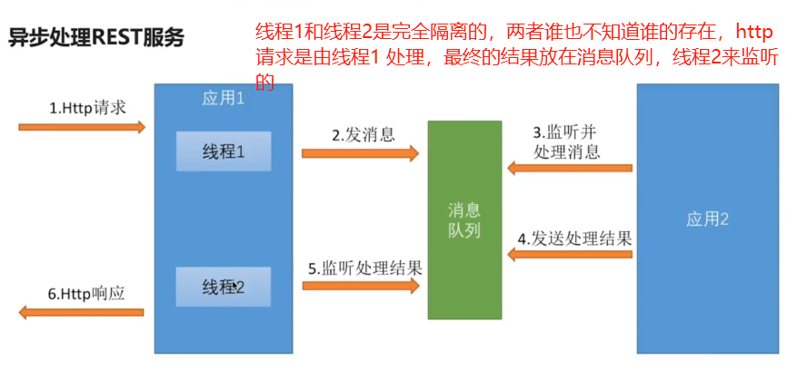

- 下面用DeferredResult来演示这样的一个结果

- 第一步，我们先创建一个对象来模拟消息队列

  > 1. **这个消息队列的原理**是通过获取到订单号,然后输出订单号在控制台，然后通过Tread.sleep(1000)这样的时间间隔来模拟这样的一个处理过程，然后在控制台输出下单请求处理完毕
  >
  > 2. **应用线程1的原理**：就是我的controller就收请求的主线程
  >
  > 3. **线程2**是监听器监听订单完成的消息，会把结果返回回去
  >
  > 4. **DeferredResultHoler**是在线程1和线程2 之间传递DeferredResult对象
  >
  >    线程1通过DeferredResult来和线程2进行交互，线程1 返回DeferredResult对象给线程2

- 这个服务的流程

- 模拟一个消息队列，和应用2，为了简便，我们将这两个模块整合在一起

- ```java
  package com.chenlifan.web.async;
  
  import org.slf4j.Logger;
  import org.slf4j.LoggerFactory;
  import org.springframework.stereotype.Component;
  
  /*这个是模拟的消息队列*/
  @Component
  public class MockQueue {
      /*一个代表下单的消息*/
      private String placeOrder;
      /*一个代表订单完成的消息*/
      private String completeOrder;
      /*用来输出线程的日志信息*/
      private Logger logger = LoggerFactory.getLogger(getClass());
  
      public String getPlaceOrder() {
          return placeOrder;
      }
  
      public void setPlaceOrder(String placeOrder) {
          /*
           * 按照正确的逻辑来说，下面的逻辑应该是由应用二来处理的，我们只是将应用二和消息队列整合在了一起，
           * 所以单开一个线程来处理下单的这样一个逻辑
           * */
          new Thread(() -> {
              logger.info("接到下单请求" + placeOrder);
              try {
                  /*这个是处理下单的过程*/
                  Thread.sleep(1000);
              } catch (InterruptedException e) {
                  e.printStackTrace();
              }
              this.completeOrder = placeOrder;
              logger.info("下单请求处理完毕" + placeOrder);
          }).start();
      }
  
      public String getCompleteOrder() {
          return completeOrder;
      }
  
      public void setCompleteOrder(String completeOrder) {
          this.completeOrder = completeOrder;
      }
  }
  
  ```

- 创建一个对象用来封装一个map对象，用来线程1和线程2 的通信

- ```java
  package com.chenlifan.web.async;
  
  import org.springframework.stereotype.Component;
  import org.springframework.web.context.request.async.DeferredResult;
  
  import java.util.HashMap;
  import java.util.Map;
  
  @Component
  public class DeferredResultHolder {
      /*DeferredResult是把信息以String返回到前台
       * map 的key就是String可以理解为订单号，每一个订单号对应订单的处理结果
       * */
      private Map<String, DeferredResult<String>> map = new HashMap<String, DeferredResult<String>>();
  
      public Map<String, DeferredResult<String>> getMap() {
          return map;
      }
  
      public void setMap(Map<String, DeferredResult<String>> map) {
          this.map = map;
      }
  }
  
  ```

- 创建线程2，相当于一个监听器，实现ApplicationListener<ContextRefreshedEvent>接口，用来监听消息队列中的completeOrder的值是否为空，如果不为空，则将DeferredResult返回给用户

- ```java
  package com.chenlifan.web.async;
  
  import org.apache.commons.lang.StringUtils;
  import org.slf4j.Logger;
  import org.slf4j.LoggerFactory;
  import org.springframework.beans.factory.annotation.Autowired;
  import org.springframework.context.ApplicationListener;
  import org.springframework.context.event.ContextRefreshedEvent;
  import org.springframework.stereotype.Component;
  
  /*
   * 线程2监听消息队列
   * */
  @Component
  public class QueueListener implements ApplicationListener<ContextRefreshedEvent> {
  
      @Autowired
      private MockQueue mockQueue;
  
      @Autowired
      private DeferredResultHolder deferredResultHolder;
  
      private Logger logger = LoggerFactory.getLogger(getClass());
  
      /*
       * 这个事件相当于整个系统启动的时候要做的事情
       * */
      @Override
      public void onApplicationEvent(ContextRefreshedEvent contextRefreshedEvent) {
          /*
           * 给这个循环单开一个线程，防止系统阻塞
           * */
          new Thread(() -> {
              while (true) {
                  /*当队列中订单完成的属性有值之后，证明监听器监听到这个CompleteOrder中的值，代表订单执行完成就返回true，下面的逻辑向用户返回结果*/
                  if (StringUtils.isNotEmpty(mockQueue.getCompleteOrder())) {
                      /*这个是我们完成的订单号*/
                      String orderNumber = mockQueue.getCompleteOrder();
                      logger.info("返回订单处理结果：" + orderNumber);
                      /*通过订单号拿到我们的DeferredResult这个对象，然后通过setResutl来告诉浏览器订单完成了
                       * */
                      deferredResultHolder.getMap().get(orderNumber).setResult("place order succcess");
                      /*
                       * 因为不是真正都消息队列，所以我们把CompleteOrder这个值设置为null来停止逻辑处理
                       * */
                      mockQueue.setCompleteOrder(null);
                  } else {
                      /*
                       * 值为null则暂停一秒后再次执行循环
                       * */
                      try {
                          Thread.sleep(1000);
                      } catch (InterruptedException e) {
                          e.printStackTrace();
                      }
                  }
              }
  
          }).start();
      }
  }
  
  ```

- 创建主线程，其实就是Controller中的接收用户请求的api，返回通过返回这个map对象，这个对象的value为DeferredResult对象，key 为订单号

- ```java
   @Autowired
      private MockQueue mockQueue;
    
      @Autowired
      private DeferredResultHolder deferredResultHolder;
   ```


      /*通过Logger来打印线程信息*/
      private Logger logger = LoggerFactory.getLogger(getClass());
      
      @RequestMapping(path = "/order")
      /*我们用callable来处理异步的请求，返回String
       * */
      public DeferredResult<String> order() {
          logger.info("主线程开始");
      
          /*生成一个随机的订单号*/
          String orderNumber = RandomStringUtils.randomNumeric(8);
          /*将订单号放进消息队列，模拟一个下单请求*/
          mockQueue.setPlaceOrder(orderNumber);
      
          DeferredResult<String> stringDeferredResult = new DeferredResult<>();
          /*将订单号作为key,DeferredResult作为value放进放进map里面*/
          deferredResultHolder.getMap().put(orderNumber, stringDeferredResult);
      
          /*
           * 这个Callable实际上是单开一个线程
           * */
         /* Callable<String> stringCallable = new Callable<String>() {
      
              @Override
              public String call() throws Exception {
                  logger.info("副线程开始");
                  Thread.sleep(1000);
                  logger.info("副线程返回");
                  return "success";
              }
          };*/
      
          /*
           * 1秒的延迟来模拟下单的处理时间
           * */
          /*Thread.sleep(1000);*/
          logger.info("主线程返回");
          /*
           * 返回这个map对象，这个对象的value为DeferredResult对象
           * */
          return stringDeferredResult;
      }
  ```

- 控制台输出的结果
- 

- 这3个线程之间是完全独立的，只能通过消息 队列来完成通信
- 因为主线程Controller获取到了用户的请求的时候，创建了DeferredResult这个对象来与线程二监听器来通信，相当于线程1Controller只负责处理用户的请求，生成订单号将订单号返回发送给线程2，线程二通过订单号来监听订单的处理状态，处理完成则返回浏览器告诉用户订单处理完成
- 


###### 异步处理配置

  课程没有详细讲，只简单的讲了4个方法


## 使用Swagger自动生成文档

**前后端分离**：前后端开发工作是并行的

1. 使用Swagger工具自动生成前端的环境（生成html文档）

> 如果我们自己写前端的话，就需要自己维护前端的代码和后端的代码向匹配，而swagger可以根据我们后端的代码自动生成前端的代码，每次后端代码发生变化，我们不需要去维护前端的代码

2. 使用WireMock快速伪造Restful服务


###### 使用Swagger工具自动生成前端的环境

**开发准备**

- 导入swagger的依赖

- ```xml
  <!-- https://mvnrepository.com/artifact/io.springfox/springfox-swagger2 -->
          <dependency>
              <groupId>io.springfox</groupId>
              <artifactId>springfox-swagger2</artifactId>
              <version>2.8.0</version>
          </dependency>
          <!-- https://mvnrepository.com/artifact/io.springfox/springfox-swagger-ui -->
          <dependency>
              <groupId>io.springfox</groupId>
              <artifactId>springfox-swagger-ui</artifactId>
              <version>2.8.0</version>
          </dependency>
  ```

- 然后在我们的application的头部添加Swagger的注解

- 

- 重启一下springboot
- 然后我们通过浏览器来访问swagger
- 

- 但是有一些属性的name是需要一些描述信息来描述来提高可读性的，那么我们可以通过注解的方式来添加描述信息
- 

- 在controller方法上声明一个注解
- 

- 

- 那么我们如何来通过注解描述参数呢

- **有两种情况**

- > 1. 第一种是参数的封装在参数javabean里面的
  >
  >    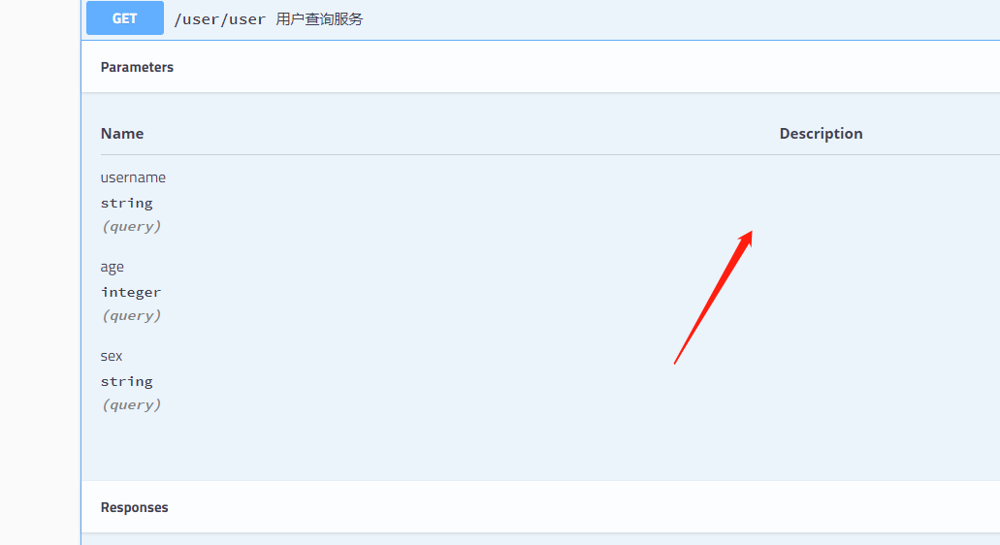
  >
  > 通过注解来添加描述
  >
  > 
  >
  > 再次查看
  >
  > 
  >
  > 2. 第二种的是基本类型 

  > 

> 通过注解修改
>
> 

> 查看结果
>
> 

###### 使用WireMock快速伪造Restful服务


- 因为前端会有很多种端，假如前端有ios，Android、网页我们就要写三种rest服务来适配，或者前端自己写参数来适配我们的rest服务，这其实都是很累赘的，相当于做了三件事，实际上只完成了一样东西
- **wireMock相当于一个独立的服务器**

- 前端开发好后只需要在wiremock进行测试
- **实际演示一下**
- 首先在wiremock下载
- 然后进入dos命令行进入下载wire mock的文件夹启动wiremock
- 输出java -jar wiremock-standalone-2.24.1.jar --port 9999 （后面要自定义端口号）
- 

- 这样就相当于wiremock服务启动成功了

- 现在我们要做的就是编写代码，告诉wiremock当得到什么请求的时候给出什么样的响应

- 首先要导入wiremock的依赖

- ```xml
  <dependency>
              <groupId>com.github.tomakehurst</groupId>
              <artifactId>wiremock</artifactId>
          </dependency>
  ```

- 然后创建一个MockServer的类

- 

- ```java
  package com.chenlifan.wireMock;
  
  import com.github.tomakehurst.wiremock.client.WireMock;
  import org.apache.http.impl.conn.Wire;
  
  /**
   * 这个类用来告诉wiremock服务器处理什么请求，返回什么值
   *
   * @ Author     ：konglongzai
   * @ Date       ：Created in 2019/8/16
   */
  
  public class MockServer {
      public static void main(String[] args) {
          /*与wiremock服务器的端口相匹配*/
          WireMock.configureFor(8082);
          /*每次执行清空以前的配置
           * 因为随着开发越来越多的东西，可能会有很多配置，所以重新把最新的配置配置一次
           * */
          WireMock.removeAllMappings();
          /*告诉服务器如何处理请求
           *WireMock.stubFor——伪造一个测试桩
           *WireMock.urlPathEqualTo——严格匹配完全相等的url
           *WireMock.urlPathMatching()_这个是自己写一个正则表达式匹配
           * 因为我们写的是rest服务，所以我们要告诉wiremock我们是get请求还是post请求
           * willReturn()告诉服务器应该返回什么
           * 返回一个response，这个响应是一个json的这样一个响应体，状态码为200
           * */
          WireMock.stubFor(WireMock.get(WireMock.urlPathEqualTo("/order/1")).willReturn(WireMock.aResponse().withBody("{\"id\":\"1\"}").withStatus(200)));
  
      }
  }
  
  ```

- 执行一下main方法
- 控制台输出
- 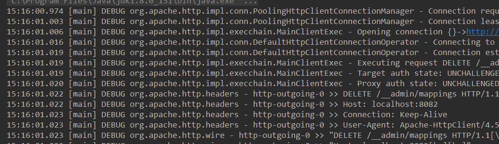

- 没有报错，然后我们通过浏览器来访问
- 

- 浏览器输出了我们定义的响应

****

- 上面mian方法的代码有点累赘，我们重构一下
- 在resources目录下新建文件夹
- 并编写json内容
- 

- 

- 然后获取文件的路径并将内容转化为字符串，然后和模拟rest服务的方法一起封装成一个mock方法

- ```java
   private static void mock(String url, String file) throws IOException {
          /*读取文件的路径，将文件的内容转化为string
           * */
          ClassPathResource classPathResource = new ClassPathResource("mock/response/" + file + ".txt");
          String content = StringUtils.join(FileUtils.readLines(classPathResource.getFile(), "UTF-8").toArray(), "\n");
    
          /*告诉服务器如何处理请求
           *WireMock.stubFor——伪造一个测试桩
           *WireMock.urlPathEqualTo——严格匹配完全相等的url
           *WireMock.urlPathMatching()_这个是自己写一个正则表达式匹配
           * 因为我们写的是rest服务，所以我们要告诉wiremock我们是get请求还是post请求
           * willReturn()告诉服务器应该返回什么
           * 返回一个response，这个响应是一个json的这样一个响应体，状态码为200
           * */
          WireMock.stubFor(WireMock.get(WireMock.urlPathEqualTo(url)).willReturn(WireMock.aResponse().withBody(content).withStatus(200)));
      }
  ```

- 只需要传入文件命和请求路径

- ```java
   mock("/order/1", "demo");
  ```

- 后面如果我们需要模拟rest请求，只需要不断调用mock这个静态方法，然后在resources下添加返回的json的内容的文件夹就可以了

- 如

- ```java
   public static void main(String[] args) throws IOException {
          /*与wiremock服务器的端口相匹配*/
          WireMock.configureFor(8082);
          /*每次执行清空以前的配置
           * 因为随着开发越来越多的东西，可能会有很多配置，所以重新把最新的配置配置一次
           * */
          WireMock.removeAllMappings();
          mock("/order/1", "demo");
          mock("/user/1", "demo02");
      }
  ```

  

  


## 使用spring security开发基于表单的认证

**我们现在的服务都是没有被保护的状态**

> 所谓没保护就是任何人只要知道我文件路径，就都能访问进来
>
> 我们需要就用户进行授权，进行身份的认证，保证我们的服务只有合法的用户才能访问

**spring security的3个核心功能**

1. 认证（你是谁）——一般来说这是一个登陆的过程
2. 授权（你能干什么）——指定当前用户能干什么不能干什么
3. 攻击防护（防止伪造身份）——如果这步被攻破，上面的两个功能都没用了


**下面是开始的内容**

1. springsecurity的基本原理
2. 实现用户名+密码认证

> spring security对这种方式提供了内建的实现

3. 实现手机号+短信认证（这个功能需要自定义配合spring security框架使用）


###### spring security的基本原理

- 我们先在配置文件将spring security服务打开

- ```properties
  #在不使用security的时候先关闭该功能
  security.basic.enabled=true
  ```

- 然后我们重启服务器，然后在浏览器访问一下我们Controller中的api

- 然后就会弹出一个对话框要求我们输入用户名和密码

-  

- 在我们启动spring boot容器的时候输出框会输出一串password，而用户名的默认值为user

- 

- 


- 然后就返回json
- 可以看到，在默认的情况下，我们不做任何的保护，spring security默认把我们访问的所有资源都保护起来了
- 任何一个rest服务都要先进行身份认证，
- **但我一般来说我们不能这样进行安全认证的，那么问题来了，我们怎样覆盖掉spring security的这个身份认证去读取我们自己的配置，比如我们用表单登陆来覆盖掉呢**
- 现在我们要开始在browser这个包下面开始写代码，demo只是我们进行实验的包
- 我们在browser下配置spring security
- 创建一个配置类
- 

- 这个配置类的代码

- ```java
  package com.chenlifan.browser;
  
  import org.springframework.context.annotation.Configuration;
  import org.springframework.security.config.annotation.web.builders.HttpSecurity;
  import org.springframework.security.config.annotation.web.configuration.WebSecurityConfigurerAdapter;
  
  /**
   * 创建一个web安全配置的适配器
   *
   * @ Author     ：konglongzai
   * @ Date       ：Created in 2019/8/16
   */
  @Configuration
  public class BrowserSecurityConfig extends WebSecurityConfigurerAdapter {
      /*
       * 我们想要表单去登陆
       * */
      @Override
      protected void configure(HttpSecurity http) throws Exception {
          /*这个是表单登陆的意思
           * 之前说了spring security有认证、授权、攻击防护
           * */
          /*这一步就是——认证*/
          http.formLogin()
                  /*
                   * 下面就是进行授权这一步
                   * and开始都是授权的配置
                   * */
                  .and()
                  /*对请求进行授权*/
                  .authorizeRequests()
                  //任何请求
                  .anyRequest()
                  //都需要身份认证
                  .authenticated();
      }
  }
  
  ```

- 然后我们启动demo项目下的application

- 通过浏览器访问demo项目的controller的api

- 

- 进入到这个表单认证的界面，通过url路径可以看到进入的是login界面
- 这时候像之前默认的spring security的认证一样输入密码和username
- 就会跳转到
- 

- 我们输入的api的url并返回json参数

- 如果我们要回之前默认的spring security的登陆认证我们要怎么写呢，我们只需要把http.formLogin()改为httpBasic()就可以了
- 

- spring security本身就是一个过滤器


- 上面绿色的过滤器是最核心的，用来**验证用户的身份**，每一个过滤器处理一种认证方式，如上显示

- 上面的过滤器会判断请求是否有用户名密码，是否是基本的请求方式，
- 

- 橙色的是我们过滤器的最后一步，是在我们的controller之前的最后一步，

- 如果身份认证不符合要求，就会抛出异常

- 蓝色过滤器就是用来捕获橙色过滤器抛出来的异常，会根据抛出的异常来做相应的处理，比如我们橙色过滤器要求用户要表单登陆，用户进入到橙色过滤器的时候，没有进行表单登陆，就会抛出相应的异常，然后蓝色过滤器就会处理这个异常，将请求转到login登陆页面上

- 后边我们需要的什么微信认证和qq认证，都是通过添加绿色过滤器来实现的

- 所以绿色过滤器就是我们通过代码进行配置得，后面蓝色和橙色得过滤器我们是不能处理的

- **我们通过debug来了解spring security这样的一个原理**

- 我们现在4个位置来打断点，分别是

- > 第一个UsernamePasswordAuthenticationFilter这个 就是 做我们 的表单登陆的
  >
  > 第二个是蓝色的异常那个地方
  >
  > 第三个是最终的Filter Security Interceptor
  >
  > 第四个是我们在Controller写的api

- 在我们的服务打断点

- 

- 在橙色的filter打断点
- 

- 蓝色的filter
- 

- 

- 

- 然后我们以debug模式启动项目
- 

- 通过浏览器访问这个服务器，
- 

- 可以看到请求第一次进入的是FilterSecurityInterceptor这个类中，为什么呢，然后我们没有写登陆信息，前面的绿色的过滤器全部都不起作用
- 因为我们在配置spring security中要求任何请求都需要认证，所以在Invocation中就会抛出异常
- 

- 这个异常就会抛到ExceptionTranslationFilter中
- 

- 就是上面蓝色的图示让这个Filter捕获到这个异常
- 这个异常处理就相当于一个重定向，在debug模式中我们按F9直接跳到下一个断点，重定向到我们的登陆页面
- 

- 

- 获得用户名和密码就又会跳到我们**的/user/1的请求**中然后到我们最终橘色的Filter的这个过滤器中
- 

- 这次就没有抛出异常，再往下就跳到我们的接口中去
- 

- 

- 然后前台就获得信息


## 自定义用户认证逻辑

1. 处理用户信息获取逻辑
2. 处理用户校验逻辑
3. 处理密码加密解密

###### 处理用户信息获取逻辑（比如怎么从数据库把它读出来）

- 用户信息的获取逻辑在spring security中是被封装成一个接口的

> 这个接口叫做UserDetailsService，由spring这个项目提供的


> 可以看到这个接口只有一个方法，接收string这样的一个参数，返回UserDetails这样的一个对象
>
> 会抛出一个UsernameNotFoundException这样的一个异常，这个方法的作用，**根据前面用户输入的用户名，去读取用户信息，用户信息会被封装在UserDetails这样的一个接口的实现类中**

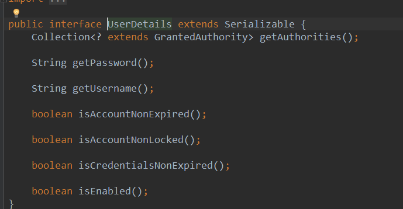

- 上面是接口
- 如果你输入的用户名通过了，那么就会保存在session里面
- 如果不通过，就会抛出UsernameNotFoundException异常，spring security捕获到这个异常就会响应相应的错误信息
- 然后我们演示一下
- 在browser这个包中创建一个类，实现UserDetailService这个接口
- 包是在browser这个项目下面的
- 

- ```java
  package com.chenlifan.browser;
  
  import org.slf4j.Logger;
  import org.slf4j.LoggerFactory;
  import org.springframework.security.core.authority.AuthorityUtils;
  import org.springframework.security.core.userdetails.User;
  import org.springframework.security.core.userdetails.UserDetails;
  import org.springframework.security.core.userdetails.UserDetailsService;
  import org.springframework.security.core.userdetails.UsernameNotFoundException;
  import org.springframework.stereotype.Component;
  
  @Component
  public class MyUserDetailsService implements UserDetailsService {
  
      private Logger logger = LoggerFactory.getLogger(getClass());
  
      @Override
      public UserDetails loadUserByUsername(String username) throws UsernameNotFoundException {
          logger.info("登陆用户名：" + username);
          //根据用户名查找用户信息
  
          /*因为我们要返回UserDetails这个接口，但是接口是不能实例化的
           * 我们用spring提供的User对象,这个类实现了UserDetails接口，所以返回spring的User对像就可以了
           * User对象需要传的参数username、password——用户在数据库存储的密码，我们就不从数据库中获取，而是直接自定义一个密码
           * AuthorityUtils.commaSeparatedStringToAuthorityList("admin")这是一个集合，用来代表用户的权限，所谓的安全就是用户的认证和授权，以及攻击防护
           * 前面username和password这两个属性我们可以做用户的认证
           * AuthorityUtils.commaSeparatedStringToAuthorityList("admin")——通过告诉spring security返回的用户拥有什么权限，
           * spring security会通过之前我们配置的BrowserSecurityConfig里面的授权代码
           * 可以理解为用户名为admin的权限为BrowserSecurityConfig里面设置的权限
           * */
          return new User(username, "123456", AuthorityUtils.commaSeparatedStringToAuthorityList("admin"));
      }
  
  
  }
  
  ```

- 然后重启服务器

- 访问deme项目的接口

- 

- 输入admin 和123456
- 

- 上面是结果


###### 处理用户校验逻辑（比如检验用户是不是冻结了）

密码校验的逻辑可以交由给spring来完成

<u>而用户是否冻结的逻辑应该怎么做呢</u>

- 先来查看一下UserDetails接口
- 

- 下面开始进行用户账户状态的判断

- ```java
  @Override
      public UserDetails loadUserByUsername(String username) throws UsernameNotFoundException {
          logger.info("登陆用户名：" + username);
          //根据用户名查找用户信息
          /*因为我们要返回UserDetails这个接口，但是接口是不能实例化的
           * 我们用spring提供的User对象,这个类实现了UserDetails接口，所以返回spring的User对像就可以了
           * User对象需要传的参数username、password——用户在数据库存储的密码，我们就不从数据库中获取，username则是当前用户输入的名字，就是任意输入,而是直接自定义一个密码
           * AuthorityUtils.commaSeparatedStringToAuthorityList("admin")这是一个集合，用来代表用户的权限，所谓的安全就是用户的认证和授权，以及攻击防护
           * 前面username和password这两个属性我们可以做用户的认证
           * AuthorityUtils.commaSeparatedStringToAuthorityList("admin")——通过告诉spring security返回的用户拥有什么权限，
           * spring security会通过之前我们配置的BrowserSecurityConfig里面的授权代码
           * 可以理解为用户名为admin的权限为BrowserSecurityConfig里面设置的权限
           * */
          //根据查到的用户信息判断用户是否被冻结
          /*
           * 所以需要使用七个参数的构造函数的User，这七个参数就是User实现UserDetails接口的
           * 第一个是用户名、第二是密码、第三个enabled、第四个accountNonExpired、第五个credentialsNonExpired、第六个accountNonLocked、第七个是用户权限信息
           *
           * */
          return new User(username, "123456", true, true, true, false, AuthorityUtils.commaSeparatedStringToAuthorityList("admin"));
      }
  ```

- 然后我们重启服务器任意登陆一个账户

- 

- 这是因为我们将accountNonLocked这个接口方法的返回值设置为false
- 注意：在实际开发中，User里面的参数是要自己做逻辑判断从数据库中获取的，而不是直接限定死，如果数据库中没有这些字段，可以直接设置它的返回值为true


###### 处理密码加密解密

**在我们的应用中，我们不会将密码的明文存储到数据库中，也就是说我们从数据库中获取的密码是经过加密的，而不是直接返回1213456**

> 那么在springsecurity中我们是如何处理加密和解密的呢
>
> 

在spring的发展中不只有一个PasswordEncoder的接口，我们现在使用crypto这个包下的


- 现在开始流程的展示，首先我们先在BrowserSecurityConfig中添加BCryptPasswordEncoder对象，这个对象实现了PasswordEncoder接口，因为BCryptPasswordEncoder是别人写的组件，所以我们只能这样创建它的对象并注入spring boot容器中，我们现实中可以自己编写一个类是BCryptPasswordEncoder这样的一个类来实现PasswordEncoder接口，然后直接在这个类上声明一个@Component注解
- 

- 在MyUserDetailsService类中模拟数据库的加密的密码，使用PasswordEncoder的实现类的encode方法对密码进行加密
- 

- 


- 然后我们通过浏览器访问demo的接口服务，最后返回结果
- 

- 我们两次访问我们的api，密码都是123456
- 

- 可以看到两次密码加密都是不一样的，而密码都是123456，这就是PasswordEncoder的encoder方法的强大的地方，
- 这说明spring security存储到数据库的加密的值虽然都是123456相同的密码，但是加密的值是不一样的，所以推荐使用人家写好的实现类BCryptPasswordEncoder


## 个性化用户认证流程（上）

1. 自定义登陆页面（我们现在用的是spring security自动生成的）
2. 自定义登陆成功的处理
3. 自定义登陆失败处理

###### 自定义登陆页面

我们先开始一段演示，

- 在BrowserSecurityConfig类下，自定义我们登陆页面的url
- 
- html的文件路径为
- 
- 内容为一段标题，并没有写自己的登陆认证
- 
- 重启服务器，然后我们通过浏览器访问我们UserController中的api
- 
- 因为我们没有写登陆认证，从之前的学习中我们可以知道我们的请求会进入FilterSecurityInterceptor这个过滤器中，然后因为我们的下面的的代码，请求没有通过认证和授权
- 
- 那么这个过滤器就会抛出异常，然后前面的ExceptionTranslationFiler这个过滤器就会捕获异常，然后不断的重定向到我们自己定义的登陆页面中，然后浏览器就会因为重定向过多，自动拒绝这个请求的访问
- 所以我们需要通过配置，让我们访问这个页面的时候不需要进行身份认证
- 

- 再次访问我们demo项目的任意api
- 

- 就进入了我们自定义的登陆页面

- 我们自定义一个表单，action为"/authentication/form"，
- 前面我们说过，spring security的表单登陆是UsernamePasswordAuthernticationFilter这个过滤器来处理的

- 

但是上面是处理login这个的请求的，所以我们需要配置

让UsernamePasswordAuthernticationFilter处理"/authentication/form"请求

- 
- 再次访问并输入账号密码，出现了这样的一个问题，后面会在攻击放防护讲解

- 

- 那么，为了解决这个问题，我们需要配置一下

- 

- 然后我们再次访问我们的api并返回了json参数
- 

- 现在还是一个很简陋的阶段,还是有很多问题的

- >我们现发的是restful的服务请求，但是如果这个请求需要身份认证的话，返回去的是一段HTML，这是不合理的，**因为restful请求返回的应该是状态码和信息**，<u>我们想要的效果是：如果是html请求就跳转到登陆页面上，如果不是就返回json</u>，我们的目标是创建一个可重用的安全模块，所以，并不是所有人都使用我们自己定义的登陆页面，我们如何让用户自己选择默认的登陆页面还是可自定义的登陆页面


- 

- 基于上述表单进行修改

- > 当我们接受到请求的时候，spring会自动判断是否需要进行身份认证，是的话按照普通的模式是跳转到html，但是我们修改一下是跳转到我们的controller上然后再方法内判断是否跳转到html页面，然后再进行判断

- 然后开始我们的实现流程

- 首先我们编写一个自定义的Controller的方法，该方法的api为"/authentication/require"
- 所以修改配置跳转到我们的api上
- 

- 在执行这个跳转 之前，spring security用HttpSessionRequestCache这个类把当前请求缓存到这个对象中去，所以我们要在api中处理身份认证逻辑，需要通过这个类来获取请求


- 创建一个封装的实体类用来返回一个对象来反映错误信息

- 

- ```java
  package com.chenlifan.browser.support;
  
  public class SimpleResponse {
  
      private Object content;
  
      public SimpleResponse(Object content) {
          this.content = content;
      }
  
      public Object getContent() {
          return content;
      }
  
      public void setContent(Object content) {
          this.content = content;
      }
  }
  
  ```

- 这个就是BrowserSecurityController

- ```java
  package com.chenlifan.browser;
  
  
  import com.chenlifan.browser.support.SimpleResponse;
  import com.chenlifan.core.properties.SecurityProperties;
  import org.apache.commons.lang.StringUtils;
  import org.slf4j.Logger;
  import org.slf4j.LoggerFactory;
  import org.springframework.beans.factory.annotation.Autowired;
  import org.springframework.http.HttpStatus;
  import org.springframework.security.web.DefaultRedirectStrategy;
  import org.springframework.security.web.RedirectStrategy;
  import org.springframework.security.web.savedrequest.HttpSessionRequestCache;
  import org.springframework.security.web.savedrequest.RequestCache;
  import org.springframework.security.web.savedrequest.SavedRequest;
  import org.springframework.web.bind.annotation.RequestMapping;
  import org.springframework.web.bind.annotation.ResponseStatus;
  import org.springframework.web.bind.annotation.RestController;
  
  import javax.servlet.http.HttpServletRequest;
  import javax.servlet.http.HttpServletResponse;
  import java.io.IOException;
  
  @RestController
  public class BrowserSecurityController {
  
      private Logger logger = LoggerFactory.getLogger(getClass());
  
      //spring在认证后跳转会把请求放在这个对象，我们通过这个对象获取请求
      private RequestCache requestCache = new HttpSessionRequestCache();
  
      //用这个对象来做跳转
      private RedirectStrategy redirectStrategy = new DefaultRedirectStrategy();
  
      @Autowired
      private SecurityProperties securityProperties;
  
      //
      /*
       * 写一个用来处理身份认证请求的方法
       * */
      @RequestMapping("/authentication/require")
      //返回401状态码
      @ResponseStatus(code = HttpStatus.UNAUTHORIZED)
      public SimpleResponse requireAuthentication(HttpServletRequest httpServletRequest, HttpServletResponse httpServletResponse) throws IOException {
          /*
           * 在这里我们要做一个判断判断跳转的是html还是不是html
           * */
          //获取引发跳转的请求
          SavedRequest savedRequest = requestCache.getRequest(httpServletRequest, httpServletResponse);
          if (savedRequest != null) {
              //如果这个请求不为空，我们就获取这个请求的url
              String targetUrl = savedRequest.getRedirectUrl();
              logger.info("引发跳转的请求：" + targetUrl);
              //判断引发跳转的url是否以.html结尾，
              if (StringUtils.endsWithIgnoreCase(targetUrl, ".html")) {
                  /*
                   * 如果是，就跳转到登陆页面上
                   * 但是因为不可能永远都跳转到我们自己写的登陆页面上去，因为我们这个项目写的是一个公用的安全模块，只是提供一个能力，
                   * 所以，登陆页应该让用户自己来配置的
                   * */
                  redirectStrategy.sendRedirect(httpServletRequest, httpServletResponse, securityProperties.getBrowserProperties().getLoginPage());
                  //如果不是一个html的页面的请求，我们应该返回一段401的状态码，错误信息，告诉用户需要身份认证
              }
  
          }
          return new SimpleResponse("访问的服务需要身份认证，请引导用户到登陆页");
      }
  }
  
  ```

  

- 

- 在demo的resources目录下编写一个html

- 

- 如果demo项目做了下面的配置的时候，希望可以跳转到上面的页面

- 

- **注意：上面的红字，必须要与创建的javabean对象的名字一样，成员变量也要一样，因为是映射的关系，如下：**

- 

- 

- 如果没有做，则跳转到我们标准登陆页面

- 

- 因为我们最终完成的安全模块会提供很多像上面的配置块供使用者使用，所以我们要管理这些配置项，对这些配置项进行封装，封装到一个类中

- 编写一个封装类

- 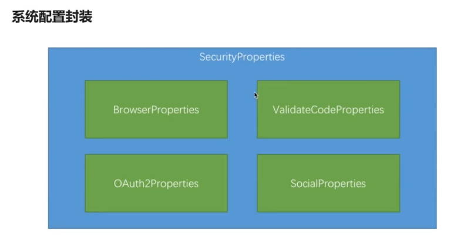

- 类里面根据配置项种类的不同，分成上面4个小项

- 因为这个模块任何项目都会用到无论是app还是browser模块，所以在core中配置，用来读取我们的properties配置项

- 

- Browser properties的代码，用来获取browser的配置项

- ```java
  package com.chenlifan.core.properties;
  
  public class BrowserProperties {
      //如果用户使用默认的登录页面，则我们默认在这里配置
      private String loginPage = "/signByMyself.html";
  
      public String getLoginPage() {
          return loginPage;
      }
  
      public void setLoginPage(String loginPage) {
          this.loginPage = loginPage;
      }
  }
  
  ```

- SecurityProperties的代码获取配置项

- ```java
  package com.chenlifan.core.properties;
  
  
  import org.springframework.boot.context.properties.ConfigurationProperties;
  
  /*
   * 这个类的意思是会读取所有以chenlifan.security为开头的配置项
   * */
  @ConfigurationProperties(prefix = "chenlifan.security")
  public class SecurityProperties {
      //其中browser的配置都会读取到browserProperties中去
      private BrowserProperties browserProperties = new BrowserProperties();
  
      public BrowserProperties getBrowserProperties() {
          return browserProperties;
      }
  
      public void setBrowserProperties(BrowserProperties browserProperties) {
          this.browserProperties = browserProperties;
      }
  }
  
  ```

- SecurityCoreConfig代码，让SecurityProperties跑起来

- ```java
  package com.chenlifan.core;
  
  import com.chenlifan.core.properties.SecurityProperties;
  import org.springframework.boot.context.properties.EnableConfigurationProperties;
  import org.springframework.context.annotation.Configuration;
  
  @Configuration
  //作用是让我们的SecurityProperties读取器生效
  @EnableConfigurationProperties(SecurityProperties.class)
  public class SecurityCoreConfig {
  }
  
  ```

- 最后在Controller和Config配置，获取登陆页

- 

- 


- 


- 然后我们启动tomcat通过浏览器任意访问我们的demo的api
- 返回结果
- 

- 前台返回了json的状态码，就是我们在Controller上面写的返回的错误信息，需要我们自己引导用户，因为我们请求的url的后缀不是html
- 所以当我们使用有html后缀的访问请求的时候，就会跳转到用户自定义的登陆页面
- 


- 当我们注释掉配置配置块的时候，就会跳转到我们安全模块自定义的登陆页面，先注释掉
- 

- 然后访问，
- 

- 所以使用我们的安全模块的用户，只需要在配置文件配置他自己的登陆页面

## 个性化用户认证流程（下）

###### 自定义登陆成功的处理

1. **在默认情况下，spring security的登陆成功处理，比如我们访问/user/1的时候，需要身份认证，那么就会跳转到<u>登陆页上</u>，登陆成功了就跳转到我们的<u>访问请求</u>**
2. **当在spa这种比较流行的情况下，登陆一般不是form表单访问的而是通过异步ajax请求来访问的，前端希望拿到的是json格式的用户信息**

> 实现这种方式，我们需要实现AuthenticationSuccessHandler这个接口

**代码的实现**

- 先在browser目录下创建一个类实现AuthenticationSuccessHandler接口
- 

- ```java
  package com.chenlifan.browser.authentication;
  
  import org.codehaus.jackson.map.ObjectMapper;
  import org.slf4j.Logger;
  import org.slf4j.LoggerFactory;
  import org.springframework.beans.factory.annotation.Autowired;
  import org.springframework.security.core.Authentication;
  import org.springframework.security.web.authentication.AuthenticationSuccessHandler;
  import org.springframework.stereotype.Component;
  
  import javax.servlet.ServletException;
  import javax.servlet.http.HttpServletRequest;
  import javax.servlet.http.HttpServletResponse;
  import java.io.IOException;
  
  /**
   * @ Author     ：konglongzai
   * @ Date       ：Created in 2019/8/19
   */
  @Component(value = "demoAuthenticationSuccessHandler")
  public class DemoAuthenticationSuccessHandler implements AuthenticationSuccessHandler {
  
      private Logger logger = LoggerFactory.getLogger(getClass());
  
      //将authentication转化为json的工具类
      //所以我们可以直接Autowired
      @Autowired
      private ObjectMapper objectMapper;
  
      /*
       * 这个方法就是登陆成功之后会被调用，
       * 第三个参数Authentication这个接口封装我们的认证信息，
       * 认证信息包括（我们发起的请求的一些信息：ip、session是什么、以及认证通过之后返回的UserDetail用户信息）
       * */
      @Override
      public void onAuthenticationSuccess(HttpServletRequest httpServletRequest, HttpServletResponse httpServletResponse, Authentication authentication) throws IOException, ServletException {
          logger.info("登陆成功");
          //把authentication以一个json的格式返回给前台，将authentication转化为json的工具类
          httpServletResponse.setContentType("application/json;charset=UTF-8");
          //将authentication这个对象转换成json格式的字符串
          httpServletResponse.getWriter().write(objectMapper.writeValueAsString(authentication));
          /*
          * 然后我们还需要在BrowserSecurityConfig中配置让spring security知道，我们登陆成功之后，使用我们自己写的登陆成功处理器
          * 而不用spring security默认的处理器
          * */
      }
  }
  
  ```

- 然后我们在BrowserSecurityConfig中配置，用户成功登陆后，使用我们自己的登陆成功处理器

- 声明ObejctMapper的实现类，将其注册进spring boot中

- 

- 

- 

- 然后访问我安全模块默认的登陆页面
- 


- 返回各种登陆的认证信息
- 

- 这个就是返回的我们登陆的各种信息username、password、权限
- 


###### 自定义登陆失败处理

如果是异步的ajax请求的话，我们要返回一个错误信息，而不是带着错误信息去跳转到我们的api接口，比如这个


- 实现流程

- 在authentication包下创建一个登陆失败的类，实现AuthenticationFailureHandler接口

- 

- ```java
  package com.chenlifan.browser.authentication;
  
  import org.codehaus.jackson.map.ObjectMapper;
  import org.slf4j.Logger;
  import org.slf4j.LoggerFactory;
  import org.springframework.beans.factory.annotation.Autowired;
  import org.springframework.http.HttpStatus;
  import org.springframework.security.core.AuthenticationException;
  import org.springframework.security.web.authentication.AuthenticationFailureHandler;
  import org.springframework.stereotype.Component;
  
  import javax.servlet.ServletException;
  import javax.servlet.http.HttpServletRequest;
  import javax.servlet.http.HttpServletResponse;
  import java.io.IOException;
  
  @Component(value = "DemoAuthenticationFailureHandler")
  public class DemoAuthenticationFailureHandler implements AuthenticationFailureHandler {
      private Logger logger = LoggerFactory.getLogger(getClass());
      @Autowired
      private ObjectMapper objectMapper;
  
      /*
       * 登陆失败的时候的一个处理
       * AuthenticationException这个就是不获取登陆的用户的信息，而是登陆失败的错误信息,
       * 这个类继承了大量的父类，比如我们之前的UsernamePasswordNotEmpty这个异常类
       * */
      @Override
      public void onAuthenticationFailure(HttpServletRequest httpServletRequest, HttpServletResponse httpServletResponse, AuthenticationException authenticationException) throws IOException, ServletException {
  
  
          logger.info("登陆失败");
          //返回一个错误500的状态码
          httpServletResponse.setStatus(HttpStatus.INTERNAL_SERVER_ERROR.value());
          //把authenticationException以一个json的格式返回给前台，
          httpServletResponse.setContentType("application/json;charset=UTF-8");
          //将authenticationException这个对象转换成json格式的字符串
          httpServletResponse.getWriter().write(objectMapper.writeValueAsString(authenticationException));
      }
  }
  
  ```

- 同样配置成功处理器一样，我们配置错误处理器

- 

- 

- 然后我们重启错误处理器，通过浏览器来访问

- 在我重启服务器的时候，出现了一个错误

- 

- 估计是spring无法判断到底谁先注入，所以我们创建一个javabean来获取ObjectMapper这个主键，然后DemoAuthenticationSuccessHandler和DemoAuthenticationFailureHandler分别获取这个实体类

- 

- ```java
  package com.chenlifan.browser.authentication;
  
  import org.codehaus.jackson.map.ObjectMapper;
  import org.springframework.beans.factory.annotation.Autowired;
  import org.springframework.stereotype.Component;
  
  @Component
  public class BeanOfAuthenticationHandler {
      @Autowired
      private ObjectMapper objectMapper;
  
      public ObjectMapper getObjectMapper() {
          return objectMapper;
      }
  
      public void setObjectMapper(ObjectMapper objectMapper) {
          this.objectMapper = objectMapper;
      }
  }
  
  ```

- 相应的DemoAuthenticationSuccessHandler和DemoAuthenticationFailureHandler需要做一些修改

- 

- 

- 输入一个错误的密码，因为我们设置的默认的密码为12465，所以我不输入123456

- 

- 


- 因为我们写的是一个通用的安全组件，如果将返回的方式写死是不合适的
- 我们改造一下我们的代码，让用户可以通过配置来决定返回的是json还是跳转
- **现在开始实现**
- 现在core编写一个枚举类
- 

- ```java
  package com.chenlifan.core.properties;
  
  public enum LoginType {
      /*
      * 1.跳转
      * 2.json
      * */
      REDIRECT ,
      JSON
  }
  
  ```

- 在BrowserProperties中添加枚举类的json属性

- 

- 添加getset方法
- 

- DemoAuthenticationSuccessHandler类

- ```java
  package com.chenlifan.browser.authentication;
  
  
  import com.chenlifan.core.properties.LoginType;
  import com.chenlifan.core.properties.SecurityProperties;
  import org.codehaus.jackson.map.ObjectMapper;
  import org.slf4j.Logger;
  import org.slf4j.LoggerFactory;
  import org.springframework.beans.factory.annotation.Autowired;
  import org.springframework.beans.factory.annotation.Qualifier;
  import org.springframework.security.core.Authentication;
  import org.springframework.security.web.authentication.AuthenticationSuccessHandler;
  import org.springframework.security.web.authentication.SavedRequestAwareAuthenticationSuccessHandler;
  import org.springframework.stereotype.Component;
  
  import javax.annotation.Resource;
  import javax.servlet.ServletException;
  import javax.servlet.http.HttpServletRequest;
  import javax.servlet.http.HttpServletResponse;
  import java.io.IOException;
  
  /**
   * @ Author     ：konglongzai
   * @ Date       ：Created in 2019/8/19
   */
  @Component(value = "demoAuthenticationSuccessHandler")
  public class DemoAuthenticationSuccessHandler extends SavedRequestAwareAuthenticationSuccessHandler {
  
      private Logger logger = LoggerFactory.getLogger(getClass());
  
      //将authentication转化为json的工具类
      //所以我们可以直接Autowired
  
      /* @Autowired
       private ObjectMapper objectMapper;*/
      @Autowired
      private BeanOfAuthenticationHandler beanOfAuthenticationHandler;
  
      @Autowired
      private SecurityProperties securityProperties;
  
      /*
       * 这个方法就是登陆成功之后会被调用，
       * 第三个参数Authentication这个接口封装我们的认证信息，
       * 认证信息包括（我们发起的请求的一些信息：ip、session是什么、以及认证通过之后返回的UserDetail用户信息）
       * */
      @Override
      public void onAuthenticationSuccess(HttpServletRequest httpServletRequest, HttpServletResponse httpServletResponse, Authentication authentication) throws IOException, ServletException {
          logger.info("登陆成功");
  
  
          //如果配置的处理方式是json，则我们返回json给前台
          if (LoginType.JSON.equals(securityProperties.getBrowserProperties().getLoginType())){
              //把authentication以一个json的格式返回给前台，
              httpServletResponse.setContentType("application/json;charset=UTF-8");
              //将authentication这个对象转换成json格式的字符串
              /*httpServletResponse.getWriter().write(objectMapper.writeValueAsString(authentication));*/
              httpServletResponse.getWriter().write(beanOfAuthenticationHandler.getObjectMapper().writeValueAsString(authentication));
              /*
               * 然后我们还需要在BrowserSecurityConfig中配置让spring security知道，我们登陆成功之后，使用我们自己写的登陆成功处理器
               * 而不用spring security默认的处理器
               * */
              //如果不是json，我们就调用父类的方法进行跳转
          }else{
              super.onAuthenticationSuccess(httpServletRequest,httpServletResponse,authentication);
          }
  
      }
  }
  
  ```

- DemoAuthenticationFailureHandler类

- ```java
  package com.chenlifan.browser.authentication;
  
  import com.chenlifan.core.properties.LoginType;
  import com.chenlifan.core.properties.SecurityProperties;
  import org.codehaus.jackson.map.ObjectMapper;
  import org.slf4j.Logger;
  import org.slf4j.LoggerFactory;
  import org.springframework.beans.factory.annotation.Autowired;
  import org.springframework.http.HttpStatus;
  import org.springframework.security.core.AuthenticationException;
  import org.springframework.security.web.authentication.AuthenticationFailureHandler;
  import org.springframework.security.web.authentication.SimpleUrlAuthenticationFailureHandler;
  import org.springframework.stereotype.Component;
  
  import javax.servlet.ServletException;
  import javax.servlet.http.HttpServletRequest;
  import javax.servlet.http.HttpServletResponse;
  import java.io.IOException;
  
  @Component(value = "demoAuthenticationFailureHandler")
  public class DemoAuthenticationFailureHandler extends SimpleUrlAuthenticationFailureHandler {
      private Logger logger = LoggerFactory.getLogger(getClass());
  
  
      /*@Autowired
      private ObjectMapper objectMapper;*/
  
      @Autowired
      private BeanOfAuthenticationHandler beanOfAuthenticationHandler;
  
      @Autowired
      private SecurityProperties securityProperties;
  
      /*
       * 登陆失败的时候的一个处理
       * AuthenticationException这个就是不获取登陆的用户的信息，而是登陆失败的错误信息,
       * 这个类继承了大量的父类，比如我们之前的UsernamePasswordNotEmpty这个异常类
       * */
      @Override
      public void onAuthenticationFailure(HttpServletRequest httpServletRequest, HttpServletResponse httpServletResponse, AuthenticationException authenticationException) throws IOException, ServletException {
  
  
          logger.info("登陆失败");
          if (LoginType.JSON.equals(securityProperties.getBrowserProperties().getLoginType())) {
              //返回一个错误500的状态码
              httpServletResponse.setStatus(HttpStatus.INTERNAL_SERVER_ERROR.value());
              //把authenticationException以一个json的格式返回给前台，
              httpServletResponse.setContentType("application/json;charset=UTF-8");
              //将authenticationException这个对象转换成json格式的字符串
              httpServletResponse.getWriter().write(beanOfAuthenticationHandler.getObjectMapper().writeValueAsString(authenticationException));
              //跳到错误的页面
          } else {
              super.onAuthenticationFailure(httpServletRequest, httpServletResponse, authenticationException);
          }
  
      }
  }
  
  ```

- 因为我们默认是json格式

- 

- 启动服务器
- 输入正确的密码
- 

- 输入错误的密码
- 

- 可以看到都是返回的json格式
- 因为我们没有进行配置
- 我们在demo项目的properties进行配置
- 

- 添加一个登陆成功的页面
- 

- 我们输入正确的密码
- 


- 输入错误的密码
- 
- 跳转到了spring security默认的错误页面
- 然后我们 这样通过配置就可以自定义返回json还是跳转页面


## 认证流程的源码级详解

1. 认证处理流程说明
2. 认证结果如何在多个请求之间共享
3. 获取认证用户信息


- 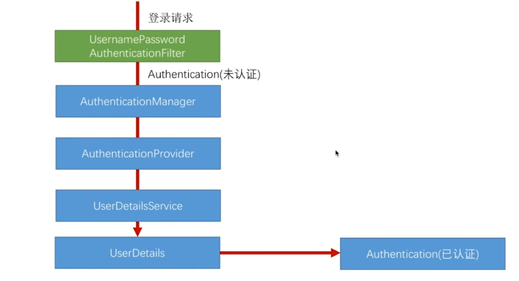


- 上面是涉及到的核心的类
- 开始分析
- 首先进入我们的默认的登录页
- 然后输入正确的账号密码

1. 第一步就是进入UsernamePasswordAuthenticationFilter处理我们的表单登陆请求
2. 

- 获取请求我们的用户名密码
- 然后用用户名密码构建了一个UsernamePasswordAuthenticationToken对象
- 

- 实现了Authenticaion接口
- 


## 实现图形验证码功能

1. 开发一个生成图形验证码的接口
2. 在认证流程中加入图形验证码的校验
3. 重构代码（提高代码质量）

###### 开发生成图形验证码的接口

- 一个rest的服务接口

流程

1. 根据随机数生成图片

2. 将随机数存在session中

3. 将生成的图片写到接口的响应中

   

   **流程**

   - 现在core项目中创建包
   
- 
  
   - 创建类ImageCode，封装图形验证码的信息
   
   - > 1. 图片
     > 2. 随机数，图片根据这个随机数生成
     > 3. 时间（过期时间）
   
   - ```java
     package com.chenlifan.core.validate.code;
     
     import java.awt.image.BufferedImage;
     import java.time.LocalDateTime;
     
     public class ImageCode {
         //展示给用户看的图片
         private BufferedImage bufferedImage;
         //存储到session中的随机数
         private String code;
         //这个是验证码的过期时间
         //一般设置为多少秒过期
         private LocalDateTime expresTime;
     
         //比如我们要设置的是60秒的过期时间，
         public ImageCode(BufferedImage bufferedImage, String code, int expresInt) {
             this.bufferedImage = bufferedImage;
             this.code = code;
             //我们就在当前时间点上加上60秒
             this.expresTime = LocalDateTime.now().plusSeconds(expresInt);
         }
     
         public ImageCode(BufferedImage bufferedImage, String code, LocalDateTime expresTime) {
             this.bufferedImage = bufferedImage;
             this.code = code;
             this.expresTime = expresTime;
         }
         public boolean isExpried(){
             return  LocalDateTime.now().isAfter(expresTime);
         }
     
         public BufferedImage getBufferedImage() {
             return bufferedImage;
         }
     
         public void setBufferedImage(BufferedImage bufferedImage) {
             this.bufferedImage = bufferedImage;
         }
     
         public String getCode() {
             return code;
         }
     
         public void setCode(String code) {
             this.code = code;
         }
     
         public LocalDateTime getExpresTime() {
             return expresTime;
         }
     
         public void setExpresTime(LocalDateTime expresTime) {
             this.expresTime = expresTime;
         }
   }
     
     ```
   
- 创建一个controller用来生成验证码
  
  - 
  
- ```java
  package com.chenlifan.core.validate.code;
  
  import org.springframework.social.connect.web.HttpSessionSessionStrategy;
  import org.springframework.social.connect.web.SessionStrategy;
  import org.springframework.web.bind.annotation.GetMapping;
  import org.springframework.web.bind.annotation.RestController;
  import org.springframework.web.context.request.ServletWebRequest;
  
  import javax.imageio.ImageIO;
  import javax.servlet.http.HttpServletRequest;
  import javax.servlet.http.HttpServletResponse;
  import java.awt.*;
  import java.awt.image.BufferedImage;
  import java.awt.image.RenderedImage;
  import java.io.IOException;
  import java.util.Random;
  
  @RestController
  public class ValidateCodeController {
      //作为session的key
      private static final String SESSION_KEY = "SESSION_KEY_IMAGE_CODE";
  
      private SessionStrategy httpSessionSessionStrategy = new HttpSessionSessionStrategy();
  
      @GetMapping(path = "/code/image")
      public void createCode(HttpServletRequest httpServletRequest, HttpServletResponse httpServletResponse) throws IOException {
          //根据随机数生成的图片，图片的数据会封装在ImageCode中
          ImageCode imageCode = createImageCode(httpServletRequest);
          //将随机数存入到session中
          //new ServletWebRequest(httpServletRequest)将请求传进session中
          //SESSION_KEY session的key
          //imageCode生成的图片
          httpSessionSessionStrategy.setAttribute(new ServletWebRequest(httpServletRequest), SESSION_KEY, imageCode);
          /*
           * 将生成的图片写道接口的响应中
           * 1.生成的图片
           * 2.生成图片的格式
           * 3.响应到输出流中
           * */
          ImageIO.write((RenderedImage) imageCode, "JPEG", httpServletResponse.getOutputStream());
  
  
      }
  
      private ImageCode createImageCode(HttpServletRequest httpServletRequest) {
          int width = 67;
          int height = 23;
          BufferedImage bufferedImage = new BufferedImage(width, height, BufferedImage.TYPE_INT_RGB);
          Graphics graphics = bufferedImage.getGraphics();
          Random random = new Random();
          graphics.setColor(getRandColor(200, 250));
          graphics.fillRect(0, 0, width, height);
          graphics.setFont(new Font("TIMES NEW ROMAN", Font.ITALIC, 20));
          graphics.setColor(getRandColor(160, 200));
          for (int i = 0; i < 155; i++) {
              int x = random.nextInt(width);
              int y = random.nextInt(height);
              int xl = random.nextInt(12);
              int yl = random.nextInt(12);
              graphics.drawLine(x, y, x + xl, y + yl);
          }
  
          String sRand = "";
          for (int i = 0; i < 4; i++) {
              String rand = String.valueOf(random.nextInt(10));
              sRand = sRand + rand;
              graphics.setColor(new Color(20 + random.nextInt(110), 20 + random.nextInt(110), 20 + random.nextInt(110)));
              graphics.drawString(rand, 13 * i + 6, 16);
  
  
          }
          graphics.dispose();
          return new ImageCode(bufferedImage, sRand, 60);
      }
  
      /*
       * 生成随机背景条纹
       * */
      private Color getRandColor(int fc, int bc) {
          Random random = new Random();
          if (fc > 255) {
              fc = 255;
          }
          if (bc > 255) {
              bc = 255;
          }
          int r = fc + random.nextInt(bc - fc);
          int g = fc + random.nextInt(bc - fc);
          int b = fc + random.nextInt(bc - fc);
          return new Color(r, g, b);
      }
  
  
  }
  
  ```

- 写一个页面，将图形验证码显示出来
- 在标准登陆页面上显示
- 

- 


- 然后把/code/image加入进我们的安全请求中
- 
- 然后访问标准页面
- 
- 然后我们验证这个验证码
- 我们在spring security这个过滤器链加一个过滤器，在这个过滤器中执行校验验证码的这个逻辑
- 先编写一个filter，和一个捕获异常的类
- 


- ```java
  package com.chenlifan.core.validate.code;
  
  import org.springframework.security.core.AuthenticationException;
  
  public class ValidateCodeException extends AuthenticationException {
  
  
      private static final long serialVersionUID = 967121536341308024L;
  
      public ValidateCodeException(String msg) {
          super(msg);
      }
  }
  
  ```

- ```java
  package com.chenlifan.core.validate.code;
  
  import org.apache.commons.lang.StringUtils;
  import org.springframework.security.web.authentication.AuthenticationFailureHandler;
  import org.springframework.social.connect.web.HttpSessionSessionStrategy;
  import org.springframework.social.connect.web.SessionStrategy;
  import org.springframework.web.bind.ServletRequestBindingException;
  import org.springframework.web.bind.ServletRequestUtils;
  import org.springframework.web.context.request.ServletWebRequest;
  import org.springframework.web.filter.OncePerRequestFilter;
  
  import javax.servlet.FilterChain;
  import javax.servlet.ServletException;
  import javax.servlet.http.HttpServletRequest;
  import javax.servlet.http.HttpServletResponse;
  import java.io.IOException;
  
  public class ValidataCodeFilter extends OncePerRequestFilter {
  
      private AuthenticationFailureHandler authenticationFailureHandler;
      private SessionStrategy sessionStrategy = new HttpSessionSessionStrategy();
  
      /*
       *
       * */
      @Override
      protected void doFilterInternal(HttpServletRequest httpServletRequest, HttpServletResponse httpServletResponse, FilterChain filterChain) throws ServletException, IOException {
          //这个过滤器只有在登陆的时候有效
          if (StringUtils.equals("/authentication/form", httpServletRequest.getRequestURI()) && StringUtils.equals(httpServletRequest.getMethod(), "post")) {
  
              try {
                  validate(new ServletWebRequest(httpServletRequest));
              } catch (ValidateCodeException e) {
                  authenticationFailureHandler.onAuthenticationFailure(httpServletRequest, httpServletResponse, e);
              }
  
          }
          //如果不符合if的条件，则调用下面的过滤器
          filterChain.doFilter(httpServletRequest, httpServletResponse);
      }
  
      private void validate(ServletWebRequest servletWebRequest) throws ServletRequestBindingException {
          ImageCode imageCodeSession = (ImageCode) sessionStrategy.getAttribute(servletWebRequest, ValidateCodeController.SESSION_KEY);
  
          String codeInRequest = ServletRequestUtils.getStringParameter(servletWebRequest.getRequest(), "imageCode");
          if (StringUtils.isBlank(codeInRequest)) {
              throw new ValidateCodeException("验证码的值不能为空");
          }
          if (imageCodeSession == null) {
              throw new ValidateCodeException("验证码不存在");
          }
          if (imageCodeSession.isExpried()) {
              sessionStrategy.removeAttribute(servletWebRequest, ValidateCodeController.SESSION_KEY);
              throw new ValidateCodeException("验证码已过期");
          }
          if (!StringUtils.equals(imageCodeSession.getCode(), codeInRequest)) {
              throw new ValidateCodeException("验证码不正确");
          }
          sessionStrategy.removeAttribute(servletWebRequest, ValidateCodeController.SESSION_KEY);
      }
  
      public AuthenticationFailureHandler getAuthenticationFailureHandler() {
          return authenticationFailureHandler;
      }
  
      public void setAuthenticationFailureHandler(AuthenticationFailureHandler authenticationFailureHandler) {
          this.authenticationFailureHandler = authenticationFailureHandler;
      }
  
      public SessionStrategy getSessionStrategy() {
          return sessionStrategy;
      }
  
      public void setSessionStrategy(SessionStrategy sessionStrategy) {
          this.sessionStrategy = sessionStrategy;
      }
  }
  
  ```

  

- 将我们的过滤器加载过滤器链中

- 


- 把配置文件的错误跳转到html的配置注解掉
- 

- 然后进入我们的标准的登陆页面
- 直接点击登陆按钮
- 

- 就会弹出一大堆的错误信息
- 实际上我们前台是不需要这么多的错误信息的
- 我们修改一下我们的失败处理器
- 

- 


- 为了能在失败处理后直接返回，我们加一个return
- 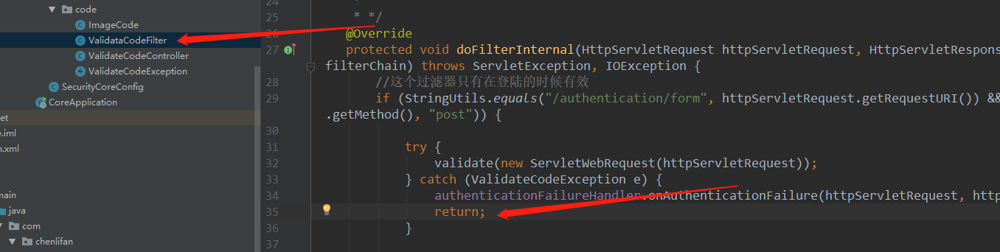

- 我们我们重新配置服务器，然后直接点击login按钮
- 

- 输入正确的账号密码和验证码
- 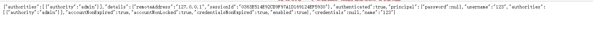

- 拿到用户的信息


## 重构图形验证码接口的代码

1. 验证码基本参数可配

> 配置验证码的大小时间等参数

2. 验证码拦截的接口可配置

> 比如配置验证码不单只可以配置"/authentication/form"这个接口，而是可以自己自定义

3. 验证码的生成逻辑可配置


- 使用我们安全模块的项目会分成三级
- 

- 最底层的默认配置，就是写在我们的core项目下的，如果使用者不进行任何配置，则使用我们的默认的参数
- 第二应用级的配置，应用级的配置会写在demo项目下，用户自定义参数，并且覆盖默认级的配置
- 比如在多个接口中调用这个图形验证码

###### 验证码基本参数可配置

- 第一步在core的properties包下添加一个类
- 


- ```java
  package com.chenlifan.core.properties;
  
  public class ImageCodeProperties {
      //应用级默认的配置
      private int width = 67;
      private int height = 23;
      private int lenght = 4;
      private int expireIn = 60;
  
      public int getWidth() {
          return width;
      }
  
      public void setWidth(int width) {
          this.width = width;
      }
  
      public int getHeight() {
          return height;
      }
  
      public void setHeight(int height) {
          this.height = height;
      }
  
      public int getLenght() {
          return lenght;
      }
  
      public void setLenght(int lenght) {
          this.lenght = lenght;
      }
  
      public int getExpireIn() {
          return expireIn;
      }
  
      public void setExpireIn(int expireIn) {
          this.expireIn = expireIn;
      }
  }
  
  ```

  

- ValidateCodeProperties类

- ```java
  package com.chenlifan.core.properties;
  
  public class ValidateCodeProperties {
      private ImageCodeProperties imageCodeProperties = new ImageCodeProperties();
  
      public ImageCodeProperties getImageCodeProperties() {
          return imageCodeProperties;
      }
  
      public void setImageCodeProperties(ImageCodeProperties imageCodeProperties) {
          this.imageCodeProperties = imageCodeProperties;
      }
  }
  
  ```

- 在SecurityProperties类中配置

- ```java
  package com.chenlifan.core.properties;
  
  
  import org.springframework.boot.context.properties.ConfigurationProperties;
  
  /*
   * 这个类的意思是会读取所有以chenlifan.security为开头的配置项
   * */
  @ConfigurationProperties(prefix = "chenlifan.security")
  public class SecurityProperties {
      //其中browser的配置都会读取到browserProperties中去
      private BrowserProperties browserProperties = new BrowserProperties();
  
      private ValidateCodeProperties validateCodeProperties = new ValidateCodeProperties();
  
      public BrowserProperties getBrowserProperties() {
          return browserProperties;
      }
  
      public void setBrowserProperties(BrowserProperties browserProperties) {
          this.browserProperties = browserProperties;
      }
  
      public ValidateCodeProperties getValidateCodeProperties() {
          return validateCodeProperties;
      }
  
      public void setValidateCodeProperties(ValidateCodeProperties validateCodeProperties) {
          this.validateCodeProperties = validateCodeProperties;
      }
  }
  
  ```

- 在demo的properties中配置图形验证码的参数

- 

- 然后我们在图形验证码控制器进行修改
- 

- 

- 

- 

- 

- 


- 

- 然后我们进入登录页
- 

- 可以看到验证码的数字长度为6，覆盖了默认的4位的长度
- 验证码图形的长度为200的长度，覆盖了配置文件中的100的长度


###### 验证码的拦截可配置

- 在ImageCodeProperties中添加一个配置
- 

- 


- 在properties中添加配置
- 

- 在Filter下做判断
- 

- 生成getset方法
- 

- 实现InitializingBean的方法

- ```java
    @Override
      public void afterPropertiesSet() throws ServletException {
          super.afterPropertiesSet();
          String[] cinfigUrls = StringUtils.splitByWholeSeparatorPreserveAllTokens(securityProperties.getValidateCodeProperties().getImageCodeProperties().getUrl(), ",");
          for (String config : cinfigUrls) {
              urls.add(config);
          }
          urls.add("/authentication/form");
      }
  ```

- 

- 然后我们在config中进行配置
- 


- 访问标准登录页
- 直接点击登陆
- 

- 我们输入正确的账号密码，然后访问user和user/1
- 


- 

- 两者都被拦截到，都被需要使用验证码
- 我们修改一下配置文件
- 

- 重启服务器
- 然后在正确的登陆页面输入正确的账号密码后，分别访问user和user/1
- 访问user
- 

- 访问user/1
- 

- 可以看到拦截到了user需要只用验证码


###### 验证码的生成逻辑可配置

- 声明一个接口
- 


- 编写一个实现了实现我们的接口


- ```java
  package com.chenlifan.core.validate.code;
  
  import com.chenlifan.core.properties.SecurityProperties;
  import org.springframework.beans.factory.annotation.Autowired;
  import org.springframework.web.bind.ServletRequestUtils;
  import org.springframework.web.context.request.ServletWebRequest;
  
  import java.awt.*;
  import java.awt.image.BufferedImage;
  import java.util.Random;
  
  public class ImageCodeGenerator implements ValidateCodeGenerator {
      //引进配置信息
      @Autowired
      private SecurityProperties securityProperties;
  
      @Override
      public ImageCode createImageCode(ServletWebRequest servletWebRequest) {
          int width = ServletRequestUtils.getIntParameter(servletWebRequest.getRequest(), "width", securityProperties.getValidateCodeProperties().getImageCodeProperties().getWidth());
          int height = ServletRequestUtils.getIntParameter(servletWebRequest.getRequest(), "height", securityProperties.getValidateCodeProperties().getImageCodeProperties().getHeight());
  
          BufferedImage bufferedImage = new BufferedImage(width, height, BufferedImage.TYPE_INT_RGB);
          Graphics graphics = bufferedImage.getGraphics();
          Random random = new Random();
          graphics.setColor(getRandColor(200, 250));
          graphics.fillRect(0, 0, width, height);
          graphics.setFont(new Font("TIMES NEW ROMAN", Font.ITALIC, 20));
          graphics.setColor(getRandColor(160, 200));
          for (int i = 0; i < 155; i++) {
              int x = random.nextInt(width);
              int y = random.nextInt(height);
              int xl = random.nextInt(12);
              int yl = random.nextInt(12);
              graphics.drawLine(x, y, x + xl, y + yl);
          }
  
          String sRand = "";
          for (int i = 0; i < securityProperties.getValidateCodeProperties().getImageCodeProperties().getLenght(); i++) {
              String rand = String.valueOf(random.nextInt(10));
              sRand = sRand + rand;
              graphics.setColor(new Color(20 + random.nextInt(110), 20 + random.nextInt(110), 20 + random.nextInt(110)));
              graphics.drawString(rand, 13 * i + 6, 16);
  
  
          }
          graphics.dispose();
          return new ImageCode(bufferedImage, sRand, securityProperties.getValidateCodeProperties().getImageCodeProperties().getExpireIn());
      }
  
      /*
       * 生成随机背景条纹
       * */
      private Color getRandColor(int fc, int bc) {
          Random random = new Random();
          if (fc > 255) {
              fc = 255;
          }
          if (bc > 255) {
              bc = 255;
          }
          int r = fc + random.nextInt(bc - fc);
          int g = fc + random.nextInt(bc - fc);
          int b = fc + random.nextInt(bc - fc);
          return new Color(r, g, b);
      }
  }
  
  
  ```

- 删除ValidateCodeController的createImageCode代码
- 修改

- 

- 创建一个配置类
- 

- ```java
  package com.chenlifan.core.validate.code;
  
  import com.chenlifan.core.properties.SecurityProperties;
  import org.springframework.beans.factory.annotation.Autowired;
  import org.springframework.boot.autoconfigure.condition.ConditionalOnMissingBean;
  import org.springframework.context.annotation.Bean;
  import org.springframework.context.annotation.Configuration;
  
  @Configuration
  public class ValidateCodeBeanConfig {
  
      @Autowired
      private SecurityProperties securityProperties;
  
      @Bean
      //当不存在validateCodeGenerator这个组件的时候才调用下面的方法
      @ConditionalOnMissingBean(name = "validateCodeGenerator")
      public ValidateCodeGenerator validateCodeGenerator() {
          ImageCodeGenerator imageCodeGenerator = new ImageCodeGenerator();
          imageCodeGenerator.setSecurityProperties(securityProperties);
          return  imageCodeGenerator;
      }
  }
  
  ```

- 在ImageCodeGenerator添加getset方法

- 

- 重启服务器

- 

- 可以看到我们的代码没有任何问题
- 我们做一个名字叫validateCodeGenerator的bean
- 在demo项目下实现
- 

- ```java
  package com.chenlifan.code;
  
  import com.chenlifan.core.validate.code.ImageCode;
  import com.chenlifan.core.validate.code.ValidateCodeGenerator;
  import org.springframework.stereotype.Component;
  import org.springframework.web.context.request.ServletWebRequest;
  @Component(value = "validateCodeGenerator")
  public class DemoImageCodeGenerator implements ValidateCodeGenerator {
      @Override
      public ImageCode createImageCode(ServletWebRequest servletWebRequest) {
          System.out.println("更高级的图形验证码生成代码");
          return null;
      }
  }
  
  ```

- 重启服务器，因为我们返回的是null，所以会报出空指针异常，控制台输出System.out.println("更高级的图形验证码生成代码");的信息

- 

- 图形验证码没有出来，后台报错了
- 

* 所以，这里的出结论是，作为一个高级的程序员，以增量的方式去适应变化，当出现变化的时候，原本的代码的逻辑不满足了，我们的处理方式不是去删除或则修改原来的代码，而是去增加代*代码


## 添加功能

1. 记住我功能基本原理
2. 记住我功能具体实现
3. 记住我基本源码的解析

###### 记住我功能基本原理


###### 记住我功能具体实现

- 先在我们的基本登陆页面上添加一个checkbox，来用实现记住我这样的一个功能
- 

- 把之前做的配置注释掉

- 注释掉这个组件

- 

- 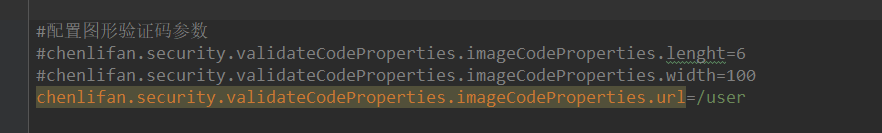

- 因为我们在properties中配置了数据库的连接信息，我们在browser中配置我们的数据源

- ```java
   //指定数据源，说明我们的数据库在哪里
      @Autowired
      private DataSource dataSource;
    
      @Bean
      public PersistentTokenRepository persistentTokenRepository() {
          JdbcTokenRepositoryImpl jdbcTokenRepository = new JdbcTokenRepositoryImpl();
          jdbcTokenRepository.setDataSource(dataSource);
          //系统启动的时候自动创建一张表
          jdbcTokenRepository.setCreateTableOnStartup(true);
          return jdbcTokenRepository;
      }
  ```

- 在core项目下配置记住我功能的有效时间

- 
- 

- 在browser下配置
- 

- 

- 启动服务后，我们的数据库就会自动创建一张表
- 

- 然后我们访问user/1
- 

- 就会告诉我需要身份认证
- 那么我们去标准登录页做身份认证
- 

- 把勾子勾上
- 

登陆显示认证成功，我们进入我们的数据库看一下


- 可以看到数据库保存的记录，
- **因为我们当前的用户都是保存在session中的**

- 我们停掉服务器，重启服务器，按理说我们的session都丢掉了
- 我们注释掉
- 

- 然后我们不做登陆直接访问这个user/1
- 

- 这是因为springsecurity通过RememberMefilter来查找

  


###### 记住我基本源码的解析


## 短信验证码接口开发

1. 开发一个短信验证码接口
2. 校验短信验证码并登陆
3. 重构代码


###### 开发一个短信验证码接口

- 首先，我门在core目录下的validate code的ValidateCodeController控制器中，编写一个接口
- 

- 那么我们就不能使用这个图片验证码的生成器了
- 要新编写一个短信验证码的生成器
- 在ValidateCodeController添加这个配置
- 

- 我们要封装一下生成出来的短信验证码创建ValidateCode类
- 
- 这个smsCode和imageCode的这个属性只差一个图片

```java
package com.chenlifan.core.validate.code;

import java.awt.image.BufferedImage;
import java.time.LocalDateTime;

public class SmsCode {

    //存储到session中的随机数
    private String code;
    //这个是验证码的过期时间
    //一般设置为多少秒过期
    private LocalDateTime expresTime;

    //比如我们要设置的是60秒的过期时间，
    public SmsCode(String code, int expresInt) {

        this.code = code;
        //我们就在当前时间点上加上60秒
        this.expresTime = LocalDateTime.now().plusSeconds(expresInt);
    }

    public SmsCode(String code, LocalDateTime expresTime) {

        this.code = code;
        this.expresTime = expresTime;
    }

    public boolean isExpried() {
        return LocalDateTime.now().isAfter(expresTime);
    }


    public String getCode() {
        return code;
    }

    public void setCode(String code) {
        this.code = code;
    }

    public LocalDateTime getExpresTime() {
        return expresTime;
    }

    public void setExpresTime(LocalDateTime expresTime) {
        this.expresTime = expresTime;
    }
}

```


- 所以我们可以让imageCode继承smsCode这个类，重构一下代码
- 

- ```java
  package com.chenlifan.core.validate.code;
  
  import java.awt.image.BufferedImage;
  import java.time.LocalDateTime;
  
  public class ImageCode extends SmsCode {
      //展示给用户看的图片
      private BufferedImage bufferedImage;
  
  
      //比如我们要设置的是60秒的过期时间，
      public ImageCode(BufferedImage bufferedImage, String code, int expresInt) {
          super(code, expresInt);
          this.bufferedImage = bufferedImage;
  
      }
  
      public ImageCode(BufferedImage bufferedImage, String code, LocalDateTime expresTime) {
          super(code, expresTime);
          this.bufferedImage = bufferedImage;
  
      }
  
  
      public BufferedImage getBufferedImage() {
          return bufferedImage;
      }
  
      public void setBufferedImage(BufferedImage bufferedImage) {
          this.bufferedImage = bufferedImage;
      }
  
  
  }
  
  ```

- 然后我们改造一下ValidateCodeGenerator

- 

- 

- 然后我们修改controller的代码
- 

- 上面的是我们之前的图片验证码的接口，因为返回的是一个图片，所以我们要做一个强转

- 这个是到现在为止在controller中是短信验证码接口的代码

- ```java
   @GetMapping(path = "/code/sms")
      public void createSmsCode(HttpServletRequest httpServletRequest, HttpServletResponse httpServletResponse) throws IOException {
          //根据随机数生成的图片，图片的数据会封装在ImageCode中
          ValidateCode smsCode = smsCodeGenerator.createImageCode(new ServletWebRequest(httpServletRequest));
          //将随机数存入到session中
          //new ServletWebRequest(httpServletRequest)将请求传进session中
          //SESSION_KEY session的key
          //imageCode生成的图片
          httpSessionSessionStrategy.setAttribute(new ServletWebRequest(httpServletRequest), SESSION_KEY, smsCode);
      }
  ```

- 现在我们去封装一个短信验证码发送的接口

- 创建一个sms的包

- 

- ```java
  package com.chenlifan.core.validate.code.sms;
  
  public interface SmsCodeSender {
      /*
      * mobile向哪一台手机发送
      * code发送的信息是什么
      * */
      void send(String mobile,String code);
  }
  
  ```

- 然后我们编写一个默认的实现

- 

- ```java
  package com.chenlifan.core.validate.code.sms;
  
  public class DefaultSmsCodeSender implements SmsCodeSender{
      /**
       * @ Author     ：konglongzai
       * @ Date       ：Created in 2019/10/3
       */
      @Override
      public void send(String mobile, String code) {
          System.out.println("向手机"+mobile+"发送短信验证码"+code);
      }
  }
  
  ```

- 配置validateCodeBeanConfig

- 

- 

- 然后在Controller注入smsCodeSender
- 

- 然后修改Controller修改sms的代码

- ```JAVA
    @GetMapping(path = "/code/sms")
      public void createSmsCode(HttpServletRequest httpServletRequest, HttpServletResponse httpServletResponse) throws IOException, ServletRequestBindingException {
          //根据随机数生成的图片，图片的数据会封装在ImageCode中
          ValidateCode smsCode = smsCodeGenerator.createImageCode(new ServletWebRequest(httpServletRequest));
          //将随机数存入到session中
          //new ServletWebRequest(httpServletRequest)将请求传进session中
          //SESSION_KEY session的key
          //imageCode生成的图片
          httpSessionSessionStrategy.setAttribute(new ServletWebRequest(httpServletRequest), SESSION_KEY, smsCode);
          //获取向我们发出请求的手机的信息
          //getRequiredStringParameter请求中必须包含参数
          String mobile = ServletRequestUtils.getRequiredStringParameter(httpServletRequest,"moblie");
          //获取短信验证码的输出的接口
          smsCodeSender.send(mobile, smsCode.getCode());
      }
  ```

- 至此我们的短信验证码的接口的就写完了

- 然后我们修改登陆页面

- 

- 在原本的页面中写一个短信登陆
- 

- 短信登陆的代码

- ```html
  <h3>短信登陆</h3>
  <form method="post" action="/authentication/mobile">
       手机号: <input type="text" name="mobile" value="13664925754"/>
      <br/>
      短信验证码：<input type="text" name="smsCode"/>
      <!--通过点击连接来请求我们的短信验证码的接口，因为是mock，所以我们自定义手机号-->
      <a href="/code/sms?mobile=13664925754">发送验证码</a>
      <button type="submit">login</button>
  
  </form>
  ```

- 然后我们编写验证码生成器

- 

- 


###### 校验短信验证码并登陆

###### 重构代码


## 学习中遇到的问题

java的转义字符

- 当我们在java中输出hello world的时候我们是这样写的

- ```java
  System.out.println("Hello World");
  ```

- 这种写法输出的是Hello World

- 我们怎么样才能输出"Hello World"呢

- ```java
  System.out.println("/”Hello World/“");
  ```

- 这样就能输出"Hello World"

- 这种写法通常用在java传输json字符串的时候

- 比如json数据是

- ```json
  {
  	"username": "chenlifan",
  	"password": "null "
  }
  ```

- 那么我们在java中的写法是

- ```java
   String content ={\"username\":\"chenlifan\",\"password\":\"null\"}";
  ```


