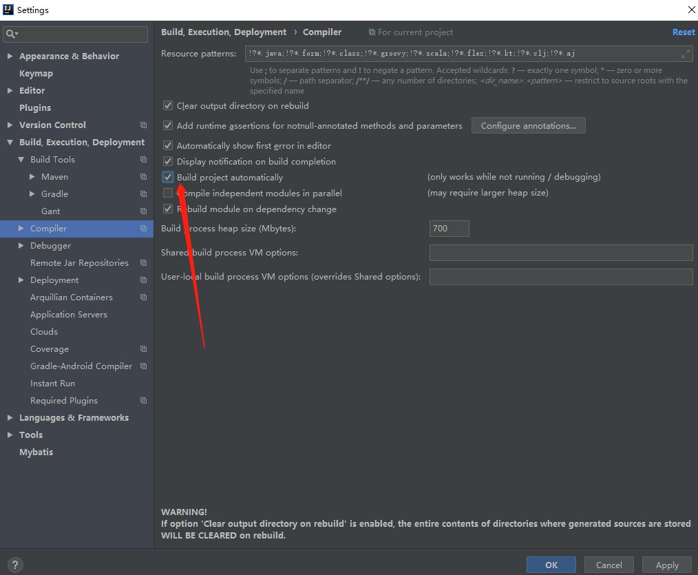

## spring boot简介

#### 原有spring优缺点分析

##### spring的优缺点分析

spring是Java企业版的轻量级代替品，无需开发重量级的Enterprise JavaBean，spring为企业级Java开发提供了一种相对简单的方法，通过依赖注入喝面向切面编程，用简单的Java对象实现EJB的功能

##### spring的缺点分析

虽然spring的组件代码是轻量级的，但它的配置却是重量级的，一开始，spring用xml配置，而且是很多xml配置，spring2.5引入了基于注解的组件扫描，这消除了大量针对应用程序自身组件的显式xml配置，spring3.0引入了基于java的配置，这是一种类型安全的可重构配置方式，可以代替xml

所有这些配置都代表了开发时的损耗。因为在思考spring特性配置喝解决业务问题之间需要进行思维切换，所以编写配置挤占了编写应用程序逻辑的时间。喝所有框架一样，spring实用，但与此同时它要求的回报也不少。

除此之外，项目的依赖管理也是一件耗时耗力的事情，在环境搭建时，需要分析要导入哪些库的坐标，而且还需要分析导入与之有依赖关系的其他库的坐标，一旦选错了依赖的版本，随之而来的不兼容问题就会严重阻碍项目的开发进度

#### spring boot的概述

##### spring boot解决上述spring的缺点 

spring boot对上述spring的缺点进行的改善喝优化，基于约定由于配置的思想，可以让开发人员不必在配置与逻辑业务之间进行思维的切换，全身心的投入到逻辑业务的代码编写中，从而大大提高了开发的效率，一定程度上缩短了项目周期

##### spring boot的特点

- 为基于spring的开发提供更快的入门体验
- 开箱即用，没有代码生成，也无需xml配置，同时也可以修改默认值来满足特定的需求
- 提供了一些大型项目中常见的非功能性特性，如嵌入式服务器、安全、指标、健康监测、外部配置等等
- spring boot不是对spring功能上的增强，而是提供了一种快速使用spring的方式

##### spring boot的核心功能

- 起步依赖
  - 起步依赖本质上是一个maven项目对象模型（project object Model，pom），定义了对其他库的传递依赖，这些东西加在一起即支持某项功能。
  - 简单说，起步依赖就是将具备某种功能的坐标打包到一起，并提供一些默认的功能。
- 自动配置
  - spring boot的自动配置是一个运行时（更准确地说，是应用程序启动时）的过程，考虑了众多因素，才决定spring配置应该用哪个，不该用哪个，该过程是spring自动完成的。


#### spring boot入门

##### 添加spring boot的起步依赖

- springboot要求，项目要继承spring boot的起步依赖spring-boot-starter-parent

  ```xml
   <dependency>
              <groupId>org.springframework.boot</groupId>
              <artifactId>spring-boot-starter-parent</artifactId>
              <version>2.1.6.RELEASE</version>
          </dependency>
  ```

  


springboot要集成springmvc进行controller的开发，所以项目要导入web的启动依赖

```xml
 <dependency>
            <groupId>org.springframework.boot</groupId>
            <artifactId>spring-boot-starter-web</artifactId>
        </dependency>
```

##### 编写spring boot引导类（入口）

- 要通过spring boot提供的引导类起步spring boot才能进行访问

```java
package com.chenlifan.precties03;

import org.slf4j.LoggerFactory;
import org.springframework.boot.SpringApplication;
import org.springframework.boot.autoconfigure.SpringBootApplication;

import java.util.logging.Logger;

@SpringBootApplication
public class Precties03Application {

    public static void main(String[] args) {

        SpringApplication.run(Precties03Application.class, args);

    }

}

```


#### spring boot工程热部署

我们在开发中反复修改类，页面等资源，每次修改后都是需要重新启动才生效，这样每次启动都很麻烦，浪费了大量的时间，我们可以在修改代码后不重启就能生效，在pom.xml中添加如下配置就可以实现这样的功能，我们称之为热部署。

```xml
<!-- https://mvnrepository.com/artifact/org.springframework.boot/spring-boot-devtools -->
<dependency>
    <groupId>org.springframework.boot</groupId>
    <artifactId>spring-boot-devtools</artifactId>
    <version>2.1.6.RELEASE</version>
</dependency>

```

注意：idea进行spring boot热部署失败的原因

- 出现这种情况，并不是热部署配置的问题，其根本原因是因为intellij IDEA默认情况下不会自动编译，需要对idea进行自动编译的设置，如下



然后Shift+Alt+Ctrl+/


## springboot的配置文件

#### spring boot配置文件类型合作用

spring boot是基于约定的，所以很多配置都有默认值，单如果使用自己的配置替换默认的配置的话，就可以使用application.properties或者application.yml(yaml)进行配置
spring boot默认会从Resource目录下加载application.properties或application.yml(yaml)文件

其中，application.properties文件是键值对文件


#### application.yml配置文件

###### yml配置文件简介

yml文件格式是yaml（yaml Aint Markup Language）编写的文件格式


## spring boot整合mybatis

- 添加Mybatis的起步依赖

```xml
<!-- https://mvnrepository.com/artifact/org.mybatis.spring.boot/mybatis-spring-boot-starter -->
<dependency>
    <groupId>org.mybatis.spring.boot</groupId>
    <artifactId>mybatis-spring-boot-starter</artifactId>
    <version>2.1.0</version>
</dependency>

```


- 添加数据库驱动坐标

```xml
<!-- https://mvnrepository.com/artifact/mysql/mysql-connector-java -->
<dependency>
    <groupId>mysql</groupId>
    <artifactId>mysql-connector-java</artifactId>
    <version>5.1.47</version>
</dependency>


```


- 添加数据库的连接信息

```properties
# DB configuration:
spring.datasource.driver-class-name=com.mysql.jdbc.Driver
spring.datasource.url=jdbc:mysql://127.0.0.1:3306/SSM?serverTimezone=UTC
spring.datasource.username=root
spring.datasource.password=admin
```


- 创建一张表
- 创建一个实体bean

```java
package com.chenlifan.precties03.pojo;

public class Account {
    private int id;
    private String name;
    private double money;

    public int getId() {
        return id;
    }

    public void setId(int id) {
        this.id = id;
    }

    public String getName() {
        return name;
    }

    public void setName(String name) {
        this.name = name;
    }

    public double getMoney() {
        return money;
    }

    public void setMoney(double money) {
        this.money = money;
    }

    @Override
    public String toString() {
        return "Account{" +
                "id=" + id +
                ", name='" + name + '\'' +
                ", money=" + money +
                '}';
    }
}

```


- 编写dao接口

```java
package com.chenlifan.precties03.dao;

import com.chenlifan.precties03.pojo.Account;

import java.util.List;
@Repository
@Mapper
public interface AccountDao {
    public List<Account> queryAccountList();
}

```


- 配置mapper映射文件

```xml
<?xml version="1.0" encoding="UTF-8" ?>
<!DOCTYPE mapper
        PUBLIC "-//mybatis.org//DTD Mapper 3.0//EN"
        "http://mybatis.org/dtd/mybatis-3-mapper.dtd">
<mapper namespace="com.chenlifan.precties03.pojo.Account">
    <select id="queryAccountList" resultType="com.chenlifan.precties03.pojo.Account">
        select * from account
    </select>
</mapper>

```


- 在application.properties中添加mybatis的信息

```properties
#配置mybatis的信息
mybatis:
  type-aliases-package: com.chenlifan.precties03.pojo
      # 加载mybatis映射文件

  mapper-locations: classpath:mapper/*Account-mapper.xml
```

- 编写测试controller

```java
 @ResponseBody
    @RequestMapping(path = "/testMyubatis")
    public List<Account> queryAccountList() {
       /* List<Account> accounts = accountDao.queryAccountList();*/
        return accountService.getDaoAccount();
    }
```


- 测试


 

## spring boot整合redis

- 添加redis的起步依赖

```xml
<!-- https://mvnrepository.com/artifact/org.springframework.boot/spring-boot-starter-data-redis -->
<dependency>
    <groupId>org.springframework.boot</groupId>
    <artifactId>spring-boot-starter-data-redis</artifactId>
    <version>2.1.6.RELEASE</version>
</dependency>

```

- 配置redis的连接信息

```yaml
spring:
	redis:
    	host: 192.168.53.129
   	 	port: 6379
```

- 注入redisTemplate测试redis操作

```

```

