[TOC]

[视频网站](https://www.imooc.com/learn/196)

# 概述

**在spring中，由spring管理的对象都叫bean**


- web层：springmvc
- service层：ioc
- dao：spring 的jdbcTemplate 


学习的内容

- 什么是框架
- Spring间接
- IOC
- Bean
- AOP


Spring学习的资源

[Spring](https://spring.io/)

[Spring框架文档](https://spring.io/projects/spring-framework)


spring是一个开源框架，是为了解决企业应用开发的复杂性而创建的，但现在已经不止应用于企业应用

**这次学习的主要是轻量级的控制反转(IOC)和面向切面(AOP)的容器框架**

> - 为什么说是轻量的呢：因为大小和内存开销spring都是轻量的
>
> - 控制反转有什么用：通过控制反转可以达到松耦合的目的
>
> - 提供了面向切面编程的丰富支持，允许通过分离应用的业务逻辑与系统级服务进行内聚性的开发
> - 包含并管理应用对象的配置和生命周期，这个意义上是一种容器
> - 将简单的组件配置、组合成为复杂的应用，这个意义上是框架

**spring是一个免费的开源的容器**

## Spring Framework

**什么是框架**

> 框架是指定一套规范或者规则。大家在这套框架（规则）下工作，遵循框架的规则。


## Spring的组成和拓展

**spring的七大模块**

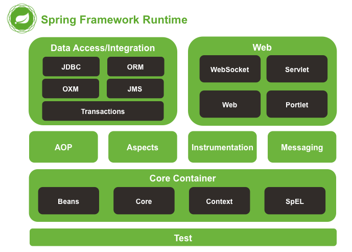


spring到后期有一个缺点，配置越来越多，越来越繁杂，所有spring boot横空出世


# IOC

## IOC理论推导

> ioc是一种思想，通过这种思想来转变自己的代码风格，
>
> 以前我们需要一个类，都是需要new出来的
>
> 而在spring，通过ioc，我们把这些对象交给spring来保管，然后通过spring的 配置来创建对象


## **ioc的底层原理**

原始的调用对象的方式是

- 创建一个类
- 类里面有一个方法
- 然后通过new的方式调用这个方法

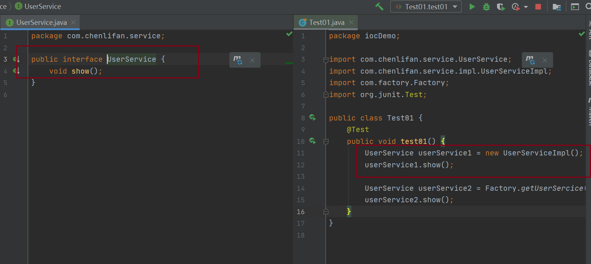

> 这样的方式耦合度调太高了


**使用工厂模式解耦合操作**

- 在上面的基础上创建一个工厂类

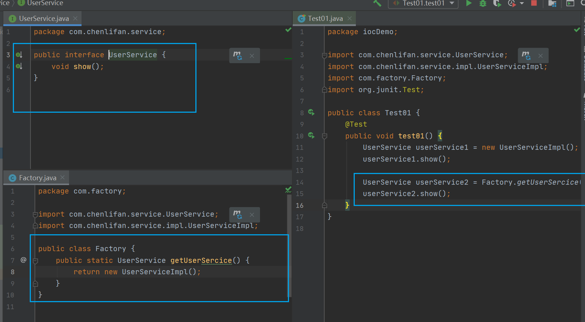

> 这种方式依然是存在耦合的，只是耦合转移到了工厂类


## Ioc的底层原理（通过spring实现）


**ioc的操作分为**

- 配置文件的方式
- 注解的方式


上面的两种创建方式都是纯手工实现的，并没有通过spring来管理，那么下面的方式就是通过spring来管理我们的对象（bean）

**在上面的基础上:arrow_down:**

1. 创建xml文件，配置要创建的对象
2. 创建工厂类，使用dom4j来解析配置文件+反射


**使用spring管理类对象步骤**

- 导入jar包
- 创建一个类，然后配置一些方法
- 创建spring配置发文件，配置好要创建的类
- 创建一个工厂类
- 然后调用

```xml
<!-- https://mvnrepository.com/artifact/org.springframework/spring-webmvc -->
<dependency>
    <groupId>org.springframework</groupId>
    <artifactId>spring-webmvc</artifactId>
    <version>5.2.2.RELEASE</version>
</dependency>


```

**官方建议是spring的核心配置文件放在src下，命名为applicationContext.xml**

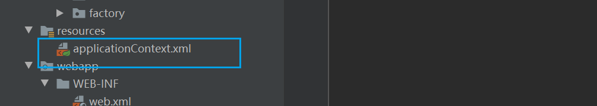

**引入约束**

[点击获取spring的命名空间](https://docs.spring.io/spring-framework/docs/5.0.8.RELEASE/spring-framework-reference/core.html#beans)

**把创建好的类交给spring管理**

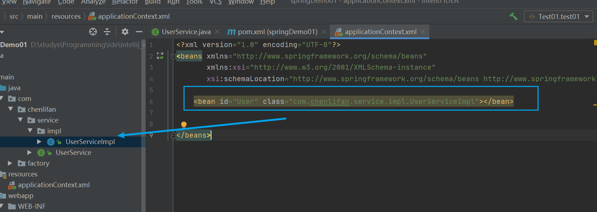


**创建工厂类**

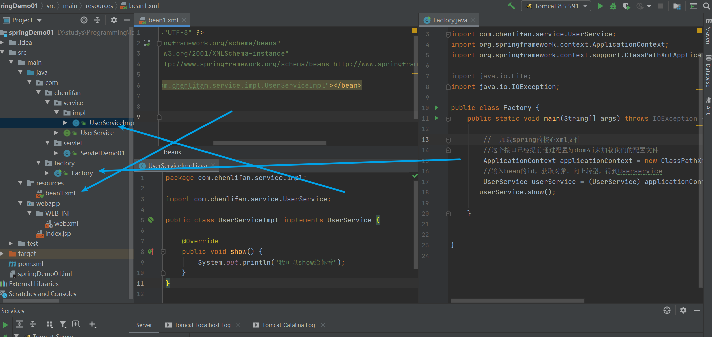


## bean实例化的三种方式（spring的bean管理，通过xml文件实现）

**接上面的内容，我们通过spring来管理我们的对象，通过xml文件配置，然后读取这个xml文件，获得spring的工厂类的实例**


- **使用类的无参构造类传教创建（重点）**

从文字可以看出来，意思是，如果我们创建的这个类想要交给spring管理，**就必须要有无参构造方法**

那么，如果没有无参构造方法，会怎样呢

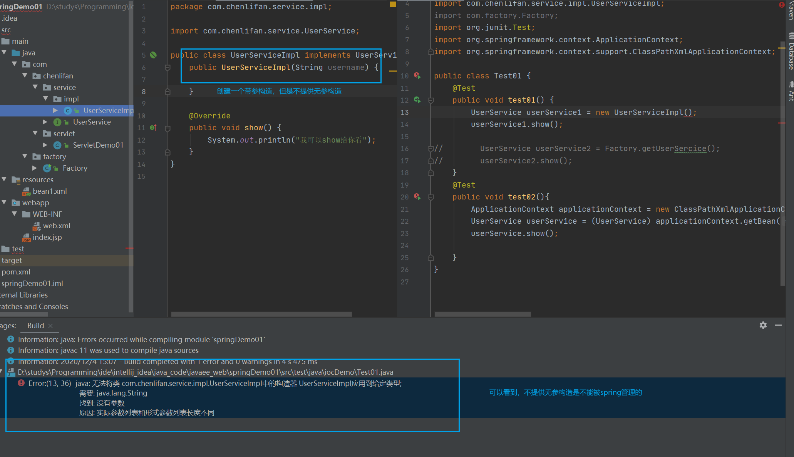

- 使用静态工厂创建

> 创建静态的方法，返回类的对象

- 创建一个类
- 创建一个工厂，工厂创建一个静态方法，返回类的实例
- 将这个静态工厂交给spring管理，在xml中
- 然后获取这个静态工厂

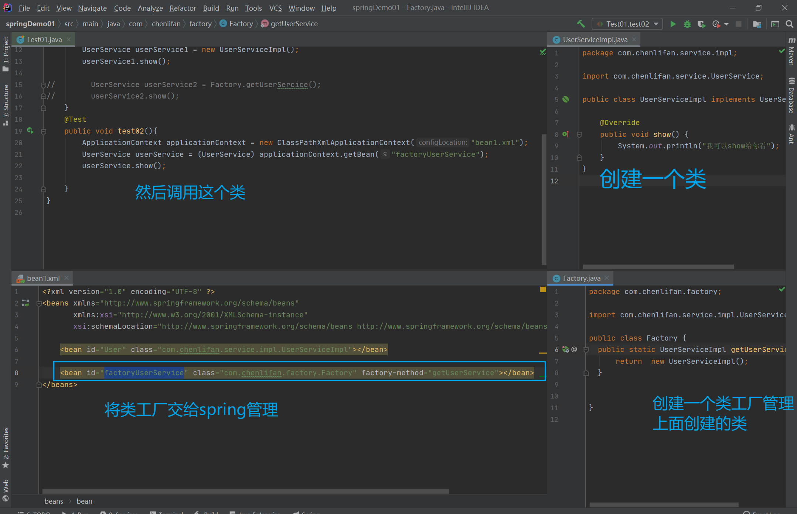


- 使用实例工厂创建

> 创建不是静态的方法，返回类对象

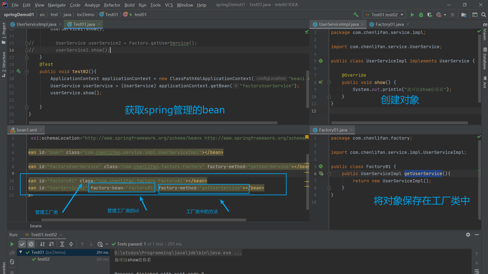


## bean标签的常用属性

id属性：相当于bean对象的名称（属性值不能包含特殊符号）

class属性：创建对象所在类的全路径


name属性：功能和id一样（属性值可以包含特殊符号）


scope属性（范围）

- singleton（单例）
- prototype （多例）
- request  web项目中，spring创建一个bean对象，将对象保存如到request域中
- session  web项目中，spring创建一个bean对象，将对象存入到session域中
- globalsession   web项目中，应用在porlet环境，如果没有prolet环境，那么globalsession相当于session


## 属性注入

**创建对象的时候，向类里面属性设置值**


### spring框架中，属性注入的两种方式

1. set方法注入

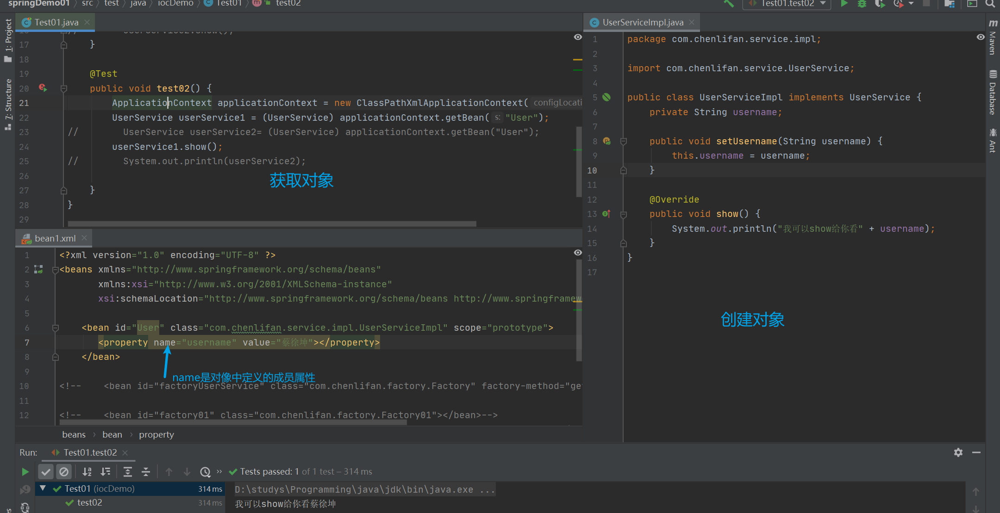


2. 有参数构造注入

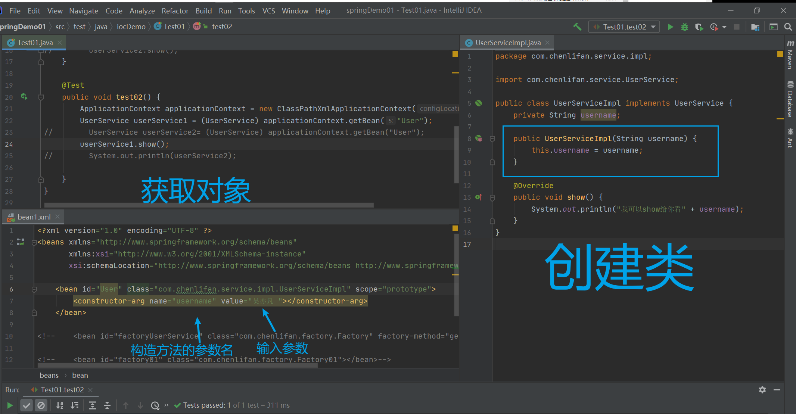


### 在spring中，一个类注入另一个类的对象（注入对象类型的属性）

- 创建一个service类和一个dao类
- 在service类中获得dao类的对象

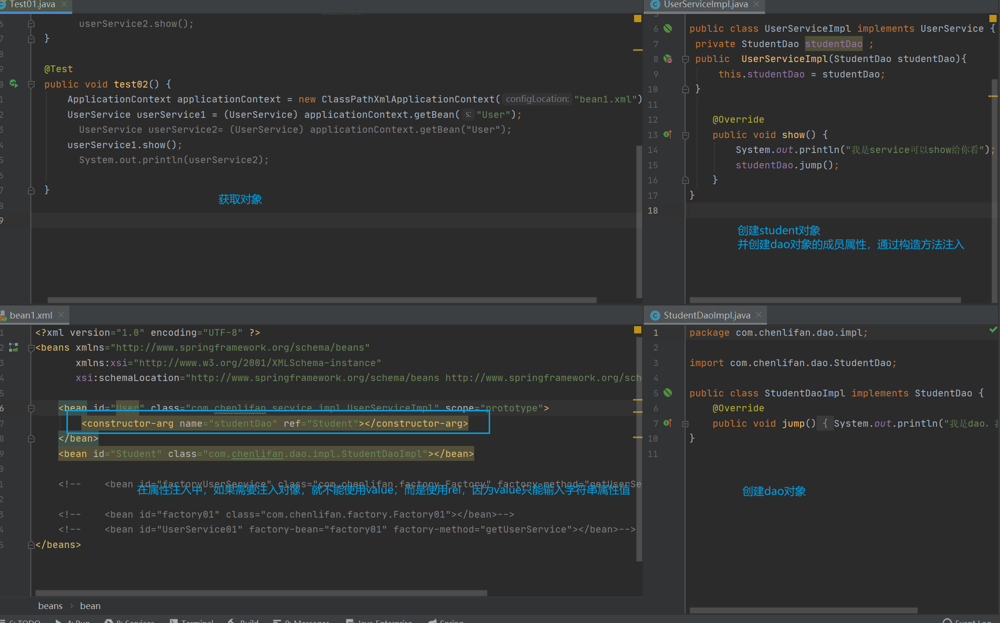


### 注入复杂类型的属性（p名称空间的使用、list 、数组、map输出）

- 在xml文件中输入p名称空间的配置

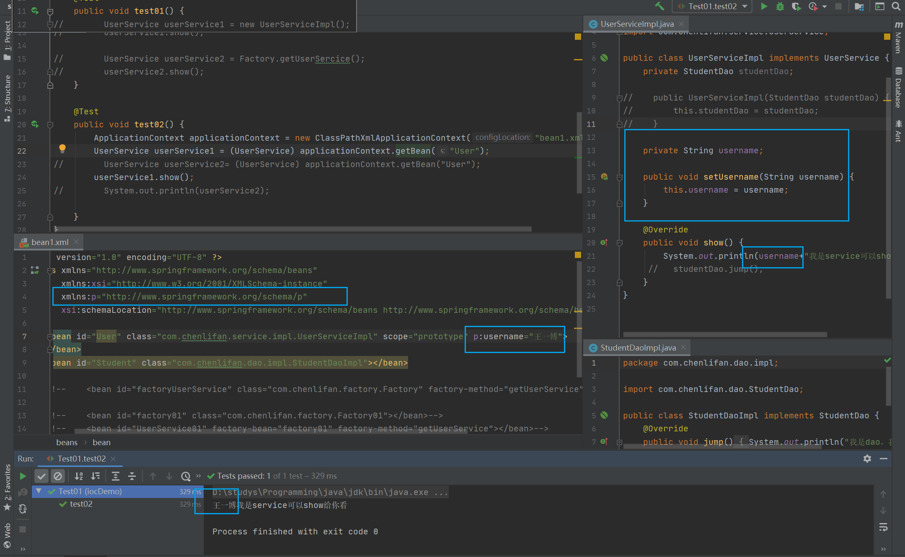

**那么如何注入复杂类型数组呢**

**比如lsit map等数据类型**

**演示**

- 创建一个类，类里面定义四种成员属性 数组、list 、map 、properties对象，分别创建它们的set方法

```java
public class UserServiceImpl implements UserService {
    private String[] strings;
    private List<String> stringList;
    private Map<String, String> stringStringMap;
    private Properties properties;


    public void setStrings(String[] strings) {
        this.strings = strings;
    }

    public void setStringList(List<String> stringList) {
        this.stringList = stringList;
    }

    public void setStringStringMap(Map<String, String> stringStringMap) {
        this.stringStringMap = stringStringMap;
    }

    public void setProperties(Properties properties) {
        this.properties = properties;
    }

    @Override
    public void show() {
        System.out.println(Arrays.toString(strings));
        for (String s : stringList) {
            System.out.println(s);
        }
        for (String key : stringStringMap.keySet()) {
            System.out.println(stringStringMap.get(key));
        }
        System.out.println(properties.toString());
    }
}
```

- 把上面的类，交给spring保管，并进行属性注入

```xml
 <bean id="User" class="com.chenlifan.service.impl.UserServiceImpl" scope="prototype">
        <property name="strings">
            <list>
                <value>吴亦凡</value>
                <value>蔡徐坤</value>
                <value>王一博</value>
            </list>
        </property>
        <property name="stringList">
            <list>
                <value>肖战</value>
                <value>张艺兴</value>
                <value>lisa</value>
            </list>
        </property>
        <property name="stringStringMap">
            <map>
                <entry key="篮球" value="科比"></entry>
                <entry key="桌球" value="张晓婷"></entry>
                <entry key="乒乓球" value="李宁"></entry>
            </map>
        </property>
        <property name="properties">
            <props>
                <prop key="username">admin</prop>
                <prop key="passwrod">root</prop>
            </props>
        </property>
    </bean>
```

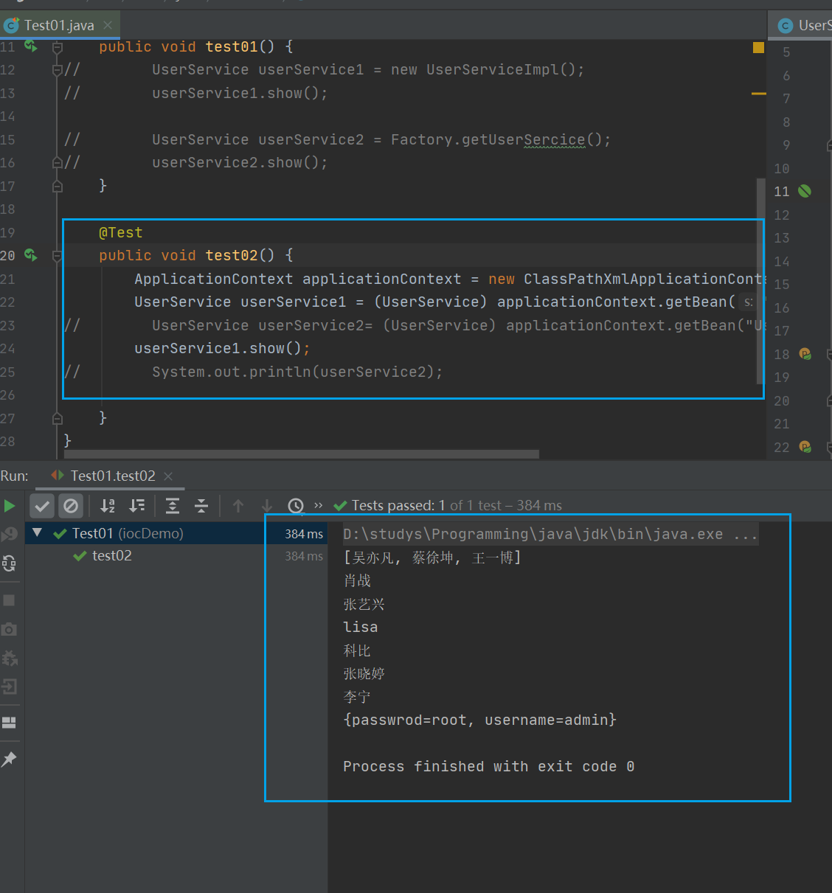

## IOC和DI的区别

**IOC：控制反转，把对象创建交给spring来完成**——创建对象

**DI：依赖注入，向类里面的属性设置值**——配置对象成员属性的参数

> 关系：依赖注入是不能单独存在的，需要在ioc的基础上完成 


****

## 通过注解的方式创建对象和注入属性


**注解开发的准备工作**

**在spring配置文件中配置一个约束**

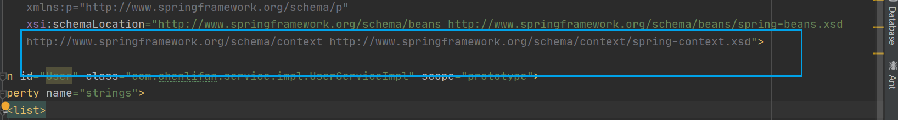

**然后在配置文件中开启注解扫描**

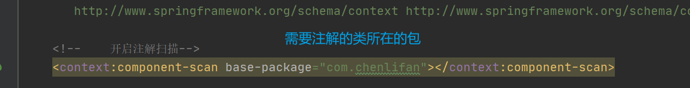

**还有一个只扫描属性上面的注解（用得不多）**

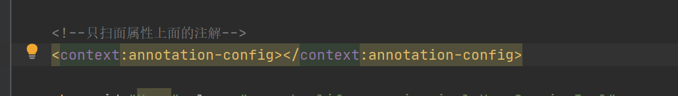


## 通过注解的方式创建对象

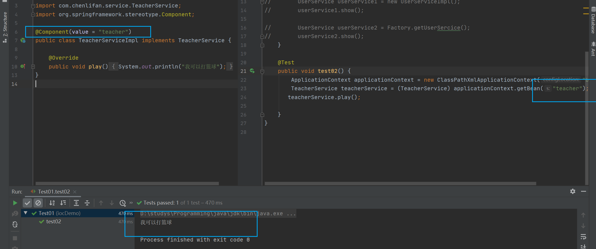

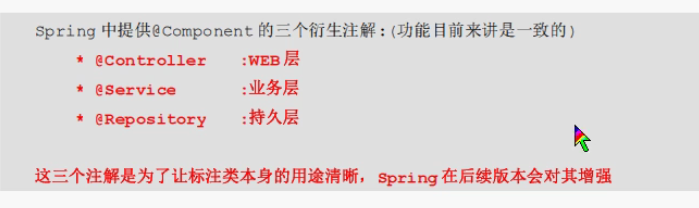

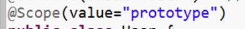

> 配置单例还是多例等等


## 通过注解注入对象属性（service层调用dao层对象）

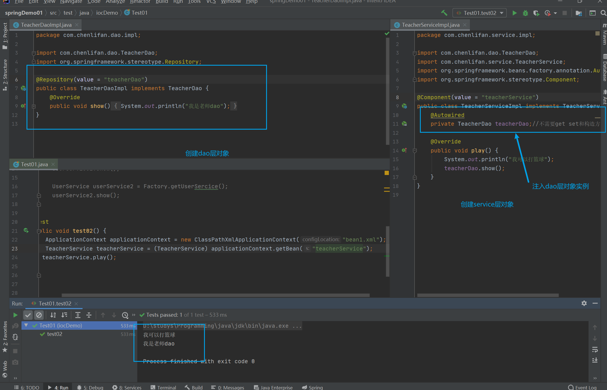


**使用@Resource注解注入**

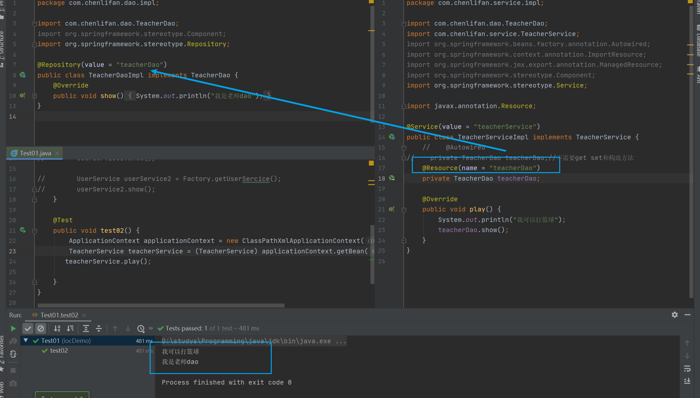

> @Resource的好处是更加准确，指定用的是哪个对象，类似于配置注入的set和构造方法注入


## 注解配置文件的混合使用

**一般来说**

1. 创建对象使用配置文件的方式实现
2. 注入属性的操作使用注解的方式实现


****


# AOP

**AOP：面向切面编程**（扩展功能不修改源代码实现）

> aop采取了横向抽取机制，取代了传统的纵向继承体系重复性代码


## aop的原理

传统修改 代码增加功能不足之处

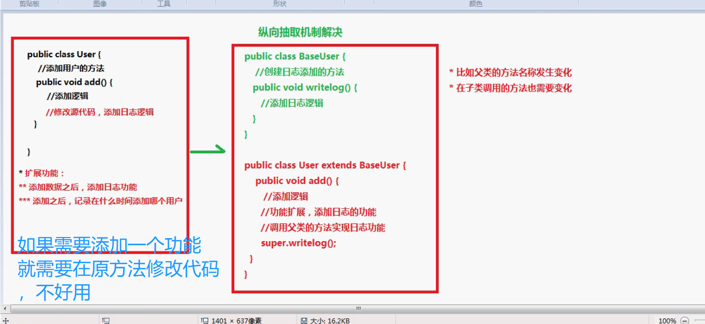


**底层原理（横向机制）**

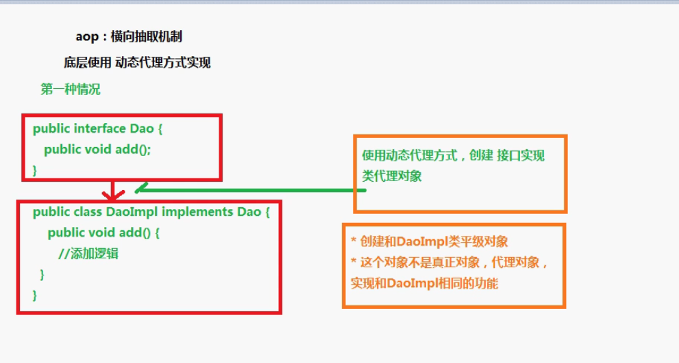

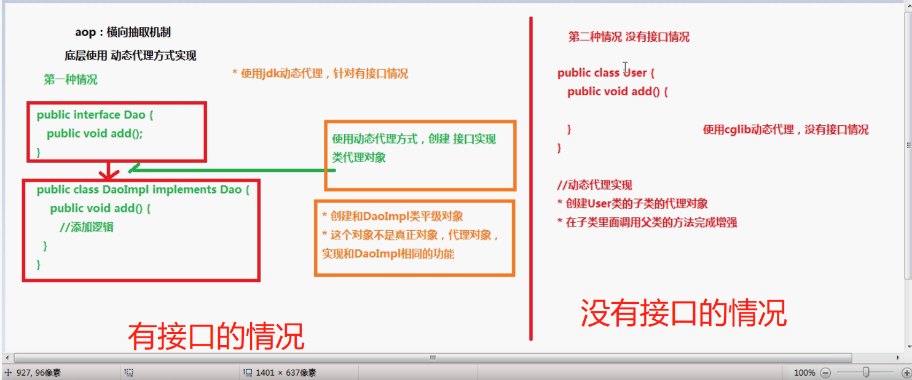


## AOP操作术语

- **连接点 JoinPoint：类里面可以被增强的方法，这些方法叫做连接点**
- **切入点 PointCut：在类里面可以有很多的方法被增强，但实际只增强了add方法和update方法，实际增强的方法被称为切入点**
- **通知/增强 advice：增强的逻辑，称为增强，比如扩展日志功能，这个日志功能称为增强**

> **前置通知：在方法之前执行**
>
> **后置通知：在方法之后执行**
>
> **异常通知：方法出现异常**
>
> **最终通知：在后置之后执行**
>
> **环绕通知：方法之前和之后执行**

- **切面 Aspect ：把增强应用到具体方法上面，过程称为切面**

> **把增强用到切入点的过程（比如在add方法增强日志功能的过程就称为切面）**

- 引介 Introduction ：是一种特殊的通知，在不修改代类代码的前提下，**Introduction可以在运行期为类动态地添加一些方法或属性**（一般不会用）
- 目标对象 Target ：增强的方法所在的**类** ——就是目标对象
- 织入 Weaving ：把增强/通知（advice）应用到类（target）的过程
- 代理  Proxy ：一个类被AOP织入增强后，就产生一个结果代理类


## spring 的aop操作（aspectJ）

在spring里面进行aop操作，使用aspectJ实现

- **aspectJ是一个面向切面框架，不是spring的一部分，是另外的一个全新的框架**

- **aspectj是一个基于Java语言的apo框架**
- 注意：spring2.0以后新增对aspectJ的支持
- **新版本speing框架，建议使用aspectJ实现aop的操作**


**使用aspectJ实现aop的两种方式**

1. 基于aspectJ的xml配置
2. 基于aspectJ的注解方式


## AOP操作准备


导入aop相关的jar包

> aopalliance-1.0.jar、aspectjweaver-1.8.9.jar、spring-aop-4.3.0.RELEASE.jar、spring-aspects-4.3.0.RELEASE.jar。

```xml
<!--        spring aop所需的jar包-->
<!-- https://mvnrepository.com/artifact/org.springframework/spring-aspects -->
<dependency>
    <groupId>org.springframework</groupId>
    <artifactId>spring-aspects</artifactId>
    <version>5.2.2.RELEASE</version>
</dependency>
<!-- https://mvnrepository.com/artifact/aopalliance/aopalliance -->
<dependency>
    <groupId>aopalliance</groupId>
    <artifactId>aopalliance</artifactId>
    <version>1.0</version>
</dependency>

<!-- https://mvnrepository.com/artifact/org.aspectj/aspectjweaver -->
<dependency>
    <groupId>org.aspectj</groupId>
    <artifactId>aspectjweaver</artifactId>
    <version>1.8.13</version>
    <scope>runtime</scope>
</dependency>
<!-- https://mvnrepository.com/artifact/aspectj/aspectjrt -->
        <dependency>
            <groupId>aspectj</groupId>
            <artifactId>aspectjrt</artifactId>
            <version>1.5.3</version>
        </dependency>
<!-- https://mvnrepository.com/artifact/org.springframework/spring-aop -->
<dependency>
    <groupId>org.springframework</groupId>
    <artifactId>spring-aop</artifactId>
    <version>5.2.2.RELEASE</version>
</dependency>
```


- 在xml文件中导入aop核心约束

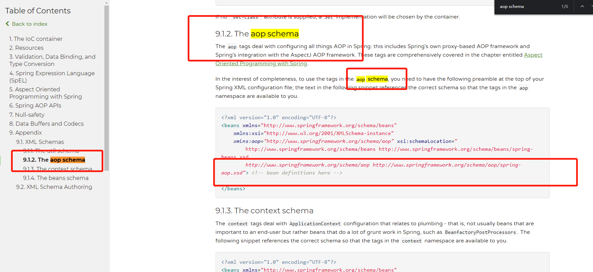


## 使用表达式配置切入点


**常用的表达式**

`execution(<访问修饰符 方法全路径>?<返回类型><方法名>(<参数>)<异常>)`

> 访问修饰符  public 、private      *代表任意的修饰符       ——>    (public 方法的全路径) ——>常见写法如下:arrow_down:
>
>  execution(public com.chenlifan.aop.Animal.eat(..))    ..的意思是如果方法有参数也包含
>
> execution(* com.chenlifan.aop.Animal.*(..))   意思是所有访问修饰符，animal类下的所有方法
>
> execution(* *.\*(..))  意思类中的所有方法都增强
>
> execution(* save*(..))   匹配所有方法名为save开头的方法


**aspectj的aop操作**

1. 创建类
2. 配置aop操作

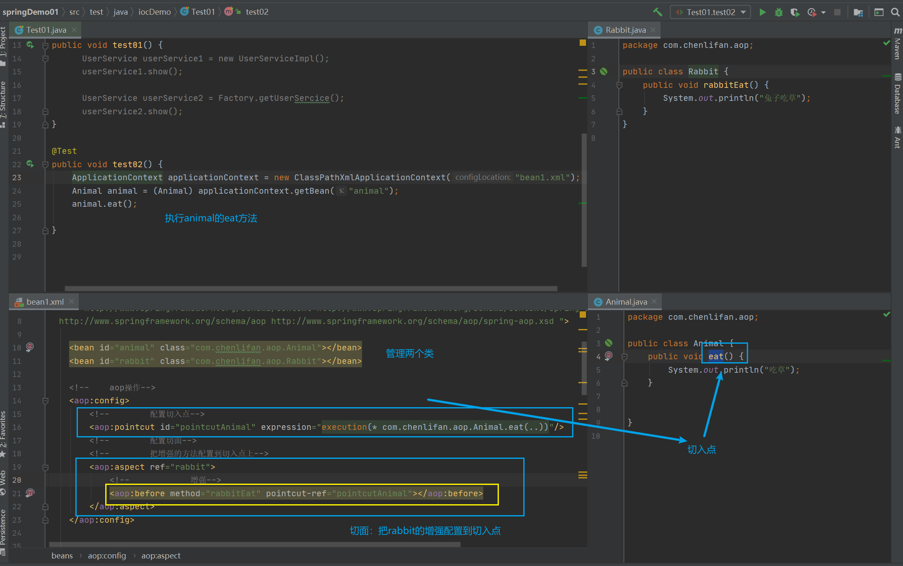

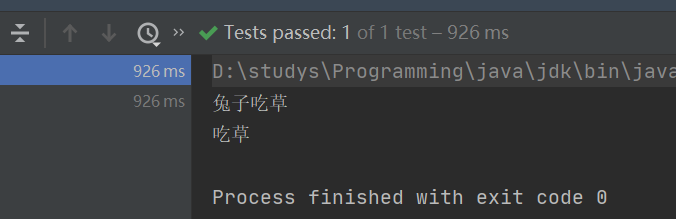


## 环绕增强的演示

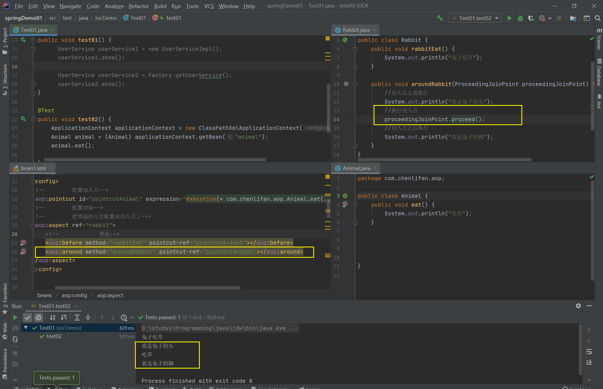

****


## 基于aspectj的注解aop

- **在spring核心配置文件中开启aop操作**

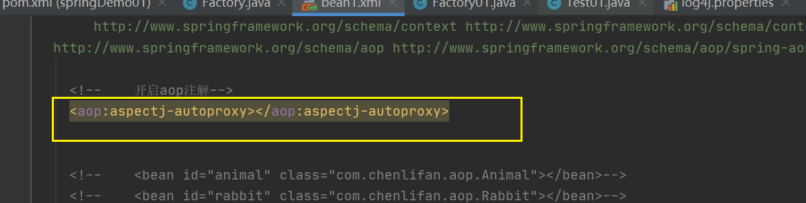

**演示**

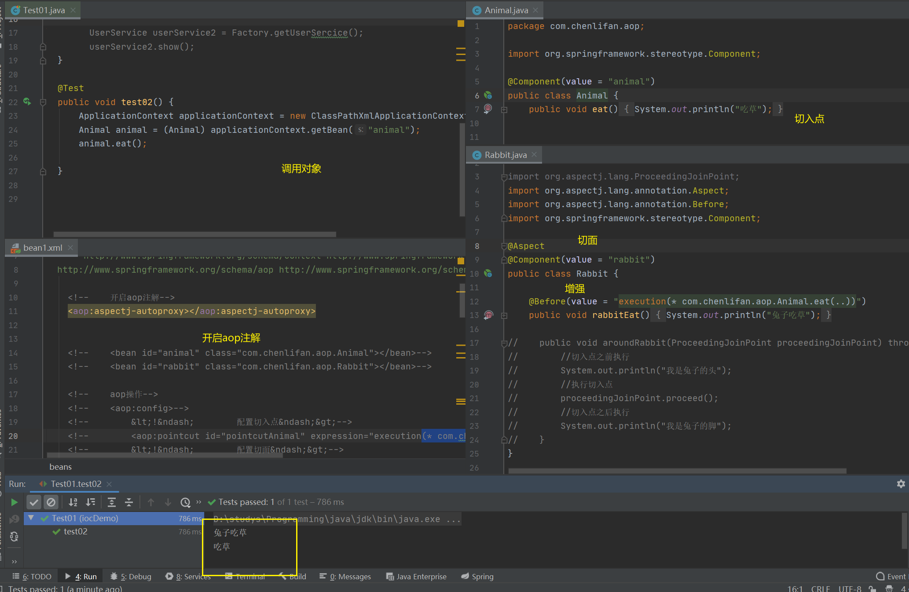


# log4j

- 导入依赖

```xml
<!-- https://mvnrepository.com/artifact/log4j/log4j -->
<dependency>
    <groupId>log4j</groupId>
    <artifactId>log4j</artifactId>
    <version>1.2.17</version>
</dependency>

```


**通过log4j可以查看运行过程中的详细信息**

>  使用log4j常看日志（错误信息）


- 配置log4j的配置文件在src下

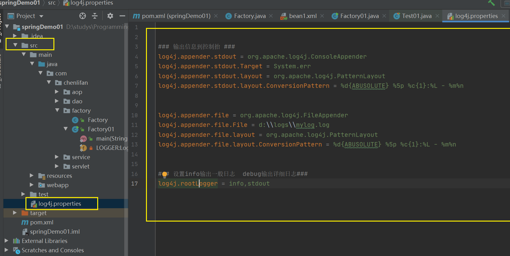


**但是我配置完成之后，控制台并不输出日志，不知道怎么搞，后面再搞吧**


# spring可能出现的问题

## 针对@autowrite可以使用而@Resource注解不能使用的问题

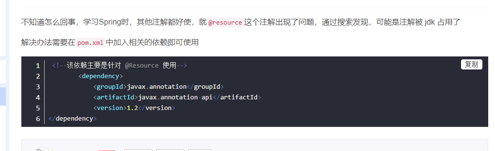


****

# Spring mvc入门

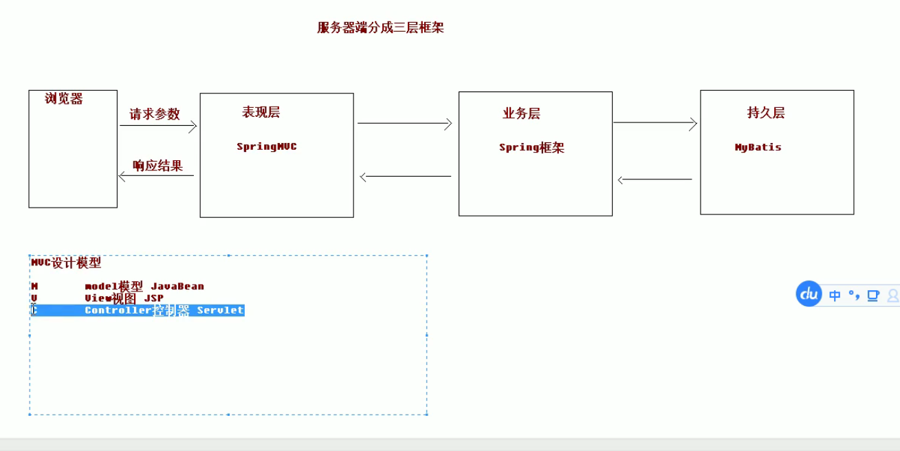


**springmvc的优势**

> 清晰的角色划分

- 前端控制器 DispatcherServlet
- 请求到处理器映射 HandlerMapping
- 处理器适配器 HandlerAdapter
- 视图解析器 ViewResolver
- 处理器或页面控制器 Controller
- 验证器 Validator
- 命令对象 Command——请求参数绑定到的对象叫命令对象
- 表单对象 Form Object 提供给表单暂时和提交到的对象就叫表单对象


## 搭建开发环境

**版本锁定**

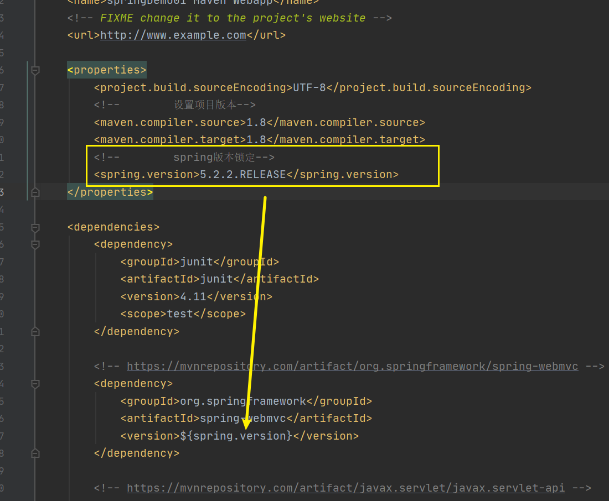


**需要的jar包**

```xml
<!-- https://mvnrepository.com/artifact/org.springframework/spring-webmvc -->
<dependency>
    <groupId>org.springframework</groupId>
    <artifactId>spring-webmvc</artifactId>
    <version>${spring.version}</version>
</dependency>
<!-- https://mvnrepository.com/artifact/javax.servlet/javax.servlet-api -->
<dependency>
    <groupId>javax.servlet</groupId>
    <artifactId>javax.servlet-api</artifactId>
    <version>3.1.0</version>
    <scope>provided</scope>
</dependency>
<!-- https://mvnrepository.com/artifact/javax.servlet.jsp/jsp-api -->
<dependency>
    <groupId>javax.servlet.jsp</groupId>
    <artifactId>jsp-api</artifactId>
    <version>2.2</version>
    <scope>provided</scope>
</dependency>

```


**配置前端控制器**

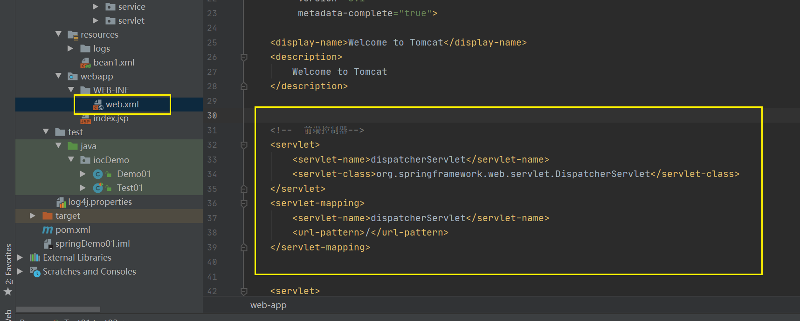


## 入门程序

**创建配置文件**

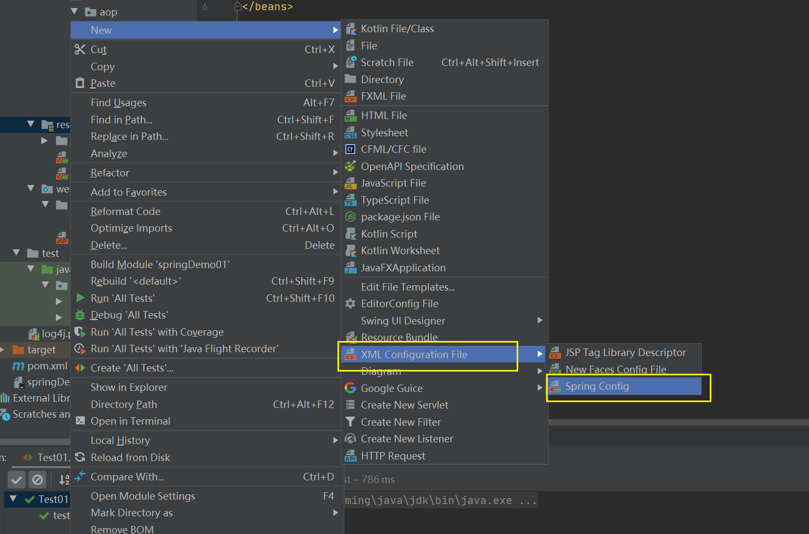


**编写index.jsp页面，点击连接跳转到我们的入门程序**

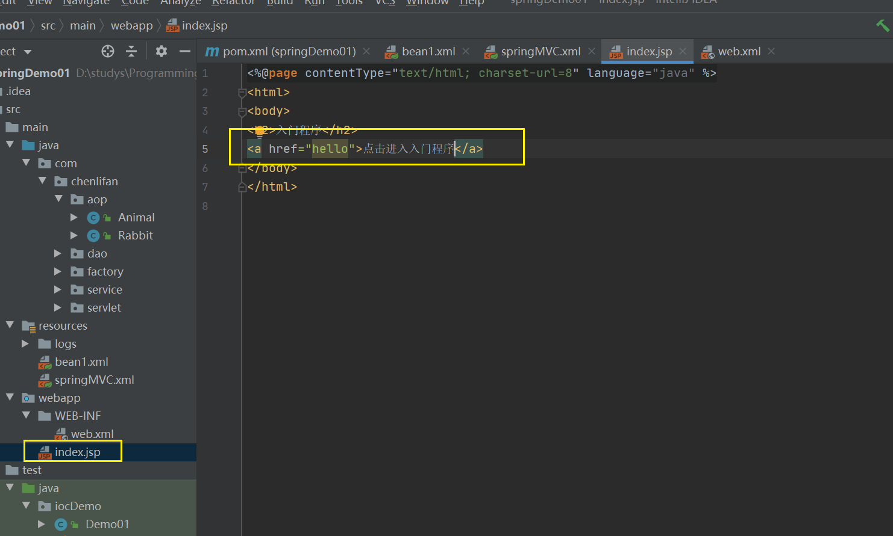


**在springmvc核心文件中配置命名空间 **

[spring-mvc官方文档 需要根据版本选择正确版本的官方文档](https://docs.spring.io/spring-framework/docs/5.0.8.RELEASE/spring-framework-reference/web.html#spring-web)

```xml
<beans xmlns="http://www.springframework.org/schema/beans"
       xmlns:mvc="http://www.springframework.org/schema/mvc"
       xmlns:context="http://www.springframework.org/schema/context"
       xmlns:xsi="http://www.w3.org/2001/XMLSchema-instance"
       xsi:schemaLocation="http://www.springframework.org/schema/beans http://www.springframework.org/schema/beans/spring-beans.xsd
  http://www.springframework.org/schema/mvc
        http://www.springframework.org/schema/mvc/spring-mvc.xsd
  http://www.springframework.org/schema/context
        http://www.springframework.org/schema/context/spring-context.xsd">
```

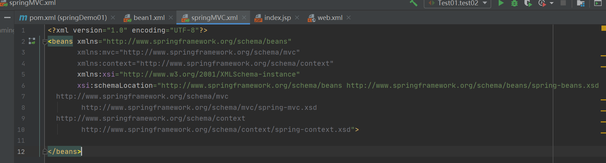


**开启注解扫描**


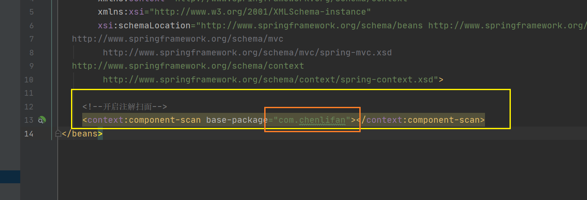


**创建前端控制器控制的类**

> 之前基础的servlet是我们创建一个类，然后继承HttpService，然后在xml中配置这个servlet，然后我们就可以通过浏览器访问
>
> **但是在springmvc中，会有一个类来统一管理这些后台程序，由DispatcherServlet这个spring提供的类来管理，这也是为什么上面的xml中配置这个类的访问路径的原因**


```java
//这个类被前端控制器DispatcherServlet管理
//当用户访问我们的程序,前端控制器根据url映射访问该映射的类的方法
@Controller
public class FirstController {
    //因为前端控制器在xml中配置的路径是/
    //所以用户在浏览器输入loaclhost/springDemo01/hello,就会先进入前端控制器,
    //然后前端控制器会根据映射hello访问到这个方法
    @RequestMapping(path = "/hello")
    public String sayHello() {
        System.out.println("我是第一个控制器的sayHello方法");
        return "/success";//这个与视图控制器有关,现在可以理解为跳转到名字为success的页面
    }

}
```


**让前端控制器获取spring-mvc的核心文件，控制spring管理的类**

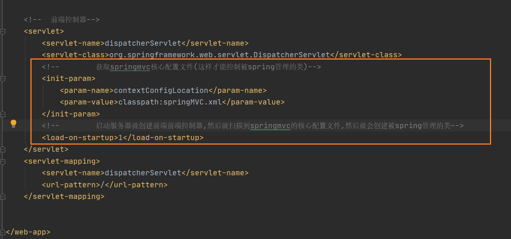


**创建访问成功后，跳转到成功页面**

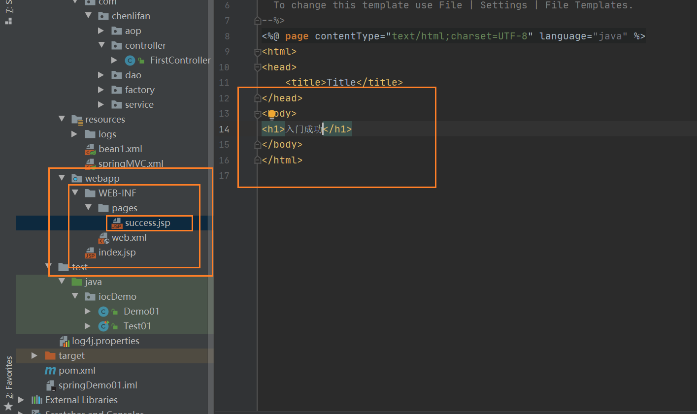


**在springmvc核心配置文件设置视图解析器**

视图解析器是用来解析访问完servlet程序之后跳转的页面

也就是解析前面的return "success"

```xml
<!--    视图解析器-->
<bean id="internalResourceViewResolver" class="org.springframework.web.servlet.view.InternalResourceViewResolver">
    <!--        配置解析完成后,跳转到文件所在的目录  就是说,会寻找到/WEB-INF/pages/这个路径下的pages文件-->
    <property name="prefix" value="/WEB-INF/pages/"/>
    <!--        表示解析完成后,跳转到的文件的后缀名-->
    <property name="suffix" value=".jsp"/>
</bean>
```

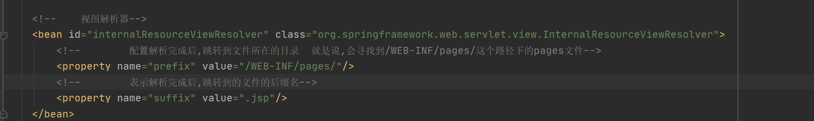


**开启springmvc框架注解的支持**

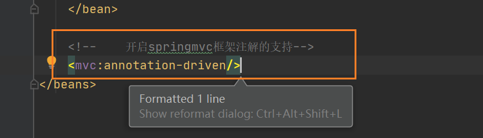


**运行效果如下**

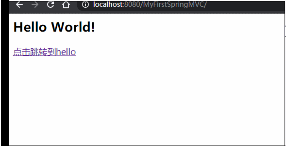


## 案例总结


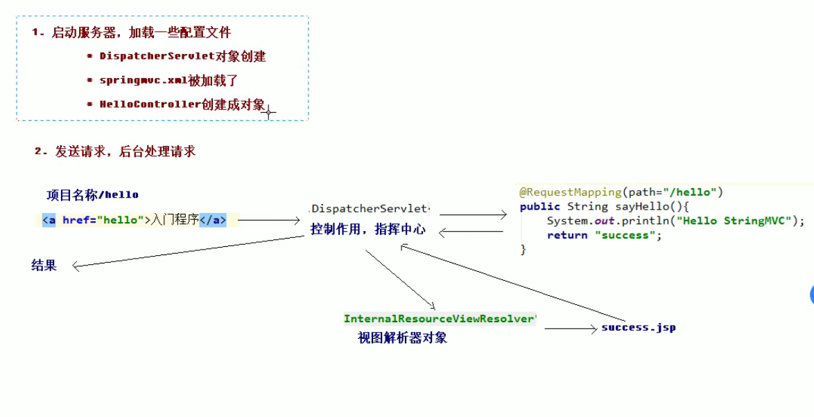


## springmvv组件介绍

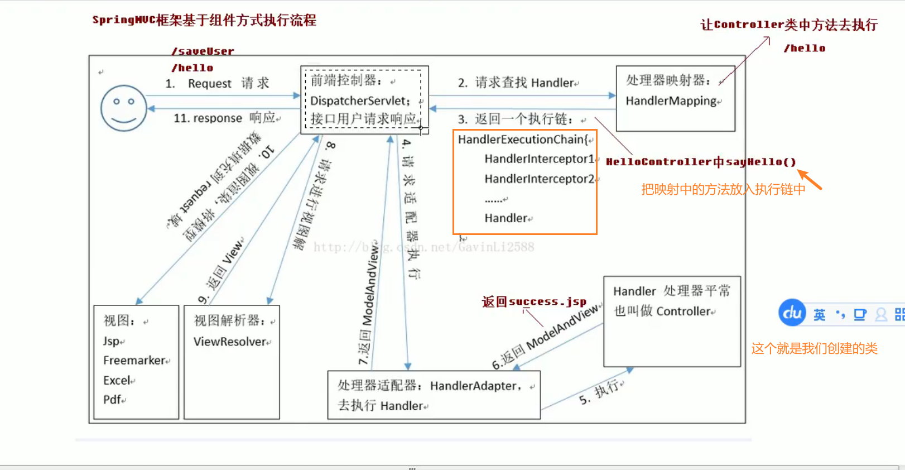


**在上面的项目中，我们配置了前端控制器和视图解析器**

**那么处理器映射器和处理器适配器为什么没有配置呢，其实当我们配置了开启springmvc的注解之后，就相当于，默认打开处理器映射器和处理器适配器了**

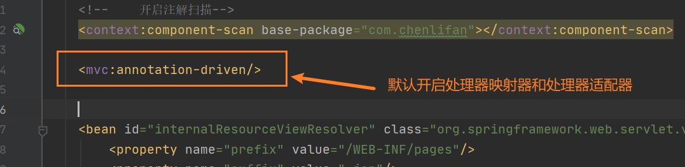


# mcv:view-controller

如果发送的请求不想通过controller，只想直接地跳转到目标页面，这时候就可以使用mvc:view-controller标签
在配置文件中配置:

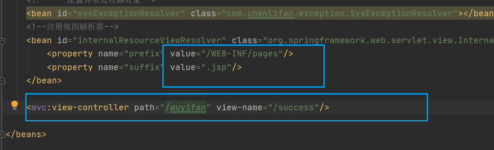

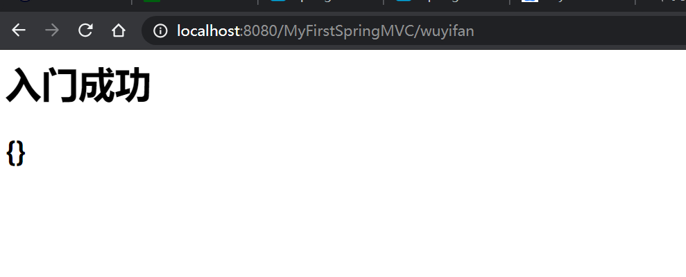


# RequerstMapping

**用与建立请求url和处理请求方法之间对应的关系**


> 如图，request Mapping的源码可知，这个RequerstMapping注解可以放在**方法**上也可以放在**类**上


**演示：把requestMapping用在类上**


## request Mapping注解的属性

- name（不重要）
- value：url映射和处理方法的关系——用来指定请求的url。它和path属性的作用是一样的
- path：url映射和处理方法的关系

> path和value的作用是一样的

- method：当前的处理方法或类能接收请求的方式（POST GET）


- params 用于指定限制请求参数的条件

比如


**还可以限定要求传到的值是什么，比如:arrow_down:**


**要求请求过来的值不能是1000**


- headers  要求发送过来的请求必须包含的请求头


# 请求参数绑定

## **绑定普通参数**


## **绑定实体类型**


## **在Student中封装User**

创建一个user类

```java
package com.chenlifan.entity;

public class User {
    private String username;
    private  String usex;

    @Override
    public String toString() {
        return "User{" +
                "username='" + username + '\'' +
                ", usex='" + usex + '\'' +
                '}';
    }

    public String getUsername() {
        return username;
    }

    public void setUsername(String username) {
        this.username = username;
    }

    public String getUsex() {
        return usex;
    }

    public void setUsex(String usex) {
        this.usex = usex;
    }
}
```

创建student类，定义User的成员属性和getset方法


```java
package com.chenlifan.entity;

public class Student {
    private String name;
    private String age;
    private String sex;
    User user;

    public User getUser() {
        return user;
    }

    public void setUser(User user) {
        this.user = user;
    }

    public String getName() {
        return name;
    }

    public void setName(String name) {
        this.name = name;
    }

    public String getAge() {
        return age;
    }

    public void setAge(String age) {
        this.age = age;
    }

    public String getSex() {
        return sex;
    }

    public void setSex(String sex) {
        this.sex = sex;
    }

    @Override
    public String toString() {
        return "Student{" +
                "name='" + name + '\'' +
                ", age='" + age + '\'' +
                ", sex='" + sex + '\'' +
                '}';
    }
}
```

创建前台页面


> 注意input的name一定要与实体类的属性名一致


创建处理方法


## 绑定list集合类型

继续上面的例子，我们在student中定义list和map属性


创建User对象用来暂存数据


前台代码


后台代码


## 自定义类型转换器演示异常

上面进行了前台传送数据到后台的演示

原理如下


**那么如何传送日期类型的数据呢**

> 如何把前台字符串类型的日期数据，传到后台进行转换

正常来说，springmvc可以自动将日期格式为2020/11/1这种日期字符串自动封装成Date类型的，但是如果是2020-11-1这种日期格式的字符串就不能自动封装


**当我们传送2020-11-1这种日期格式，看看是什么效果**


可以看到，springmvc无法解析这种日期格式的字符产


如何解决呢 

**springmvc让我们自定义类型的转换器**


- 创建一个工具类，实现converter接口
- 在xml文件注册类型转换器


# 获取servlet原生的api

只需要在后台的处理程序添加request和response参数就可以获取了


# RequestParam注解

之前我们进行前后传送数据给后台，要求前台发送请求过来的参数名和处理程序的形式参数名要一致

而当这两个参数名不一致的时候，如何进行数据绑定呢，requestParam就是解决这个问题


# RequestBody

**用来获取请求体的内容，直接使用得到是键值对key  value结果的数据**

**get请求方式不适用**

这个注解是属性:arrow_down:

**require ： 是否必须用请求体，默认值为true，当取值为true时，get请求方式就会报错，如果取值是false，get请求得到的是null**


可以通过Map List来装载前端的数据，如下


# PathVariable

**用来绑定url中的占位符，例如：请求url中/delete/{id}，这个{id}就是url占位符**

url支持占位符是spring3.0之后加入的，是springmvc支持rest风格url的一个重要标志


**属性**

- value:用于指定url中占位符名称
- required：是否必须提供占位符


## rest风格Url


**演示**


## 基于HiddentHttpMethodFilter的示例

**作用**


# RequestHeader（一般不怎么用）

**作用**

用户获取请求消息头


**属性**

value：提供消息头名称

required：是否必须有此消息头


# CookieValue

**作用**

**用于把指定cookie名称的值传入控制器方法参数**


**属性**

value：指定cookie的名称

required：是否必须有此cookie


**演示**

因为当我们通过浏览器访问服务器的时候，服务器就会为我们的浏览器默认开启一个session空间

然后就会返回浏览器创建一个cookie


# ModelAttribute注解

**作用**

> 可以作用的方法上和参数上
>
> **出现在方法上**，表示当前方法会在控制器的方法执行之前，先执行，它可以修饰没有返回值的方法，也可以修饰具体返回值的方法
>
> 出现在参数上，获取指定的数据给参数赋值。

**属性**

> value 用于获取数据的key，key可以是pojo的属性名称，也可以是map结构的key

**应用场景**


> 就是说，这个注解下的方法会优先与其他控制器的方法执行


**演示**（ModelAttribute注解的方法有返回值的情况）

前台数据我只传入名字和性别，但是不输入日期，如果用普通的直接用处理程序接收我这个前台的数据，

那么User对象的date属性就会为null，输出也为null，那么通过ModelAttribute注解，

当请求访问到后台的时候，就先执行被ModelAttribute注解的方法，提前自动输入date的值


> 前台输入两个属性


> User对象


**演示**（modelAttribute注解的方法没有返回值的情况）


# SessionAttributes注解

**作用**

用于多次执行控制器方法间的参数共享

**属性**

value：用于指定存入的属性名称

type：用于指定存入的数据类型


## 如何在springmvc中对request域进行存入值


## sessionattributes注解演示

**将request域中的值共享到sessionattributes中**

查看sessionattribute注解的源代码


> 可以看到这个注解是作用在类上面的


**演示**


> 在处理程序的类上加上SessionAttributes注解


## 获取session中的值


## 清除session中的内容的方法


# 响应返回数据


## 返回String类型

就是上面我们演示的方式，访问的处理程序的返回值类型是String


## 返回值是void类型


**演示**


> 可以看到访问到了这个处理程序

**但是**


> 前台报错了，可以看到，springmvc中，返回值是void的时候，默认是会返回我们uri的页面的，因为我们没有在WEB-INF/pages下提供这个页面，所以就报404错误

**解决返回值是void的响应的方法**

- 创建一个和uri一样名字的页面，让访问自动跳转到这个页面
- 通过servlet进行跳转
- 通过servlet进行重定向
- 通过response.getwrite.print响应回当前页面


****

## 返回值类型是ModelAndView

- ModelAndView对象是Spring提供的一个对象，可以用来调整具体的JSP视图


**像上面的返回String类型的处理方法，其实底层上还是通过ModelAndView来实现的**


**演示**


## 使用forward和redirect进行页面跳转（使用关键字的方式）

**当使用这两种方法，是无法使用视图解析器来处理的**


# 响应JSON数据

## 过滤静态资源

- 搭建异步环境

导入jQuery


创建一个button，设置点击事件，看能否运行jQuery


> 可以看到，代码没有问题，但是点击按钮并没有触发事件

**这是因为我们配置了springmvc的前端控制器，而前端控制器是会拦截我们所有的静态资源的，其中我们引入jQuery文件的路径就被拦截了，所以jQuery并不生效**


**那么如何解决这个问题呢**

我们需要在springmvc的核心配置文件中设置


> 告诉前端控制器什么静态资源不拦截

**注意，在javaweb项目中，路径最好是用/而不是\\**


> 虽然浏览器可以自动转换，但是\\并不规范，应该替换成\\\或者/

然后就可以调用到jQuery


## 通过Ajax向后台传json 数据


> **值得注意的是，之前我们方法返回void类型的处理程序，springmvc是会默认跳转到我们uri的页面的**
>
> **而当我们使用Ajax发送异步请求，是不会发生任何跳转的**


## 后台获取到前台json数据，将json封装到对象中

- 首先需要导入jackson依赖（**注意2.7.0以下的版本不能使用**）

```xml
    <!--    jackson需要的jar包-->
    <!-- https://mvnrepository.com/artifact/com.fasterxml.jackson.core/jackson-databind -->
    <dependency>
      <groupId>com.fasterxml.jackson.core</groupId>
      <artifactId>jackson-databind</artifactId>
      <version>${jackson.version}</version>
    </dependency>
    <!-- https://mvnrepository.com/artifact/com.fasterxml.jackson.core/jackson-core -->
    <dependency>
      <groupId>com.fasterxml.jackson.core</groupId>
      <artifactId>jackson-core</artifactId>
      <version>${jackson.version}</version>
    </dependency>
    <!-- https://mvnrepository.com/artifact/com.fasterxml.jackson.core/jackson-annotations -->
    <dependency>
      <groupId>com.fasterxml.jackson.core</groupId>
      <artifactId>jackson-annotations</artifactId>
      <version>${jackson.version}</version>
    </dependency>
```


# springmvc文件上传

- 导入需要的jar包（借助这些第三方的组件实现文件上传）

```xml
   <!-- https://mvnrepository.com/artifact/commons-fileupload/commons-fileupload -->
    <dependency>
      <groupId>commons-fileupload</groupId>
      <artifactId>commons-fileupload</artifactId>
      <version>1.3.1</version>
    </dependency>
    <!-- https://mvnrepository.com/artifact/commons-io/commons-io -->
    <dependency>
      <groupId>commons-io</groupId>
      <artifactId>commons-io</artifactId>
      <version>2.4</version>
    </dependency>
```


- 文件上传的前提

> form表单的enctype取值必须是：`multipart/form-data`   默认值是: `application/x-www-form-urlencoded`
>
> enctype表示表单请求正文的类型
>
> method：post （必须）
>
> 提供一个文件选择域 `<input type="file"/>`


- 文件上传原理

> 当forrm表单的enctype取值不是默认值之后，request.getparameter()将失效
>
> 
>
> 


## 传统的文件上传方式


## springmvc的方式文件上传

**原理**


**配置文件解析器对象**


**代码**


**传统方式和springmvc方式对比**


## 跨服务器上传分析（环境搭建——文件服务器创建）


**在实际开发中，我们会有很多处理不同功能的服务器**

> 应用服务器：负责部署我们的应用
>
> 数据库服务器：运行我们的数据库
>
> 缓存和消息服务器：负责处理大并发访问的缓存和消息
>
> 文件服务器：负责存储用户上传文件的服务器

**什么是跨服务器的文件上传**


**需要用到的jar包 **

```xml
 <!-- https://mvnrepository.com/artifact/com.sun.jersey/jersey-client -->
    <dependency>
      <groupId>com.sun.jersey</groupId>
      <artifactId>jersey-client</artifactId>
      <version>1.18.1</version>
    </dependency>

    <!-- https://mvnrepository.com/artifact/com.sun.jersey/jersey-core -->
    <dependency>
      <groupId>com.sun.jersey</groupId>
      <artifactId>jersey-core</artifactId>
      <version>1.18.1</version>
    </dependency>
```


**搭建一个图片服务器**


**然后再简单地修改一个index.jsp，就完成了，因为这个服务器主要是用来保存上传文件的，所以并不需要进行过多的配置**


**然后就可以启动这个服务器了**


## 跨服务器文件上传实战

- **导入jersey-client和jersey-core两个jar包在应用服务器**


**然后运行试一下**

报错了


这是因为上传文件服务器的target目录下没有生成upload，就是这个服务器的部署路径没有upload文件，所以我们手动生成一下


还有另一种可能（最有可能）

因为我们的tomcat服务器是默认不允许文件写入的，所以我们要在conf/web.xml加入如下


**然后我们在再次上传一次**


# Springmvc的异常处理

**异常处理思路**

Controller调用Service，Service调用Dao，异常多是向上抛的，最终由DispatcherServlet找异常处理器进行异常处理

**Springmvc的异常处理**


## 什么都不处理下的抛出异常


## springmvc异常的处理方式

- **编写自定义异常类（做提示信息）**

```java
public class SysException extends Exception {
    private String exceptionMessage;

    public String getExceptionMessage() {
        return exceptionMessage;
    }

    public void setExceptionMessage(String exceptionMessage) {
        this.exceptionMessage = exceptionMessage;
    }

    //要求使用这个对象，必须传入错误信息
    public SysException(String exceptionMessage) {
        this.exceptionMessage = exceptionMessage;
    }
}
```


- **改造一下controller代码**

```java

    @RequestMapping(path = "/throwsExceptionDemo")
    public String throwsExceptionDemo() throws Exception {

        try{
            //模拟异常
            int i = 1 / 0;
        }catch(Exception e){
            //在控制台打印信息
            e.printStackTrace();
            //向前端控制器抛出自定义异常信息
            throw  new SysException("除数不能为0");
        }

        return "/success";
    }
```


- **创建异常处理器对象**


- **创建error页面**


- **配置异常处理器对象**


**演示**


**异常处理器处理过程**


# SpringMVC拦截器


## 拦截器的代码实现（预处理方法）

1. 编写拦截器类，实现HandlerIntercepter接口
2. 配置拦截器


**创建controller方法和jsp连接链接**


**当拦截器不放行，直接跳转到其他页面**


## 后处理的方法


**在后处理方法添加页面跳转，这样就不会跳转到success方法了**


## 最后执行的方法

**success.jsp方法执行之后最后执行的方法**


## 配置多个拦截器

**创建第二个拦截器**


**在xml把这个拦截器配置进去**


**运行结果**


**拦截器的排列顺序和在springmvc核心文件配置的拦截器的顺序有关**


# 配置解决中文乱码的过滤器

```xml
<!--filter最好放在servlet之前,否则会有意想不到的错误出现-->
<filter>
    <filter-name>characterEncodingFilter</filter-name>
    <filter-class>org.springframework.web.filter.CharacterEncodingFilter</filter-class>
    <init-param>
        <param-name>encoding</param-name>
        <param-value>UTF-8</param-value>
    </init-param>
</filter>
<filter-mapping>
    <filter-name>characterEncodingFilter</filter-name>
    <url-pattern>/*</url-pattern>
</filter-mapping>
```


# springmvc可能出现的问题

**这是springmvc的问题总结，如果是spring的问题，点击下面连接跳转**

[spring问题总结](#spring可能出现的问题)


## 解决相同jar包不同版本报错的问题（一定要搞版本锁定）


> 这个问题我的解决是，因为我之前pom导入依赖导入了同样的jar包的不同版本，导致tomcat项目中的lib目录下的ja包有一样的jar包不同版本
>
> 我第一解决的方法是重新布置项目，重新打代码，我认为下一次的解决方法应该是直接在target下的lib包下删除没有用的jar包
>
> **所以这就体现了版本锁定的重要性，spring项目的jar包一定要一样的版本，不然会报错**


## filter最好放在最前面，否则会有意想不到的意外出现


## springmvc核心文件可能不生效的问题

我在配置前端孔子其，告诉它不要拦截静态资源

但是怎么配置都没有找到jQuery文件，

然后我发现springmvc核心文件上面有这个显示


点击进去后有这四个选项，然后我选择了第二个 ，然后就能找到jQuery文件了


****

# Spring Boot

[springboot快速入门文档](https://spring.io/guides/gs/rest-service/)


**背景**

j2ee笨重的开发、繁多的配置、地下的开发效率、发杂的部署流程、第三方技术继承难度大

**解决**

- spring全家桶
- spring boot——> j2ee一站式解决方案
- spring cloud ——>分布式整体解决方案

**spring boot是对spring框架的再封装**

> spring boot 来简化spring应用开发，约定大于配置，去繁从简，just run 就能创建一个独立的，产品级别的应用


## 入门

> - 简化spring应用开发的一个框架
> - 整个spring技术栈的一个大整合
> - j2ee开发的一站式解决方案


### 微服务简介

微服务：架构风格

> 一个应用应该是一组小型服务，可以通过HTTP的方式进行互通


 **传统的应用**


**微服务应用**


> 每一个功能元素最终都是一个可独立替换和独立升级的软件单元


### 环境准备


**maven设置**

在maven 的conf/settings中添加一个配置（告诉mavenjdk的版本）

```xml
    <profile>
      <id>jdk-15</id>
      <activation>
        <activeByDefault>true</activeByDefault>
        <jdk>15</jdk>
      </activation>
      <properties>
        <maven.compiler.source>15</maven.compiler.source>
        <maven.compiler.target>15</maven.compiler.target>
        <maven.compiler.compilerVersion>15</maven.compiler.compilerVersion>
      </properties>
    </profile>
```


**在idea中配置maven**


**导入jar包依赖**


### spring boot hello word

浏览器发送一个请求，服务器接收，响应一个hello word 字符串


**创建一个spring boot工程**


> 这样一个maven工程就创建完成了


**然后配置maven**


**导入spring boot相关的依赖**

 

**关于parent标签的解析**


**编写一个主程序；启动spring boot应用**


**编写一个controller类**


**然后就可以启动main方法了**


**在浏览器输入local host:8080**


### 将应用打包成一个可执行的jar包

**这样我们就不需要在服务器中配置tomcat了**


> 在pom文件配置这个


**那么如何打包成jar包呢**


**然后在控制台查看信息**


**然后我们运行这个jar包**


> 进入cmd

**然后用Java -jar的命令运行这个jar包**


**记得启动这个jar包之前把idea的spring boot关闭掉，否则会端口冲突**


然后这样就启动成功了


**我们解压这个jar包**


可以看到我们写的被编译的Java代码


> 然后这个spring boot所有的jar包


### pom文件解析


> 如果我们在子项目中导入的依赖在dependencies里面没有管理，依然需要版本号


在官网可以看到


> 需要什么就导入相关的依赖
>
> **spring boot将所有的功能场景都抽取出来，做成一个个的starters（启动器），只需要在项目中引入这些starters相关场景的所有依赖都会导入进来。要用什么功能就到入什么场景启动器。**


### 主程序类、主入口类


点击@SpringbootApplication查看源代码


 **@springbootconfiguration**

**这个注解注释在类上，就说明这个类是spring boot的配置类**

> 被这个注解注释的类，就会变成一个配置类
>
> 配置类  ==  配置文件 ——配置类也是容器中的一个组件 @Component


 **@EnableAutoConfiguration**

**开启自动配置功能**

点击这个注解查看源代码


**从上到下，其实到了这里，想表达的是**

在我们之前的学习的spring和springmvc中，我们都需要创建一个核心配置文件，如果想让spring管理bean，就必须在核心配置文件中创建bean或者开启注解扫描，而注解扫描是有范围的

> 上面的@autoconfigurationPackage:是将主配置类@SpringbootApplication的所在的包及下面所有的子包里面的所有组件扫描到spring容器中

那么在spring boot中，我们在application类上层文件夹创建一个controller，看 是否能访问到


然后我们在这个浏览器访问这个页面


> 可以看到这是跳到了错误页面
>
> 因为这个controller类不是@springbootapplication类所在包及以下


**Spring boot在启动的时候从类路径下的META-INF/spring.factories中获取EnableAutoConfiguration执行的值，将这些值作为自动配置类导入到容器中，自动配置类就生效，帮我们进行自动配置工作**


> 这些是我们自己需要配置的东西，自动配置类都帮我们完成了。


j2ee的整体整合解决方案和自动配置都在如下


### 快速创建spring boot应用


点击finish之后，idea就会联网创建spring boot项目


**@ResponseBody也可以注释在类上**


### @RestController

@RestController就是@responsebody和@Controller的合体形式

直接在类上注解@RestController就等于上面两个注解


### idea initializer快速创建spring boot项目文件解析


### 热部署


### 修改spring boot启动的banner（好玩的东西）

百度搜索bootschool

[bootschool](https://www.bootschool.net/ascii-art/search)

选择一个拷贝下来


在resources文件夹下创建一个banner.txt文件，把上面的banner拷贝进去这个文件


然后重启spring boot


****

## springboot配置


**演示**

创建一个yml文件，修改服务端口号为9090


### yaml语法

key:(空格)value   表示一对键值对（空格必须 有）

以空格的缩进来控制层级关系；只要是左对齐的一列数据，都是同一个层级


### yaml配置文件值获取

**案例**

创建两个对象

一个animal和一个rabbit

在animal中创建rabbit成员属性

这两个实体类都生成getset  toString方法


**在application.yaml中设置值**


导入配置文件处理器


```xml
<dependency>
    <groupId>org.springframework.boot</groupId>
    <artifactId>spring-boot-configuration-processor</artifactId>
    <optional>true</optional>
</dependency>
```

> 导入下载完成之后，重启spring boot


**配置animal绑定yaml属性的值**


**在spring boot单元测试输出animal对象**


> 如图：成功运行


**小贴士**

在配置文件中，可以用这种写法（-后面的第一个字母大写）

```
lastName 等于 last-name
```

****


### 在properties文件中设置属性值


### 解决properties文件中文乱码问题


再次运行test


可以看到就不乱码了


### ConfigurationProperties和value的区别

**松散语法绑定**


都能获取yaml和properties的值


**value举例**


> 总结：
>
> 在某个业务逻辑中需要获取一下配置文件中的某项值，使用@Value
>
> 专门编写了一个JavaBean来和配置文件进行映射，我们就直接使用@ConfigurationProperties


### @PropertySource  @ImportResource @Bean @Configuration


**创建一个animal.properties文件专门用来存放属性值**


> @PropertiesSource默认是不支持yml文件的


**@ImportResource：导入spring的配置文件，让配置文件里面的内容生效**


> spring boot 里面没有spring的配置文件，我们自己编写的配置文件，和不能自动识别；
>
> 想让spring的配置文件生效，在主程序类加@importSource


**在程序类添加@ImportResource**


就能读取到配置文件


**但是spring boot不推荐这种方式**

推荐使用配置类  配置类====配置文件


**创建配置类**


### 配置文件占位符

1. 随机数

> ```properties
> ${random.value}、${random.int}   ${random.long}
> ${random.int(10)}   ${random.int[1024,65536]}
> ```

2. 占位符获取之前的配置的值，如果没有可用指定的默认值

> 


### profile多环境支持

**springboot的多环境支持，因为在开发、测试、运行，配置文件有可能不同**

> 开发人员用开发环境
>
> 项目发布用运行环境
>
> 测试期间用测试环境


**多profile文件**


**在原本properties文件的基础上，再创建两个properties 文件，设置不同的端口号**


**然后我们激活其他配置文件**


**通过yaml文件解决多环境配置问题**

在yaml文件中，就不需要创建多个properties文件了，而是在一个yml文件中指定多个文档块


除了如上的spring.profiles.active的方式激活，还有**命令行**的方式激活


然后就调用到prod的配置了


**还有一种是通过命令行的方式**

先把项目打包成jar包，然后在命令行中执行

其实就是和上面的idea图形化界面配置的一样，只是这是直接在cmd中配置，而不是通过idea帮我们配置 


**最后一种是虚拟机参数**


重新启动spring boot，可以看到是 使用的prod的生产环境


> **总结：优先级**
>
> 命令行参数> 虚拟机参数> properties文件参数


### 配置文件加载位置


**springboot会从这四个位置全部加载主配置文件：互补配置**

**演示**

在项目根路径下创建一个application.properties

在类路径的config目录下创建一个application.properties


设置项目根路径下创建一个application.properties的端口号为8085

设置类路径的config目录下创建一个application.properties设置项目访问路径为/chenlifan


**通过spring.config.location来改变默认配置，就是改变上面不同文件路径的优先级**

项目打包好以后，我们可以使用命令行参数的形式，启动项目的时候来指定配置文件的新位置；指定配置文件和默
认加载的这些配置文件共同起作用形成**互补配置**

> 就是在项目打包后，通过命令行的方式使用spring.config.location来配置默认配置


### 外部配置加载顺序


**通过命令行的方式设置端口号**

将项目打包成jar包之后


**jar包外配置文件演示**

将项目打包成jar包

在jar包的同一文件夹下创建一个properties文件


配置文件设置


然后在cmd不输入任何参数启动jar包


可以看到，已经默认加载了jar包外部的配置文件，，端口号一致


****


### 自动配置的原理

 

在spring boot官网可以查看配置文件的各种键值对

[Common Application properties](https://docs.spring.io/spring-boot/docs/current/reference/html/appendix-application-properties.html#data-properties)


**自动配置的原理**


**spring boot 已经提前将所有不同版本的依赖管理起来了**


> spring-boot-dependencies：核心依赖在父工程中
>
> 我们在写或者引入一些spring boot依赖的时候，不需要执行版本，因为已经由这些版本仓库

**启动器**

spring-boot-starter：这个东西说白了就是springboot的启动场景

比如


> spring -boot -starter-web 就会帮我们导入web环境所需要的所有依赖


spring boot会将所有的功能场景，都变成一个个的启动器

我们需要什么功能，就只需要找到对象的启动器，在官网可以查看[Common Application properties](https://docs.spring.io/spring-boot/docs/current/reference/html/appendix-application-properties.html#data-properties)


**主程序**


> springbootapplication启动类下的所有资源被导入

**@SpringbootConfiguration**


@EnableAutoConfiguration注解表示开启自动配置功能，以前需要配置的东西，spring boot帮我们自动配置


@EnableAutoConfiguration中导入了AutoConfigurationPackages

这个的作用是将主配置类的所在包及下面子包里面所有的组件扫描到spring容器中


> 这个东西说白了就是想要组件生效，就必须在主配置类所在的包已经这些包的下
>
> 


@Import({AutoConfigurationImportSelector.class})会给容器中导入非常多的自动配置类，就是给容器中导入每个场景需要的所有组件，并配置好这些组件（就是上面说的starters，需要web就导入spring boot starter web场景的组件）


> 就是在pom文件中导入的starter依赖
>
> 


### 关于自动配置（知乎上比较和的文章）

[自动配置原理](https://zhuanlan.zhihu.com/p/55637237)


### 主启动类是怎么运行

**SpringBootApplication主要做了四件事情**

> 判断这个应用的类型是普通的项目还是web项目
>
> 查找并加载所有的可用初始化器，设置到initializers属性中
>
> 找出所有的应用程序监视器，设置到listeners属性中
>
> 推断并设置main方法的定义类，找到运行的主类


### 关于spring boot谈谈你的理解

- 自动装配
- run()

> 判断这个应用的类型是普通的项目还是web项目
>
> 查找并加载所有的可用初始化器，设置到initializers属性中
>
> 找出所有的应用程序监视器，设置到listeners属性中
>
> 推断并设置main方法的定义类，找到运行的主类


### @Conditional和自动配置报告


**自动配置类必须再一定的条件下才能生效**
我们怎么知道哪些自动配置类生效
我们可以通过席用 debug=true属性；来让控制台打印自动配置报告，这样我们就可以很方便的知道哪些自动配置
类生效


**看源码看不懂以后再深追**


## 日志

### 日志矿建分类和选择


> jboss不适合普通程序员    jcl最后一次更新是2014    所以选择slf4j
>
> 因为我们选择的是slf4j，而日志实现里面log4j和logback和slf4j是出自同一个人的，所以选择logback，logback比log4j先进


**Spring boot**：底层是spring框架，spring框架默认是用jcl；

> springboot 选用slf4j和logback


### slf4j的使用原理

**如何在系统中使用slf4j**

> 以后开发的时候，日志记录方法的调用，不应该来直接调用日志的实现类，而是调用日志抽象层里面的方法,这样就能自动调用实层的方法


> 每一个日志的实现框架都有自己的配置文件，使用slf4j以后，配置文件还是做成日志实现框架的配置文件


### 其他日志框架统一转换为slf4j

在日常开发中，会有很多种框架


> 在我们自身使用slf4j和logback的同时还会有其他框架内置的日志，比如hibernate内置jboss-logging日志
>
> 那么我们如何把这些日志都统一为使用slf4j输出日志信息呢


> 如何让系统种所有的日志都统一到slf4j
>
> 1. 将系统种其他日志框架先 排除出去
> 2. 用中间包来替换原有的日志框架
> 3. 导入slf4j其他的实现


### spring boot日志关系


> springboot 底层也是使用slf4j+logback的方式进行日志记录
>
> spring boot也把其他日志都替换成了slf4j
>
> 中间转换包
>
> 
>
> 如果我们要 引入 其他框架，一定要把这个框架的默认日志依赖 移除掉
>
> spring框架用的是commons-logging
>
> spring boot能 自动适配所有日志，而底层使用slf4j+logback的方式记录日志，引入其他框架的时候，只需要把这个 框架依赖的日志框架排除掉


### spring boot默认配置

#### 配置日志输出等级

**spring boot默认帮我们配置好了日志**


在配置文件中设置项目输出的日志级别为trace


**默认的日志输出是在控制台输出的，那么怎么把日志输出到文件呢**


#### logging.file.name演示

> 一般是使用loggin.path

```properties
#将日志输出到指定的文件
logging.file.name=D:spring.log
```

**演示**

启动test输出日志 


> 如图，设置日志输出到d盘


#### logging.file.path演示

```properties
#在当前磁盘的根路径 下创建spring文件夹和里面的log文件夹，使用spring.log作为默认文件
logging.file.path=/spring/log
```

**path演示**


#### 设置控制台日志输出格式


**默认的日志输出格式**


**自定义日志输出格式**


**设置文件中日志的输出格式**


### 指定日志文件和日志profile功能

**查看spring boot默认的日志输出格式**


> 打开这个文件就能查看默认的日志输出格式


**指定配置**


> 给类路径下放上每个日志框架自己的配置文件；spring boot就不使用他默认的日志配置文件
>
> logback.xml直接就被日志框架识别
>
> logback-spring.xml日志框架就不直接加载日志的配置项，由spring boot解析日志配置，可以使用spring boot的高级profile功能
>
> 


### 切换日志框架

了解即可，一般不会切换到log4j


## spring boot web开发


### 静态资源映射规则


#### webjars：以jar包的方式引入静态资源

[webjars官网](https://www.webjars.org/)

**所以是什么意思呢**

就是前端的一些jQuery bootstrap以maven的方式提供


尝试导入jQuery


那么如何使用这些文件呢


> 如上，就能通过jar包的方式存放在项目里面了


#### **如果是自己定义的资源 呢，应该如何存放这些资源在项目中**


在类路径（classpath）下创建如上四个文件夹


**然后就可以在static中存放静态资源，比如我存放Layui的资源**

然后就访问一下试试


> 注意如果自定义静态资源访问出现404问题，需要clean一下maven
>
> 


#### **欢迎页：静态资源文件夹下所有的index.html页面**


#### **设置浏览器图标**

首先在icon库中下载一个png图标，然后转换成ico

然后重命名图标的名字为favicon

把图标放置在resource文件夹下

然后重启springboot，关闭所有的浏览器


#### 自定义静态资源文件夹夹


> 在properties中设置静态文件夹
>
> 然后创建一个hello文件夹
>
> 把js文件放进去
>
> clean一下maven
>
> 重启spring boot


**自定义文件夹之后，原本默认的静态文件夹就会失效**


### thymeleaf模板引擎


- 导入thymeleaf依赖

```xml
        <dependency>
            <groupId>org.springframework.boot</groupId>
            <artifactId>spring-boot-starter-thymeleaf</artifactId>
        </dependency>
```


#### thymeleaf语法

查看源码


> 就类似我们之前学的前端解析器

**演示**


**在 html页面设置thymeleaf语法提示**


****


**thymeleaf语法规则**

- th:任意html属性；来替换原生属性的值


**thymeleaf语法等到用到时候百度就可以了**

[thymeleaf教程](https://www.cnblogs.com/jerry126/p/11531310.html)


**演示**


#### 关闭模板引擎缓冲


****

### 扩展和全面接管springmvc

**之前的springmvc，如果我们想通过请求直接访问页面不通过controller或者设置拦截器，我们需要在springmvc配置文件中设置，如下**


**那么在spring boot中，就需要创建一个配置类来扩展mvc的功能**

来配置这些东西

**通过配置类，来实现上面核心配置文件的mvc:view-controller**


> 这种方式是既保留了springmvc给我们的配置，也扩展了springmvc的配置


**全面接管springmvc的意思是，我们配置的配置类，完全覆盖springmvc给我们默认的配置，就是之前的springmvc配置全部失效，所有有关springmvc的配置都由我自己创建的配置类控制**

在全面接管之前，spring boot默认配置好视图解析器的

访问一下我们的index页面


当我们全面接管springmvc配置，然后我们的配置类暂时不配置视图解析器


> 如图页面访问变404了。因为我们的配置类没有配置视图解析器


## 注解

### @Data  @AllArgsConstructor  @NoArgsConstructor

**idea安装一个插件**


**重启idea**

**首先需要导入依赖**

```xml
<!-- https://mvnrepository.com/artifact/org.projectlombok/lombok -->
        <dependency>
            <groupId>org.projectlombok</groupId>
            <artifactId>lombok</artifactId>
        </dependency>
```


**演示**


- @Data : 注解在类上, 为类提供读写属性, 此外还提供了 equals()、hashCode()、toString() 方法
- @Getter/@Setter : 注解在类上, 为类提供读写属性
- @ToString : 注解在类上, 为类提供 toString() 方法
- @Slf4j : 注解在类上, 为类提供一个属性名为 log 的 log4j 的日志对象
- @Log4j : 注解在类上, 为类提供一个属性名为 log 的 log4j 的日志对象


**@AllArgsConstructor  @NoArgsConstructor**

> 第一个是带参构造，第二个是无参构造


## 员工管理系统


### 前期准备

**idea安装一个插件**


**重启idea**

**首先需要导入依赖**

```xml
<!-- https://mvnrepository.com/artifact/org.projectlombok/lombok -->
        <dependency>
            <groupId>org.projectlombok</groupId>
            <artifactId>lombok</artifactId>
        </dependency>
```


**导入前端模板**


**创建实体类模拟数据库**


**在dao层模拟一个数据库**

```java
@Repository
public class DepartmentDao {
    private static Map<Integer, Department> departmentMap = null;


    static {
        departmentMap = new HashMap<>();
        departmentMap.put(001, new Department(001, "教学部"));
        departmentMap.put(002, new Department(002, "市场部"));
        departmentMap.put(003, new Department(003, "营销部"));
        departmentMap.put(004, new Department(004, "技术部"));
        departmentMap.put(005, new Department(005, "后勤部"));
    }


    //获取部门所有的信息
    public Collection<Department> getAllDepartment() {
        return departmentMap.values();
    }

    //通过id获取一个部门
    public Department getDepartmentById(Integer id) {
        return departmentMap.get(id);
    }
}
```

**模拟员工数据库**

```java
@Repository
public class EmployeeDao {
    private static Map<Integer, Employee> employeeMap = null;

    @Autowired
    private DepartmentDao departmentDao;

    static {
        employeeMap = new HashMap<>();
        employeeMap.put(10001, new Employee(10001, "吴亦凡", "546809@qq.com", 0, new Department(001, "教学部"), new Date()));
        employeeMap.put(10002, new Employee(10002, "吴亦凡", "213809@qq.com", 1, new Department(002, "市场部"), new Date()));
        employeeMap.put(10003, new Employee(10003, "吴亦凡", "8891239@qq.com", 1, new Department(003, "营销部"), new Date()));
        employeeMap.put(10004, new Employee(10004, "吴亦凡", "8546809@qq.com", 1, new Department(004, "技术部"), new Date()));
        employeeMap.put(10005, new Employee(10005, "吴亦凡", "8546809@qq.com", 1, new Department(005, "后勤部"), new Date()));
    }

    //  查询全部员工
    public Collection<Employee> getAllEmp() {
        return employeeMap.values();
    }

    //通过id查询员工
    public Employee getEmployeeByid(Integer id) {
        return employeeMap.get(id);
    }

    //删除员工byid
    public void delete(Integer id) {
        employeeMap.remove(id);
    }

    //主键自增
    private static Integer initID = 1006;

    public void addEmp(Employee employee) {
        if (employee.getId() == null) {
            employee.setId(initID++);
        }
        employee.setDepartment(departmentDao.getDepartmentById(employee.getDepartment().getId()));
        employeeMap.put(employee.getId(), employee);

    }


}
```


### 首页实现

欢迎页的设置

输入/或者输入/index.html自动跳转到index


**修改index.html页面**


> **注意，如果是经过thymeleaf渲染的页面，需要把路径改为thymeleaf格式的，如果是直接通过浏览器请求不经过thymeleaf渲染的就可以直接使用相对路径**

**视频教学中所有的静态资源文件（如上）都是用thymeleaf接管@{}，但是 我用了相对路径解决，这两种方法都是可以的。**

**在修改了项目的根路径之后，一样都能访问到的**


### 页面国际化

**就是一个页面点击中文，页面变成中文，点击英文，页面全部切换成英文**


**第一步是确保所有的编码都是utf-8**


**实操演示**


**设置每个页面不同的语言**


**配置properties**


> 这个配置是用来绑定我们properties文件的


然后我们操作一下页面

修改index页面


然后访问


可以看到，please login in 改成了请登录

**然后我们继续进行国际化**


**上面都是默认写死的东西，那么应该如何切换不同语言呢**

- 第一步是在自己的配置类中扩展springmvc配置实现LocaleResolve接口


**查看一下源代码**


**注意，一下实验是在语言环境为中文的情况下实现的**

**修改前台代码**


**创建一个国际化解析器组件**


**然后将这个解析器在springmvc配置中注册**


>  这个bean是向上转型 ，覆盖原本的resolveLocale方法


**然后重启spring boot，查看一下效果**


**总结**

> 


### 登录功能的实现

- 设置index的form表单的请求路径

> 设置usernname和password

**注意要修改前端页面的路径**


- **编写一个controller**

> 验证成功跳转到dashboard   失败跳转到index


**修改前端页面**


然后演示效果

> 如果用户名密码正确，就跳转到dashboard页面
>
> 如果不正确，就跳转回index页面，并返回错误信息


### 登录拦截器

**步骤**

- 创建一个拦截器实现类
- 在springmvc中注册是个拦截器
- 在登录成功后在session中存储一个一个标志（标志最近成功登录过系统）
- 然后拦截器获取session，
- 拦截器放行


**在此之前，设置dashboard页面的可访问路径为**


创建一个拦截器


在springmvc注册这个拦截器


登录成功后存储一个session


**注意要放行静态资源**


### 展示员工列表


修改dashboard页面，


**创建一个员工controller类**

访问这个程序之后跳转到list页面，并传送一个所有员工信息的集合


**然后将request域中的collection配置到list页面中**


### 添加员工

- 添加一个按钮
- 点击跳转到dashboard页面
- 输入添加的信息
- 点击提交


- dashboard添加一个表单


- 点击跳转到后台


添加员工数据


然后在list页面查询


### 修改员工信息


- 在list页面点击编辑，然后带着id跳转到修改页面
- 在修改页面进行修改


跳转到controller，然后转发到emp update页面传送一个id


emp/updateemp页面点击修改跳转到controller


controller修改员工信息后跳转回update页面


然后点击员工管理查看员工信息


### 删除以及404处理


**删除步骤**

前台添加一个删除按钮


跳转到controller


#### 404删除

在spring boot中，404页面非常简单

只需要在template页面下创建一个error文件夹，然后存放一个404页面


然后如果服务器找不到页面就会自动跳转到这个页面


### 注销功能


点击dashboard的logout

清楚所有session

返回index页面


### 如何写一个网页


- 要有属于自己的一套后台模板

[后台模板](http://x.xuebingsi.com/)

****

## 下阶段任务


## 整合JDBC


**导入依赖**

```xml
      <!--整合jdbc-->
        <dependency>
            <groupId>org.springframework.boot</groupId>
            <artifactId>spring-boot-starter-jdbc</artifactId>
        </dependency>
        <!--        mysql驱动-->
        <dependency>
            <groupId>mysql</groupId>
            <artifactId>mysql-connector-java</artifactId>
            <scope>runtime</scope>
        </dependency>
```

**配置连接参数**


**然后在测试中看看能否使用**


可以看到是报错了，是因为我们没有设置mysql 的时区


在url添加时区就可以了


**创建一个controller来操作数据库**


**查看jdbctemplate源代码**


**查询数据库所有信息**


## 整合Druid数据源


**导入druid依赖**

```xml
   <!-- https://mvnrepository.com/artifact/com.alibaba/druid-spring-boot-starter -->
        <dependency>
            <groupId>com.alibaba</groupId>
            <artifactId>druid-spring-boot-starter</artifactId>
            <version>1.2.3</version>
        </dependency>
```

**配置数据源**


**因为一会的druid需要用到log4j来日志输出，所以要导入log4j依赖**

```xml
<!--log4j-->
<dependency>
    <groupId>log4j</groupId>
    <artifactId>log4j</artifactId>
    <version>1.2.17</version>
</dependency>
```


**然后创建一个配置类，绑定上面配置文件的属性**


#### druid后台监控

**然后在这个配置类配置进入druid监控后台的配置（druid核心的东西）**


```java
@Configuration
public class DruidConfig {
    @ConfigurationProperties(prefix = "spring.datasource")//绑定配置文件属性
    @Bean
    public DataSource druidDataSource() {
        return new DruidDataSource();
    }

    //后台监控
    @Bean
    public ServletRegistrationBean a() {
        ServletRegistrationBean<StatViewServlet> bean = new ServletRegistrationBean<>(new StatViewServlet(), "/druid/*");
        //设置后台用的设置
        Map<String, String> initParameters = new HashMap<>();
        //创建一个后台登录的账号密码
        initParameters.put("loginUsername", "admin");
        initParameters.put("loginPassword", "123456");

        //允许谁可以访问
        initParameters.put("allow", "");
        //禁止谁访问
//        initParameters.put("wuyifan",ip地址)

        //初始化上面配置的参数
        bean.setInitParameters(initParameters);
        return bean;

    }
```

**重启spring boot，`http://localhost:8082/druid`访问这个地址**


> 进入这个页面

**然后我们输入账号密码**


> 就进入到这个页面，可以查看各种信息


**然后我们进行一次sql查询，看会输出什么信息**

继续使用刚刚的查询所有学生的接口


> 可以通过后台监控查看到查询的信息


## 在spring boot没有了xml如何配置servlet和filter

**之前上面学习的spring boot默认是不支持springmvc.xml核心文件，所以就通过一个@Configuration来替代核心文件**

**那么spring boot没有了web.xml文件，又应该如何注册servlet和filter呢**

****

### ServletRegistrationBean 和FilterRegistrationBean

**因为spring boot内置了servlet容器，所以没有web.xml，替代的方法为ServletRegistrationBean **

举例上面的


**同样的，注册filter就需要用到ServletRegistrationBean ****


## 整合mybatis

**导入依赖**


```xml
  <!--        整合mybatis-->
        <!-- https://mvnrepository.com/artifact/org.mybatis.spring.boot/mybatis-spring-boot-starter -->
        <dependency>
            <groupId>org.mybatis.spring.boot</groupId>
            <artifactId>mybatis-spring-boot-starter</artifactId>
        </dependency>
```


**在配置中设置好mysql连接参数之后**


**创建一个实体类**


> 因为使用了lombok，所以记得下载插件，和导入依赖
>
> 


**创建一个接口**


完整的mapper接口是这样的


**在resource下面建一个mybatis文件下，然后再建一个mapper文件夹**

件一个xml文件


然后编写这个xml文件

具体的配置可以在mybatis官网查询到[mybatis官网](https://mybatis.org/mybatis-3/zh/getting-started.html)


**整合mybatis**


**编写mapper和xml**


**创建一个controller来测试看mybatis整合是否成功**


**可以看到测试成功了**


**控制台输出**


## spring security环境搭建

**在web开发中，安全是第一位，之前都是用过滤器，拦截器来完成**

**安全是非功能性需求（不做安全网站也能跑起来）**

**做网站之前：安全就第一步考虑进来**


**市面上比较出名的安全框架**

- shiro
- spring security

> 这两个框架很像，类不一样，名字不一样


**搭建spring security环境**

**创建一个新的项目**


**导入thymeleaf依赖**


**关闭模板引擎缓存**


**导入群里面的素材**


**在controller创建一个路由，专门用来跳转到各种页面的**


**上面可以说是把spring security环境搭建完成了，下面开始操作**

### 用户认证和授权


**导入springsecurity的依赖**


```xml
 <!--        spring security依赖-->
        <dependency>
            <groupId>org.springframework.boot</groupId>
            <artifactId>spring-boot-starter-security</artifactId>
        </dependency>
```


> 可以看到spring security 的包中包含了aop，面向切面


#### security授权


**在spring boot官网查看security的相关教程**


> 一般来说，Enable都是开启的意思，@EnableWebSecurity可以理解为开启web security配置


**然后设置首页所有人可以访问，其他的功能页只有有权限的人才可以访问**


然后我们访问上面3个映射的controller程序，看能否访问到


**开启spring security自带的登录页面，当没有权限访问我们服务器特定的页面的时候，跳转到spring security特定的登录页面**


#### security认证

基于在内存中的认证


**然后进行测试**

访问level1以下的页面

然后就报了这样的一个错误


**应该是没有对密码进行编码的原因**


> 新版本的认证需要用一下方法
>
> 

**演示**


> 如上chenlifan用户拥有3个角色，所以可以访问三个level，而caixukun用户只有1个rolelevel1角色，所以只能访问level1


### 注销及权限控制

#### 注销

在上面的授权功能下添加注销的代码

> 这个注销的功能是spring security是内置的，我们只需要在前台设置一个注销的链接，跳转到logout，这个logout页面是spring security自带的，然后点击logout按钮，springsecurity就会带着logout参数跳转到spring security的login页面


**演示**


在上面的基础上，设置注销**成功**之后跳转到index页面


#### 根据不同用户的角色权限，显示页面不同内容(权限控制)

> 要求，当登录了spring security，就显示注销按钮和用户名、角色
>
> 如果没有登录就显示登录按钮，隐藏注销按钮

- 首先导入thymeleaf和security整合的依赖

> 
>
> 
>
> 如果当前项目的spring boot版本是2.1.x的，换成spring5，（如果版本不匹配的话thymeleaf-security是不生效的）
>
> 当前的spring boot是4.0的
>
> **所以，导入依赖**
>
> ```xml
>         <!--        thymeleaf-security-->
>         <!-- https://mvnrepository.com/artifact/org.thymeleaf.extras/thymeleaf-extras-springsecurity5 -->
>         <dependency>
>             <groupId>org.thymeleaf.extras</groupId>
>             <artifactId>thymeleaf-extras-springsecurity5</artifactId>
>             <version>3.0.4.RELEASE</version>
>         </dependency>
> ```


- 设置前台页面的命名空间

> 

- 控制前台属性显示隐藏


**演示**


> 登录之后显示用户的内容


### 记住我和首页定制

**只需要在配置类的授权方法添加rememberme方法，然后spring security就能自动实现**


**自定义页面**

**在配置类中设置我们自定义页面的路径、自定义页面的username和password的参数名，以及将这些数据传给spring security后台处理的路径**


> 在spring security源代码中，默认的参数名是username和password
>
> 

**完整的流程**


**在自定义页面设置rememberme**


### 详细的spring security教学


## Shiro


 

### spring booe整合shiro


**导入thymeleaf依赖**

```xml
      <dependency>
            <groupId>org.springframework.boot</groupId>
            <artifactId>spring-boot-starter-thymeleaf</artifactId>
        </dependency>
```


**导入shiro整合spring boot的依赖**

```xml
        <!--        整合spring boot和shiro依赖-->
<!-- https://mvnrepository.com/artifact/org.apache.shiro/shiro-spring-boot-web-starter -->
<dependency>
    <groupId>org.apache.shiro</groupId>
    <artifactId>shiro-spring-boot-web-starter</artifactId>
    <version>1.5.3</version>
</dependency>
```


**编写shiro配置类型**


**首先先编写认证授权类**（shiro的核心）


**然后创建shiro配置类，在这个类中注册认证授权类**


**然后创建几个页面看能否成功**


**总结**

> - 导入shiro整合依赖 导入thymeleaf依赖
> - 编写shiro的两个核心配置  一个是用户授权认证类  一个是配置类


### 实现登录拦截

**在shiro配置列添加内置过滤器**

其中的4种配置

> - anon  无需认证就可以访问
> - authc  必须认证了才能访问
> - user 必须拥有记住我功能才能用
> - perms  拥有对某个资源的权限才能访问
> - role   拥有某个角色权限才能访问

**添shiro加内置过滤器**


**演示**


> 通过过滤器，我们配置了adduser无需认证认证就能访问
>
> 而updateuser需要认证之后才能访问
>
> **因为shiro没有像spring security一样，内置了登录页面，所以这个登录页面需要自己编写的**


**实现用户认证**

- 获取当前用户
- 封装用户信息
- 执行登录方法
- 捕获执行方法的异常
- 在认证授权类的认证方法进行判断


**创建一个controller处理表单数据**


**前台表单**


> 注意：layui的表单的复选按钮等需要导入form模块才能显示


**编写shiro认证**


**完整的逻辑图**


**演示**


### shiro整合mybatis

**导入jdbc依赖**

**导入mysql依赖**

**log4j依赖**

**druid依赖**

**mybatis依赖**

**lombok依赖**

```xml
<!--整合jdbc-->
<dependency>
    <groupId>org.springframework.boot</groupId>
    <artifactId>spring-boot-starter-jdbc</artifactId>
</dependency>
<!--        mysql驱动-->
<dependency>
    <groupId>mysql</groupId>
    <artifactId>mysql-connector-java</artifactId>
    <scope>runtime</scope>
</dependency>
<!--log4j-->
<dependency>
    <groupId>log4j</groupId>
    <artifactId>log4j</artifactId>
    <version>1.2.17</version>
</dependency>
<!-- https://mvnrepository.com/artifact/com.alibaba/druid-spring-boot-starter -->
<dependency>
    <groupId>com.alibaba</groupId>
    <artifactId>druid-spring-boot-starter</artifactId>
    <version>1.2.3</version>
</dependency>
<!--        整合mybatis-->
<!-- https://mvnrepository.com/artifact/org.mybatis.spring.boot/mybatis-spring-boot-starter -->
<dependency>
    <groupId>org.mybatis.spring.boot</groupId>
    <artifactId>mybatis-spring-boot-starter</artifactId>
    <version>2.1.0</version>
</dependency>
<!--        lombok-->
<dependency>
    <groupId>org.projectlombok</groupId>
    <artifactId>lombok</artifactId>
</dependency>
```


**编写配置文件**


**创建mapper文件**


**创建实体类**


**编写mapper接口**


**测试看到可以查询到数据库**


**然后我们给realm设置从数据库中获取用户**

创建管理员实体类


mapper接口


mapper.xml


**userRealm编写**


### shiro请求授权

**设置进入/adduser必须是user用户而且是add有权限**


**演示**


> 先登录进行认证，如果登录成功，可以进入updateUser页面，因为这个页面只需要登录认证就能进去
>
> 而进入addUser页面就回报错401，因为只能是user用户带有add才可以进去


**如果没有授权的用户，就跳转到未授权页面**


**上面只是简单的拦截的配置**

**只有在realm类下才是对授权的配置**


**我们修改我们的admini表，添加perms属性**


**演示**

先登录用户名为admin密码为root的用户，因为这个用户是有user:add的权限的，所以可以进入addUser页面而不能进入updateUser页面

> 用户认证进入UserReamm的认证的方法
>
> 用户进入授权页面被拦截后先是进入UserRealm的授权方法，如果获得授权才能进入页面


**先登录用户名为clf03密码为root的用户，因为这个用户是有user:update的权限的，所以可以进入updateUser页面而不能进入updateUser页**


### shiro整合thymeleaf

**导入依赖**

```xml
<!-- https://mvnrepository.com/artifact/com.github.theborakompanioni/thymeleaf-extras-shiro -->
<dependency>
    <groupId>com.github.theborakompanioni</groupId>
    <artifactId>thymeleaf-extras-shiro</artifactId>
    <version>2.0.0</version>
</dependency>
```

**在shiro配置类中注册shiro和thymeleaf的组件**


**在前端页面导入命名空间**


然后修改前端页面的a标签，只有当前登录的用户有add权限或者update权限的时候，才显示


**演示**


## Swagger


**前后端分离**


**前后端分离时代**


**产生的问题**


**swagger**


### 使用swagger


### spring boot集成swagger

**导入依赖**


```xml
<!-- https://mvnrepository.com/artifact/io.springfox/springfox-swagger2 -->
<dependency>
    <groupId>io.springfox</groupId>
    <artifactId>springfox-swagger2</artifactId>
    <version>2.9.2</version>
</dependency>


<!-- https://mvnrepository.com/artifact/io.springfox/springfox-swagger-ui -->
<dependency>
    <groupId>io.springfox</groupId>
    <artifactId>springfox-swagger-ui</artifactId>
    <version>2.9.2</version>
</dependency>
```


**配置swagger**

>  因为这是第三方的jar包，不是spring自己的，所以需要配置


**然后就可以测试以下看能否使用的**


> 输入swagger-ui.html就能看看


**创建一个swagger的配置类**


**从源代码中解读上面的操作（学会读源代码很重要）**

创建一个Docket

这个Docket是swagger写好的类

我们把这个类交给 spring类处理


既然要交给spring管理，就需要创建这个类的实例，我们点击这个Docket要查看这个类是什么情况


点击进入Apiinfo类

就能查看应该传给apiInfo类什么样的参数了


### 配置扫描接口及开关


**扫描包的方式**


**扫描方法注解方式的方式**


**扫描类注解的方式**


**过滤路径**


**关闭swagger**


**案例**

> 如何让swagger在生产环境中使用，在发布的时候不使用

- 判断是否是生产环境
- 注入enable（）


继续创建两个properties文件

一个是开发环境的配置文件

一个是发布环境的配置文件


**然后在swagger配置类中获取当前生产环境**


**注意记得改变不同环境下的端口号**


**在dev环境下，flag为true**


**然后我们修改主配置文件的spring.profiles.active=prod**


### 配置api分组

之前上面分析swagger结构的时候，左上角有一个组的东西，当时还很蒙蔽，现在要配置一下

在同一个swagger类下创建多个Docket


### 关于页面的controller和model


创建一个实体类，然后我们的接口返回User对象


> 给实体类添加注释


#### 添加注释


#### 测试功能

get


post


上面只是简单的测试，需要自行百度搜索文档


**总结**

> 我们可以通过swagger给一些比较难理解的属性或者接口，增加注释信息
>
> 接口文档实时更新
>
> 可以在线测试

**注意：在正式发布的时候，关闭swagger**


## 异步任务


**一般来说，后台处理用户的请求是需要时间的**

**但是如果我们每次都让用户等待这段时间，是不友好的**

演示没有进行异步处理的案例


如上，我们应该如何解决让用户等待3秒的这个问题呢

可以通过spring boot的异步任务解决

- 首先在spring boot的程序类开启异步任务
- 然后在执行的方法标注异步注解，告诉springboot这是一个异步任务


**演示**

在开启异步任务之后，查看效果


> 如上：可以看到，设置异步任务之后，前台不再需要等待后台处理了


## 邮件任务

**导入邮件依赖**

```xml
<!--        邮件任务-->
<dependency>
    <groupId>org.springframework.boot</groupId>
    <artifactId>spring-boot-starter-mail</artifactId>
</dependncy>
```

**开启邮件的smtp服务**


> 获取的授权码是为了让我们登录第三方的平台，而不需要直接使用自己的qq密码，而是使用授权码登录，防止密码暴露

**在配置文件中配置**


**编写一个测试的方法发送邮件**


然后就能收到自己给自己发送的邮件了


### 发送一个复杂的邮件

**在上面的基础上组装一个邮件**


**发送成功**


### 定时执行任务

定时任务是设置一个时间去完成一些事情，比如半夜12点干什么之类


- 开启定时功能


- 编写一个定时的任务


> 注意这里的cron表达式

关于cron表达式，我们可以直接通过网上的网站执行

[cron表达式在线生成](https://cron.qqe2.com/)


## 分布式系统理论


**详细文档在这**

[分布式系统理论](https://mp.weixin.qq.com/s/sKu9-vH7NEpUd8tbxLRLVQ)


## 什么是RPC


[分布式系统理论](https://mp.weixin.qq.com/s/sKu9-vH7NEpUd8tbxLRLVQ)


## Zookeeper安装

**zookeeper安装**


**解压zookeeper文件夹**


**以管理员的身份运行zkserver.cmd**


第一次运行是会闪退的，因为没有aoo.cgf文件

进入conf文件夹下添加一个复制原本的zoo-sample.cfg文件，然后重命名问zoo.cfg


然后重新通过管理元运行


可以看到zookeeper新增的审核日志是默认关闭的，所以我们在zoo.cfg添加一行audit.enable=true即可


然后重新通过管理员运行server.cmd

就开启成功了


然后我们先开启zkserver.cmd 然后打开  zkcli.cmd


可以看到zkcli.cmd是连接成功了

然后输入ls /


**这样zookeeper就安装完成了**


## Dubbo-admin的安装

**在github下载zip包**

[dubbo-admin下载地址](https://github.com/apache/dubbo-admin/tree/master)


**解压后可以看到这是一个maven项目**


然后修改


> 修改这个配置文件指定的zookeeper地址


我们直接使用我们本机的地址就可以了


**然后我们在项目目录下把这个duboo-admin打包成jar包**


通过cmd启动


回车，就开始下载了


> 如图就下载完成了

然后在这个文件夹下就生成了这样的jar包


然后运行这个jar包


但是运行之后会一直报错


这是因为我们没有打开zookeeper

**所以在运行这个jar包之前要开启zookeeper**

开启zookeeper


然后再次运行jar包


> 然后可以看到绑定成功了

我们在浏览器输入localhost:7001


进入到这个界面

默认的账号密码都是root root


进入到界面

到现在就成功完成了


### 使用maven打包项目出现无效的目标的发行版的错误


这是因为我们在maven中配置的jdk和当前所用的jdk不一致


去maven文件夹的

把jdk15修改成1.8就行了


## 服务注册发现实战（模拟在两个服务器部署不同的项目模块，然后一个模块调用另一个模块的方法）

**创建一个空的项目**


配置jdk


**创建项目模块**


**创建maven或者spring快速项目都可以，这里我创建spring的（provide）**


> 在上面创建好的项目，我们创建一个service方法，方面一会我们访问到


**然后我们继续像上面一样创建第二个模块**（客户端）

注意，创建的项目路径一定要和上面的模块项目在同一个项目下


> 注意上面的项目路


> 这是两个最终剑建好的项目


**然后我们在consumer-server中创建一个方法，获取上面provide-server项目的getTicket方法**

但是这是分别在两个项目下的，如何才能获取到呢

**可以通过http或者是rpc**

**先是设置两个项目的端口号啊**

provider的端口号设置为8081

consumer的端口号设置为8082


根据这个图，provide需要找到注册中心

所以我们先在provide导入依赖


记得先修改maven配置


导入dubbo和zookeeper依赖

```xml
   <!--        dubbo zookeepr-->
        <!-- https://mvnrepository.com/artifact/org.apache.dubbo/dubbo-spring-boot-starter -->
        <dependency>
            <groupId>org.apache.dubbo</groupId>
            <artifactId>dubbo-spring-boot-starter</artifactId>
            <version>2.7.8</version>
        </dependency>
        <!-- https://mvnrepository.com/artifact/com.github.sgroschupf/zkclient -->
        <dependency>
            <groupId>com.github.sgroschupf</groupId>
            <artifactId>zkclient</artifactId>
            <version>0.1</version>
        </dependency>

```


导入zookeepr之后可能产生日志冲突

导入以下依赖

```xml
 <!--        防止日志冲突，引入zookeeper-->
        <!-- https://mvnrepository.com/artifact/org.apache.curator/curator-framework -->
        <dependency>
            <groupId>org.apache.curator</groupId>
            <artifactId>curator-framework</artifactId>
            <version>2.12.0</version>
        </dependency>
        <!-- https://mvnrepository.com/artifact/org.apache.curator/curator-recipes -->
        <dependency>
            <groupId>org.apache.curator</groupId>
            <artifactId>curator-recipes</artifactId>
            <version>2.12.0</version>
        </dependency>
        <!-- https://mvnrepository.com/artifact/org.apache.zookeeper/zookeeper -->
        <dependency>
            <groupId>org.apache.zookeeper</groupId>
            <artifactId>zookeeper</artifactId>
            <version>3.4.14</version>
            <!--       排除slf4j log4j2-->
            <exclusions>
                <exclusion>
                    <groupId>org.slf4j</groupId>
                    <artifactId>slf4j-log4j12</artifactId>
                </exclusion>
            </exclusions>
        </dependency>
```


**编写配置文件注册中心地址**


**编写provider的service层方法**


**然后我们打开zookeeper**


然后我们启动provider项目


可以看到没有报错，启动成功，


然后我们启动dubbo-admin的jar包，进入监控页面查看一下


> 可以查看到我们启动的provider


**然后我们就开始配置consumer**

导入相关的依赖

```xml
    <!--        dubbo zookeepr-->
        <!-- https://mvnrepository.com/artifact/org.apache.dubbo/dubbo-spring-boot-starter -->
        <dependency>
            <groupId>org.apache.dubbo</groupId>
            <artifactId>dubbo-spring-boot-starter</artifactId>
            <version>2.7.8</version>
        </dependency>
        <!-- https://mvnrepository.com/artifact/com.github.sgroschupf/zkclient -->
        <dependency>
            <groupId>com.github.sgroschupf</groupId>
            <artifactId>zkclient</artifactId>
            <version>0.1</version>
        </dependency>
        <!--        防止日志冲突，引入zookeeper-->
        <!-- https://mvnrepository.com/artifact/org.apache.curator/curator-framework -->
        <dependency>
            <groupId>org.apache.curator</groupId>
            <artifactId>curator-framework</artifactId>
            <version>2.12.0</version>
        </dependency>
        <!-- https://mvnrepository.com/artifact/org.apache.curator/curator-recipes -->
        <dependency>
            <groupId>org.apache.curator</groupId>
            <artifactId>curator-recipes</artifactId>
            <version>2.12.0</version>
        </dependency>
        <!-- https://mvnrepository.com/artifact/org.apache.zookeeper/zookeeper -->
        <dependency>
            <groupId>org.apache.zookeeper</groupId>
            <artifactId>zookeeper</artifactId>
            <version>3.4.14</version>
            <!--       排除slf4j log4j2-->
            <exclusions>
                <exclusion>
                    <groupId>org.slf4j</groupId>
                    <artifactId>slf4j-log4j12</artifactId>
                </exclusion>
            </exclusions>
        </dependency>
```


**编写配置文件**


**编写service方法**

在这之前，需要定义一个和provider路径一样的TicketService接口名


定义买票服务


然后我们在测试中查看能否买到票


> 可以看到，我们通过消费者模块项目调用到了服务者模块项目的的方法


**至此，这个项目的部署集成就完成了**

启动消费者服务，在控制台可以查看到


**总结**

**服务提供者**

> 首先要有提供者提供服务
>
> 导入依赖
>
> 配置注册中心的地址及服务发现名和要扫描的service包
>
> 在想要被注册的服务上面增加一个注解@Service

**消费者**

> 导入依赖
>
> 配置注册中心地址，配置自己的服务名
>
> 从远程注入服务@DubboRefrence


自己可以在两台电脑上尝试一下，一台电脑是服务者，一条电脑是消费者


## 关于dubbo和zookeeper的总结


## springboot集成redis


首先要快速生成一个spring boot项目


导入jedis包

```xml
<!-- https://mvnrepository.com/artifact/org.springframework.boot/spring-boot-starter-data-redis -->
<dependency>
    <groupId>org.springframework.boot</groupId>
    <artifactId>spring-boot-starter-data-redis</artifactId>
</dependency>
```


连接配置


测试


## spring boot集成mybatis plus事务

在开启事务的方法添加@Tramsactional注解


> 因为只有在方法报错的时候才会回滚，而mybatis plus的方法如果执行失败是不会报错的，而是会返回0，所以我们设置当执行返回0的时候就抛出异常。


有关于Transaction注解的知识点如下


## 获取项目路径

```java
   String projectPath =  this.getClass().getClassLoader().getResource("static/images/articleCover").getPath();
        //解决中文乱码问题
        projectPath = java.net.URLDecoder.decode(projectPath,"utf-8");
        System.err.println("path2：" + projectPath);
```


## 微信小程序文件上传集成spring boot

**微信小程序代码**

```JavaScript
     wx.uploadFile({
          url: 'http://localhost:8080/article/uplaodFile',
          filePath: this.data.imgList[0],
          name: 'file',
          formData: {
            'user': "chenlifan"
          },
          header: {
            token: that.data.userToken,
            "Content-Type": "multipart/form-data"
          },
          success: res => {
            //要在后端中设置一个controller接收微信小程序上传的图片，通过io流写在static文件夹下，而不能直接上传到static文件夹
            console.log('上传成功');
            console.log(res.data);
            console.log(res);
          },
          fail: err => {
            console.log(err);
          }

        })
```

**spring boot需要的依赖**

```xml
        <!--        springmvc 文件上传-->
        <!-- https://mvnrepository.com/artifact/commons-fileupload/commons-fileupload -->
        <dependency>
            <groupId>commons-fileupload</groupId>
            <artifactId>commons-fileupload</artifactId>
            <version>1.3.1</version>
        </dependency>
        <!-- https://mvnrepository.com/artifact/commons-io/commons-io -->
        <dependency>
            <groupId>commons-io</groupId>
            <artifactId>commons-io</artifactId>
            <version>2.4</version>
        </dependency>
```


**controller接口**


```java
    @RequestMapping("/uplaodFile")
    public CommonResult uplaodFile(HttpServletRequest request, @RequestParam("file") MultipartFile multipartFile) throws IOException {
        String projectPath =  this.getClass().getClassLoader().getResource("static/images/articleCover").getPath();
        //解决中文乱码问题
        projectPath = java.net.URLDecoder.decode(projectPath,"utf-8");
        System.err.println("path2：" + projectPath);
        //判断路径是否存在
        File file01 = new File(projectPath);
        if (!file01.exists()) {
            file01.mkdirs();
        }
        System.out.println(multipartFile.getOriginalFilename());
        String filename = multipartFile.getOriginalFilename();
        File file02 = new File(projectPath, filename);
        multipartFile.transferTo(file02);
        return CommonResult.ok();
    }
```

生成图片的文件夹


这个知识点的关键就是


# Spring boot可能出现的问题

## 将项目打包成jar包报错


按照我的估计是因为导入springboot的依赖和Java jdk版本不相符产生的错误

我上面产生错误，可能是我导入的spring boot版本太旧，而Java版本是15的原因，

所以我更换maven厂库，然后导入springboot最新的pom配置，来适配我的jdk15


## 自定义静态资源访问404问题


注意如果自定义静态资源访问出现404问题，需要clean一下maven，然后重启spring boot 


## 国际化idea可视化key爆红，value无法保存的问题

直接手动在text中编辑


## 前台页面图片404的问题

主要是图片命名的问题


> `__`图片名字有这个下划线是有可能找不到图片的
>
> 所以我们改成


## 解决连接数据库没有设置时区报错问题


在url添加时区就可以了


## springboot整合shiro出现缺少 shiroFilterFactoryBean的报错


## 快速创建spring boot项目失败的问题


## 解除spring security拦截，可以通过浏览器直接访问static下的静态文件


**注意修改了之后不能只是重启项目，要关闭tomcat之后，在开启才有效果**


## springsecurity permiall和ignoring的区别，解决不拦截某些资源的问题


## 解决localdatetime在获取前端时间数据报错，以及返回数据带T的问题


在实体类添加如上注解就可以了


# 关于类路径的概念


# 完结

继续努力学习


