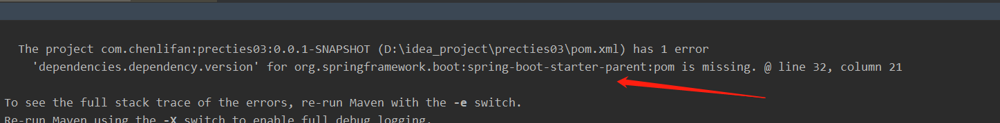
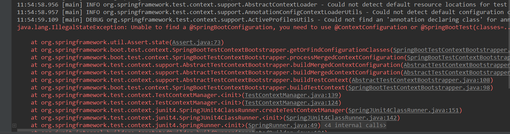
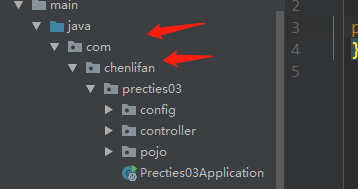
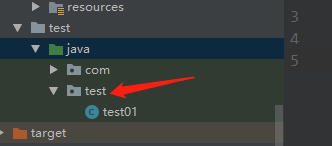
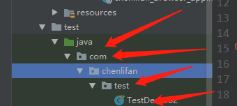
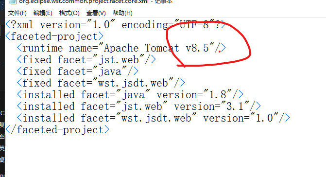

出现这个问题是因为我pom包里面多导入另一个parent没有设置版本把原本就spring boot设置好的parent给覆盖了

所以我只要去掉这个依赖就好了

------

如果像查看maven的jar包的代码，点击down source弹出一个窗口显示cannot down source，在Terminal窗口输入，回车键就可以解决

```
mvn dependency:resolve -Dclassifier=sources
```


### spring boot Test启动不了的问题



```xml
java.lang.IllegalStateException: Unable to find a @SpringBootConfiguration, you need to use @ContextConfiguration or @SpringBootTest(classes=...) with your test
```

****

不同分支的包名不同会导致这个错误，





<u>上面图片的包名是com.chenlifan,而下面test的包名是test，所以分支不一致，就会报错，我们把test的包名的该成和上面的一样就好了</u>



将包名改为与其他分支一样的路径。就可以了！


## 当项目的tomcat版本和使用的tomcat的版本不一致的时候的处理

- 右键项目-->show in -->system expolorer打开项目路径，然后打开.settings文件，编辑里面的xml文件
- 

修改红色圈中的地方为当前的tomcat版本