[TOC]

## Vue的基本使用

1. **实例参数分析**

> el: 你要将数据放在哪个DOM元素或者是CSS选择器中
>
> data：数据值的对象

2. **插值表达式**

> `{{message}}`
>
> - 将数据填充到html标签中
> - 插值表达式支持基本的计算操作
>
> > 加减乘除  字符串拼接等

3. Vue代码运行原理分析

> - 概述编译过程的概念（Vue语法---->原生语法）


## 模板语法

1. **如何理解前端渲染**

> 把数据填充到HTML标签中
>
> 


2. **前端渲染的方式**

- 原生js拼接字符串

> 将数据以字符串的方式拼接到HTML标签中
>
> <u>缺点是不同开发人员的代码风格差别很大，随着业务的复杂，后期维护很大</u>
>
> 

- 使用前端模板引擎

> 使用自己的一套模板语法规则，可读性提高，方便维护
>
> <u>缺点是没有提供专门事件机制</u>
>
> 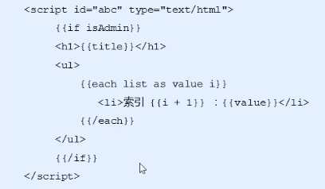

- 使用vue特有的模板语法

> - 差值表达式
> - 指令
> - 事件绑定
> - 属性绑定
> - 样式绑定
> - 分支循环结构


<u>接下来就详细概述vue的模板语法</u>


### 指令

1. **什么是指令**

比如a标签的href属性就是标准属性，而在vue中的指令格式是以v-开始的，这些是自定义属性

（比如v-cloak）

2. v-cloak指令用法

- 插值表达式存在的问题：“闪动”

> 闪动的举例：当浏览器有点卡的时候，就会先显示差值表达式的内容比如{{message}},在顺畅的时候才会显示message这个对象里面的值

- 如何解决这个问题：使用v-cloak指令
- 解决该问题的原理：先隐藏，替换好值之后在显示最终的值

```html
/*
先使用样式隐藏,然后在内存中进行值的替换，替换好之后再显示最终的结果
*/
<style type="">
    [v-cloak]{
        display:none;
    }
</style>
<div id="app01">
   <div v-cloak>
        {{message}}
    </div>
</div>
<script type="">
    var var01 = new Vue({
        el:'#app01',
        data:{
            message:'hello world'
        }
    });
</script>
```


#### v-text

这个指令和v-cloak一样，可以解决差值表达式的闪动问题，一般使用v-text更有效简洁


#### v-html

- 使用这个指令是有隐患的，一般只在可信内容上使用v-html，什么是可信的，就是通过ajax访问到本网站的内容就是可信的，如果是跨域的内容就不可信的，不推荐直接把html片段直接嵌入到页面中。所以 `<span v-html="message"></span>`里面的message最好是本网站数据的值


#### v-pre

- 显示原始信息，跳过便也过程

```vue.js
<div id="app08">
			<span v-text='message'></span>
			<span >{{message}}</span>
			<span v-pre>{{message}}</span>
		</div>


<script type="text/javascript">
		var app08 = new Vue({
			el: '#app08',
			data: {
				message: "hello"
			}
		});
	</script>
```

- 使用了v-pre指令后，就不会编译双括号里面的message
- 


### 数据响应式

#### HTML5中的响应式

<u>屏幕尺寸的变化导致样式的变化</u>

#### 数据响应式

<u>数据的变化导致页面内容的变化</u>


- 上面是相应前的内容

- 当我们在控制台中输入JavaScript中的app08对象，然后改变message的值的时候，页面中的hello也会相应改变
- 
- 那么hello也会改变成123
- 


#### 数据绑定（单向）

<u>将数据填充到标签中</u>

比如插值表达式或者是v-text等标签就是数据绑定

#### v-once

<u>只编译一次（示内容之后不再具有响应式功能</u>

-  使用这个标签可以提高性能

- 例子

- ```html
  <div id="app08">
  			<p v-once>{{info}}</p>
  		</div>
  
  <script type="">
  	var app08 = new Vue({
  			el: '#app08',
  			data: {
  				info:"只响应一次"
  			}
  			
  		});
  </script>
  ```

  

- 当我们通过控制台修改js对象的info值的时候
- 
- 
- 点击enter
- 可以看到页面没有响应任何数据
- 


### 双向数据绑定

- 上面介绍的数据绑定是单向的，而这个数据绑定是双向的

- v-model

  

#### MVVM设计思想

1. M(model)（就是data中的数据）
2. V(view)（dom元素）
3. VM(View-Model)（实现逻辑）


由View到Model中的过程是Dom Listeners，比如v-model

由Model到View中的过程是Data Bingdings，就是数据绑定，比如插值表达式，v-text等指令


### 事件绑定

#### **1.vue如何处理事件**

- v-on指令用法

> `<input tyep= 'botton' v-on:click='num++'>`

- v-on简写形式

> `<input tyep= 'botton'  @click='num++'>`

```html
<button @click="num++">点击一下</button>
			<p>{{num}}</p>

<script type="text/javascript">
		var app08 = new Vue({
			el: '#app08',
			data: {
				message: "hello",
				info:"只响应一次",
				num : 0
			}
			
		});
	</script>
```

- 上面的代码可以通过时间绑定来触发点击事件，点击一次加一


#### **2.如何调用函数**

-  直接绑定函数名称
- `<button v-on:click='say'>hello</button>`
- 调用函数
- `<button v-on:click='say()'>hello</button>`

```html
			<p>{{num}}</p>
			<button @click="say()">调用函数say</button>

<script type="text/javascript">

		var app08 = new Vue({
			el: '#app08',
			data: {
				message: "hello",
				info:"只响应一次",
				num : 0
			},
			methods:{
				say:function(){
                    console.log(this === app08)
					this.num++;
				}
			}
			
		});
	</script>
```

- **特别注意：不能直接写num++，要通过this来调用**
- this就等于app08这个对象，比如我们可以在上面的say方法加上这样一段话来验证 `console.log(this === app08)`

- 点击按钮，控制台输出true
- 
- 证明这是一个对象


#### **3.事件参数传递**

- 普通参数和事件对象

`<button v-on:click='say('hello',$event)'>Say hi</button>`

- 事件对象必须是写在最后的，而且$event这个名字是固定格式

- ```html
  <button @click="say(123,456,$event)">调用函数say</button>
  <script type="text/javascript">
  		
  
  		var app08 = new Vue({
  			el: '#app08',
  			data: {
  				message: "hello",
  				info:"只响应一次",
  				num : 0
  			},
  			methods:{
  				say:function(p,p1,event){
  					console.log(this === app08);
  					console.log(p);
  					console.log(event.target.tagName);
  					this.num++;
  				}
  			}
  			
  		});
  	</script>
  ```

点击按钮，就会在控制台输出这个对象的dom标签


- 如果事件直接绑定函数名称，那么默认会传递事件对象作为事件函数的第一个参数

```html
<button @click="test01">test01</button>
<script type="text/javascript">
		

		var app08 = new Vue({
			el: '#app08',
			data: {
				message: "hello",
				info:"只响应一次",
				num : 0
			},
			methods:{
				test01:function(event){
					console.log(event.target.tagName);
				}
			}
			
		});
	</script>
```

点击按钮，数据事件标签的名称。


#### **4.事件修饰符**

- **.stop阻止冒泡**

什么是冒泡呢，如下代码


这个图片是点击了3下后累加的数字

```html
<div v-on:click="handle00">
				<button v-on:click="handle01">点击一下</button>
			</div>
			<p>{{num02}}</p>


<script type="text/javascript">
		var app08 = new Vue({
			el: '#app08',
			data: {
				num02:0
			},
			methods:{
				handle00:function(){
					this.num02++;
				},
				handle01:function(event){
					
				}
			}
			
		});
	</script>
```

> 可以看到，一个div下面有一个button标签，div有一个点击事件触发handle00方法，button点击事件触发handle01方法，但是当我们点击button标签的时候，也会触发div的handle00方法，那么也就是冒泡，那么我们应该怎么阻止这样的事情发生呢


传统阻止冒泡的方式

- 在我们点击的button标签的handle01方法加上这么一段代码

```javascript
handle01:function(event){
					//阻止冒泡
				event.stopPropagation();
				}
```

这样当我们触发handle01方法的时候，也不会冒泡到handle00方法了


点击了也没有加一


使用vue的方法，就是使用事件修饰符

`	<button v-on:click.stop="handle01">点击一下</button>`


- **.prevent阻止默认行为**

这个典型的场景就是a标签

`<a v-on:click.prevent="handle02">跳转</a>`


传统的，当我们点击a标签，比如 `<a href="http://www.baidu.com" >点击跳转百度</a>`

就会跳转到百度，但是我们怎么阻止不跳转呢，

传统的方法是

```html
<a href="http://www.baidu.com" v-on:click="handle02">点击跳转百度</a>
```

```javascript
handle02:function(event){
					event.preventDefault();
				}
```

- 这样，当我们点击a标签的时候，就不能跳转了


使用vue的方法

`<a href="http://www.baidu.com" v-on:click.prevent="handle02">点击跳转百度</a>`

这样，点击a标签不能跳转了

- .prevent相当于让这个标签点击的时候不再生效


这里说的阻止所有点击是包括阻止冒泡的点击


#### 5.按键修饰符

- 通过按键enter来触发方法 `v-on:keyup.enter='submit01'`

```html
<div id="div01">
			<form action="">
				<input type="text" v-on:keyup.enter="submit01" v-model="uname"/>
				<input type="text" v-on:keyup.enter="submit01" v-model="pword" />
				<input type="button" v-on:click="submit01" value="再提交一下"/>
			</form>
		</div>
```

```JavaScript
var app10 = new Vue({
		el:'#div01',
		data:{
			uname:'',
			pword:''
		},
		methods:{
			submit01:function(){
				console.log(this.uname,this.pword);
			}
		}
		
	});
```

- 通过按键delete来触发方法

```html
<input type="text" v-on:keyup.delete="clearContent" v-on:keyup.enter="submit01" v-model="uname"/>
```

```JavaScript
clearContent:function(){
				//按delete键清空用户名
				this.uname = '';
			}
```


#### 自定义按键修饰符

- 全局 `config.keyCodes`对象

  

  在说上面的对象之前，我们先来看看我们键盘中每一个按键所对应的数字

  通过以下代码来在控制台输出每个键盘对应的数字

  ```html
  <input type="text" v-on:keyup="keyupMethod" v-model="keyWords"/>
  ```

  

```JavaScript
keyupMethod:function(event){
				console.log(event.keyCode);
			}
```


可以看到，当我们在输入框点击个中按钮的时候

控制台就会输出对应按钮对应的数字

- 但是，数字并不好去区分，那么我们可以通过这样的代码来自定义按钮

- ```html
  <input type="text" v-on:keyup.a="keyupMethod" v-model="keyWords" />
  ```

- 

- 这样，当我们点击键盘的时候只会接受a的信号，点击其他的按钮不会有反应

- 


- 关于这个自定义按键的规则是

  > 自定义按钮修饰符名字是自定义的，但是对应的值必须是按键对应event.keyCode值
  >
  > 这是一个全局对象


### 案例：简单计算器

```html
<div id="div02">
			<form action="">
				<div>
					数值A:<input type="text" v-model="numA" />
				</div>
				<div>
					数值B:<input type="text" v-model="numB" />
				</div>
				<div>
					<input type="button" v-on:click="sumMethod" value="计算" />
				</div>
				<div>
					<p>计算结果：{{Result_sum}}</p>
				</div>
			</form>

		</div>
```

```JavaScript
var app11 = new Vue({
			el: '#div02',
			data: {
				numA: '',
				numB: '',
				Result_sum: ''
			},
			methods: {
				sumMethod: function() {
					this.Result_sum = parseInt(this.numA) + parseInt(this.numB);
				}
			}
		});

```

- **特别注意的是，vue中的数据默认是字符串，我们需要把这些数据转化为int，用到parseInt()方法，否则使用+只会进行字符串拼接**
- 


### 属性绑定

#### vue如何动态处理属性

- v-bind指令用法

`<a v-bind:href='url'>跳转</a>`

- 缩写形式

`<a :href='url'>跳转</a>`


- 用法示例

- ```html
  <a v-bind:href="url">百度一下你就知道</a>
  ```

  
  
  - 这样，我们 就能通过数据绑定的方式来控制跳转的URL

下面我们设置一个按钮，点击按钮切换url地址

```JavaScript
<input type="button" v-on:click="changeUrl" value="切换"/>
```

```JavaScript
changeUrl:function(){
					this.url = 'https://www.huawei.com/cn/?ic_medium=direct&ic_source=surlent';
					this.urlContent = '华为:构建万物互联的智能世界';
				}
```


#### v-model的底层实现原理分析

- 底层用到了一个属性绑定和一个事件绑定
- `<input v-bind:value='msg' v-on:input='msg=$event.target.value'>`

**实例**

```html
<input type="text" v-bind:value="inputmsg" v-on:input="changinputmsg" />
			<span>{{inputmsg}}</span>
```

```JavaScript
var app11 = new Vue({
			el: '#div02',
			data: {		
				inputmsg: 'chenlifan'
			},
			methods: {				
				changinputmsg: function(event) {
					this.inputmsg = event.target.value;
				}

			}
```

> 可以理解为，先通过属性绑定v-bind来绑定value的属性，然后通过v-on:input这个事件绑定来改变inputmsg这个值，当输入事件触发的时候，修改inputmsg这个值

- 上面html的另一种写法可以如下

- ```html
  <input type="text" v-bind:value="inputmsg" v-on:input="inputmsg =$event.target.value" />
  ```

- 下面就是直接用v-model指令来做

- ```html
  <input type="text"v-model="inputmsg"/>
  ```


### 样式绑定

#### class样式处理

1. 对象语法

`<div v-bind:class="{actiove:isActive}"></div>`

实例

```html
<style type="text/css">
		.active{
			border: 1px solid red;
			width: 100px;
			height: 100px;
		}
	</style>

<div id="div03">
			<div v-bind:class="{active:isActive}"></div>
			<button v-on:click="handle00">切换</button>
		</div>
```

```JavaScript
var div03 = new Vue({
			el:'#div03',
			data:{
				isActive:true
			},
			methods:{
				handle00:function(){
					this.isActive = !this.isActive;
				}
			}
		});
```


如何将多个类作用在dom上

```css
.error{
			background: orange;
		}
```

```html
<div v-bind:class="{active:isActive,error:isError}"></div>
```

```JavaScript
data:{
				isActive:true,
				isError:true
			}
```


2. 数组语法

`<div v-bind:class="[activeClass,errorClass]"></div>`

**实例**

css不变

```html
<div v-bind:class="[varClass]"></div>
			<button v-on:click="handle00">切换</button>
```

```JavaScript
data:{
				varClass:{
					active:true,
					error:true
				}
				
			},
			methods:{
				handle00:function(){
					this.varClass.active = !this.varClass.active;
				}
			}
```

存入两个数组元素的vue.js写法

```JavaScript
data: {
				activeClass: 'active',
				errorClass: 'error'
			},
```

html写法

```html
<div v-bind:class="[activeClass,errorClass]"></div>
```

- 对象和数组组合使用

```css
.active {
			border: 1px solid red;
			width: 100px;
			height: 100px;
		}

		.error {
			background: orange;
		}
		.textColor{
			color: blue;
		}
```

html

```html
<div v-bind:class="[activeClass,errorClass,{textColor:istextColor}]">我就要看看</div>
```

vue.js

```JavaScript
var div03 = new Vue({
			el: '#div03',
			data: {
				activeClass: 'active',
				errorClass: 'error',
				istextColor:true
			},
			methods: {
				handle00: function() {
					this.istextColor = !this.istextColor;
				}
			}
		});
```


#### Class绑定的简化操作


- 对于数组的处理，我们可以这样写

```html
	<div v-bind:class='arrClass'></div>
```

```JavaScript
data: {
				arrClass:['active','error']
			},
```

- 对于对象的处理，我们可以这样写

```html
<div v-bind:class="objClass"></div>
```

```JavaScript
data: {		
				objClass:{
					active:true,
					error:true
				}
			}
```

**这样，我们就可以简化dom的写法，而集中精力在vue上处理这些逻辑**


<u>默认的class会保留</u>

`<div class="base" v-bind:class='objClass'>我这个字有多大呢</div>`


可以看到，这个dom绑定了3个类，其中默认的类保留了下来


#### style样式处理

- 对象语法

```html
<div v-bind:style="{
				border:styleborder ,
				width: stylewidth,
				height: styleheight
			}"></div>
```

```JavaScript
data: {
				styleborder:'2px solid green',
				stylewidth:'200px',
				styleheight:'100px'
			},
```


- 数组语法

```html
<div v-bind:style='objsytle'></div>
```

```JavaScript
data: {
				objsytle :{
					border: '2px solid green',
					width: '200px',
					height: '100px'
				}
			}
```


上面是单个数组元素，下面是多个数组元素

```html
<div v-bind:style='[objsytle,overideobj]'></div>
```

```JavaScript
data: {
				objsytle :{
					border: '2px solid green',
					width: '200px',
					height: '100px'
				},
				overideobj:{
					border: '5px solid green',
					width: '200px',
					height: '100px',
					background:'orange'
				}
			},
```


- 可以看到，并没有生成两个框，有的属性会覆盖，没有的属性会加上去


## 分支循环结构

### 分支结构

- v-if
- v-else-if
- v-else
- v-show

```html
<div v-if="score>90">你真丑</div>
			<div v-else-if="score<90&&score>=60">菜</div>
			<div v-else>你真的不行</div>
```

```javascript
data: {
				score:88
			},
```


- v-show指令的演示

```html
	<div v-show="flag">你能看到我吗</div>
```

```JavaScript
flag:false
```

因为设置的是false，所以网页是不会显示这个dom的


现在我们来看看if和show这两类标签的区别，我们打开f12中的element这个框


* 可以看到，if只显示true的dom，但是show这个标签是通过样式的display这个属性来隐藏的，在网页上依旧存在这个dom

### v-if和v-show的区别

- v-if控制元素是否渲染到页面
- v-show指令控制元素渲染到了页面，通过display控制是否显示这个dom元素

> 一般来说更推荐使用if指令	


### 循环结构

- v-for遍历数组

```html
<div>水果列表</div>
			<ul>
				<li v-for="item in fruits">{{item}}</li>
			</ul>
```

```JavaScript
data:{
				fruits:['apple','banaban','orange']
			},
```


**我们也可以这样来显示每个数组元素的索引**

```html
	<li v-for="(item,index) in fruits">{{item+'----------'+index}}</li>
```


**更加复杂一点的写法**

```html
<div>卖手机辣</div>
			<ul>
				<li v-for="item in mobile">{{item.mphone+'----'+item.mname}}</li>
			</ul>
```

```JavaScript
mobile:[
					{
					mphone:'mate20',
					mname:'huawei'	
					},{
					mphone:'reno30pro',
					mname:'oppo'		
					},{
					mphone:'iphonexr',
					mname:'apple'		
					}
				]
```


- key的作用：帮助Vue区分不同的元素，从而提高性能

我们可以自己给我们的数据加上id ，也可以直接使用过index下标，

**如果我们直接使用下标，可以这样写**

```html
<div>卖手机辣</div>
			<ul>
				<li :key="item.index" v-for="item in mobile">{{item.mphone+'----'+item.mname}}</li>
			</ul>
```

**如果我们自己上上id**

```html
<div>卖手机辣</div>
			<ul>
				<li :key="item.id" v-for="item in mobile">{{item.mphone+'----'+item.mname}}</li>
			</ul>
```

```JavaScript
mobile: [{
					id: 1,
					mphone: 'mate20',
					mname: 'huawei'
				}, {
					id: 2,
					mphone: 'reno30pro',
					mname: 'oppo'
				}, {
					id: 3,
					mphone: 'iphonexr',
					mname: 'apple'
				}]
```

### 使用原生js的方式遍历对象（一般是不会遍历数组的）

```JavaScript
	var obj = {
			username:'chenlifan',
			age:12,
			password:'clf13795'
		}
		for(var key in obj){
			console.log(key,obj[key]);
		}
```


### 使用vue的for来遍历对象

```html
<ul>
				<li v-for="(value,key,index) in obj">{{value+'----'+key+'----'+index}}</li>
			</ul>
```

**注意，value、key、index这三个属性的名字可以自定义，但是顺序不能变**

```JavaScript
obj: {
					username: 'chenlifan',
					age: 12,
					password: 'clf13795'
				}
```


**我们可以通过v-if来筛选出年龄为13的人的数据**

```html
<ul>
				<li v-if="value == 13" v-for="(value,key,index) in obj">{{value+'----'+key+'----'+index}}</li>
			</ul>
```


### 基础案例：Tab选项卡


### Vue常用特性

- 表单操作

> 比如form表单，当我们点击提交按钮的时候，如果我们不在action这个属性上设置路径，就会刷新页面，那么我们可以重新设置提交按钮的行为，通过点击来将数据提交到控制台上，通过v-model来绑定

- 自定义指令
- 计算属性
- 过滤器
- 侦听器
- 生命周期


### 表单域修饰符

- number：转化为数值
- trim：去掉开始和结尾的空格
- lazy：将input事件切换为change事件

`<input type= text" v -model.number= " age>'`

v-model.number可以将数值转化为数字类型，这样我们就不用专门在js上转化了


lazy这个修饰符，input事件是当我们使用v-model这个指令的时候，就已经存在input事件，当我们在输入域输入的时候，时刻监听着输入域的内容，如


change事件是当我们在输入域输入内容的时候，只有我们的鼠标单击其他地方，失去焦点，才会监听输入域的内容


## 自定义指令

- 自定义指令的语法规则（获取元素焦点）

- ```JavaScript
  Vue .directive (' focus' {
  inserted: function(el) {
  //获取元素的焦点
  el.focus() ;
  }
  })
  
  ```

- 用法

- ```html
  <input type="text" v- focus>
  ```

  - 上面的代码可以当我们打开这个页面的时候，焦点会聚焦在input输入框上

## 带参数的自定义指令（改变元素背景色）

```JavaScript
Vue.directive('color', {
			bind: function(el, binding) {
				el.style.backgroundColor = binding.value.color;
			}
		})

		var app02 = new Vue({
			el: "#div01",
			data: {
				msg: {
					color: 'orange'
				}

			},
			methods: {

			}
		});
```

- 上述自定义指令的用法

- ```html
  <div id="div01" v-color="msg">
  			自定义指令修改背景颜色
  		</div>
  ```

  

## 局部指令

局部指令就是在已经定义的一个vue对象下面定义一个自定义指令，

例子接上面的改变背景色


# 计算属性

- 为什么使用计算属性

- >  表达式的计算逻辑可能会比较复杂,使用计算属性可以使模板内容更加简洁s

例子，字符串拼接

```html
<div id="div02">
			{{reverseString}}
		</div>
```


```JavaScript
var app03 = new Vue({
			el: "#div02",
			data: {
				msg: 'chenlifan'

			},
			methods: {

			},
			computed:{
				reverseString:function(){
					return this.msg.split('').reverse().join('');
				}
			}
			
		});
```


# 计算属性和methods的区别

- 计算属性是基于它们的依赖进行缓存的
- 方法不存在缓存

结合上一个例子，我们调用两次computed这个计算属性


然后我们在控制台输出test这个字符串


可以看到，我们调用了两次计算属性，但是只输出了一个test

- **这个就是缓存问题，当第一次计算了computed的结果之后，就会缓存到内存中，第二次计算就会直接在内存调用这个结果，所以不会再调用log()这个方法来输出test字符串**

所以这样可以提高性能


- 比如我们通过method来进行运算
- 和上面一样，调用两次方法
- 
- 
- 可以看到输出了两次，所以调用了两次方法
- 

- **注意，计算属性是有依赖的，依赖于data中的数据，如果data中的数据变化，那么计算属性也会变化**


# 侦听器


**应用场景**

- 数据变化时执行异步或开销较大的操作

例子，设置两个输入域，当修改输入域中的内容，则显示出来

```html
<div id="div03">
			性别：<input type="text" v-model="firstname" /></p>
			名称：<input type="text" v-model="lastname" /></p>
			{{fullname}}
		</div>
```

```JavaScript
var app04 = new Vue({
			el: "#div03",
			data: {
				firstname: '',
				lastname: '',
				fullname: ''
			},
			watch: {
			firstname:function(val){
				/* val代表firstname当前最新的值 */
				this.fullname = val+''+this.lastname;
			},
			lastname:function(val){
				this.fullname = this.firstname+''+val;
			}
			}
		});
```


# 监听器的特定场景案列（验证用户名是否可用）

**需求：需求:输入框中输入姓名,失去焦点时验证是否存在,如果已经存在,提示从新输入,如果不存在,提示可以使用。**

```html
<div id="div04">

			输入你的昵称<input type="text" v-model="username" /><span>{{tip}}</span>

		</div>
```

```JavaScript
var app05 = new Vue({
			el: "#div04",
			data: {
				username: '',
				tip: ''
			},
			methods: {
				checkname: function(username) {
					/* 因为setTimeout这个接口的this调用的是window的对象，所以我们要给vue的对象改个名字*/
					var that = this;
					setTimeout(function() {
						if (username == 'chenlifan') {
							that.tip = '你这个名称已经被注册';
						} else {
							that.tip = '这个名称可以用';
						}
					}, 2000)
				}
			},
			watch: {
				username: function(val) {
					this.checkname(val);
					this.tip = '正常查询这个id是否可以用';
				}
			}
		});
```


上面的触发条件是input，这样会耗费资源，我们改变为change，这样当失去焦点的时候，再验证输入域中的username


# 过滤器

**应用场景有**

格式化数据,比如将字符串格式化为首字母大写,将日期格式化为指定的格式等


这种写法是我们可以不断地在后面添加过滤器

 

这种写法是我们对绑定的数据进行过滤 如


## 自定义全局过滤器

设置一个过滤器，可以将英文字母的开头转化为大写字母

```html
	<div id="div05">
			<input type="text"  v-model="msg" />
			{{msg | upper}}
		</div>
```

```JavaScript
	Vue.filter('upper',function(val){
			return val.charAt(0).toUpperCase()+val.slice(1);
		})
		
		var app06 = new Vue({
			el:"#div05",
			data:{
				msg:''
			},
			、
		});
```


## 自定义局部过滤器


## 带参数过滤器的用法


## 案例：使用过滤器格式化日期


# 生命周期


# 数组相关api


- 演示

代码

```html
<div id="div01">
			<input type="text" v-model="addEL" />
			<input type="button" v-on:click="addlist" value="添加到数组" />
			<ul>
				<li :key="index" v-for="(item,index) in list">{{item}}</li>
			</ul>
		</div>
```

```JavaScript
var app01 = new Vue({
			el: "#div01",
			data: {
				addEL: '',
				list: ['苹果', '香蕉', '橙子']
			},
			methods: {
				addlist: function() {
					this.list.push(this.addEL);
				}
			}
		});
```


- 上面演示的数组的便变异方法
- 下面演示的是替换数组，注意的是，替换数组生成的是一个全新的数组
- 

```JavaScript
changelist:function(){
					this.list = this.list.slice(0,2);
				}
```


## filter()演示

```html
{{even()}}
```

```JavaScript
data: {
				testnum: [1, 2, 3, 4, 5, 6]
			},
			methods: {			
				even:function(){
					return this.testnum.filter(function(number){
						return number %2 == 0;
					});
				}

			}
```


可以看到，过滤了除以2后不等于0的数


数组响应式变化


当我们通过索引修改数组的时候，页面并没有相应，如


而页面依旧是苹果


打开控制台，我们发现其实已经修改了


因为这样修改不是响应式的

- 这样设置后，页面就相应了
- 
- 


# 综合案例(图书管理)


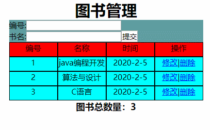


```html
<!DOCTYPE html>
<html>
	<head>
		<meta charset="utf-8">
		<title></title>
	</head>
	<script src="js/vue.js"></script>
	<style type="text/css">
		* {
			margin: 0;
			padding: 0;
		}

		#content {

			margin-top: 100px;
		}

		#content h1 {
			text-align: center;
		}

		#content ul {
			background-color: aqua;
			width: 400px;
			height: 30px;
			margin: 0 auto;
		}

		ul li {
			list-style-type: none;
			float: left;
			text-align: center;
			width: 98px;
			height: 28px;
			border: 1px solid black;
		}

		#ul01 li {
			background-color: #FF0000;
		}

		#sumitmode {
			background-color: cadetblue;
			margin: 0 auto;
			width: 400px;
		}

		#content h3 {
			text-align: center;
		}
	</style>
	<body>
		<div id="content">
			<h1>图书管理</h1>
			<div id="sumitmode">
				<span>编号:</span><input type="text" v-model="id" :disabled="isDisable" v-focus />
				<p></p>
				<span>书名:</span><input type="text" v-model="name" /><input type="button" v-on:click="addbook" value="提交" :disabled="isDisableSumit" />
			</div>
			<ul id="ul01">
				<li><span>编号</span></li>
				<li><span>名称</span></li>
				<li><span>时间</span></li>
				<li><span>操作</span></li>
			</ul>
			<ul :key="item.id" v-for="item in books">
				<li><span>{{item.id}}</span></li>
				<li><span>{{item.name}}</span></li>
				<li><span>{{item.date | format('yyyy-MM-dd')}}</span></li>
				<!-- @click.prevent:取消这个标签的默认行为，不再跳转 -->
				<li><a href="#" @click.prevent v-on:click="edit(item.id)">修改</a><span>|</span><a href="#" @click.prevent v-on:click="deletedate(item.id)">删除</a></li>
			</ul>
			<h3>图书总数量：{{totalBooks}}</h3>
		</div>
	</body>
	<script type="text/javascript">
		/* 设置焦点 */
		Vue.directive('focus', {
			inserted: function(el) {
				el.focus();
			}
		});
		/* 格式化时间 */
		Vue.filter('format', function(value, arg1) {
			if (arg1 == 'yyyy-MM-dd') {
				var ret = '';
				ret += value.getFullYear() + '-' + (value.getMonth() + 1) + '-' + value.getDate();
				return ret;
			}
			return value;
		});

		var app01 = new Vue({
			el: "#content",
			data: {

				id: '',
				name: '',
				isDisable: false,
				isDisableSumit: false,
				books: [{
						id: 1,
						name: 'java编程开发',
						date: new Date()
					},
					{
						id: 2,
						name: '算法与设计',
						date: new Date()
					},
					{
						id: 3,
						name: 'C语言',
						date: new Date()
					}
				]
			},
			methods: {
				addbook: function() {
					/* 当修改图书的时候，不能直接以添加的方式修改，通过输入域是否被禁用来判断是修改状态还是添加转台 */
					if (this.isDisable) {
						//编辑状态
						this.books.some((item) => {
							if (item.id == this.id) {
								item.name = this.name;
								//完成更新操作之后，终止循环,没必要再遍历下去
								return true;
							}
						});
						this.isDisable = false;

					} else {
						//添加状态
						var newbook = {};
						newbook.id = this.id;
						newbook.name = this.name;
						newbook.date = new Date();
						this.books.push(newbook);
						/* 置空输入域的文本 */
						this.id = '';
						this.name;

					}

				},
				edit: function(id) {
					var book = this.books.filter(function(item) {
						/* 返回id 与 要修改的id一样的对象 */
						/* filter方法会将books中的对象一个个遍历，就是item，当id一样的时候就返回 */
						return item.id == id;
					});
					/* 这个book是一个数组 */
					console.log(book);
					//把id和书名填充到表单
					this.id = book[0].id;
					this.name = book[0].name;
					this.isDisable = true;
				},
				deletedate: function(id) {
					/* var bookindex =  this.books.findIndex(function(item){
						return item.id = id;
					});
					this.books.pop(bookindex); */
					//第二种删除的思路是通过filter来实现的
					this.books = this.books.filter(function(item) {
						return item.id != id;
					})
				}


			},
			computed: {
				totalBooks: function() {
					return this.books.length;
				}
			},
			watch: {
				id: function(val) {
					/* for(let book in this.books){
						if(book.id == val){
							this.isDisableSumit = true;
							return
						}
						
					} */
					flag = this.books.some(function(item) {
						return item.id == val;
					});
					if (flag) {
						this.isDisableSumit = true;
					} else {
						this.isDisableSumit = false;
					}
				},
				name: function(val) {
					/* for(let book in this.books){
						if(book.name == val){
							this.isDisableSumit = true;
							return
						}
						
					} */
					flag = this.books.some(function(item) {
						return item.name == val;
					});
					if (flag) {
						this.isDisableSumit = true;
					} else {
						this.isDisableSumit = false;
					}
				}
			}

		});
	</script>
</html>

```

# Vue全家桶之组件化开发


## 现实中的组件化思想体现

- 标准
- 分治
- 重用
- 组合


## 组件化规范：Web Components


## 组件注册


### 全局组件注册语法


```html
<div id="div01">
			<button-counter></button-counter>
		</div>

<script type="text/javascript">
		Vue.component('button-counter', {
			data: function() {
				return {
					count: 0
				}

			},
			template: '<button v-on:click="count++">点击加一{{count}}</button>'

		});
		var app01 = new Vue({
				el: "#div01",
				data: {

				}
			}

		);
	</script>
```


- 通过函数调用实现
- 

### 组件注册注意事项


- 不可以一个button标签再包围一个button标签


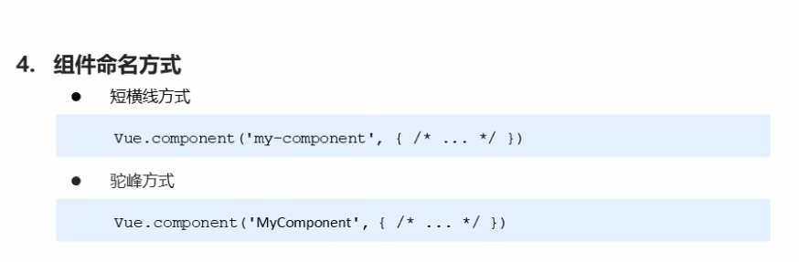

### 局部组件注册


### 在局部组件中嵌套子父组件


效果


## 组件模板抽离的方式


上面两种分离方式的结果都是下面的


## Vue调试工具用法

### devtools


## 父组件向子组件传值

**静态props**


**动态props**


**props传递数据原则，单向数据流，只能是父组件向子组件传递数据**

- 因为vue实例本身就是一个组件， 而且是根组件，所以我们只需要再定义一个组件就可以了
- 


### props属性名规则


- 字符串形式的模板指的是如下
- 

### props属性值类型


这种传递方式是string类型

当使用bind的时候


是number属性


一样的，判断是否是boolean类型

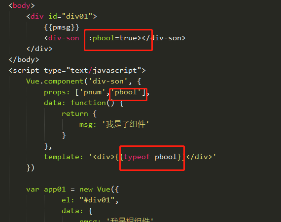


传递数组


## 子组件向父组件传值


因为props传递数据原则，单向数据流，只能是父组件向子组件传递数据

### 通过自定义事件向父组件传递信息


## 非父子组件间传值

### 单独的事件中心管理组件间的通信


通过事件中心来完成两个独立组件之间的传值


- 例子

```html
<!DOCTYPE html>
<html>
	<head>
		<meta charset="utf-8">
		<title></title>
		<script src="js/vue.js"></script>
		<style type="text/css"></style>
	</head>
	<body>
		<div id="div01">
			<button v-on:click="handle">销毁事件</button>
			<div-one></div-one>
			<div-two></div-two>


		</div>
	</body>
	<script type="text/javascript">
		var hub = new Vue();
		Vue.component('div-one', {
			data: function() {
				return {
					num: 0
				}
			},
			template: `
			<div>TOm:{{num}}
			
				<button type="button" v-on:click="handle">点击</button>
			
			</div>
			
			`,
			methods: {
				handle: function() {
					hub.$emit('jenny-event', 2);
				}
			},
			mounted: function() {
				hub.$on('tom-event', (val) => {
					this.num += val;
				});
			}
		});
		Vue.component('div-two', {
			data: function() {
				return {
					num: 0
				}
			},
			template: `
			<div>jenny:{{num}}
			<button type="button" v-on:click="handle">点击</button>
			</div>
			
			`,
			methods: {
				handle:function(){
					hub.$emit('tom-event', 1);
				}
			},
			mounted: function() {
				hub.$on('jenny-event', (val) => {
					this.num += val;
				});
			}
		});


		var app01 = new Vue({
			el: "#div01",
			data: {

			},
			methods:{
				handle:function(){
					//事件销毁后就无效
					hub.$off('tom-event');
					hub.$off('jenny-event');
				}
			}

		});
	</script>
</html>

```

### 组件插槽的作用

- 父组件向子组件传递内容


演示：


当我们在 `<slot></slot>`标签中输入内容的时候，会有一样的效果


当我们去掉slot标签，就不能插入内容了


### 具名插槽用法


另一种写法


### 作用域插槽

- 应用场景：父组件对子组件的内容进行加工处理


```html
<!DOCTYPE html>
<html>
	<head>
		<meta charset="utf-8">
		<title></title>
		<script src="js/vue.js"></script>
		<style type="text/css">
.current{
	color: #FF0000;
}
		</style>
	<body>
		<div id="div01">
			<li-component v-bind:list='list'>
				<template slot-scope='slotprops'>
					<strong v-if="slotprops.info.id == 2" class="current">{{slotprops.info.name}}</strong>
					<span v-else>{{slotprops.info.name}}</span>
				</template>

			</li-component>
		</div>


	</body>

	<script type="text/javascript">
		Vue.component('li-component', {
			props: ['list'],
			template: `
	<div>
	<ul>
		<li :key='item.id' v-for = 'item in list'>
		<slot :info = 'item'>{{item.name}}</slot>
		</li>
	</ul>
	</div>
	`
		});

		var app01 = new Vue({
			el: '#div01',
			data: {
				list: [{
					id: 1,
					name: '苹果'
				}, {
					id: 2,
					name: '华为'
				}, {
					id: 3,
					name: 'vivo'
				}]
			}
		});
	</script>
</html>

```


# 父子组件的访问方式


## 父访问子


## 区分不同的组件

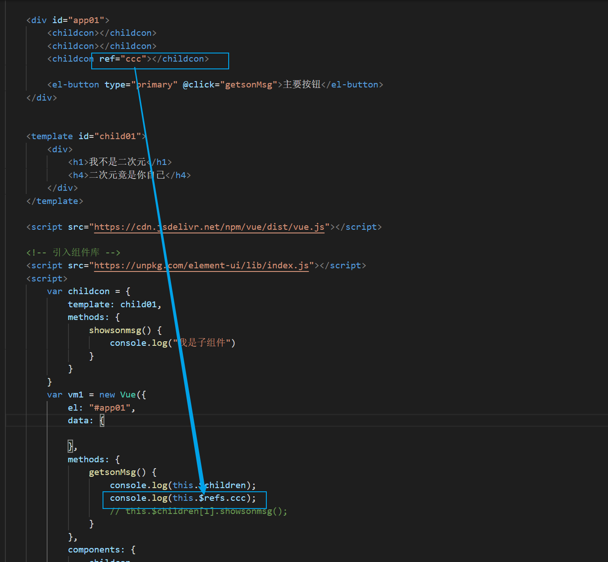


## 子访问父

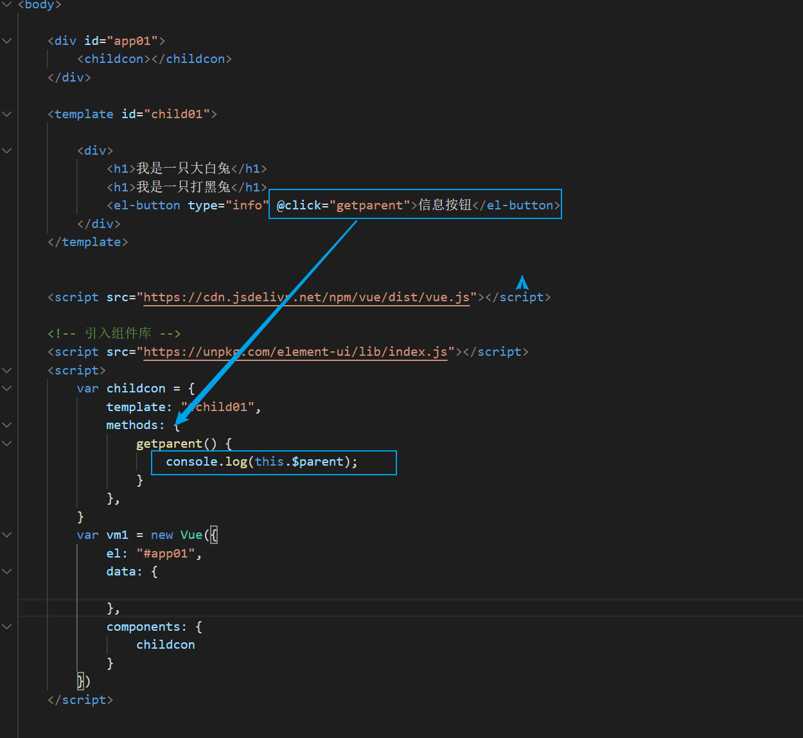


> 因为当前子组件的父组件就是一个vue实例，所以打印出来的就是vue


**当我们创建一个父组件，然后让子组件在父组件里面注册，然后查看控制台输出信息**


> 获取父组件的data的name


> 就是获取了vue实例


## 案例：购物车

### 按照组件化方式实现业

- 根据业务功能进行组件化划分

1. 标题组件（展示文本）
2. 列表组件（列表展示、商品数量变更、商品删除）
3. 结算组件（计算商品总额）

### 第一步：通过组件化的方式代码重构

```html
<!DOCTYPE html>
<html>
	<head>
		<meta charset="utf-8">
		<title></title>
		<script type="text/javascript" src="js/vue.js"></script>
		<style type="text/css">
			* {
				margin: 0;
				padding: 0;

			}

			#div01 {
				width: 500px;
				height: 700px;
				background-color: coral;
				margin: 0 auto;
			}

			#div01 #div01_header {
				background-color: brown;
				height: 50px;
				text-align: center;


			}

			#div01 #content {
				background-color: cornflowerblue;
				height: 575px;
				padding-top: 1px;


			}

			#div01 #content ul li {
				list-style-type: none;
			}

			#div01 #content ul li .second_li ul li {
				list-style-type: none;
			}

			#div01 #footer {
				background-color: cadetblue;
				height: 75px;
			}

			.div_img {
				width: 48px;
				height: 48px;

			}

			#img01 {
				width: 48px;
				height: 48px;
			}

			.second_li li {
				display: inline-block;
			}

			.second_li li input {
				width: 30px;
			}

			#content #content_ul {
				margin: 0px auto;
				margin-top: 100px;
				width: 200px;
			}

			#settle_button {
				margin-top: 20px;
				margin-left: 400px;
				width: 50px;
				height: 30px;
				color: #A52A2A;
				background-color: #FF7F50;
			}
		</style>
	</head>
	<body>
		<div id="app01">
			<shoping_comp></shoping_comp>
		</div>

	</body>
	<script type="text/javascript">
		var header_comp = {
			template: `
			<div id="div01_header">
				<h1>购物车列表</h1>
			</div>
			`
		}
		var content_comp = {
			template: `
			<div id="content">
				<ul id="content_ul">
					<li>
						<ul class="second_li">
							<li></li>
							<li>
								<button type="button">-</button>
								<input type="text" />
								<button type="button">+</button>
							</li>
							<li></li>
						</ul>
					</li>
					<li>
						<ul class="second_li">
							<li></li>
							<li>
								<button type="button">-</button>
								<input type="text" />
								<button type="button">+</button>
							</li>
							<li></li>
						</ul>
					</li>
					<li>
						<ul class="second_li">
							<li></li>
							<li>
								<button type="button">-</button>
								<input type="text" />
								<button type="button">+</button>
							</li>
							<li></li>
						</ul>
					</li>
					<li>
						<ul class="second_li">
							<li></li>
							<li>
								<button type="button">-</button>
								<input type="text" />
								<button type="button">+</button>
							</li>
							<li></li>
						</ul>
					</li>
					<li>
						<ul class="second_li">
							<li></li>
							<li>
								<button type="button">-</button>
								<input type="text" />
								<button type="button">+</button>
							</li>
							<li></li>
						</ul>
					</li>
			
			
				</ul>
			</div>
			`
		}
		var footer_comp = {
			template: `
			<div id="footer">
				<button id="settle_button" type="button"><strong>结算</strong></button>
			</div>
			`
		}

		Vue.component('shoping_comp', {
				template: `
			<div id="div01">
			<header-comp></header-comp>
			<content-comp></content-comp>
			<footer-comp></footer-comp>
			</div>
			`,
				components: {
					'header-comp': header_comp,
					'content-comp': content_comp,
					'footer-comp': footer_comp
				}

			},

		);


		var app = new Vue({
			el: "#app01",
			data: {

			},
			methods: {

			}
		});
	</script>
</html>

```


## 父子组件通信之双向绑定


但是官方是不推荐上面这种代码方式的


> 报错如上
>
> 上面的意思是应该由父组件来完成这样的一个重写

所以我们就不要绑定props里面的值，通过data或者计算属性来完成上面的事情


> 在上面代码的基础上增加一个data，获取prop的属性，然后上面绑定data里面的值
>
> 


# 插槽

当我们使用模板的时候，如果希望某一个模板出现一个按钮，而其他模板没有按钮，我们应该怎么做呢


**在没有使用插槽的情况下，每个组件都会出现按钮**


**而如果使用插槽，我们就能控制任意组件出现不同的内容**


**当我们直接在插槽 中存放一个按钮，那么组件就会默认有一个按钮，除非指定了其他的内容**


## 具名插槽

上面只演示了一个插槽的情况，那么当一个组件中有多个插槽，我们应该怎么区分这些插槽呢


> 上面是一个组件中三个插槽显示的默认的内容，那么我们如何控制插槽显示的内容呢


## 编译作用域


当我们在vue实例和组件都设置一样的变量名，vue实例的属性的值未false  组件的实例为true，看看在v-show下，调用的是谁的变量


> 浏览器什么都不显示，说明调用了vue实例的变量


**如果我们在模板中使用v-show，那么就会调用组件的实例**


## 作用域插槽的使用


# 前端代码复杂带来的问题


当多个人开发js，将js文件都导入的时候，就会出现问题

比如bbb.js定义了flag为false

而mmm.js定义当flag为true就显示某些东西，因为bbb.js定义了额flag为false，所以mmm.js因为没有设置默认为true，flag就会一直是false。


# 前端模块化雏形和common.js（包含使用es5进行模块化开发）

可以直接看视频


> 这种视频有教怎么用es5来进行模块化开发（解决代码复用性的问题）


## js原始解决全局变量冲突的方法


**演示**


**常见的模块化规范**

- commonjs  amd cmd es6的moduls


## commonjs（了解）


**模块化的核心**

> 导出
>
> 导入


**演示**

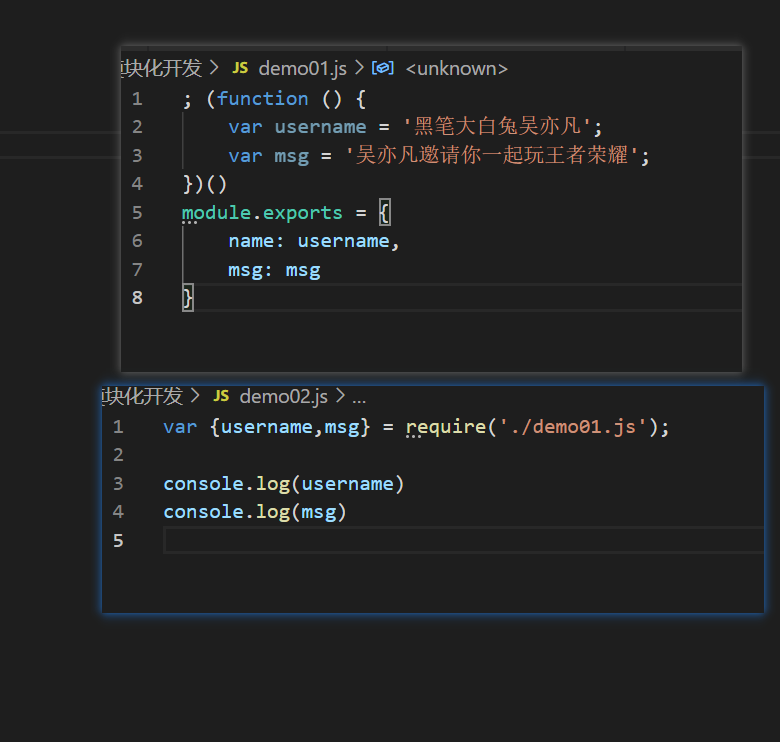


> 应该是配合node.js导入commonjs来使用的


# ES6模块化的导入和导出


创建两个js文件


然后在html文件导入这两个文件的连接


在浏览器就可以看到bbb.js输出了aaa.js的username的变量


**export default**


**import**


**解决跨域问题**


# webpack

## 介绍和安装


> webpack全局安装完成


## webpack基本使用


**在src文件夹下创建两个js文件，**


然后我们的index文件不需要输入任何东西，


在控制台输入下面这段话


> webpack main.js文件，因为main.js文件已经导入了demo02.js的依赖,  然后就会整体打包到dist文件夹，生成bundle文件


然后我们只需要在index文件夹引入bundle.js文件，就在浏览器打开就能看到效果了


**webpack支持两种方式的模块化，一种是commonjs和es6的模块化规范**


## webpack config.js配置和package.json的配置

 **上面进行webpack的打包，写了很多的代码，那么如何只输入webpack，就能将src的文件打包到dist文件中呢**


我们先进入我们的项目，然后在控制台输入npm init


然后就会生成一个package.json文件


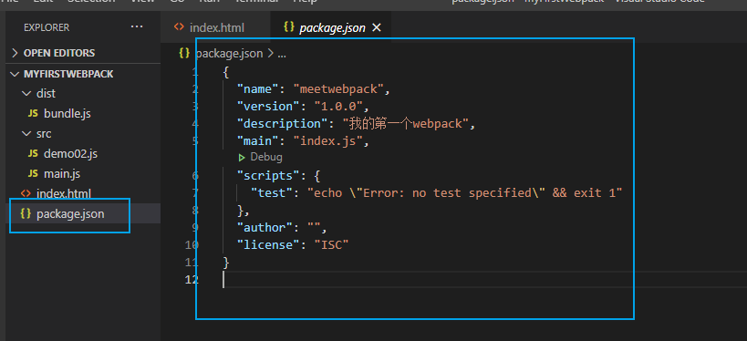

> 里面的内容就是我们刚刚输入的东西，这个文件就是告诉人这个项目的具体信息

如果package.json文件中有一些依赖的话，可以在控制台输入npm install来安装package.json中的依赖


然后我们创建webpack.config.js文件

输入以下内容


```JavaScript
const path = require('path')

module.exports = {
    entry: './src/main.js',
    output: {
        path: path.resolve(__dirname, 'dist'),
        filename: 'bundle.js'
    }
}
```


> 一般都是用main.js作为入口，main.js导入各种依赖


**然后我们也可以将webpack指令进行映射**

在package.json中，添加如下代码


然后我们在控制台输入`npm run build`，就能执行webpack指令了


## 在项目安装webpack并使用

**当我们在项目安装一个webpack，项目打包后就不需要使用**


> 安装成功，就会在项目安装一个webpack


而package.json就会新增webpack依赖


**那么如何使用项目的webpack呢**

两种方式

1. 使用在package.json中设置好的方式

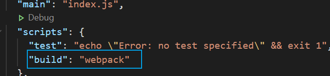

然后在控制台输入`npm run build`

2. 在控制台输入`./node_modules/webpack`

相当于是直接调用项目的webpack


## webpack中使用css文件的配置

就是像上面将各种js文件作为模块打包到bundle.js一样，将css文件也作为模块打包到bundle里面

但是因为css没有像js一样有commonjs和es6来导入依赖，所以，首先需要安装loader


先是在main.js添加js文件依赖


第一步 安装loader

```JavaScript
npm install --save-dev css-loader
```

> --save-dev是开发者环境，应该是相当于只安装在项目中的意思


第二部 在webpack.config.js设置路径


然后我们在src下创建js和css文件夹，专门用来存放各种对应的文件，只留main.js作为我们的入口


**但是这样，我们的样式依然是还不能产生效果的，因为loader只负责加载，不负责帮着我们解析，也不复杂将css文件加载到html中**


我们还需要安装style loader


## webpack-less文件的处理

先创建一个less文件

然后编写样式


然后在main.js导入less依赖


安装loader


添加配置到webpack.config.js


然后webpack一下，然后查看以下页面


## webpack图片 文件的处理（这是v4之前的方式，v5之后弃用了）


在webpack中，会把每一个引用都当作一个模块，如下


所以，当我们运行webpack的时候，这是会报错的


**报错告诉我们需要一个loader来出来图片这个模块**


安装url loader

`npm install url-loader --save-dev`


配置参数


然后就有两种情况，当图片小于limit的值，一般是20kb以下，

就会把我们的图片转化为base64格式的字符串


而当图片大于limit的值


就会要求我们安装file-loader

我们安装file-loader


然后重启webpack以下，浏览器就会报错

找不到图片了‘


这是因为webpack会把我们 的图片打包到dist文件夹下，而我们css设置的图片路径不是dist文件夹下的路径，所以就会报错

所以我们就修改一个配置，可以自动加载到图片


> 这样就显示成功了


**总结**

> 学习url-loader我踩了很多坑，一开始是不知道问家门浏览器识别我的background这个语句无效，一直不能显示图片，估计是版本问题，所以我就重新船创建项目
>
> 但是这个学习的是已经淘汰的版本，后期需要重新 学习v5


## es6转es5的babel


所以将es6语法转化为es5语法需要Babel


第一步是安装Babel


第二部配置webpack.config.js


```js
      {
                test: /\.m?js$/,
                exclude: /(node_modules|bower_components)/,
                use: {
                    loader: 'babel-loader',
                    options: {
                        presets: ['es2015'],
                    }
                }
            }
```


然后我们执行webpack，就能将es6语法转换为es5语法了


## 使用vue的配置


上面我们没有导入vue.js等文件，所以我们是不能使用vue 的东西的，所以如果我们要使用vue，

第一步，安装vue依赖


然后我们测试一下看能不能用


可以看到不不起效果的，好像是因为冲突原因，所以需要在webpack配置中添加下面的


```js
   resolve: {
        alias: {
            'vue$': 'vue/dist/vue.esm.js'
        }
```


这样就能生效使用vue了


## 创建vue时template和el的关系


一般来说，index.html的app应用是不写任何东西的


而是这样的


那么我们怎么绑定数据，调用方法呢


> 通过template就会实现页面的内容，代码都写在 js中，入口页面就会非常的干净


## vue的终极使用方案

如果我们在vue实例里面写太多template代码，并不是u什么好习惯，那么应该怎么解决呢

那么我们可以将template的代码提取出来，其实就是将这些代码提出到一个组件中


下面开始演示


> 这样我们就可以不在index页面输入任何东西而可以绑定数据了


**如果这样抽离代码的方式还不够简介，那么我们可以新建一个js文件，然后把这些代码都放在专门的js文件中**


这样也是实现上面的效果，而且显得代码更加简洁


但是上面的还不够简洁，因为模板代码和js代码还没有达到分离

创建一个vue文件，之前的app.js可以删除掉

 


然后在main导入


然后webpack一下


> 报错了，因为webpack不能识别vue这个文件，所以需要安装loader


然后就是配置webpack参数


还需要添加插件，否则会报错，因为我们用的vue-loader是15版本


做好上面的工作，我们就可以webpack项目了


可以看到成功展示了


还有如何在vue文件中添加子组件呢

我们新建一个vue文件


然后在父组件中导入子组件，并且注册组件，将组件应用在模板上


webpack一下，然后就输入子组件的内容了


## 横幅plugin的使用


第一步

在webpack.config.js添加插件


第二部，重新打包，在bundle.js文件的头部，就能看到


## HTMLwebpackplugin


当我们发布项目的时候，是只需要一个bundle.js的，但是dist文件夹中没有index.html，那么就会造成文件确实，我们

如何将index.html打包进dist'文件夹，就需要用到插件了


第一步安装插件


第二部修改webpack.config.js配置


然后webpack一下


dist文件夹下就生成了index.html文件


但是引入的路径是dist

这是多余的，因为在同一个文件夹

所以我们注释掉webpack.config.js查看


webpack一下


 


但是生成的index.html并没有<div>

我们在插件对象添加一个参数


## Uglifyjswebpackplugin


第一步


第二部配置参数


第三步webpack一下


bundle js就会变成压缩的文件


## webpack-dev-server搭建本地服务器

之前我们每次修改代码，都需要webpack一下，然后查看页面效果，每次都这样，会很影响效率


第一步，安装


> 因为我的webpack版本是4以上的，所以要安装webpack-cli以及webpack-dev-server要高一点才能匹配，如果安装了还是不行，上面两个同时卸载多几次安装试试。

第二步配置参数


第三步运行服务


> 这是进入文件夹运行

也可以在package.json中配置命令


然后输入命令


我们只需要点击这个连接就能打开我们的项目了


我们在index.html添加一个按钮，然后刷新一下网站，就能修改了，不需要每次都webapck

但是我们dist文件夹的bundle内容还是没有被打包的，修改的内容是暂时保存在我们的内存中的，如果想打包，还是需要webpack一下，才能真正的打包起来的


## webpack配置文件的分离


1. 安装插件


2. 创建配置文件


3. 把webpack.config.js所有东西都复制到base里面，然后在base中抽取开发用到配置到dev中，生产用的配置到prod中


4. 在开发的时候是base文件和dev文件组合  

 生产的时候是base文件和prod文件组合


5. 然后我们修改package.json,配置配置文件的路径


6. 修改dist文件夹生成的路径


> 这样就能将dist文件夹生成在项目目录下


这样无论我们是webpack还是打包成在服务器运行，都可以


## webpack出现的问题


 webpack执行报错，无法执行的问题


**出现 UnhandledPromiseRejectionWarning报错**

这是因为css-loader版本过高，版本和其他loader不匹配导致的，卸载当前的loader，安装对应版本的loader就行了


# vue-cli脚手架


- 安装node
- 

- 安装vue脚手架
- 

如果想要安装脚手架2的版本，可以在3的基础上安装


## vue脚手架2初始化项目过程


## vue-cli2目录结构解析


## eslint规范


说白了就是对你的代码进行规范，格式不正确就会报错


## runtime-compiler和runtime-only的区别


vue程序运行过程是

通过template 解析抽象成语法树 ast  然后编译成render函数  形成虚拟（virtual）dom 然后转化成我们的真实dom  ——> compiler

而only是直接从render函数  然后形成虚拟dom  然后转化成真实dom


 


## vue-cli3创建项目和目录结构


脚手架3的配置文件都没有了，那么我们应该怎么去配置呢


**具体vuecli3的项目创建方式可以百度**

控制台输入vue ui然后点击插件


> 因为我创建项目选择了默认选项，所以，官方默认给我安装了上面的3个插件


# 箭头函数和this指向


this指向


可以看到，function方法是输出window，而箭头函数输出的是一个对象

这是因为箭头函数中的this引用的就是最近作用域中的this，向外层作用域中，一层一层查找this，知道有this的定义


# 什么是路由和其中的映射关系


用脚手架3创建一个vue项目


# 前端渲染后端渲染和前端路由和后端路由


- 后端渲染

> java server page

- 后端路由

> 后端处理rul和页面之间的映射关系


 

- 前端渲染


前端路由


# url的hash和html5的history

通过改变url的hash和html5的history可以使得当我们改变url的时候页面不会刷新


> 上面的两种方式都不会刷新网页


> pushstate是一个栈结构，而replacestate是一个替换方案


# vue-router

## vue-router安装配置


> 通过vue ui 进行vuerouter 的安装


> 然后vue就会自动创建如上文件夹
>
> 我们可以在这个index.js中配置路由信息


## 路由映射配置


1. 创建路由组件


2. 创建映射关系


3. 使用路由 

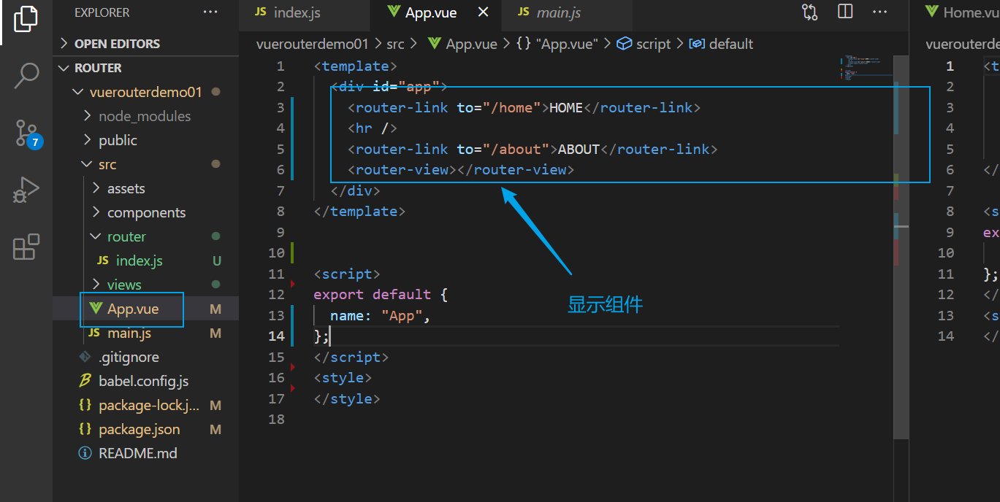


## 路由的默认值和修改为history模式


比如当我们进入页面就默认显示home组件的内容

第一种方式


第二种方式


**上面都是使用hash值的方式，这种方式都有一个#号，不美观**


下面改用html5的history模式


> 我们只需要修改vuerouter对象的模式为history模式就可以了


> 这样就美观多了


## router-link及其属性补充


tag

比如我们可以把router-link设置为一个button标签


replace

不设置replace，history是通过pushstate来切换不同的路由的，相当于一个栈

而设置为replace ，history是通过replacesate来切换路由的，相当于直接替换


- 当设置为replace，因为不记录之前的锚点，所以不能返回之前的页面


- 如果不设置为replace，就会有一个栈记录之前的锚点


router-link-active

当我们点击router-link标签的 时候，就会出现router-link-active属性，所以，我们可以通过这个类来设置，当我们点击这个标签的时候，就改变字体颜色


> 当我们点击router-link标签的时候，就会出现上面的类属性，所以我们设置个属性的颜色就可以在我们点击标签的时候改变字体颜色


当然我们也可以改变这个类名如下


**我们可以通过路由来进行统一的修改**


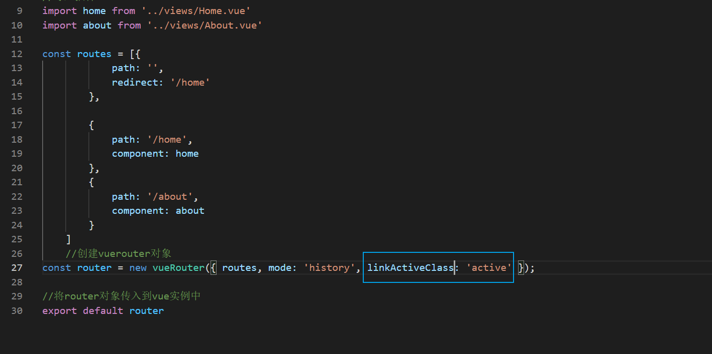

> 这样就不用一个一个link都要修改名字了，统一修改类名为active
>
> 


## 通过代码跳转路由

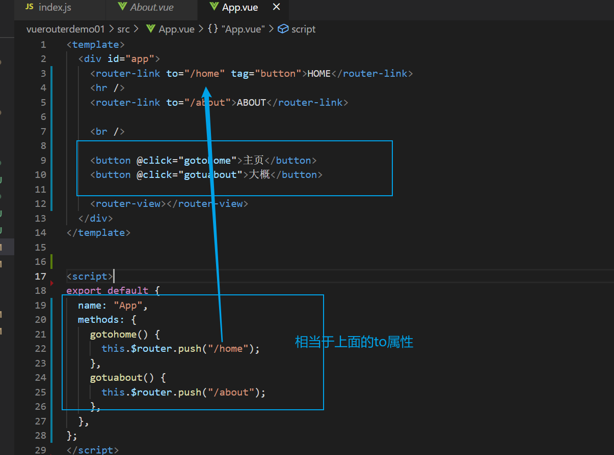


## 动态路由的使用


举例


然后我们的地址栏就能实现动态url


那么如何在我们的组件显示上面的吴亦凡姓名呢


> 注意，这里是route，获取的是动态的对象，router获取的是整体的大的对象，就是我们在index.js中new出来的router


## vue-router打包文件的解析

详情看视频吧


## 路由懒加载


**演示**


## 路由的嵌套使用


**演示**

创建两种组件，作为home下的组件


配置路由


配置子路由显示的位置


然后我们查看效果


然后我们也可以设置默认显示的路由


## 参数传递


**演示**

创建一个组件为profile


配置路由


然后在app.vue配置输出这个路由


然后我们查看效果就能看到url有query参数了


然后我们在组件中输出query的参数


不通过router-link的方式来 传递数据


## 区分$router和$router

在main.js中输出router对象

以及通过点击事件输出$router查看是不是同一个东西


然后我们输出$route查看是什么东西


> 其实就是我们配置的路由，就是index.js的东西。$router输出的是vue router的实例

**总的来说，$router可以输出路由的各种api方式等比如push和replace 而$route输出的是我们自己配置的路由的参数**


## 	全局导航守卫

通过create这个函数，在组件每次创建的时候被调用，以此来改变标题


只需要在没有组件添加created函数，就能改变标题


可以看到，当我们点击组件的时候，这样就能改变标题


但是我们一个一个组件的修改，每个组件都添加一个created函数，这样似乎太过于繁杂了，上面的所有的跳转，都是路由跳转

那么我们可以不可以监听路由的跳转，当路由跳转的时候就改变标题呢


**这个时候就可以用到全局守卫了**


**在上面的gif可以看到，主页是因为有嵌套路由，所以标题显示的是undefined，那么如何去解决这个问题呢**

我们输出to这个对象查看


> 有matched这样的一个数组


> 这个next是必须的，如果不设置就不发调用下一个函数


## vue-router-keep-alive

之前我们每一次调用路由都会创建一个新的组件，如下


> 如上，每一次点击都会创建一个新的组件，那么我们如何保存这个组件的状态，导致每次点击都不会重新创建一个新的组件呢


我们只需要用keep-alive标签包围住route-view标签就可以了


> 可以看到这两个组件不管被点击了多少次都只创建了一次，保存了之前的状态


## keep-alive属性介绍


> 这样就不会保存about组件的状态了


# tabar基本结构的搭建

创建一个新的vue项目，然后我们继续学习


**创建两个vue文件，一个是tabbar一个是tabbaritem**


app.vue文件调用


具体效果


设置active图片


我们通过路由来控制点击不同的tabbar显示不同的效果

配置路由


创建4个页面


配置点击事件


然后在配置组件的路由路径以及输出router-view


然后查看演示的效果


修改tabbar颜色

上面我们设置了isactive的值


我们对tabbar底部的字体的颜色进行封装


## 文件路径问题

因为vue-cli3已经帮我们做好了大部分的配置，所以没有之前的config.js文件了，所以我们要在项目的根目录下创建一个vue.config.js，然后


这样，我们就可以把src目录更改为@了，之后我们配置的各种路基，都可以用@替代了


# promise


对比如下

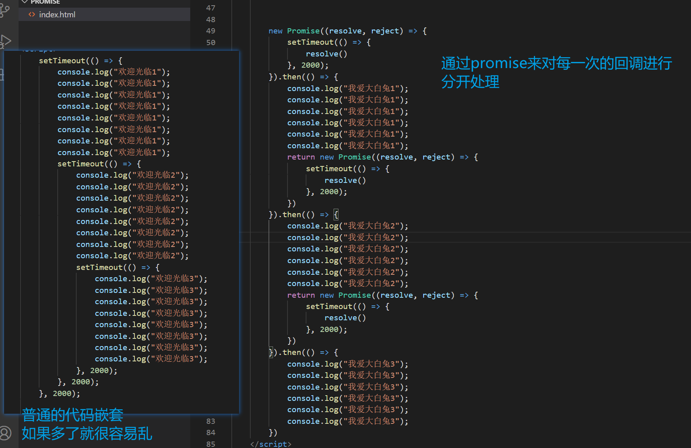

> 对每一次回调都很清晰的分开了，通过调用resolve()方法，然后处理then中的代码，就是提供专门的地方then来处理我们的逻辑，


**什么情况下会用到promise**，一般是有异步操作时候，使用promise对这个异步操作进行封装


promise的其他使用方式


> 在ajax中，当我们成功的时候就调用resolve，失败就调用reject

**这个东西的目的就是为了让我们的代码的可读性提高，写出来清新优雅**


## promise的三种状态和另外处理方式


## promise的链式调用

演示如何逐层传递数据


## promise 的all方法的使用


# vuex


## 单界面到多界面状态管理切换


案例


可以预见到的是，控制台输出了错误信息


因为我们没有进行父组件向子组件的传值，我们进行下面的修改 


效果


**上面的通过父子组件的关系来传递状态，这是没有用到vuex的，那么，当我们如果使用到vuex，应该怎么处理上面的情形呢**


vuex是一个插件，所以需要安装，我们在vue ui 上面添加vuex就可以了


vuex插件安装完成之后，就会自动帮我们创建一个store文件，包含一个index.js文件


然后也就能直接实现上面的效果


> 总结就是vuex将我们的状态都抽离出来，然后直接进行管理


但是上面我们修改vuex状态的方式是不正确的，解释如下


直接修改vuex状态，devtools显示的是undefined


既然我们不能直接修改state，那么为什么一定要通过action然后再通过mutations才能修改vuex的状态呢


那么如何做呢（devtools，mutations）

 

首先是进行同步操作的时候


然后我们在通过点击事件调用mutations

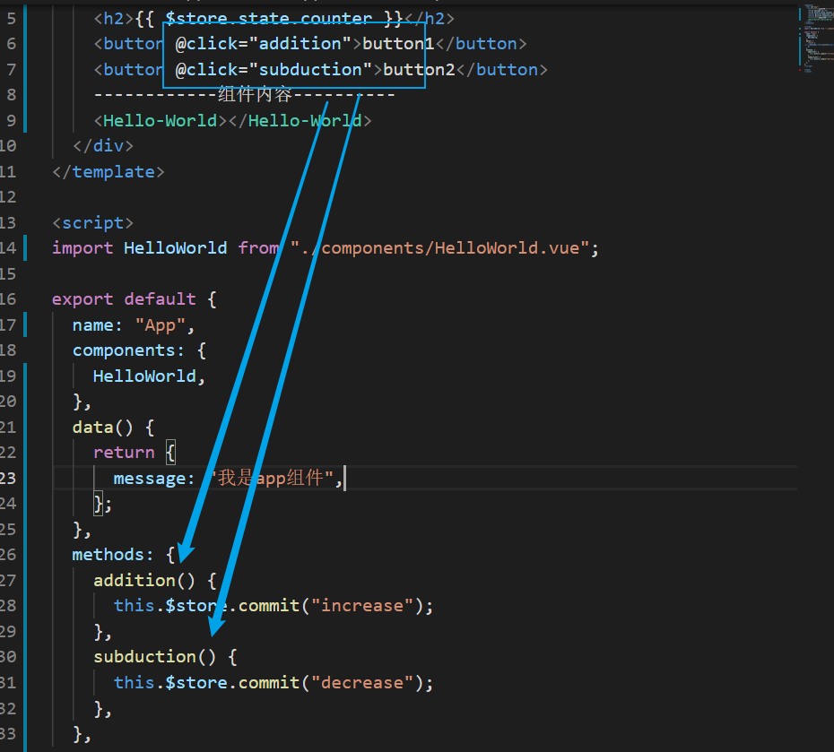


然后在devtools就能查看到修改的记录了


## vuex state单一状态树的理解


## vuex-getters的使用详解


普通的数据是我们直接调用的，但是如果我们希望调用的data属性是经过一系列的计算变化的，那么就需要getters了。getters相当于vue的计算属性。

下面演示获取counter的平方


第二个案例是筛选不同年龄范围的user


再一个案例

获取年龄大于20岁学生的个数


> 这里实际上就是将getters作为参数来传递


再一个案例

就是获取年龄大于x的学生，这个年龄是可以进行传递的


## mutations携带参数


演示

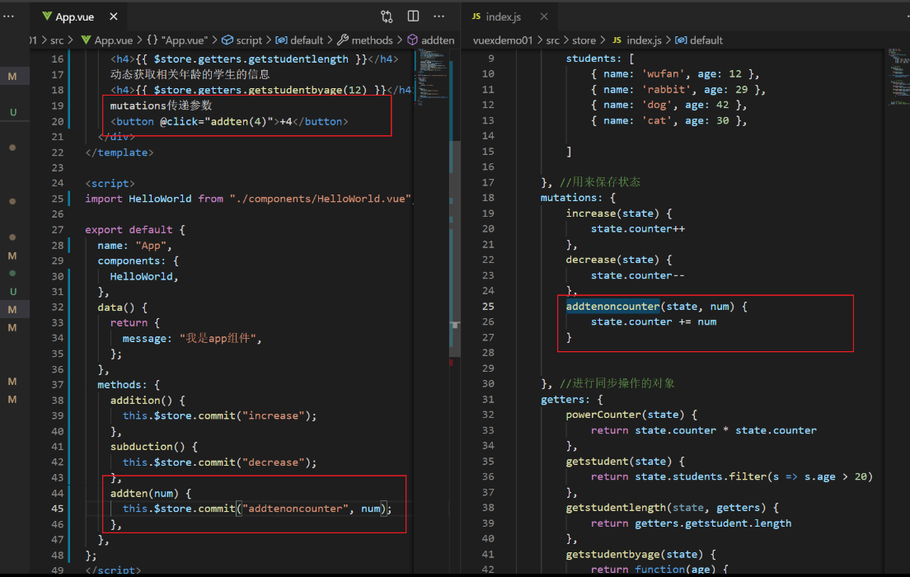

案例


如果我需要添加一个学生，应该怎么做


所以，床床底的参数被称为payload


## mutations提交风格


这种提交风格一般适合于传递的参数是一个对象的时候


> 我们输出这个传递的stu，输出在控制台看看


可以看到，输出的是一个这样的对象，其实这种特俗的提交方式的传递的参数称为payload


>  所以我们这样才能提取出stu对象


## 数据的响应式原理


而像这种临时添加一个新的属性，然后进行赋值的方式，是不能达成响应式的


> 因为address并没有添加到vue的响应式系统，所以html页面是不能更新的

如果真的要求上面的方式加入响应式系统，可以进行如下方法


## mutations的类型常量


 

创建一个js文件用来保存常量


## vuex-actions的使用详解


我们先在mutations中进行一个异步操作


>  如上图，我们可以看到，虽然我们看到网页上name的值已经被改变了，但是在vue的调试工具中，name的值并没有被改变，说明这是不好的情况。因为我们在mutations进行了异步操作。


actions进行异步操作


> 可以看到，更改name的名字，html改变了，vue调试器中也改变了


传递参数


因为上面是一个异步操作，那么我们 如果知道在执行完异步操作之后，输出一个提示信息，并且我们可以传递一个参数


> 传递一个对象，然后这个对象包含一个字符串和一个方法


但是上面的方式不够高级，因为上面涉及到回调函数，所以我们可以结合之前学习的promise


> actions中的方法中返回一个promise对象，promise对象中处理一个异步操作，然后在app.vue中因为返回了promise对象，所以then输出操作成功。


## vue-moduls的使用详解


如果我们所有的state都放在一起，就会很臃肿，但是vue又要要求单一决策树，所以我们可以通过moduls解决这个矛盾


下面是moduls的演示


> 如上所示，我们可以在moduls中继续嵌套添加state等对象

modules就是可以单独定义各种模块

那么我们怎么使用这些模块中的state呢

我们定义一个state


然后我们查看一下devtools


> 可以看到，其实moduleA也是保存在我们最开始的state中的，所以我们可以这样调用


其余的调用motations action getters和上面差不多，都其实是在原本的对象中而已。


**getters中的方法传参**


## store文件夹的目录组织

在es6中，对象的解构

演示如下


>  所以上面的这种也是对象的解构的形式


**项目的结构**


> 很明显的就是如果我们都把代码放在index，就会变得非常的臃肿，后期维护就会非常困难，所以如上显示的，可以将actions的代码放在一个js文件，mutations的代码放在一个js文件


通过export default   和 import来就行导入和导出


#  axios

 


## axios的基本使用

创建一个新的vue项目，然后安装axios


然后控制台就会输出返回的数据


## axios发送并发请求


通过axios同时发送多个并发请求，而且请求同时到达之后才做处理


## axios配置相关信息

 


所以我们可以通过通过配置直接统一这些配置信息，就不用分别设置了


 那么怎么配置呢，我们只需要在旁边配置就行


## axios的实例和模块封装


详细看视频


## axios的拦截器


axios学得一般，还需要再学习一次


# 前后端交互

## 接口调用的方式

- 原生ajax
- 基于jQuery 的ajax
- fetch
- axios

## URL地址格式

1. 传统形式的url


## restful形式的url


# 可能出现的问题

## 解决es6实现模块化时遇到的跨域问题


## webpack执行报错，无法执行的问题


## **出现 UnhandledPromiseRejectionWarning报错**

这是因为css-loader版本过高，版本和其他loader不匹配导致的，卸载当前的loader，安装对应版本的loader就行了


## 解决eslint代码检测和自动格式化

安装


这两个插件


然后在项目个根目录添加一个文件


就可以实现了

