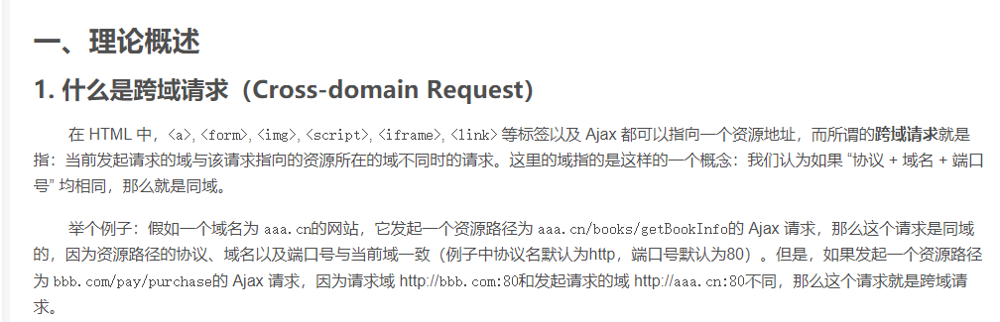

[TOC]

# 什么是跨域请求



https://blog.csdn.net/ppxin/article/details/94717173


**解决的代码**

```java
package com.cabbit.config;

import org.springframework.context.annotation.Bean;
import org.springframework.web.cors.CorsConfiguration;
import org.springframework.web.cors.UrlBasedCorsConfigurationSource;
import org.springframework.web.filter.CorsFilter;

public class CorsConfig {
    private CorsConfiguration buildConfig() {
        CorsConfiguration corsConfiguration = new CorsConfiguration();
        //需要跨域的地址
        //*表示对所有的地址都可以访问
        corsConfiguration.addAllowedOrigin("*"); // 1
        //跨域的请求头
        corsConfiguration.addAllowedHeader("*"); // 2
        //跨域的请求方法
        corsConfiguration.addAllowedMethod("*"); // 3
        return corsConfiguration;
    }

    @Bean
    public CorsFilter corsFilter() {
        UrlBasedCorsConfigurationSource source = new UrlBasedCorsConfigurationSource();
        //配置可以访问的地址
        source.registerCorsConfiguration("/**", buildConfig()); // 4
        return new CorsFilter(source);
    }

}
```

