[TOC]


## 页面布局常用标签


## 页面布局常用选择器


## 页面布局常用属性（一）


## 页面布局常用属性（二）


# CSS浮动 定位


## 清除浮动


**clear:left是清除左浮动的效果**


- overflow：hidden的作用

> 1. 当div设置了宽高，div里面的内容如果超出了宽高就会被隐藏
>
> - 未设置overflow的情况
> - 
> - 设置overflow之后
> - 
>
> 2. 清除浮动
>
> > https://www.cnblogs.com/getmn/p/11111376.html

## 定位position


- 绝对定位是以做了**（除static定位之外的）定位的外层元素（父元素或者父元素以外的元素，如爷爷元素等等）**为参考，如果都没有做，就以浏览器为参照，移动后不霸占其原有位置

> 总结：
>
> 1. 如果元素的外层元素是非static定位，那么这个外层元素就成为该元素的定位参考点
> 2. 如果元素的外层元素没有设计任何position的值，那么该元素将寻找距离自己最近的其它设定过position的外层元素作为参照物（必须为嵌套层）
> 3. 如果该元素的外层元素没有任何一个元素采用position定位，那么此时定位参考元素变为浏览器页面

- 相对定位是以元素的初始位置作为参照，移动后依旧霸占它原有的位置
- 固定定位是以浏览器页面作为参照，不受页面滚动影响，移动后不霸占其原有位置

## z-index堆叠顺序


`z-index`设置z轴的距离，这个属性高只支持定位元素

例子

```html
<div id="div02">
			<div class="d201"></div>
			<div class="d202"></div>
		</div>

```

```css
.d201{
		width: 200px;
		height: 200px;
		position: absolute;
		top: 200px;
		left: 200px;
		background: #0000FF;
	}	
	.d202{
		width: 200px;
		height: 200px;
		position: absolute;
		top: 300px;
		left: 300px;
		background: #FF0000;
	}
```

查看效果


可以看到，因为第红个div是最后执行的，所以会盖住蓝色div

但是，当我们在蓝色div加入 `z-index：1;`属性后，

```css
.d201{
		width: 200px;
		height: 200px;
		position: absolute;
		top: 200px;
		left: 200px;
		background: #0000FF;
		z-index: 1;
	}	
```


蓝色div就会盖住红色div

我们也可以在红色div中设置 `z-index:1;`或者 `z-index:999`,效果如下


红色的z轴坐标只要大于等于蓝色，就可以盖住蓝色


## display属性


`display:block`:隐藏元素

`visibility:hidden`隐藏元素，占据原有位置

`visibility:visible`很hidden配合使用，需要使用visible来显示


opacity可以用来设置透明度


# 盒子模型（标准盒模型）


- margin:上 右 下 左
- margin: 上 左右 下
- margin：上下 左右
- margin: 上右下左

margin 只作用与块状元素

- 上下10px，左右居中
- margin: 10px auto

## 外间距合并

什么是外间距合并，当上下两个盒子设置外间距，一个 `margin-bottom:100px` 一个 `marggin-top:50px`的时候，这两个盒子的外间距会合并，选取两个中的最大的外间距，就是100px


两个宽高都为100px的盒子，上面的盒子下外边距为100px，下面的盒子的上外边距为50px，最终两个的外边距为100px


**注意，这种外间距合并只适用于上下外间距，并不适用于左右外间距**

例如


## 包含式外间距合并

设置四个div

```html
<div id="div01">
			<div class="d01"></div>
			<div class="d02"></div>
			
			<div id="father">
				<div id="son">
				</div>
			</div>
			
		</div>
```

```css
.d01 {
			width: 100px;
			height: 100px;
			background: #FF0000;
		}

		.d02 {
			width: 100px;
			height: 100px;
			background: #000000;	
		}
 #father{
			width: 300px;
			height: 150px;
			background: #FFA500;
		}
		#son{
			width: 100px;
			height: 100px;
			background: #0000FF;
		} 

```


当我们给son这个div设置上外间距的时候 `margin-top:20px`


可以看到，father和son这两个div的上外间距合并了，那么我们应该怎么解决这个问题呢

可以在父元素设置一个边框或者内边距为1px(padding-top:1px)


## border边框


## 内边距


- padding的宽高要记录在模型的宽高之内，与此相同的式border 也要记录在盒子模型的宽高之内，但是margin并不算在宽高之内。所以各位在书写宽高时注意减掉内边距

## 怪异盒模型


## flex布局（移动端）

### flex布局原理

- flex时flexible box的缩写，意为“弹性布局”，用来为盒装模型提供最大的灵活性，任何一个容器都可以指定为flex布局（无论是块状元素还是行内元素）。
- 当我们为父盒子设为flex布局以后,子元素的float. clear 和vertical-align属性将失效。
- 伸缩布局=弹性布局=伸缩盒布局=弹性盒布局=flex布局


### flex父项常见属性


#### flex-direction设置主轴方向


1. row：设置主轴为x轴，方向从左到右
2. row-reverse：设置主轴为x轴，方向从右到左
3. column：设置主轴为y轴，方向从上到下
4. column-reverse：设置主轴为y轴，方向从下到上


- 先创建第一个flex父级元素

  ```html
  <style type="text/css">
  		body{
  			
  			margin: 0;
  			padding: 0; 
  		}
  		div{
  			display: flex;
  			width: 600px;
  			height: 300px;
  			background-color: #FFA500;
  		}
  		div span{
  			width: 150px;
  			height: 100px;
  			background-color: #FF0000;
  		}
  	</style>
  	<body>
  		<div id="div01">
  			<span>1</span>
  			<span>2</span>
  			<span>3</span>
  		</div>
  	</body>
  ```

  

- 默认的x轴是从左到右排列的
- 从右到左
- 

- 从上到下（主轴设置为y轴）
- 

- 从下到上（主轴设置为y轴）
- 
- 注意数字变化
- 注意:主轴和侧轴是会变化的,就看flex-direction设置谁为主轴,剩下的就是侧轴。而我们的子元素是跟着主轴来排列的

#### justify-content设置主轴上的子元素排列方式


**注意，一下均以x轴为主轴作为演示**

- flex-start为默认属性
- flex-end演示
- 


- center演示
- 

- space-around演示
- 

- space-between演示
- 


#### flex-wrap设置子元素是否换行

当里面的子元素总长度大于父元素的情况

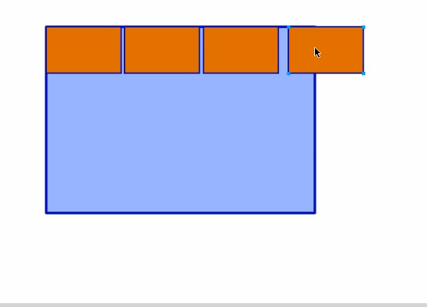


在flex布局中，就会合成一片


那么，我们如何可以向div布局中的可以让盒子跳到下一行呢


- flex布局中，默认的子元素是不换行的，如果装不开， 会缩小子元素的宽度，放到父元素里面


- wrap演示


#### align-items设置侧轴上的子元素排列方式（单行）


- 接上面的例子，当我们多加几个子元素，的时候，就会出现这样的情况
- 

- 那么，我们应该如何设置侧轴的元素排列呢
- center演示
- 


- stretch演示（需要将子元素的高去掉）


#### align-content设置侧轴上的子元素的排列方式（多行）

- 设置子项在侧轴.上的排列方式并且只能用于子项出现换行的情况(多行) , 在单行下是没有效果的。


- space-between演示
- 


#### align-content和align-items的区别


- 这种情况是单行
- 


- 这种情况是多行


#### flex-flow

- flex- flow属性是flex-direction和flex-wrap属性的复合属性


> 比如我们要设置主轴为x轴，方向为从左向右  设置自动换行，我们需要两个语句
>
> ```css
> 			flex-direction: row;
> 			flex-wrap:wrap;
> ```
>
> 

> 那么我们怎么可以用一个语句就能完成呢，使用 `flex-flow:row wrap;`


### flex布局子项常见属性


#### flex属性

- flex属性定义子项目分配剩余空间,用flex来表示占多少份数。


- 演示


- 设置三个盒子

- ```html
  <section>
  			<div></div>
  			<div></div>
  			<div></div>
  		</section>
  ```

  


#### 将3个盒子在一个父项元素中平均分成3等分

```html
<p>
			<span>1</span>
			<span>1</span>
			<span>1</span>
		</p>
```


- 如果我们要中间的盒子粘二分之一
- 

```css
p{
			background-color: #FFA500;
			height: 200px;
			width: 60%;
			display: flex;
			margin: 100px auto;
		}
		p span{
			border: 1px solid #000000;
			flex: 1;
		}
		p span:nth-child(2){
			flex:2;
			background-color: #0000FF;
		}
```


### align-self控制子项自己在侧轴上的排列方式


- 问题
- 如何控制一个盒子在侧轴上的排列方式
- 

- 通过align-self控制第三个盒子在侧轴上的排列为从底部开始
- 


#### order属性定义项目的排列顺序


- 数值越小，排列越靠前,默认为0。
  注意:和z-index不一样。

继续上图的效果，我们将盒子2提到1的前面


## 开发的一些问题

`body{ magin:0;padding:0; }`这种，就是清除浏览器有可能默认设置边距；

在全局范围使用*号，会极大的消耗资源，所以不建议在全局使用”

你加这个后，table设置的cellpadding，cellspacing都无效了，确认这是要的效果当然可以直接用这个样式

### align-item和align-content的区别


## flex学习推荐网站

[flexboxfroggy](http://flexboxfroggy.com/)

[前端学习网站](https://codepip.com/games/grid-garden/)

[flex布局语法](https://www.runoob.com/w3cnote/flex-grammar.html)


# grid布局


## 概念


**网格线**


## 容器属性

### grid-template-columns和grid-template-rows


**上面的代码可以简写成如下**


> 使用这个值时，容器是不需要制定宽高的，container的大小由浏览器窗口的伸缩决定，容器里面的items自动排序


**网格线**


> 可以给每一条线命名（是用来帮助定位用的）


### row-gap和column-gap


一行一行之间的距离

`row-gap`   行直接的距离


`column-gap`  列之间的距离


**两个合起来写就是**

`gap：20px`

`gap:20px 20px`


### grid-template-area


一个item就是一个物品，而将多个item捆绑在一起就是area（一个格子是一个区域，多个格子捆绑在一起也是一个区域）


代表一个item代表一个area

aaa为一个area

中间的  · 代表忽略，忽略掉这个item的意思


### grid-auto-flow


> 如上图，定义了3列，但是两个item的像素已经大于3列，如果使用默认属性，就很浪费空间，如左图
>
> 如果加上dense值，就能把3填充上来，充分利用空间。

### justify-items(水平方向)和align-items(垂直方向)


 


`place-items:center center`就是将justify-items和align-items组合起来


### justify-content(水平方向)和align-content（垂直方向）


content就是容器里面所有的东西打包成一坨


> 如 justify-content：center
>
> 
>
> 

### grid-auto-columns和grid-auto-rows


如


那么如项目10多出来，浏览器就会自动将这个item拉伸到container的边框的底部 


如过我们通过属性grid-auto-rows进行设置，就能控制多出来的项目10的长度

`grid-auto-rows：50px`这样就能设置item10的长度为50px


## 项目（items）属性

### grid-columns-start 、grid-column-end、grid-row-start、grid-row-end


**简写的方式**

`grid-column:开始 / 结束`


**另一种写法 **


这里的span不是html的span，而是代表跨越的意思

如上代码实例，代表跨越3个的意思


### grid-area


> 上面是通过grid-area实现简写

### justify-self/align-self/place-self


# grid第三方知识点总结

[grid知识点](https://www.html.cn/archives/8510/#prop-grid-template-columns-rows)

# BootStrap


> 上面是移动端 专用的

而一般pc端只需要 如下的就可以了

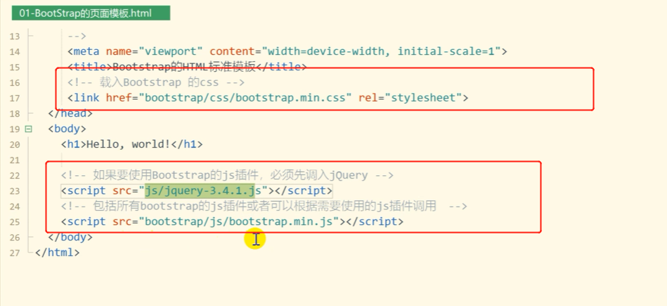

> **注意：引入配置文件的时候一定要先引入jQuery，因为bootstrap的js文件是依赖于jQuery的，如果jQuery文件不放在前面，就无法使用bootstrap的插件。**

导入bootstrap配置可以导入在线链接

> 上面配置的js文件和jQuery文件是使用到bootstrap插件的时候才使用到的，而样式是暂时使用不到的。所以可以暂时删除掉


## 布局容器


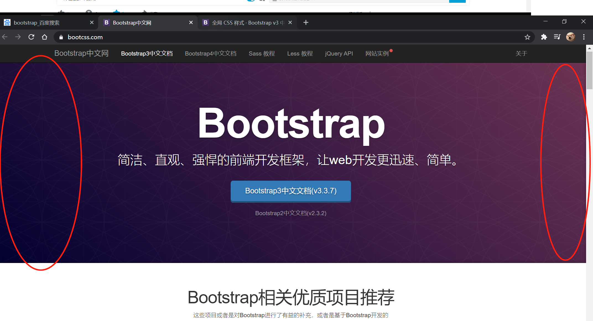

> 不留白


> 留白


## bootstrap插件简单提示


## 过渡效果


```html
<style>
    #mydiv01 {
        width: 100px;
        height: 100px;
        background-color: darkorange;
        -webkit-transition: width 2s;
        transition: width 2s;
    }
    #mydiv01:hover{
        width: 400px;
    }
</style>

<div id="mydiv01"></div>
<script>
    document.getElementById("mydiv01").addEventListener("transitionend", function (e) {
        this.innerHTML = "过渡效果完成之后就显示文字"
    })
</script>
```


## 手风琴的效果

https://ninghao.net/video/5409


# 微信小程序


## 安装微信小程序


## **创建项目步骤**


## 项目结构代码作用详解

**下面是index页面**


**下面是logs页面**


> 这个页面是遵循json格式的，如上，配置了一个json的参数，index页面就的title就被修改了


**这个wxml页面相当于html页面**


**wxss页面相当于css页面**


## 小程序项目配置

因为官方文档已经很详细了，所以我们直接看官方文档就可以了，不需要自己做笔记

[小程序官方文档](https://developers.weixin.qq.com/miniprogram/dev/reference/configuration/app.html)


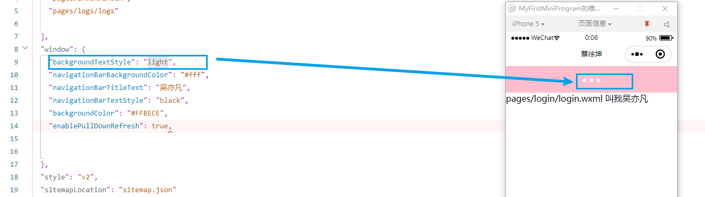


### 创建一个页面


效果如下


**注意：快速创建页面的方法**


## 全局配置

### tabBar详解


**代码演示**


### debug详解


> debug模式对于js的报错是没有什么作用的


## 页面配置

**单独针对某一个页面的配置**


## 小程序布局wxml


### 组件

### 数据绑定

### 列表渲染

#### 改变item的名称和index的名称


#### 99乘法表


#### wx:key


> 这是没有添加wx:key，可以看到，不能保证每一个switch的唯一性，当我们改变swich的数量的时候，之前被选中的swich却却变成二零新生成的switch被选中


> 添加了wx:key之后，就能确保switch的唯一性


**点击事件代码**

```JavaScript
changswitch: function () {
    //  获取上面数据的switchData对象
    var switchdata = this.data.switchData;
    //添加一个键值对    splice（添加在0下标，0代表不删除，添加的键值对）
    switchdata.splice(0, 0, {
      num: 4,
      content: "第五个"
    });
    // 然后把修改之后的值放回switchdata对象
    // this.data.switchData = switchdata; 这种方法虽然改变了switchdata的值，但是小程序并不会更新
    this.setData({
      switchData : switchdata
    })
  },
```


### 条件渲染

参考微信文档


### 模板

**注意，impot标签的路径符号一定要用'/'而不能用'\\'否则虽然不会报错不会报错，但是无法import模板**


### 模板快捷传参的方式


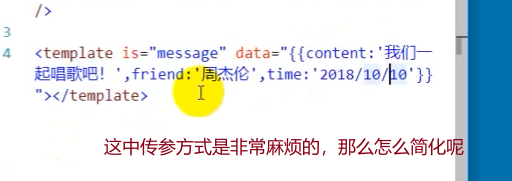


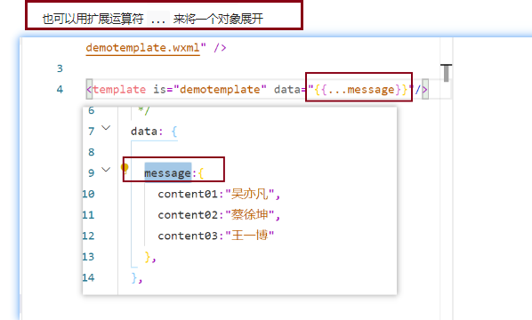


### include的用法

**相对于模板的import就更加的简单粗暴了，相当于把文件当中的代码crtl+c、复制到页面**


如上演示

> **但是我们依然可以给include的页面进行数据绑定**

在include页面布局进来之后，需要导入这个页面的样式

如下:arrow_down:


## view和block的区别

在微信小程序开发中
`<view>`：是一个标签，它会在页面显示出来。
`<block>`：是一个包装块，也就是代码块，里面可以包装一个专门的代码模块或者模板，但是它不会被显示到页面上，只会将包装的内容显示到页面上。

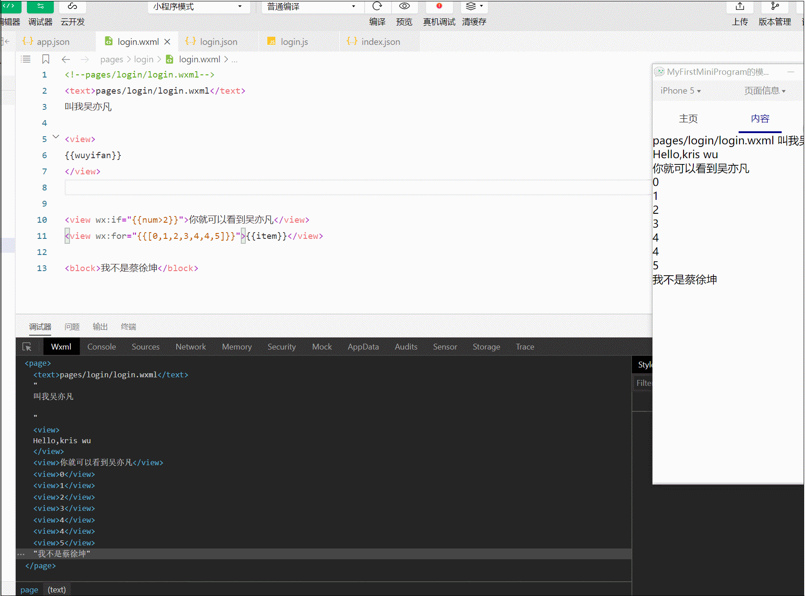

> 就是说，在控制台中，view是可以被渲染出来的，而block是不会被渲染出来的，可以看到Wxml控制台并没有block标签
>
> **所以block的性能会比view好一点**


## 事件绑定

[事件官方文档](https://developers.weixin.qq.com/miniprogram/dev/framework/view/wxml/event.html)

### 事件绑定获取元素的数据


**将获取的数据传送到其他页面**

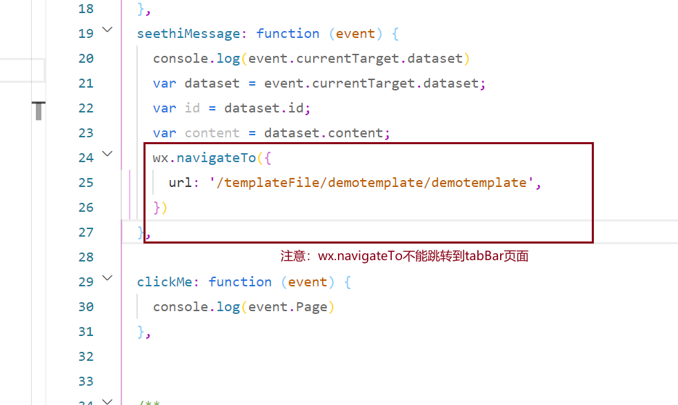


### 事件的冒泡


**事件冒泡演示**


> 定义两个view，一个包围着一个，然后点击里面的view，就会输出被点击的信息


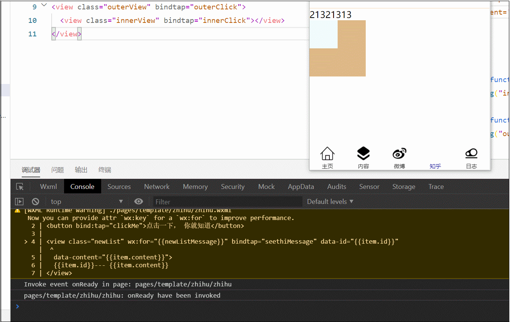

> 如上，我只是想点击innerview，却一样的outerview也给我执行了，这是不合理的
>
> 那么如何去解决这个问题呢

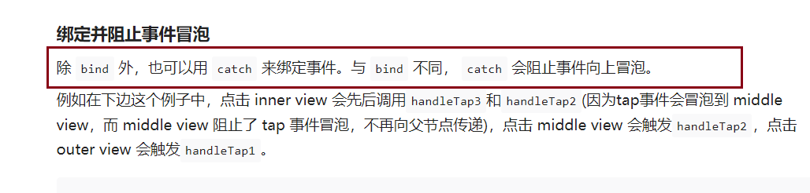


**使用catch就会阻止事件冒泡**


### event对象


> 一个点击事件出发后，输出event，会输出如下的参数对象

**我们来看看事件冒泡，的父元素的event对象是否会有区别**

点击inner元素之后，先是查看innerview输出的event对象


> 可以看到，innerview输出的`currentTarget`和`target`是一样的

然后我们看看父元素outer输出的event对象


> 可以看到，冒泡事件下，outerview输出的event对象是不一样的


## WXSS

### RPS详解


> 当我们设置为rps之后，微信小程序系统底层会根据不同手机自动换算成屏幕像素
>
> 比如当我们在设置rpx为100rpx的时候，在iPhone6会显示50像素，在iPhone5上就会显示42像素


## flex布局

****


### 支付宝案例

成果


wxml代码

```html
<!--index.wxml-->
<view class="top">
  <view class="top_search">
    <input placeholder="支付宝搜索"/>
    <mp-icon  icon="contacts" color="white" size="{{25}}"></mp-icon>
<mp-icon icon="add" color="white" size="{{25}}"></mp-icon>
  </view>
  <view class="top_content">
    <view>
      <cover-image src="../../images/icon/扫一扫.png" />
      <p>扫一扫</p>
    </view>
    <view>
      <cover-image src="../../images/icon/收钱-粗线条1.png" />
      <p>收钱/付钱</p>
    </view>

    <view>
      <cover-image src="../../images/icon/飞机,公共交通,出行.png" />
      <p>出行</p>
    </view>
    <view>
      <cover-image src="../../images/icon/卡包.png" />
      <p>卡包</p>
    </view>

  </view>

</view>

<view class="middle">
  <view class="middle_content">
    <view wx:for="{{middle_content_data}}">
      <cover-image src="{{item.src}}" />
      <p>{{item.name}}</p>
    </view>
  </view>
</view>
```

wxss代码

```css
/**index.wxss**/
.top {
  background-color: #1976FF;
  height: 340rpx;
  /* 设置内边距唯一，防止外边距合并 */
  padding-top: 1rpx;
}

.top .top_search {
  height: 100rpx;
  margin-top: 50rpx;
  display: flex;
  flex-direction: row;
  align-items: center;


}

.top .top_search input {
  width: 400rpx;
  height: 50rpx;
  background-color: #FFFFFF;
  margin: 0 20rpx 0;
  border-radius: 8rpx;
}

.top .top_content {
  height: 165rpx;
  display: flex;
  flex-direction: row;
  justify-content: space-around;
  align-items: center;

}

.top .top_search #top_searchbar {
  width: 200rpx;

}

.top_content view cover-image {
  width: 70rpx;
  height: 70rpx;

}

.top_content view p {
  color: white;

}

.top_content view {
  height: 160rpx;
  flex-basis: 25%;
  display: flex;
  flex-direction: column;
  justify-content: space-evenly;
  align-items: center;
}

.middle .middle_content view cover-image {
  width: 55rpx;
  height: 55rpx;
}

.middle .middle_content {
  background-color: #FEFEFE;
  height: 400rpx;
  display: flex;
  flex-direction: row;
  flex-wrap: wrap;
  justify-content: space-around;
  align-content: space-around;
}

.middle .middle_content view {
  flex-basis: 20%;
  display: flex;
  flex-direction: column;
  align-items: center;
}

.middle .middle_content view p {
  margin-top: 10rpx;
  font-size: small;
}
```

js代码

```JavaScript
//index.js
//获取应用实例
const app = getApp()

Page({
  data: {
    middle_content_data: [{
        id: 1,
        name: "饿了么",
        src: "../../images/icon/middle_content/饿了么.png",
        url: "#"
      },
      {
        id: 2,
        name: "口碑",
        src: "../../images/icon/middle_content/口碑.png",
        url: "#"
      },
      {
        id: 3,
        name: "市民中心",
        src: "../../images/icon/middle_content/市民中心.png",
        url: "#"
      },
      {
        id: 4,
        name: "消费卷",
        src: "../../images/icon/middle_content/消费卷.png",
        url: "#"
      },
      {
        id: 5,
        name: "电影演出",
        src: "../../images/icon/middle_content/电影演出.png",
        url: "#"
      },
      {
        id: 6,
        name: "转账",
        src: "../../images/icon/middle_content/转账.png",
        url: "#"
      },
      {
        id: 7,
        name: "信用卡还款",
        src: "../../images/icon/middle_content/信用卡还款.png",
        url: "#"
      },
      {
        id: 8,
        name: "充值中心",
        src: "../../images/icon/middle_content/充值中心.png",
        url: "#"
      },
      {
        id: 9,
        name: "余额宝",
        src: "../../images/icon/middle_content/余额宝.png",
        url: "#"
      },
      {
        id: 10,
        name: "滴滴出行",
        src: "../../images/icon/middle_content/滴滴出行.png",

        url: "#"
      },
      {
        id: 11,
        name: "校园",
        src: "../../images/icon/middle_content/校园.png",
        url: "#"
      },
      {
        id: 12,
        name: "芝麻信用",
        src: "../../images/icon/middle_content/芝麻信用.png",
        url: "#"
      },
      {
        id: 13,
        name: "火车票机票",
        src: "../../images/icon/middle_content/火车票机票.png",
        url: "#"
      },
      {
        id: 14,
        name: "基金",
        src: "../../images/icon/middle_content/基金.png",

        url: "#"
      },
      {
        id: 15,
        name: "全部",
        src: "../../images/icon/middle_content/全部.png",
        url: "#"
      }

    ]
  },
  //事件处理函数
  bindViewTap: function () {
    wx.navigateTo({
      url: '../logs/logs'
    })
  },
  onLoad: function () {
    if (app.globalData.userInfo) {
      this.setData({
        userInfo: app.globalData.userInfo,
        hasUserInfo: true
      })
    } else if (this.data.canIUse) {
      // 由于 getUserInfo 是网络请求，可能会在 Page.onLoad 之后才返回
      // 所以此处加入 callback 以防止这种情况
      app.userInfoReadyCallback = res => {
        this.setData({
          userInfo: res.userInfo,
          hasUserInfo: true
        })
      }
    } else {
      // 在没有 open-type=getUserInfo 版本的兼容处理
      wx.getUserInfo({
        success: res => {
          app.globalData.userInfo = res.userInfo
          this.setData({
            userInfo: res.userInfo,
            hasUserInfo: true
          })
        }
      })
    }
  },
  getUserInfo: function (e) {
    console.log(e)
    app.globalData.userInfo = e.detail.userInfo
    this.setData({
      userInfo: e.detail.userInfo,
      hasUserInfo: true
    })
  }
})
```

**导入WeUi组件库**


**app.json的配置**


## 小程序逻辑-app生命周期


## 小程序逻辑-页面间传递参数


**栈就相当于一个水桶**（先入后出）

比如：如果创建一个新页面，（页面初始化）,那么就会把这个页面放入栈里面


**案例**

发微博案例


**代码**

微博列表页

```html
<view>
  <text>微博列表</text>
  <view wx:for="{{weiboList}}">
    {{item}}
  </view>
</view>
<button bindtap="JumpToSendWeiBoPage" type="primary">
  点击跳转到微博发送页
</button>
```


**微博信息发送页**

```html
<form bindsubmit="submitSendMessage">
  <input type="text" placeholder="输入你的微博" name="content"/>
<button form-type="submit" type="primary">发送微博</button>
</form>
```


```JavaScript
submitSendMessage: function (event) {
    //获取发送的微博内容
    var message = event.detail.value.content;
    //获取小程序所有页面的对象
    var pages = getCurrentPages();
    console.log(pages)
    //获取微博列表页对象
    var page = pages[0];
    //提前在微博列表页定义的data里面定义好一个weiboList数组，然后获取这个数组
    //（注意：我们不能直接在这里修改这个数组，如page.data.weiboListpush(message)或者 weiboList.push(message)，这样并没有修改微博列表页的data里面的 weiboList，需要通过setData这个方法来修改才能生效。）
    var weiboList = page.data.weiboList
    //把新发的微博内容放入这个数组中
    weiboList.push(message)
    //把修改好的weiboList数组放回微博列表页的data的weiboList里面
    page.setData({
      weiboList: weiboList
    })
    //返回微博列表页
    wx.navigateBack({
      delta: 0,
    })
```


## view组件属性详解


> 如上，当我点击innerview的时候，outerview也出现了点击态，那么如何阻止呢，
>
> **我们只需要在innerview元素添加`hover-stop-propagation`就可以了**
>
> 


## scroll-view横向滚动

```html
<scroll-view id="scroll01" scroll-x="{{true}}" scroll-left="{{true}}">
  <view class="scroll_item1"></view>
  <view class="scroll_item2"></view>
  <view class="scroll_item3"></view>
  <view class="scroll_item4"></view>
  <view class="scroll_item5"></view>
  <view class="scroll_item6"></view>
  <view class="scroll_item7"></view>
</scroll-view>
```

```css
#scroll01 {
  width: 600rpx;
  height: 400rpx;
  /* 设置行内标签不换行 */
  white-space: nowrap;
}

#scroll01 view {
  height: 400rpx;
  width: 400rpx;
  display: inline-block;
}

.scroll_item1 {
  background-color: thistle;
}

.scroll_item2 {
  background-color: darkorange;
}

.scroll_item3 {
  background-color: chartreuse;
}

.scroll_item4 {
  background-color: azure;
}

.scroll_item5 {
  background-color: black;
}
```


## 引入weui

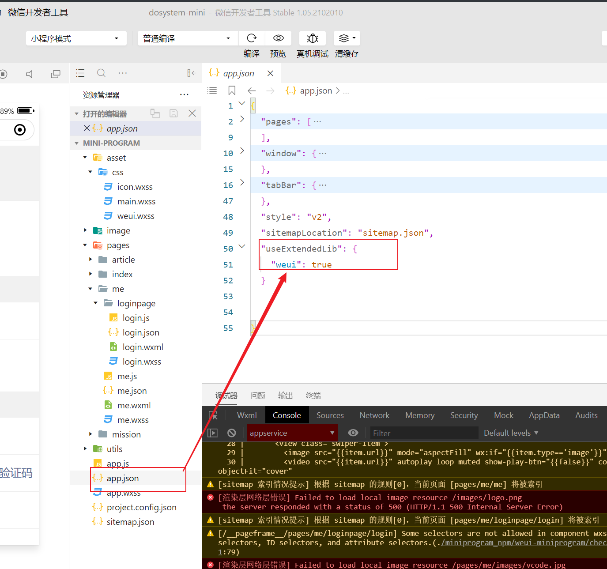

然后在页面导入组件，就能使用了


## 微信小程序获取view等基础组件的值data-


这个主键有列表渲染wx:for 然后有一个事件  然后data-  通过data-把item存到到事件中

然后js中的方法就能获取到这个item


## 微信小程序跳转页面传参的问题WX.NavigateTo


然后在方法中，我们可以通过event这个参数来获取这个值


然后我们通过navigate后面的url的传参的方式，来把这个对象传到下一个页面，但是我们需要把这个对象转变为字符串


然后我们在跳转的页面，把这个传输转变为json数据

就完成这个对象的传输了


## 解决微信小程序wx.request this..setdata this没有定义的问题


## 真机调试无法访问后端接口的问题


各级文件目录解析


## 微信小程序 color ui 全屏抽屉组件的使用

https://www.freesion.com/article/3790469475/#%E5%85%A8%E5%B1%8F%E6%8A%BD%E5%B1%89%C2%A0


## 微信小程序实现点击”空白“位置隐藏组件


如上，当我们显示modal框的时候，灰色空白的位置其实也属于modal框，所以我们直接设置modal框的事件为隐藏模态框的事件


然后我们在白色背景设置阻止事件冒泡（catchtap是阻止事件向上冒泡的意思，然后通过这个事件调用showModal方法），遮掩我们点击白色背景的区域就不会隐藏modal框了


## 关闭wx自带的样式


删掉这个就行

## 如何引入weui的项目模板


首先点击这个连接下载这个模板


**然后参考下面的介绍**


[](https://gitter.im/weui/weui?utm_source=badge&utm_medium=badge&utm_campaign=pr-badge)

### 概述

[WeUI](https://github.com/weui/weui) 是一套同微信原生视觉体验一致的基础样式库，由微信官方设计团队为微信内网页和微信小程序量身设计，令用户的使用感知更加统一。包含`button`、`cell`、`dialog`、 `progress`、 `toast`、`article`、`actionsheet`、`icon`等各式元素。

以下内容是纯UI库，如果想使用逻辑封装版本，请看[小程序组件库 - WeUI](https://developers.weixin.qq.com/miniprogram/dev/extended/weui/)

### 使用

- 样式文件可直接引用`dist/style/weui.wxss`，或者单独引用`dist/style/widget`下的组件的`wxss`
- 组件的wxml结构请看`dist/example/`下的组件

### rpx版本

默认版本使用的是`px`。这里也提供`rpx`版本，文件在[`dist-rpx-mode`](https://github.com/Tencent/weui-wxss/tree/master/dist-rpx-mode)目录下。

### WeUI 黑暗模式

在根结点增加属性 `data-weui-theme="dark"`
如:

```html
<view data-weui-theme="dark">
    ...
</view>
```

### 预览

用[微信web开发者工具](https://mp.weixin.qq.com/debug/wxadoc/dev/devtools/download.html)打开`dist`目录（**请注意，是`dist`目录，不是整个项目**）


### 文档

WeUI 视觉标准参考 [weui-design](https://github.com/weui/weui-design)

### License

The MIT License(http://opensource.org/licenses/MIT)

请自由地享受和参与开源

### 贡献

如果你有好的意见或建议，欢迎给我们提issue或pull request。


用微信小程序开发工具打开项目后


引入这些文件的代码，就可以使用了

注意，我们的项目要引入


这个js文件，因为preview的js文件需要用到


## 微信小程序保持session会话方法（即时通讯）

因为微信小程序不支持cookie，所以微信小程序每一次请求就是一次会话，所谓服务端就会为每一个微信小程序请求生成一个sessionID，所以服务端就不知道到底是谁访问，所以我们就改造一下，可以让微信小程序保持session会话


当我们用wx.request发出请求，返回的结果会是一个cookie的数组


我们把这个sessionid保存在全局变量中

然后我们下一次发送请求，就获取这个全局变量


然后在请求头添加一个cookie头，把sessionid放进去，就能保持session会话


网上的案例


## 解决微信微信小程序组件使用第三方样式不生效的问题


# Layui

# 下载使用

在官网下载下来解压


# colorUI

## colorUI如何配合iconfont使用

因为colorui提供的图标并不完全，有时候并不能在colorui上找到我们需要的图标，但是我们又希望配合colorui提供好的框架来使用，下面就是如何将iconfont的图标整合到colorui中

- 进入到iconfont官网，选择自己的图标
- 
- 
- 
- 到这一步就很简单了
- 
- 将上面的代码复制到我们的项目wxss文件中，如果有多个图标，只需要更新代码
- 
- 主要要修改成红框上面的代码
- 然后添加下面的代码，就可以使用图标了
- 
- 在js中添加我们的图标名称
- 


上面是简单的alibba帮我们配置好的方式

还有一种比较原始的方式


> https://transfonter.org/


