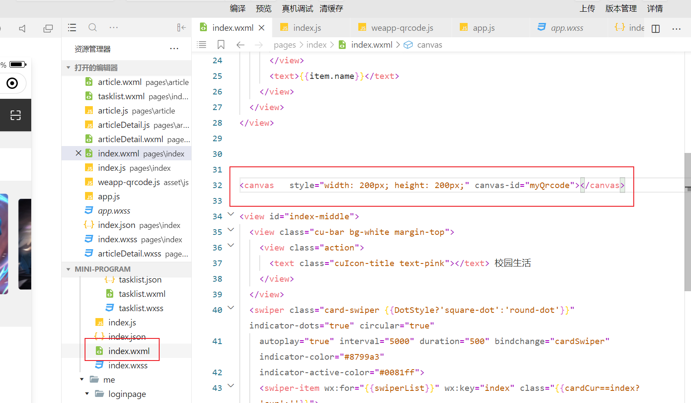
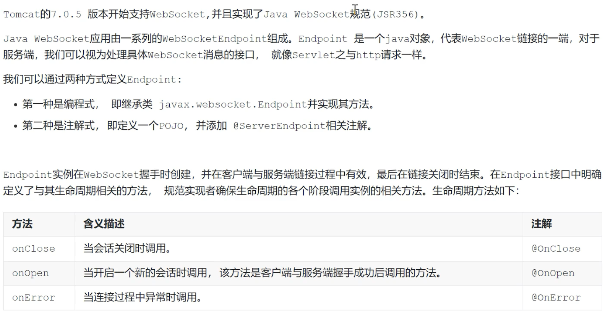

[TOC]

# 统一结果返回

```java
package com.cabbit.generator.api;

public enum ResultCode implements IErrorCode {
    SUCCESS(200, "操作成功"),
    FAILED(500, "操作失败"),
    VALIDATE_FAILED(404, "参数检验失败"),
    UNAUTHORIZED(401, "暂未登录或token已经过期"),
    FORBIDDEN(403, "没有相关权限");
    private long code;
    private String message;

    private ResultCode(long code, String message) {
        this.code = code;
        this.message = message;
    }

    public long getCode() {
        return code;
    }

    public String getMessage() {
        return message;
    }


}
```

```java
package com.cabbit.generator.api;

public interface IErrorCode {
    long getCode();
    String getMessage();
}
```

```javascript
package top.cabbit.generator.utils.response;

import lombok.Data;

import java.util.HashMap;
import java.util.Map;

@Data
public class CommonResult<T> {
    private long code;
    private String message;
    private Boolean success;
    private Map<String, Object> data = new HashMap<String, Object>();


    public static CommonResult ok(){
        CommonResult commonResult = new CommonResult();
        commonResult.setSuccess(true);
        commonResult.setCode(ResultCode.SUCCESS.getCode());
        commonResult.setMessage("成功");
        return commonResult;
    }

    public static CommonResult error(){
        CommonResult commonResult = new CommonResult();
        commonResult.setSuccess(false);
        commonResult.setCode(ResultCode.FAILED.getCode());
        commonResult.setMessage("失败");
        return commonResult;
    }

    public CommonResult success(Boolean success){
        this.setSuccess(success);
        return this;
    }

    public CommonResult message(String message){
        this.setMessage(message);
        return this;
    }

    public CommonResult code(Integer code){
        this.setCode(code);
        return this;
    }

    public CommonResult data(String key, Object value){
        this.data.put(key, value);
        return this;
    }

    public CommonResult data(Map<String, Object> map){
        this.setData(map);
        return this;
    }


}

```


# JWT封装，设置jwt拦截器


用户登录传入账号密码，查询数据库是否匹配，匹配就把用户信息存入到token中，然后token返回给用户，将token隐藏在请求头中，用户每个后续请求将包括JWT，从而允许用户访问该令牌允许的路由，服务和资源


```java
package top.cabbit.generator.utils.JWT;

import com.auth0.jwt.JWT;
import com.auth0.jwt.JWTCreator;
import com.auth0.jwt.algorithms.Algorithm;
import com.auth0.jwt.exceptions.*;
import com.auth0.jwt.interfaces.DecodedJWT;

import java.util.Calendar;
import java.util.Map;

public class JWTUtil {
    private static String signature = "$%^&G*YT(H!(@H(DH)H#GHJA(&7723";

    //获取token
    public static String getToken(Map<String, String> map) {
        JWTCreator.Builder builder = JWT.create();
        map.forEach((k, v) -> {
            builder.withClaim(k, v);//payload部分
        });
        Calendar instance = Calendar.getInstance();
        instance.add(Calendar.SECOND, 120);
        builder.withExpiresAt(instance.getTime());//设置token有效时间
        return builder.sign(Algorithm.HMAC256(signature));//设置signature部分，然后返回token
    }

    /*
     * 构建令牌验证器，
     * 通过捕抓异常来判断token是否正确
     * 返回payload部分
     * */

    public static DecodedJWT verify(String token) {
        return JWT.require(Algorithm.HMAC256(signature)).build().verify(token);

    }


}

```


用户登录controller（后面的验证用户名密码的service省略）

```java
@RestController
@RequestMapping("/sysuser")
public class SysuserController {
    @Autowired
    private SysuserService sysuserService;


    //登录操作
    @RequestMapping("/backStageLogin")
    public String backStageLogin(@RequestBody Sysuser sysuser) {
        Sysuser loginResult = sysuserService.queryOneSysUser(sysuser);//查询是否存在用户
        Map<String, String> map = new HashMap<>();//存放payload信息
        if (loginResult != null) {
            map.put("userID", loginResult.getId().toString());
            map.put("username", loginResult.getAccount());
            return JWTUtil.getToken(map);//获取token

        } else {
            return "登录失败";
        }

    }
    }
```

> 用户请求数据库查找是否有这个人，然后返回这个用户的对象，将用户的id和account存放在payload中，生成token


配置拦截器，访问系统模块都验证请求是否有合法的token


> 返回结果使用了上面的统一结果commonresult


前期验证是设置一个简单的接口，这个接口是被拦截器拦截的


> 当请求的token不是合法的，返回如下结果


> token合法返回的结果


# jwt集成spring security

https://www.cnblogs.com/niceyoo/p/10964277.html

**注意：文中的失败和成功处理器有错，自行百度搜索**


# vue-admin-template登录 接口的修改


#


# 微信小程序和vue向springsecurity请求login接口的请求方式


# 微信小程序登录（高级 ，我暂时还没有做）

https://www.jianshu.com/p/4e4db943bfb3

https://www.imooc.com/learn/1059


# 微信小程序生成二维码


api下载 地址  https://links.jianshu.com/go?to=https%3A%2F%2Fgithub.com%2Fdillonlfy%2Fweapp-qrcode

实践


在全局的app.js引入这个三方库


然后我们在页面的js中打入逻辑代码


然后再wxml中引入二维码



然后就生成了一张二维码


**注意，如果我们传入的是一个json字符串作为二维码的信息，当我们获取的时候，要记得去除空格，否者会报错，详情见下面二维码报错的原因**


| 参数         | 说明                                                         | 示例                        |
| ------------ | ------------------------------------------------------------ | --------------------------- |
| width        | 必须，二维码宽度，与`canvas`的`width`保持一致                | 200                         |
| height       | 必须，二维码高度，与`canvas`的`height`保持一致               | 200                         |
| canvasId     | 必须，绘制的`canvasId`                                       | 'myQrcode'                  |
| text         | 必须，二维码内容                                             | 'https://github.com/yingye' |
| typeNumber   | 非必须，二维码的计算模式，默认值-1                           | 8                           |
| correctLevel | 非必须，二维码纠错级别，默认值为高级，取值：`{ L: 1, M: 0, Q: 3, H: 2 }` | 1                           |
| background   | 非必须，二维码背景颜色，默认值白色                           | '#ffffff'                   |
| foreground   | 非必须，二维码前景色，默认值黑色                             | '#000000'                   |


## 解决获取扫二维码结果转化为json报错的问题

.png)


# 微信小程序地图

## 实时获取后台信息

.png)

> 注意要在手机上调试，不然无法调用onlocationchange

注意上面漏了下面这个api


# 即时通讯


## websocket


**http协议**


**ajax长轮询**


**websocket**


## websocket协议


## 客户端的实现


## 服务端的实现




## 点击用户进入聊天室


# 可能出现的问题

## 使用spring security进行登录，输入的账号密码正确，但是验证错误的问题

这是因为我们 配置的spring security会对我们输入的密码进行加密，而如果我们数据库的密码没有加密，就会密码不正确


我们可以通过如下来对存储的密码进行加密


## 关于账号密码正确，但是spring security页面只会原地刷新

这是因为我们在springmvc配置了一个解决跨域问题的代码，而在springsecurity中也关闭了跨域问题，产生了冲突，我们只需要把mvc中配置的注释掉就好了


## 跨域问题的解决


```java
httpServletResponse.setHeader("Access-Control-Allow-Origin", "*");
```

然后这个我的mvc配置是没有设置跨域解决方案的

然后springsecurity是关闭的cros crof的


## 解决vue-element-admin  cors跨域问题

创建代理服务器


然后我们请求的接口


这样设置就可以了


## 解决微信小程序wx.request this..setdata this没有定义的问题


## 解决获取扫二维码结果转化为json报错的问题

.png)