[TOC]

# 学习网站

刷题资料推荐：
https://cyc2018.github.io/CS-Notes/#/README  面试基础知识总结+刷题题号推荐
https://github.com/jwasham/coding-interview-university/blob/master/translations/README-cn.md  大神自制谷歌大学，学会之后，想去哪里去哪里
https://github.com/azl397985856/leetcode 中文刷题项目
https://github.com/MisterBooo/LeetCodeAnimation 动画形式解释算法过程

https://visualgo.net/en 数据结构算法可视化

https://programmercarl.com/ 代码随想录


https://juejin.cn/post/6844904103194132494 掘金 时间复杂度


# 数组

## 移除元素

**暴力解法**

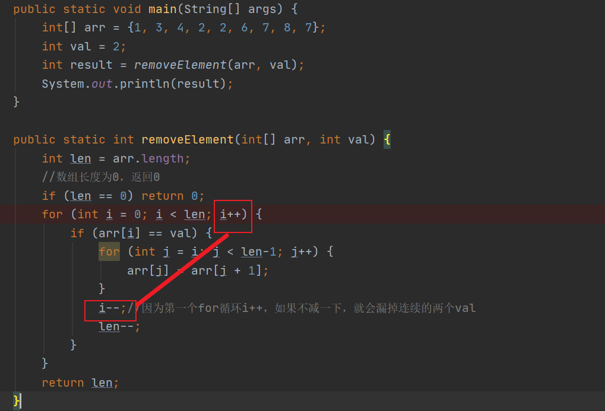


## 螺旋矩阵二


# LinkedList

https://blog.csdn.net/weixin_36605200/article/details/88804537

网上链表文章 https://juejin.cn/post/6870186377338683405

## array list引发的思考

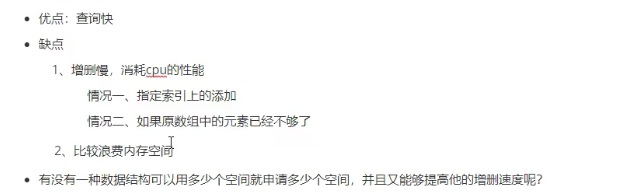

## 链表

**链表的分类：**单链表、双链表、循环链表（具体可以看代码随想录的链表介绍，通俗易懂）

**链表和数组相比，查询速度慢，因为没有索引**，但是增删快，用多少空间就创建多少空间

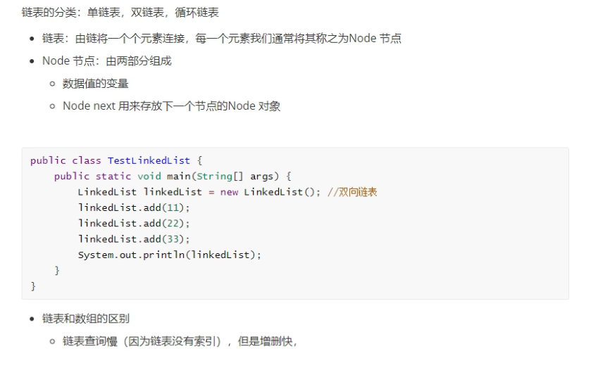

单链表（LinkedList本身是双向链表，下面图是假设LinkedList是单向链表）

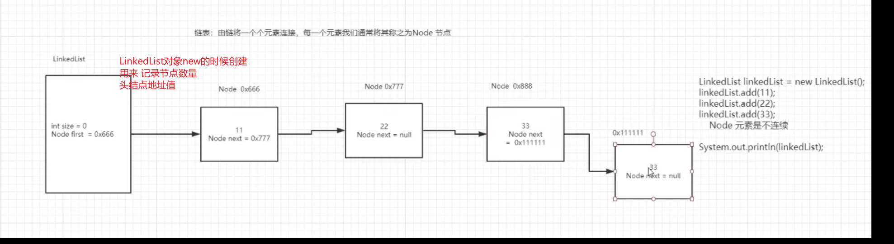


双向链表

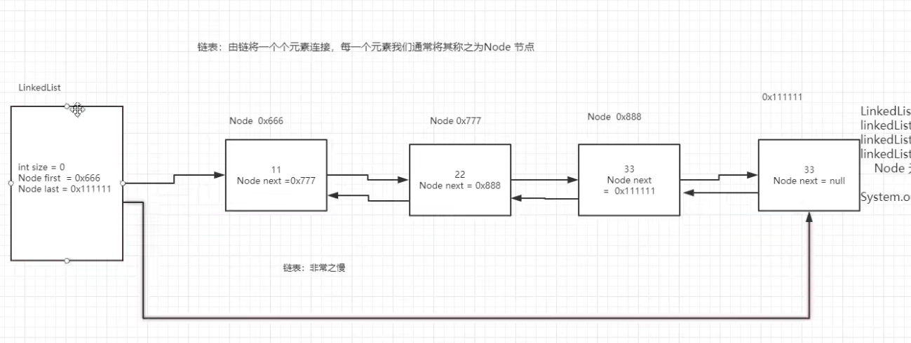


## 自定义单向链表

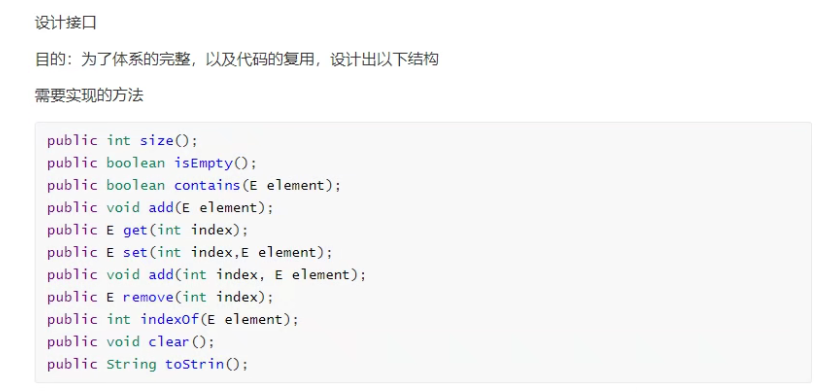

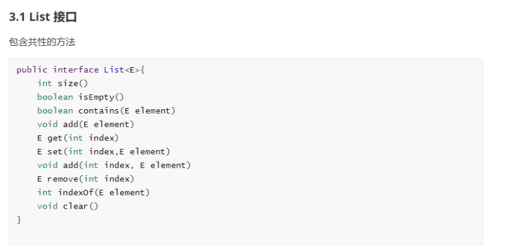

> 因为List接口中的方法不是全部都能用到，所以我们创建一个抽象类来抽取List接口部分方法，这样就不用每次都实现List接口中的所有方法


# 链表


## 链表相交

**题目关键提示**

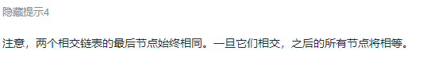


# 哈希表


# 字符串


## 反转字符串 Ⅱ

这道题目的中文翻译比较抽象，不好理解

所以参考了leetcode用户的题解

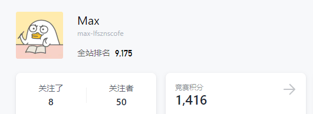


题目所给的规律
规律1.每计数2k个字符，就反转前k个字符
规律2.若剩余字符小于k个,则全部反转
规律3.若剩余字符大于等于k个但小于2k个，则反转前k个

运用数学归纳法来讨论一下：

字符串："abcdefghijklmnopqrstuvwxyz"
长度：26

运用分组的思想，这串字符串最终能以2k为长度，被划分成多个组。

当k=1时
即将字符串按照2k = 2*1 = 2的长度划分分组，那么26个字母将被划分为26/2 = 13个组，每个分组2个字符。

ab cd ef gh ij kl mn op qr st uv wx yz

按照题目意思，这13个分组都满足规律1，那么反转之后实际上字符串顺序是不变的。

当k=2时
分组长度:2k = 2 * 2 = 4,将26个字母按这个长度被划分为26/4 + 1 = 7个分组，为什么 + 1，是因为26不能被4整除，所以最后一个分组不是以4为长度的

abcd efgh ijkl mnop qrst uvwx yz

那么到这里，我们就知道，通过除法运算，我们可以得到按照2k长度划分的分组，那么最后一个分组剩下的字母长度区间就是：

[1,2k)

通过取余运算，可以得到最后一个分组的长度 26 % 4 = 2

那么到这里，我们就得到了分组的数量和最后一个分组的长度：

分组数量 ： s.length() / 2k
最后一个分组的长度：s.length() % 2k

这个有什么用呢？这可以让我们分情况对字符串进行处理了：

得到分组数量，我们就能用规律1来处理正常情况下的字符串
得到最后一组的长度，我们就能判断是用规律2还是规律3进行最后一步的处理

那么怎么得到待处理元素的区间呢，还要通过例子来找：

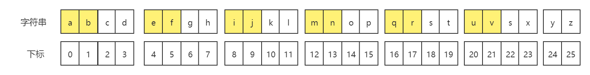

需要反转处理的元素已经标黄了，如果按照分组长度来进行迭代，框架就是：

java

```java
//分组数量
int group = s.length()/2;
//最后一组的长度
int lastNum = s.length()%2;
//处理2k为长度的分组
for(int i = 0; i < group * 2 * k; i += 2*k){
    ...
}
```


那么通过观察我们能发现，待处理元素下标的区间：

[0,1]
[4,5]
[8,9]
...
[i, i+k-1]

那么，2k长度的处理我们就可以完成了：

java

```java
//反转arr数组，区间[start, end]范围内的字符
void reverse(char[] arr, int start, int end){
...
}
//分组数量
int group = s.length()/2;
//最后一组的长度
int lastNum = s.length()%2;
//处理2k为长度的分组
for(int i = 0; i < group * 2 * k; i += 2*k){
    reverse(字符串, i, i + k - 1)
}
```


最后一组怎么办呢
通过观察，我们可以得到：

当最后一组的长度< k时:

区间 [group * 2 * k, s.length() - 1]
当最后一组长度>=k && <2k时:

区间[group * 2 * k, group * 2 * k + k - 1]
那么就可以写出代码了:


```java
java

class Solution {
    public String reverseStr(String s, int k) {
        char[] arr = s.toCharArray();
        int group = arr.length/(2 * k);
        int lastNum = arr.length % (2 * k);
        for(int i = 0; i< group * 2 * k; i += 2 * k){
            reverse(arr, i, i + k - 1);
        }
        if(lastNum >= k && lastNum < 2 * k){
            reverse(arr,group*2*k, group*2*k+k-1);
        }else{
            reverse(arr,group*2*k,arr.length - 1);
        }
        return new String(arr);
    }
public void reverse(char[] arr, int start, int end){
    while(start < end){
        char tmp = arr[start];
        arr[start++] = arr[end];
        arr[end--] = tmp;
    }
}
}
```

这个代码一看就很复杂, 为什么? 因为我们只是把初步得到的结果直接翻译了,其实还能继续提炼,分析这么多只是为了让你能看下标范围公式的时候,心里清楚是怎么来的

首先，处理2k长度的分组以及最后一组是可以合并的，因为最后一组的左区间都是group * 2k, 而for循环的结束条件也是group * 2k，那么就可以合并i的取值范围[0,s.length()],像这样：

for(int i = 0; i < s.length(); i += 2*k){
    ....
}
那合并了之后，要怎么处理待反转的区间呢，可以仔细地看上面的代码，我们的左区间其实是一样的，就是i, 那么问题就只剩下右区间了。主要观察三个地方：

2k长度： reverse(arr, i, i + k - 1);
[k,2k)长度：reverse(arr, group2k, group2k+k-1);
小于k长度： reverse(arr, group2k, arr.length - 1);

刚才说了左区间都是i，那么右区间i+k-1 实际上就等同于group*2k+k-1,那就是i+k-1和arr.length-1的选择问题了，当最后一组长度小于k，此时i = 25, i + k - 1 = 25 + 2 - 1 = 26 超出了界限，所以说，我们应当选这两个值中较小的那个做右区间。

最终代码：


​        

```java
class Solution {
    public String reverseStr(String s, int k) {
        char[] arr = s.toCharArray();
        for(int i = 0; i< arr.length; i+=2*k){
            reverse(arr, i, Math.min(i + k, arr.length) - 1);
        }
        return new String(arr);
    }

    public void reverse(char[] arr, int start, int end){
        while(start < end){
            char tmp = arr[start];
            arr[start++] = arr[end];
            arr[end--] = tmp;
        }
    }
}
```


## strStr()

**暴力解法**

```java
public static int strStr(String haystack, String needle) {
    //如果两个字符串都为空，返回0
    if (needle.length() == 0) return 0;
    //如果needle长度>haystaack返回-1
    if (haystack.length() < needle.length()) return -1;
    //只需要配对haystack与needle长度差个字符就可以了
    for (int i = 0; i <= haystack.length() - needle.length(); i++) {
        int hayIndex = i, needleIndex = 0;
        while (needleIndex < needle.length()) {
            if (haystack.charAt(hayIndex) != needle.charAt(needleIndex)) break;
            if (needleIndex == needle.length() - 1) return i;
            needleIndex++; 
            hayIndex++;
        }
    }
    return -1;
}
```


**KMP算法**

> 统一减一的情况

```java
class Solution {
    public int strStr(String haystack, String needle) {
    //如果needle长度为0 返回0
        if (needle.length() == 0) return 0;

        //创建前缀表
        int[] next = new int[needle.length()];
        getNext(next, needle);
        int j = 0;
        for (int i = 0; i < haystack.length(); i++) {
            while (j > 0 && haystack.charAt(i) != needle.charAt(j)) j = next[j - 1]+1;
            if (haystack.charAt(i) == needle.charAt(j)) j++;
            if (j == needle.length()) return i - needle.length() +1;
        }
        return -1;
    }
     //创建前缀表
    public void getNext(int[] next, String s) {
        //统一减一的情况
        int j = -1;
        next[0] = j;
        for (int i = 1; i < s.length(); i++) {
            while (j >= 0 && s.charAt(i) != s.charAt(j + 1)) j = next[j];
            if (s.charAt(i) == s.charAt(j + 1)) j++;
            next[i] = j;
        }

    }
}
```


> 不减一的情况

```java
class Solution {
    public int strStr(String haystack, String needle) {
    //如果needle长度为0 返回0
        if (needle.length() == 0) return 0;

        //创建前缀表
        int[] next = new int[needle.length()];
        getNext(next, needle);
        int j = 0;
        for (int i = 0; i < haystack.length(); i++) {
            while (j > 0 && haystack.charAt(i) != needle.charAt(j)) j = next[j - 1];
            if (haystack.charAt(i) == needle.charAt(j)) j++;
            if (j == needle.length()) return i - needle.length() +1;
        }
        return -1;
    }
     //创建前缀表
    public void getNext(int[] next, String s) {
        /*
         * 初始化指针和数组 j指向前缀的起始位置  i 指向后缀的起始位置
         * 遍历s模式串
         * 前后缀不相同，那么让j一直回退前一位
         * 如果前后缀相同 i后移一位
         * 不论上面结果如何，每一次for循环，next[i] = j;
         * */
        int j = 0;
        next[0] = j;
        for (int i = 1; i < s.length(); i++) {
            while (j > 0 && s.charAt(i) != s.charAt(j)) j = next[j - 1];
            if (s.charAt(i) == s.charAt(j)) j++;
            next[i] = j;
        }

    }
}
```


> 简单总结：
>
> 1.  解题思路就是先创建模式串的前缀表
>
>    > 创建前缀表的思路:
>    >
>    > - 初始化指针和数组j指向 前缀的起始位置  i 指向后缀的起始位置
>    > - 遍历模式串
>    > - 前后缀不相同，就让j一直回退到前一位
>    > - 前后缀相同，i后移一位
>    > - 不论上面结果如何，每一次for循环，next[i] = j; j就是代表最长相等前后缀长度
>
>    
>
>    2. 通过前缀表来比对文本串
>
>    > - 遍历文本串
>    > - j指向模式串
>    > - 比对每一个字符，如果相同j向后移一位
>    > - 如果不相同，i**一直**向前移动一位
>    > - 如果j的长度等于模式串字符长度，就能获取到文本串的起始位置。


 栈与队列

# priority queue使用

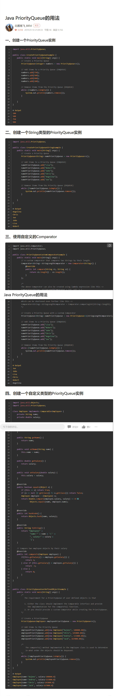


# 二叉树


## 满二叉树

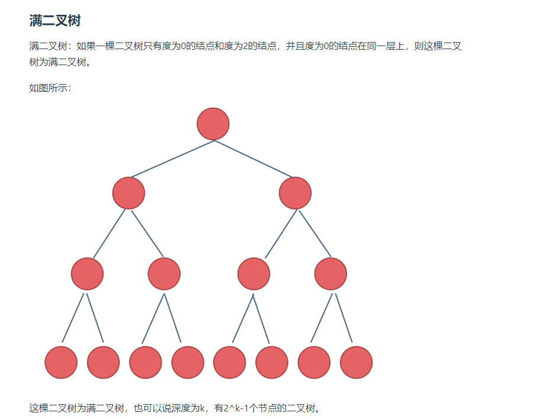


## 完全二叉树


**完全二叉树是除了底层以外，其他层都是满的，底层从左到右到结点都是连续的**

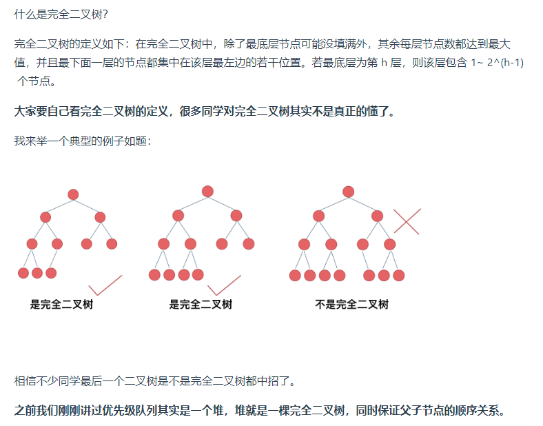


## 二叉搜索树

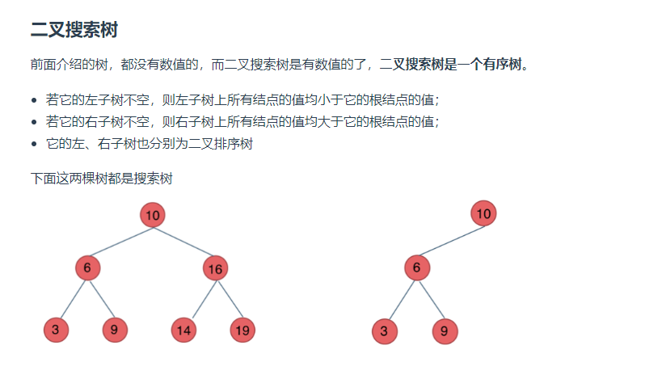


## 二叉平衡搜索树

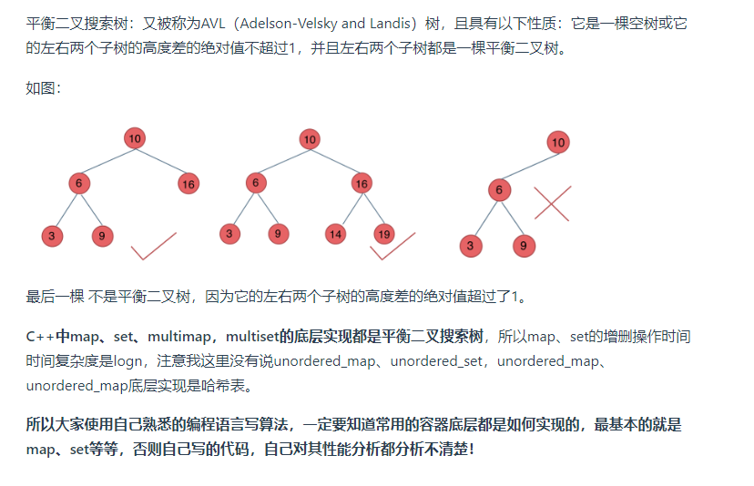


## 二叉树的遍历方式


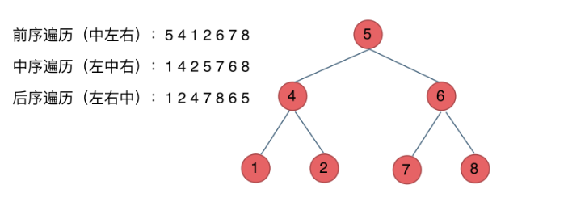


**二叉树参考例子**

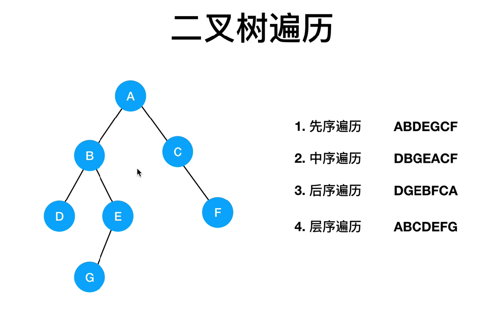


## 二叉树的高度和深度


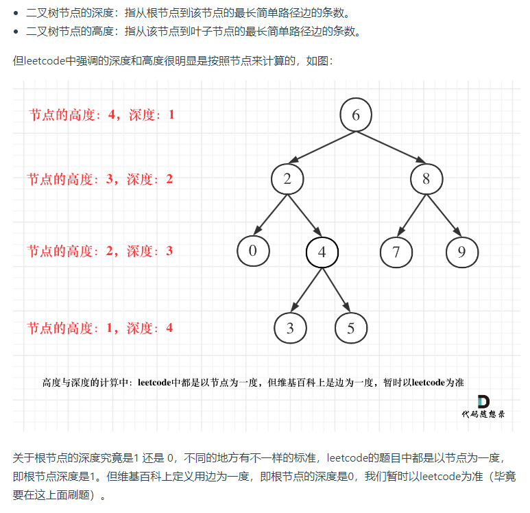