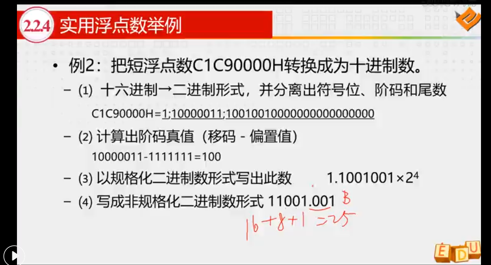
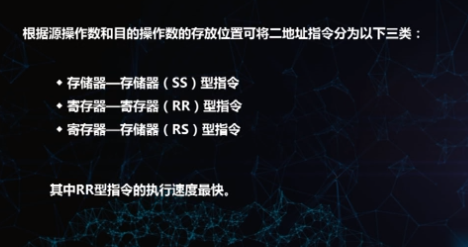
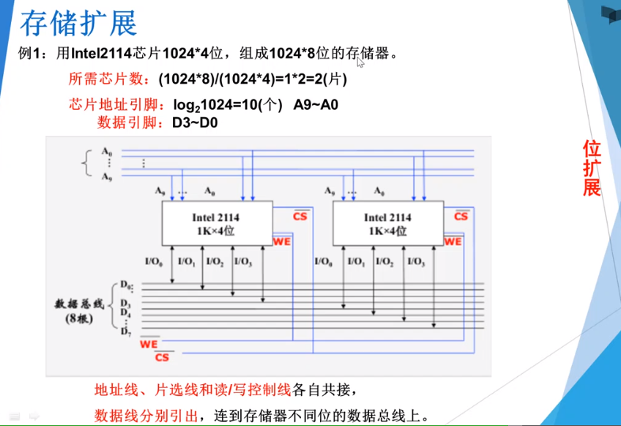
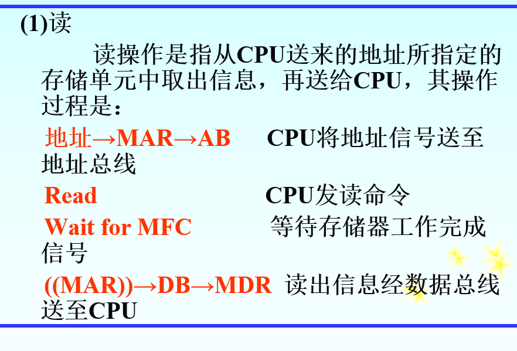

  

# 概论（完全正确）

**冯诺依曼计算机存储程序概念**

(1)计算机（指硬件）应由运算器、存储器、控制器、输入设备和输出设备五大基本部件组成；

(2)计算机内部采用二进制来表示指令和数据；

(3)将编好的程序和原始数据事先存入存储器中，然后再启动计算机工作，这就是存储程序的基本含义。

**计算机的五大硬件组成部分及其功能、cpu组成部分以及主机的组成部分**

计算机的硬件应由运算器、存储器、控制器、输入设备和输 出设备五大基本部件组成。它们各自的功能是：

 ①输入设备：把人们编好的程序和原始数据送到计算机中去，并且将 它们转换成计算机内部所能识别和接受的信息方式。 

②输出设备：将计算机的处理结果以人或其他设备所能接受的形式送 出计算机。 

③存储器：用来存放程序和数据。

 ④运算器：对信息进行处理和运算。

 ⑤控制器：按照人们预先确定的操作步骤，控制整个计算机的各部件 有条不紊地自动工作。

**中央处理器CPU**

> CPU = 运算器+控制器

**主机**

> 主机 = 中央处理器+主存储器

**外部设备**

>  除去主机以外的硬件装置（如输入设备、输出设备、辅助存储器等）

**计算机的主要性能指标和以及各个指标的定义**

> 计算机系统的主要技术指标有：机器字长、数据通路宽度、 主存容量和运算速度等。
>
>  机器字长是指参与运算的数的基本位数，它是由加法器、寄存器、数据总线的位数来决定的。
>
>  数据通路宽度是指数据总线一次所能并行传送信息的位数。
>
>  主存容量是指一个主存储器所能存储的全部信息量。 
>
> 运算速度与机器的主频、执行什么样的操作、主存本身的速度等许多 因素有关。 
>
> 

# 无符号数

基于传统的二进制表示法，表示大于或者等于零的数字。整个机器字长的全部二进制位均表示数值位（没有符号位），相当于数的绝对值。

# 真值

把带有正负号的数称为真值

# 机器数

机器数有原码  反码 补码

# 有符号数据

# 原码

# 反码

# 补码

# 移码

# 定点数

小数点固定在某一位置的数为定点数

# 浮点数

小数点不固定的数

# IEEE754标准

# 运算方法

补码的加法运算

补码的减法运算 需要看视频

- 把Y补 转变为[-Y补]，包括符号位取反，然后尾部加一

溢出及其判断方法

溢出：当两个数相加减的结果超出了给定的取值范围就称为溢出

**加法**

**减法**

**判断溢出的三种方法**

方法三

# 带符号的移位操作

- 逻辑移位：针对无符号数的移位操作

1. 逻辑左移

2. 逻辑右移

- 算术移位：

# 定点数乘法（原码、补码）

原码

两两相加解决多个数据相加

 

**补码**

# 规格化浮点数加减法

看视频

补码的补码就是原码

# 指令系统（完全正确）

- 机 器指令是指挥计算机实现某个基本操作的命令（包含以下要素）

  >操作码：用来指定该指令将要完成的操作类型（ADD、I/O）
  >
  > 源操作数的引用：计算机完成的每个操作都会涉及一个或多个源操作数，因此，在一条指令中需要指明从哪里得到这些源操作数
  >
  >结果操作的引用：它用来指明操作结果被存放在何处
  >
  >下一条指令引用：要告诉cpu这条指令执行完成后到哪儿去取下一个指令

## 指令格式（）

## 理解指令中不同地址码的类型定义，如四三二一零地址指令

这条指令所完成的功能是 

A1的内容和A2的内容完成op所规定的操作，并将计算结果保存在A3中

A1的内容和A2的内容完成op所规定的操作，并将计算结果保存在A3中，后续指令的地址隐含在程序计数器PC中

A1的内容和A2的内容完成op所规定的操作，并把结果保存在A1或者是A2中

**注意**：二地址指令执行之后，目的操作数地址中原来存放的内容已被破坏了

A1中的内容和累加器acc中的数据执行操作码规定的操作，并把结果保存在累加器中

## 熟练掌握变长编码中扩展操作码法的分配方案

## 掌握不同寻址方式的寻址过程

## 理解堆栈不同结构的类型

## 寻址技术

- 寻址技术包括编址方式和寻址方式

- 编址方式是指对各种存储设备进行编号的方式。

- 寻址方式就是如何找到下一条指令的地址和指令中操作数的地址

> 寻址方式划分成两类
>
> 1. 指令寻址
> 2. 数据寻址

- 指令寻址（顺序寻址和跳跃方式）
  - 顺序寻址

- 跳跃方式

- 数据寻址

# 存储系统和结构（完全正确）

- **按存储器在计算机系统中的作用分类**

1. 高速缓冲存储器
2. 主存储器
3. 辅助存储器（外存储器）

- **按存取方式分类**

1. 随机存取存储器RAM
2. 只读存储器ROM
3. 顺序存取存储器SAM
4. 直接存取存储器DAM

- **按存储介质分类**

1. 磁芯存储器
2. 半导体存储器
3. 磁表面存储器
4. 光存储器

- **按信息的可保存性分类**

断电后，存储信息即消失的存储器，称易失性存储器。

断电后，信息仍然保存的存储器，称非易失性存储器。

**存储系统层次结构**

由高速缓冲存储器、主存储器、辅助存储器构成的三级存储系统可以分为两个层次，
其中高速缓存和主存间称为 Cache－主存存储层次（Cache 存储系 统）；主存和辅存间称为主存—辅存存储层次（虚拟存储系统）。 

**cache存储系统是为解决主存速度不足而提出来的**

**虚拟存储系统是为解决主存容量不足而提出来的**

存储器的主要功能是什么？为什么要把存储系统分成若干个不同 层次？**主要有哪些层次？** 

解：存储器的主要功能是用来保存程序和数据。存储系统是由几 个容量、速度和价格各不相同的存储器用硬件、软件、硬件与软件相 结合的方法连接起来的系统。把存储系统分成若干个不同层次的目的 是为了解决存储容量、存取速度和价格之间的矛盾。由高速缓冲存储 器、主存储器、辅助存储器构成的三级存储系统可以分为两个层次，其中高速缓存和主存间称为 Cache－主存存储层次（Cache 存储系 统）；主存和辅存间称为主存—辅存存储层次（虚拟存储系统）

**主存储器的技术指标**

- 存储容量：主存所能容纳的二进制信息总量
- 存取速度

1. 存取时间：从启动一次存储器操作到完成该操作所经历的时间
2. 存取周期：存储器进行一次完整的读写操作所需的全部时间，即连续两次访问存储器操作之间所需要的的最短时间
3. 主存带宽：表示每秒从主存进出信息的最大数量

RAM(定义和特点)

> 可读可写
>
> 断电时丢失其存储内容，故主要用于存储短时间使用的程序

ROM（定义和特点）

> 工作时只能读出，不能写入
>
> 优点是具有非易失性，即使电源断电，ROM中存储的信息也不会丢失

主存储器的扩展

- 位扩展（字数满足要求，位数不满足要求，所以需要位扩展）

解决存储器带宽不足的问题

- 字扩展（字数不满足要求，位数满足要求，所以需要字扩展）

- 字和位同时扩展的计算方法（字数不满足要求，位数不满足要求，所以需要字位同时扩展）

- 相应芯片中地址线、数据线、读写控制线和片选信号的连线规则

主存储器的连接与控制

> 

高速缓冲存储器工作原理

当CPU发出读请求时，如果Cache命中，就直接 对Cache进行读操作，与主存无关；如果Cache不命中，则仍需访问主 存，并把该块信息一次从主存调入Cache内。若此时Cache已满，则需根据某种替换算法，用这个块替换掉Cache中原来的某块信息。 

> 

**求地址线、数据线(数据线的数量等于数据输入线和数据输出线)、**

> 举例子吧，如果是[2K](https://www.baidu.com/s?wd=2K&tn=SE_PcZhidaonwhc_ngpagmjz&rsv_dl=gh_pc_zhidao)*4的芯片，[2K](https://www.baidu.com/s?wd=2K&tn=SE_PcZhidaonwhc_ngpagmjz&rsv_dl=gh_pc_zhidao)是容量，由地址线决定，计算方法：2^n=容量,n就是地址线的位数，这里算出来是11位；4是一个存储单元的位数，也就是数据线的位数，所以这个芯片的地址线11位，数据线4位。
>
> 设n为地址线
>
> 2^n = 2k = 2048  求得n等于11 
>
> 数据线等于位数  所以等于4 
>
> 所以数据输入线为4
>
> 数据输出线为4
>
> 

1. **什么是高速缓冲存储器**
2. **高速缓冲存储器与主存是什么关系**
3. **高速缓冲存储器cache的工作原理**

> 高速缓冲存储器位于主存和CPU之间，用来存放当前正在执 行的程序段和数据中的活跃部分，使CPU的访存操作大多数针对Cache 进行，从而使程序的执行速度大大提高。
>
> 高速缓冲存储器的存取速度 接近于CPU的速度，但是容量较小，它保存的信息只是主存中最急需 处理的若干块的副本。
>
> 当CPU发出读请求时，如果Cache命中，就直接 对Cache进行读操作，与主存无关；如果Cache不命中，则仍需访问主 存，并把该块信息一次从主存调入Cache内。若此时Cache已满，则须 根据某种替换算法，用这个块替换掉Cache中原来的某块信息。 

**主存与CPU之间的连接框图以及读写数据的大致过程**

CPU对主存进行读/写操作时，首先CPU在地址总线上给出地址信号，然后发出相应的读或写命令，并在数据总线上交换信息。

# 中央处理器（答案完全准确）

cpu的功能

**熟练掌握中央处理器CPU的组成结构;**

>
>
>
>
>
>
>

**掌握CPU中的主要寄存器及每个寄存器的功能;**

CPU中的寄存器是用来暂时保存运算和控制过程中的中间结果、最终结果及控制、状态信息的，它可分为通用寄存器和专用寄存 器两大类。通用寄存器可用来存放原始数据和运算结果，有的还可以 作为变址寄存器、计数器、地址指针等，一般可以由CPU直接访问。专用寄存器是专门用来完成 某一种特殊功能的寄存器，如程序计数器PC、 指令寄存器IR、存储器地址寄存器MAR、存储器数据寄存器MDR、状态标志寄存器PSWR等

>- 通用寄存器
>
>> 通用寄存器可用来存放原始数据和运算结果，有的还可以作为变址寄存器、计数器、地址指针等。通用寄存器一般可以由CPU直接访问
>
>- 专用寄存器（专门用来完成某一种特殊功能的寄存器）
>
>> 1. 程序计数器（PC）：程序计数器用来存放正在执行的指令地址或接着要执行的下条指令地址
>>2. 指令寄存器（IR）：指令寄存器用来存放从存储器中取出的指令。
>> 3. 存储器地址寄存器（MAR）：存储器地址寄存器用来保存当前CPU所访问的主存单元的地址。
>>4. 存储器数据寄存器（MDR）：存储器数据寄存器用来暂时存放由主存储器读出的一条指令或一个数据字；反之，当向主存存入一条指令或一个数据字时，也暂时将它们存放在存储器数据寄存器
>> 5. 状态标志寄存器（PSWR）：状态标志寄存器用来存放程序状态字的。程序状态字的各位表征程序和机器运行的状态

**掌握运算器的功能;**

>1. 执行所有的算术运算；
>
>2. 执行所有的逻辑运算，并进行逻辑测试

**掌握控制器的功能;**

>1. 从主存中取出一条指令，并指出下一条指令在主存中的位置。 
>2. 对指令进行译码或测试，产生相应的操作控制信号，以便启动 规定的动作。
>3. 指挥并控制CPU、主存和输入输出设备之间的数据流动。

**理解控制器的基本组成框架以及硬件实现方法;**

**控制器的硬件实现方法**

​            控制器的输入是机器指令代码，输出是微操作控制信号，因此微操作信号发生器是控制器的核心。根据产生微操作控制信号的方式不同，控制器可分为3种，分别是为组合逻辑型、存储逻辑型、组合逻辑与存储逻辑结合型，它们的根本区别在于微操作信号发生器的实现方法不同，而控制器中的其它部分基本上是大同小异的。

- 指令部件
- 时序部件:产生一定的时序信号，保证机器的各个功能部件有节奏的进行信息传送，加工和信息存储
- 微操作信号发生器：根据指令操作码的译码和时序信号，产生各种微操作控制信号
- 中断逻辑控制：中断控制逻辑是用来控制中断处理的硬件逻辑

>

**理解指令周期、机器周期的定义;**

>指令周期是指取指令、分析指令到执行完该指令所需的全部时间。
>
>机器周期通常又称CPU周期，通常把一条指令划分为若干个机器周期，每个机器周期完成一个基本操作。

**了解微程序控制的原理**

>采用存储逻辑，将微操作控制信号按照一定规则进行信息编码(即代码化)，形成“微指令”， 再把这些微指令按照时间的先后顺序排列起来构成微程序，并存放到一个专门的存储器里(控制存储器CM )。当机器运行时,一-条又一条地读出这些微指令，从而产生全机所需要的各种操作控制信号，使相应部件执行所规定的操作。

# 输入输出系统（完全正确）

**理解中断处理的全过程**

**中断全过程分为五个阶段：**

中断全过程是指从中断源发出中断请求开始，CPU响应这个请求，现行程序被中断，转至中断服务程序，直至中断服务程序执行完毕，CPU再返回原来的程序继续执行的整个过程

​            中断请求、中断判优（当CPU正在处理中断时，能响应更高级别的，而屏蔽掉同级或较低级别的中断请求。）、中断响应、中断处理、中断返回。

> 其中中断处理就是执行中断服务程序，中断服务程序基本上由三部分组成，第一部分为准备部分，其基本功能是保护现场，对于非向量中断方式则需要确定中断源，最后开放中断，允许更高级的中断请求打断低级的中断服务程序。第二部分为处理部分，即真正执行为某个中断源服务的中断服务程序。第三部分为结尾部分，首先要关中断，以防止在恢复现场过程中被新的中断打断，接着恢复现场，然后开放中断，以便返回原来的程序后可响应其它的中断请求。

