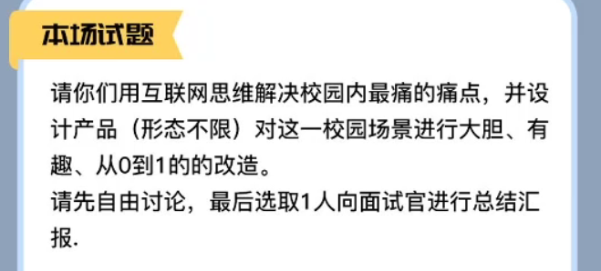
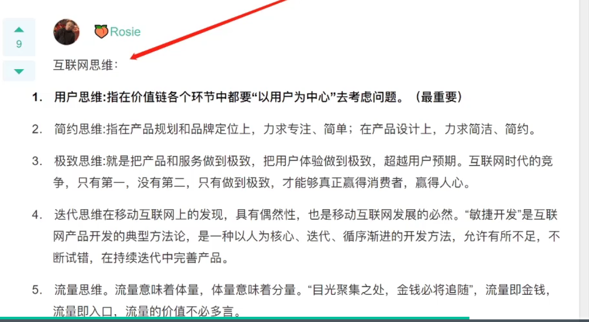

自我介绍（在自我介绍中最好有与题目有关的介绍）  

面试官好，同学好，我的名字是陈立繁，我是一个本科在读的大学生，专业是计算机科学与技术，我个人比较看重团队合作，在校期间也和同学参加一些比赛获得了一些奖项，也会学习一些课程的知意外的知识，然后有一些比较简单的项目经历。

质疑要有理由

那我们先来分析一下这个题目吧，根据这个题目，要求我们在互联网思维下解决校园内最痛的痛点，那么

当发现局势比较乱的时候，并且没有人表示要当time keeper的时候，可以主动提出当time keeper并提出自己的观点

如果要提出自己的观点并反驳别人，要提出原因

先根据题目提出大概的框架，然后根据这个框架出自己的观点，然后最后最好再快速地用一两句总结一下自己刚刚的观点

总结

案例

确定目标用户

表达一下互联网思维（用户至上）

使用小程序、还是app、还是公众号、还是网页

从什么角度来确定需求学生的角度 ，男学生的角度、女学生的角度（当然这些只是我提出的想法，你们可以用新的角度来思考这个痛点）

老师的角度

辅导员的角度

这个产品运营的手段，让我们的产品去被用户接受使用

> 1. 推广：可以通过社团，送快递，外卖的学生，商家合作
> 2. 盈利：广告推送，（其实如果痛点不是很痛的话，研究盈利是不太实际的问题，因为像美团和拼多多等前期都是通过烧钱来验证他们的模式是不是成立的）——这个不是重点
>
> 

关于是否使用app还是小程序，

>  我个人认为是一开始先是要使用小程序开发的,，然后我们可以在小程序中推广我们的app
>
> 为什么要这样做呢，我认为小程序是最容易让用户使用我们产品的一个入口，因为它是附属于微信的，用户在一开始使用我们的产品的时候，我认为更加乐意于先是通过小程序来体验我们的产品，而不是app，因为app要安装这个步骤会让很多用户放弃我们的产品，因为他们不知道我们产品到底做得好还是坏，
>
> 而使用小程序推广，用户会更加乐意使用，因为打开小程序对于很多人来说就是点击几下的过程，而且时间成本很低，对于用户来说不会觉得有什么安全风险，因为有腾讯背书，然后如果用户觉得我们这个小程序的功能好用，而且有长期使用需求，就会希望下载这个小程序的app，那么我们就可以提供一个跳转给用户来下载我们的小程序
>
> 而且小程序的用户粘度是没有app大的，相对的，也就更加用以被用户接受，如果用户觉得我们的产品在小程序中好用，就会希望下载我们的app，来升级他们的体验，这个时候就可以在小程序中提供一个提示或者接口来让用户在软件商店下载我们的app，来提升我们产品的用户黏度

什么是互联网思维

假如我是开场的话

首先我先发表一下吧，根据这个题目，我们先确定是做一件什么样的产品，因为是互联网的思维去解决，所以，在我的理解的互联网思维，应该就是通过手机，网络来解决我们的问题，那么最浅显的就是通过小程序、app、网页、公众号来设计我们的产品，这是第一步

第二步是我们要解决什么样的校园痛点，从什么角度来分析这个痛点呢，我们要在学生的角度来分析学生到底需要的是什么，所以第二步就是确定学生需要什么的东西，痛点是什么

第三步就是我们结合学生的痛点和解决这个痛点产品是否能够适用于

局部总结一下我上面说的

互联网思维可以理解用户至上、快速、方便、比如京东物流、线上购物等，我认为需要在群面中表达一下自己对互联网思维的理解

**如何让其他对手认可自己**

就是不要在场上表现出硬邦邦的态度，不要为了只顾表达自己的观点，而不顾及全局，要认可对手的观点，或者去升华对手的观点，或者去cube一下哪个人少发言

30秒自我介绍（群面）

学历 专业 姓名

亮点信息

展现我个人特点 （幽默、团队）最好要一句话概括，不要太长

2分钟的版本（单面）

群面不可以投票

要有抢话

自救环节

如果面试官问，哪一个最好、哪一个最差

这个时候只需要围绕一个点 `对于话题的贡献度`，然后可以表现得委婉一下，`我认为大家表现得都不错，如果非得指出来得话`

**Leader-框架制定者和修正者：**

① 职责：群面的领导者，负责主持群面的整体流程，必要时需要安排团队角色。

② 要求：气场、逻辑、总结归纳、排版决策。

③ 评价：要么赢的漂亮，要么死的难看 。

**Time Keeper-进程控制者：**

① 职责：负责根据面试总时间安排小组讨论节奏，不仅仅是计时而已，必须对跑题的同学进行严格控制；容易由于关注讨论而错过讨论结果；容易过渡到Leader；如果小组讨论超时，那么Timer死的几率接近100%，如果讨论结果还OK，则希望很大。

② 要求：坚定的个性、气场、时间观念、快速记笔记能力。

③ 评价：个人认为相对来说比较安全的一个角色，而且容易过渡到Leader.

**Recorder-整理记录小组讨论的人：**

① 职责：负责记录小组讨论结果，对速记能力和逻辑思维能力要求很高 。

② 要求：速记能力、逻辑思维。

③ 评价：记录时，可能无法加入小组讨论；容易转化为Reporter，但在陈述时，若漏掉要点，致死率几乎100%。

**Reporter-小组讨论结果的陈述者：**

① 职责：大局观要出众，能够在短时间内把握小组讨论脉络。

② 要求：自信、逻辑思维、大局观

③ 评价：陈述观点时须逻辑思维清晰，若思维混乱，容易团灭。

**Member-其他小组成员：**

① 职责：严格意义上，每个组员都是，需要提出建设性观点，并能让面试官注意到你是这个观点的提出者。

② 要求：创新思维、总结归纳、逻辑思维。

③ 评价：不要乱说话，如果没能说出重点，就是浪费机会和时间，下次想再说，难上加难 。

