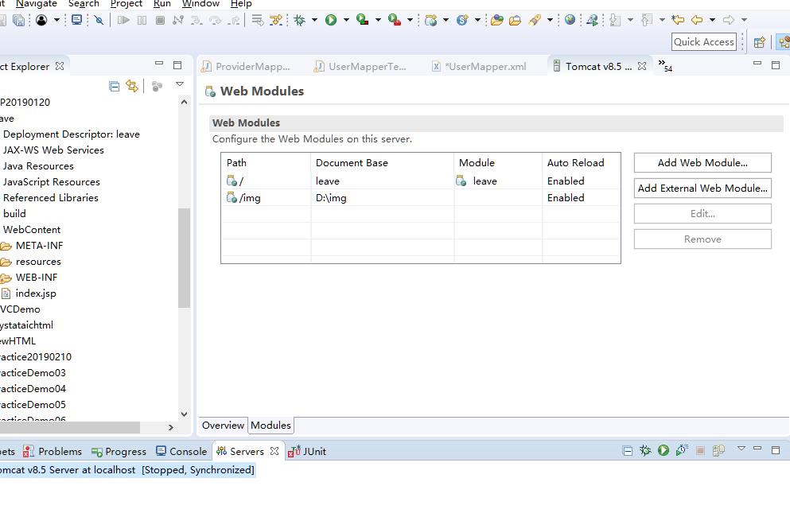
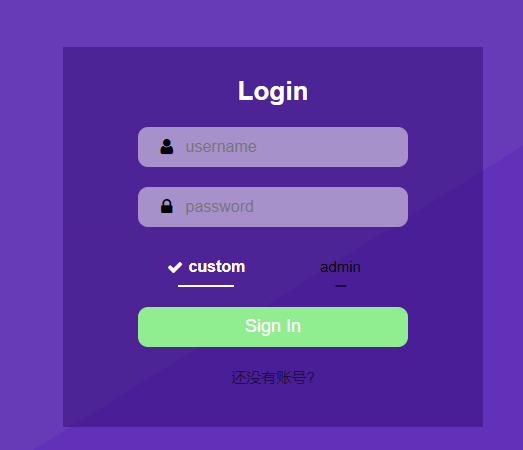

[TOC]

## 1.部署项目

在部署完项目后，启动项目前，需要配置一下项目路径

可以提前在d盘创建一个img文件夹

##  2.当启动项目后报错在MySQL登录时出现Access denied for user 'root'@'localhost' (using password: YES) 拒绝访问，并可修改MySQL密码

1、到安装的MySQL的目录下，找my.ini文件；

在[mysqld]后添加skip-grant-tables（目的是使用 set password for设置密码无效，且此后登录无需键入密码），然后保存。

2、重启MySQL服务器。

net stop mysql

net start mysql

3、登录mysql，键入mysql –uroot –p；

弹出输入密码时直接回车（Enter）

4、在命令行中输入set password for ‘root’@‘localhost’=password(‘123456’); （注意后面的分号，其中123456为重新设置的密码）

5、再把my.ini的skip-grant-tables删除，然后重启MySQL服务器：net stop mysql ;net start mysql;

6、重新用新的密码登录，OK。

`这个问题我也不知道为什么，因为我每次部署到其他电脑的时候都会包这个错，然后我修改了一下mysql的密码就好了`

## 3.用户登录问题

当注册成功学生或者辅导员的时候，会延迟2秒跳转到登录页面，然后在输入学生的账号密码的时候，点击custom，然后登录，   输入辅导员账号密码的时候，点击admin然后登录。

## 4.学生课程绑定的问题

因为没有做学生绑定课程的接口

所有新创建的学生都需要在数据库中手动绑定学生和课程

只有这样才能在发送请假请求的时候选择请假的课程。

